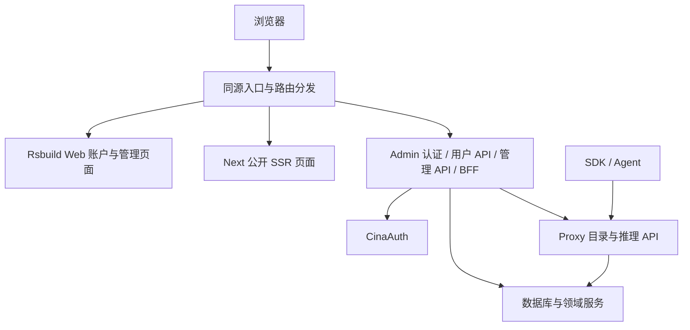

# Web 前端迁移方案与验收清单

文档层级：L1。本文是 Web 前端迁移的唯一主 checklist，与页面、认证、API、构建和发布契约绑定。后续实施、验证、发现问题和发布切换时，必须在同一批变更中更新对应任务、当前状态与证据。

目标是以 `packages/web` 的 React、Rsbuild 与现有 UI 基础作为 cinatoken 前端，覆盖公开发现、账户中心及管理后台的全部现有能力。首个交付切片是认证、工作区和网关密钥闭环；切片通过不代表整个迁移完成。

**可行性结论：可行。** `packages/web` 的 React、Rsbuild 与现有 UI 已作为独立 `cinatoken-web` 部署，并于2026-10-05接管生产主入口及公开SSR。Admin继续提供认证、用户/管理API、BFF与兼容旧路由。生产前门切流及Web自有HTML分析注入修复已完成；3847955版本曾通过严格匿名浏览器验收（5.72），当前c13完整严格QA未通过，31/45与超时证据见5.73；完整功能矩阵、真实身份/资金/链、双平台及旧页面退役仍按原门槛推进。

本文同时保存方案、checklist 和进度，不另建会分叉的实施清单。按以下入口阅读：

| 需要查看的内容 | 位置 |
| --- | --- |
| 当前实施状态、最近待办与下一批顺序 | [第 0 节](#0-当前进度与维护规则) |
| 架构、服务职责、路由和兼容决策 | [第 1 节](#1-实现决策与边界) |
| 库存、上游来源及许可核对 | [第 2 节](#2-可复核库存与来源) |
| 44 个路由组与嵌入能力的页面/API/权限矩阵 | 第 3 节 |
| P0–P8 的完整任务和 G0–G8 验收门槛 | 第 4 节 |
| 各批次命令、构建、浏览器和验收局限 | [第 5 节](#5-证据与状态记录) |
| 持续更新的变更记录 | [第 6 节](#6-更新记录) |

库存核对日期：2026-09-27。下列库存来自当前代码；任务与验收项默认未完成。存在源文件、通过类型检查或显示页面外壳，都不足以证明业务闭环、部署与迁移完成。

## 0. 当前进度与维护规则

最近更新：2026-10-05。完整范围为 **44 个页面路由组（公开 8、账户 10、管理 26）**，并包含工作区切换、预算、四类密钥、钱包及管理收益补偿等嵌入能力。

文档范围：按“将 checklist 整理成一个 md 文件，推进实施随时更新”的要求维护本文。完整清单为 **102 项主任务（99 项 P0–P8 任务、3 项来源任务）**，配套 G0–G8 验收门槛、页面/API/权限矩阵及批次记录；实施使用原任务 ID 持续更新，不另建主清单。

当前发布（2026-10-05）：`cinatoken.com/*` 继续由独立 `cinatoken-web` 承接，当前源码 `c13a64b9c3b2c90adcf736910ea408868d7854f1`、version `2a0a2777-d3b1-47f0-a0a7-88e701b4d2d9`、deployment `fd24618f-121e-4640-9edf-f15d243a6d75`、100%流量、29页面开关启用；资源Route保留，Workers.dev/Preview关闭。同SHA Linux CI37312669228两个job/36步骤全部success，冻结产物与2289 Git输入/18195586 B精确匹配。实际部署由已验证的3847955＋bdc1bfcf bridge与新CI产物合成，137资产/35服务端文件，三档对应源码可下载；GET23/HEAD6、认证转发GET3、4个HTML no-transform与资源组合137/137通过，首轮超时及定向重试均保留。Admin/Proxy仍为34c742d1。本SHA原v2两轮25/23页超时、新v3 31/45页及三交互后actual1，完整严格浏览器未通过；5.72的3847955严格45/45及交互结果仅保留为历史。当前资源保留修复见5.73，首轮遥测冲突/配置403见5.71。真实登录/资金/链、完整G0–G8和旧页退役仍待验收。

当前推进：5.73资源保留修复已提交、推送并部署，旧bdc源码归档原HEAD/GET404已恢复200及精确字节；三个归档的HEAD/GET六项组合、完整137资源组合均通过。bdc原lastCurrentAt不续期；384当时仍是线上current，在bridge复选为current后再转retained，保留bridge时间，不能声称沿用原CI时间。原v2两次总时限及新v3两页45s networkidle超时均封存，完整严格浏览器仍待验；最终版本/三路由和预览关闭后核actual0，不沿用5.72旧版本通过结论。完整迁移继续：真实CinaAuth业务/资金/链/非空目录推理、326历史来源、原生三库、完整Docker/TLS、实际回滚演练与旧页退役均保留。102主任务/54矩阵/G0–G8/E00–E08/211任务checkbox原状态保持，仅P6-11主任务已勾选。

上一批状态：NEXT-41四语公开署名修复与NEXT-13 B1五个活跃文件修复完成本地验收（5.54）。新P66 Web1401/1401、完整Web/Edge types及Web lint/format、三目标build/freeze/gen0；同一492产物真实Node HTTP45、Node compiled Worker77、Chrome JS32/真正NoJS36通过，68HTML实际footer英文原文/lang=en/译文/链接均通过。Admin源组件Chrome19/相关unit26/保留合同AST22、完整types与目标lint/format0；全量lint实际67E9W→58E5W，仍未全量通过。本地来源946文件tree/修复前1795观察已补，不能当上游导入ref/日期。P65原24/32缺英文、修前测试40失败与其他历史失败完整保留；workerd产品/最小例0xc0000005、WSL E_ACCESSDENIED，0原生case获验。29入口false、未部署；下一步NEXT-13 B2/B3按真实行为清理及来源/真实身份/三库/目录/链/LinuxCI/双平台/发布回滚，完整102主任务/54矩阵/G0–G8/E00–E08未提前完成。

上一批NEXT-40八组四语公开SSR/SEO、匿名目录币种、公开登录与Worker/Node三目标构建已实现本地切片。P60 hydration、P61取消锁、P63原生timer和P64无JS正文hidden的失败证据保留；最新P65修复完成边界inline输出，Web1364/1364、完整Web/Edge types、修改域lint/format与三目标build0。P65同一482文件候选的真实Node HTTP45、compiled Worker/Node77、JS-enabled Chrome首屏32、真实JS-disabled四语页面36、公开popup20及旧private兼容7通过；真实React取消10与在途API abort1通过（5.53）。额外Chrome绝对deadline/生命周期8、native transport8及真实跨源COOP4均通过；AUTH-SSR-A–G七项本地子任务已完成。29入口保持false、未部署；真实CinaAuth/目录/原生三库/链账本/LinuxCI/双平台/发布回滚继续。原102主任务、54矩阵及G0–G8/E00–E08完整保留，未满足项目不勾选。

上一批NEXT-36本地证据：NEXT-36完整接入ADM-22提现处理与ADM-23 NFT铸造管理及同Screen旧Next桥（5.45）。Web **1008/1008**、Admin **894/894**、Core主 **798通过/1既有原生PG跳过**、类型/两生产构建通过；P53提现两个入口各48/48，NFT Web28/28、旧Next29/29通过，共153场景；2727实际静态响应、源码/编译后核无漂移，15张代表图目视。3020源码/897编译、187资产（101current/86retained）与28个关闭入口绑定新候选。保留所有失败、P53旧详情首屏焦点P3（新P54修复见5.46）及完整Core类型旧诊断；真实身份/原生三库/链/账本/Proxy/Linux CI/Cloudflare/Docker仍待验，未部署，102主任务与G0–G8未提前完成。NEXT-35/P52只证明5.44历史冻结范围，不沿用旧哈希证明新源码。

最近已验证的历史批次：2026-10-01 NEXT-33 Tools 本地候选验收完成；2026-09-30 暂停交接保留为 5.41 历史，其后的冻结源码和检查见 5.42。保留 5.9 的暂停交接作为历史记录；Endpoints 等候选回归见 5.10，Routes 切片见 5.11，Data Policies 本地切片见 5.13，业务时区服务端前置约束见 5.14，Presets 本地切片见 5.15。Guardrails 与配置时区子页的 P14 增量见 5.16–5.17；完整配置与 P18 固定候选见 5.18；P19 Web 管理首页候选及浏览器复验见 5.19；ADM-06 用户列表/创建的 P20 失败诊断与最终 P22 本地候选见 5.20；ADM-16 可靠性分析的 P23 视觉诊断与最终 P24 本地候选见 5.21；ADM-13 模型分析 P25 本地候选见 5.22；ADM-14 供应商分析 P26 本地候选见 5.23；ADM-15 用户分析 P27 视觉诊断及最终 P28 本地候选见 5.24。P15 Config 16/16 后经复核发现硬刷新和跨页恢复锁缺口；P16 18/18 后又发现存储读取异常可能误清锁，两者仅保留为历史局部证据。P17 解决单标签锁异常；P18 为五个配置键接入数据库版本条件写入，同一候选 Config 21/21（含双预开标签模拟竞态）、Guardrails 23/23 浏览器 fixture 通过。P19 首页、P22 用户列表/创建、P24 可靠性分析、P25 模型分析、P26 供应商分析、P28 用户分析分别以固定候选完成 10/10、12/12、12/12、16/16、16/16、16/16 本地浏览器 fixture；配置审计切库漏表已补源码与离线契约，根级类型检查已通过。Admin全量lint历史记录76错误/9警告；2026-10-02重测为67错误/9警告（5.54），Tools目标范围与AuthWrapper两项旧基线见5.42，真实身份、三库并发/切库、Proxy、部署仍待验收。

P42 历史增量：NEXT-32 前置源码与用户详情 Key 安全读取/编辑已接入，最终 P42 同包 Gateway **31/31**、集成密钥 **16/16**、用户详情既有流程 **10/10**、预算 CSV **7/7**、显式 Key 编辑 **24/24**，共 **88/88**。Core 完整命令含 pre/post 退出 0，主套件 **536 通过/1 PG 跳过**；Admin **664/664**、Web **776/776**，Web 类型/lint/格式/构建、Admin 类型/最终 4 GiB 构建与根级 tsc 通过。P42 92 文件逐项匹配、22 入口开关全 false、Wrangler dry-run 0，仅供本地 QA（5.32）；P39–P41 历史证据保留（5.31）。完整 44 路由组范围、ADM-21/27 治理/审核界面、真实身份/三库/双平台及 G0–G8 仍未完成，未部署。

P42 历史实施记录：三库 Shared Keys 状态提交守卫、D1 0073/PG 0078/MySQL 0069 正式历史保护迁移、Admin/User 早退私有缓存与 Admin rederive 严格 query 已落盘；Core 迁移头库存回归已修复并通过完整命令。用户 Key 普通列表不再保存 raw metadata，Web 编辑仅显式读取并保存在可清理局部状态；旧 UI 显式查看兼容也已接入，隔离组件 **25/25**、最终真实 Next standalone **8/8** 通过。当时尚缺 Shared Keys 完整治理；后续已补的本地实现与新候选见5.33，真实数据库和平台验收仍待办，全部入口保持关闭。

P45 为历史基线：Shared Keys 安全分页/详情、完整 profile 条件写入、原子审计、精确 request ID 及 Console 主体前置已接入，ETL/库存/ACL 同步（5.33）。该冻结范围 Core 主套件 571 通过/1 PG 跳过、Admin 727/727、Web protocol-04 810/810，类型和构建通过，离线 PG79 PGlite 9/9；同包 57/57、94 资产、23 开关关闭。P43/P44 及此前筛选/主体失败保留。后续人工恢复与旧 Next 实际页面的新证据见 5.35，P45 不覆盖新源码。

P47 为上一批历史切片：人工恢复 protocol-06 已冻结，Web **834/834**、Shared **50/50**、类型/lint/格式/生产构建及 dry-run 通过。同包 Shared **46/46**、Key 编辑 **24/24**、CSV **7/7**，共 **77/77**；最终视觉 **9/9**、17 张截图均目视。旧 Next 新构建 fixture **24/24**、9 张截图通过。94 当前资产匹配、23 开关关闭；P46 焦点失败与 P47 初次时序断言均保留，未部署。长 subject 合同、真实身份/三库/ACL/ETL/平台和全部未完成门槛继续待验（5.35）。

P48为2026-09-30历史Web候选（仅证明原冻结范围）：protocol-07 与三库追加 actor 迁移完成本地集成，Console actor 617、API Key actor/原始 subject/reason 600。Core 完整 pre/main/post 0（主 585 通过/1 PG 跳过）、Admin 734/734、Web 837/837；同包 Shared 49/49、Key 编辑 24/24、CSV 7/7，共 80/80。最终视觉 9/9、17 图与长 actor 2 图均目视，70 源码/94 资产哈希匹配、23 开关关闭、dry-run 0；真实长主体登录、原生三库/ACL/ETL、平台及全量迁移继续待验（5.36）。P47旧Next24/24仅证明原构建，该历史轮未重建Next；当前P49与新Next见5.42，未部署。

上一批源码增量已修复标准 OIDC subject247–255 加前缀后的 MySQL Session 容量（5.37）：仅将 admin_sessions.username 扩至264，追加MySQL0072；Core完整pre/main/post退出0，主594通过/1原生PG跳过；Admin完整744/744，新会话仓储9项和实际callback/wire边界10项均通过。受控数据库网络和身份fixture不能证明原生DDL或外部CinaAuth登录。治理header600不是发行方能力；其他域actor容量发现独立缺口，登记NEXT-34（5.39）。ADM-11库存和原子合同在5.38是2026-09-30历史方案，当轮尚无页面/接口或新构建；当前Tools已在5.42实现并以P49 Web/新Next独立验收。P48及其80项浏览器只证明原冻结范围；未部署或开启入口。

上一批源码已完成NEXT-34标准OIDC集成密钥actor272、正式MySQL0073及三库目标/审计写入确认，并修复既有单键配置审计原子前置（5.40）。该冻结范围Core完整pre/main/post退出0，主640通过/1既有原生PG跳过；Admin完整773/773，定向Access52/52与实际Admin合同41/41、配置16/16、ETL5/5均通过。MySQL微秒no-op复核缺口已修复并重新冻结；当时16源码和独立复核相符。PGlite实际PG Access14/14、配置8/8为本地WASM证据。P48及其80浏览器项只证明原范围；该历史轮无新Web/Next候选，当前新构建见5.42，未发布或开启入口。

2026-10-01完成NEXT-33 Tools本地实现与候选验收（5.42）：完整四类10引擎、多键原子配置、安全API/Web页和旧Next薄桥已冻结；Core主716/716、Admin824/824、Web874/874与全Web类型/lint/格式通过，Root/Proxy/Admin类型0，Web/Next构建0。P49 Web独立53/53；修复旧AuthWrapper未消费me200响应体后，新Next BUILD_ID `FhJT1Bb6MzMQs4s7DeQeV`独立53/53、同tab跨入口2/2，隔离源镜像StrictMode暖态6/6。旧失败、开发冷编译异常与两项原有effect lint均保留，不宣称全量Admin lint通过。24入口与保护默认false，原生三库/真实身份/平台未验，无部署；完整主任务和G0–G8仍按门槛验收。

### 0.1 阶段状态

| 阶段 | 当前状态 | 已有实现或证据 | 下一验收重点 |
| --- | --- | --- | --- |
| P0 基线与范围 | 进行中 | 本文已列出页面/API/权限矩阵与来源要求 | 补齐可核验上游版本、基线及矩阵审查 |
| P1 工程基础 | 本批Web工程与Linux CI通过，整体待验；持续实施 | c13a64b9本机完整Web1596/1596、types/lint/format通过，同SHA Linux Node22 WebCI两个job/36步骤全部success，冻结/三目标与Admin合同构建通过（5.73）；J6完整Admin格式651、AST497及旧新实际React/HTTP保留5.69历史范围 | G1整体仍未完成；326历史来源、上游ref/日期/归属、许可及完整原生范围继续待验。Proxy native/取消和Release权限失败独立保留，不把Web CI成功称全仓库CI通过。 |
| P2 认证与工作区 | 本地切片通过，完整验收待办 | NEXT-42 B1先Portal可信身份与expected-user校验，再读Admin/复验IdP、解析workspace和领域操作；同subject才提升Portal管理能力。新Next真实HTTP45/45含401/400/409、角色复验与两个退出语义，独立重写观测2/2通过（5.63）；5.62 P70 Chrome10历史保留 | IdP/数据库/组织成员与Queue为受控binding，角色撤销或复验暂不可用分支不等于真实发行方验收；真实CinaAuth/同源登录及原生三库仍待验。 |
| P3 数据与请求层 | 进行中 | NEXT-42 canonical预期user/workspace组合、62账户调用绑定及未知写不重放已接入；B1新Next六exports旧A/B请求在Admin/IdP/workspace/domain之前409，401/400/403/409/500及成功响应private,no-store，统一退出另由精确配置保障（5.63） | 完整金额/日期/权限、缓存/Retry-After、原生三库并发及Queue/链/账本对账继续；独立两case构造观测不读取或修改请求体，不能替代真实领域平台验收。 |
| P4 账户中心 | 本地证据补齐，完整验收待办 | 十组路由/十五能力已实现，P6 244 fixture及5.62 P70 Keys/NFT/Preset Chrome10保留；B1同一新Next合法NFT POST在显式受控tier105配置下实际创建SQL行/Queue1，身份拒绝无领域增量，两退出通过（5.63） | 受控Node SQLite执行77正式D1迁移不等于原生D1/PG/MySQL；正式tier200–203配置未改，真实ACC-01–15授权、预算/收益账本、钱包/链与平台继续。 |
| P5 管理后台 | 本地证据持续补齐，整域待验 | 5.45提现/NFT完整Screen/API/四语/旧Next桥；P53历史、5.46 P54焦点48/48；5.47 NEXT-38完整四域源码及新P58三域270/270、Routes126unique、已发写切scope8/8本地证据，Root1062/类型/两构建0 | 其余域和真实身份/三库/链/账本/经济证据/Proxy/平台与G5继续；MySQL无journal模型待验 |
| P6 公开页与 SEO | 新版公开HTTP及HTML通过，严格浏览器31/45超时待验，整域待验 | 当前c13a64b9的真实Cloudflare GET23/HEAD6与四HTML no-transform通过，三源码归档HEAD/GET及137资产组合核对通过（5.73）；3847955的Chrome公开7页/缺失模型404及完整45/交互严格结果仅保留5.72历史 | 当前catalog为空/USD；新SHA新v3 31/45及三交互后超时，完整严格浏览器尚未通过，真实Auth、非空目录/完整聊天、完整SEO、上游来源和G6继续。公开页由Web SSR提供，兼容路由保留Admin。 |
| P7 双平台部署 | 新版Cloudflare发布及资源复验完成，严格浏览器31/45超时待验，完整双平台待验 | 同c13a64b9 Linux Node22 WebCI两个job/36步骤全部success；合成冻结137资产/35server，Web2a0a2777 100%/29true、预览双false，GET23/HEAD6/认证GET3/HTML4及资源组合137/137通过（5.73）。旧bdc404和本批超时/重试均保留 | Admin/Proxy版本与数据库保持；本SHA新v3 31/45及三交互后两页45s网络等待超时、actual1；最终后核actual0。Web CI仅构建SSR镜像并运行Nginx静态入口冒烟，不证明完整Docker SSR/Admin/Proxy/TLS同源部署；真实身份/资金链、SSE/WebSocket、实际回滚及完整G7继续。 |
| P8 发布与退役 | 资源保留修复已发布，完整验收及退役未完成 | 当前c13a64b9版本/Route/CI/冻结组合和HTTP资源证据已记录，新SHA新v3严格浏览器31/45及三交互后两页超时actual1、完整待验（5.73）；5.71/5.72原失败与旧严格通过结论保留历史范围，旧版本/资源保留约定继续 | 全矩阵真实业务、来源/许可、性能观测、完整双平台、灰度/实际回滚及旧UI退役，不以资源修复勾G8 |

5.7 的 `index.7ff2962b93.js` 仅是历史冻结检查点。当前生产公开页面由5.73的独立Web SSR承载，账户/管理HTML选路已开启；`/dashboard`、`/gateway/*`等兼容路由仍回到Admin，旧页面尚未退役。

### 0.2 更新与完成规则

- `[ ]` 表示任务仍有实现或验收要求未满足；仅在该任务全部要求通过且附有对应证据后改为 `[x]`。部分实现通过“进行中/待验收”和证据记录表达。
- 每次源码接入、验证完成、发现缺陷、发布或回滚，都同步更新本节、对应 P/SRC 任务及第 5 节证据；同一任务使用稳定 ID，不另建重复主清单。
- 文档整理、只读盘点和保存草稿分别注明状态，不据此勾选实现任务。尚未完成或验证的代码记录为 WIP；需要继续实施时先核对其 API 契约和当前文件，再生成新的验证证据。
- 区分 **源码已接入、模拟接口验证、真实联调、部署验收** 四种证明范围，记录未完成部分。阶段门槛 G0–G8 只有在相应范围全部通过后才完成。
- 证据绑定文件范围或提交/构建版本、命令、时间、平台/数据库、角色/工作区、浏览器视口/语言及局限。后续源码变化不沿用旧构建的通过结论。
- 已知失败必须进入待办并保持未勾选；失败修复后补充回归结果。既有历史证据保留，过期结果标为历史，不能覆盖成新版本证明。
- 实施顺序为 P0/P1 → P2/P3 → P4/P5 → P6 → P7/P8；真实部署冒烟从首个闭环开始逐步加入。每批交付都核对完整矩阵，避免遗漏嵌入能力。

- 实施暂停时只维护已发生事实、失败和后续计划；文档更新不自动恢复实施。恢复后继续使用原任务 ID 和完整验收范围。

每次推进使用以下更新顺序：

1. 开始前核对稳定任务 ID、既有改动、依赖和本批范围，在第 0 节记录“进行中”。
2. 源码接入后更新相应任务与页面/API/权限矩阵，注明仍缺哪些验证，保持未满足完整验收的项目未勾选。
3. 验证后在第 5 节记录实际命令、退出结果、源码/候选版本及证明范围；失败与跳过也保留，并关联后续待办。
4. 批次结束同步第 0 节和第 6 节；只有对应任务的实现及全部验收条件满足，才改为 `[x]`。范围不因局部通过而缩减。

新增批次记录可沿用此格式，不用复制整份 checklist：

```markdown
日期 / 批次：
关联任务：P?-?? / NEXT-?? / 页面 ID
当前状态：进行中 / 待验收 / 已完成
实施内容及文件范围：
源码或构建版本：
实际验证命令、结果与证据位置：
证明范围：源码 / 本地 fixture / 真实联调 / 部署验收
失败、跳过及剩余要求：
下一步与前置条件：
```

### 0.3 近期待办与已知缺口

| ID | 对应主任务 | 当前状态 | 实施与验收要求 |
| --- | --- | --- | --- |
| NEXT-01 | P5-02、P5-12 | 本地不可变候选 fixture 通过，待真实验收 | Models SDK/UI、API factory、Router、导航、URL、当前网关币种和四语言已连接；候选浏览器 30/30 通过（5.10）；仍须真实 Cookie/数据库/权限与部署验收 |
| NEXT-02 | P6-01、P6-04 | 本地不可变候选 fixture 通过，待真实验收 | 六组路由与国际化已接入，首页发现导航已补齐；候选浏览器 20/20 通过 URL/价格/异常/四语移动验收（5.10），仍须真实匿名数据与生产分发验收 |
| NEXT-03 | P6-06、P6-11 | 本地不可变候选 fixture 通过，待真实验收 | 合块/分块单测、开发与候选浏览器各 41/41（5.9–5.10）；仍须真实网关、计费与部署验收 |
| NEXT-04 | P3-04、P3-11、P6-12 | 本地不可变候选与定向契约通过，待真实验收 | Models 列表/详情现返回并显示当前网关 `billing_currency`；旧行无逐行来源，配置读失败不伪装 USD，5xx 不沿用陈旧币种；Next 公开价格解析与三页展示 20 项测试已纳入 Admin test:unit/CI。当前候选同哈希浏览器已复验；仍须真实金额/目录、正式发布和部署验收 |
| NEXT-05 | P2-12、P2-13、P8-03、P8-04 | 标准OIDC会话及集成actor容量本地通过，真实联调待办 | verified Console subject先发布后开放Web；MySQL先0072（username264）与0073（Access actor272），升级并排空旧writer，再核原生DDL/真实CinaAuth、Cookie、角色撤销、跨标签页和工作区。治理header600不代表发行方能力；其他域合同独立验收（5.37/5.40） |
| NEXT-06 | P6-09、P6-10 | 现有 Next SSR 的 SEO 小切片本地验证，完整迁移待验收 | Next 初始 HTML、真实目录 404 与临时 503 分流、canonical/分享卡片、robots、动态 sitemap 在本地 fixture 11/11；现有 Cookie 语言无稳定语言 URL，未生成 hreflang。Web 公开页 SSR 替换、真实目录、缓存失效和部署仍待验收 |
| NEXT-07 | P7-01–12、P8-01、P8-10 | P52本地QA已核，真实发布证据待办 | P52 `local-p52-playground-simulator-20261001044500`，157文件（98 current/59 retained），manifest/source1369/compiled448与实际响应bytes匹配，26关闭开关与dry-run0；actualNext FH0AsZx7fAkxgZkJKxt56。previous仅本地P51资源保留，currentReleaseId=null，未发布；真实Linux CI/CF/Docker/TLS/灰度/回滚继续待验（5.44） |
| NEXT-08 | P5-01、P5-03–11 | Endpoints 本地候选 fixture 通过，管理全域待验收 | Endpoints SDK、结构化表单/UI 已接共享 Console Cookie transport、Router 和 i18n；Worker/Nginx 独立默认关闭开关 25 项契约、恢复锁领域测试与候选浏览器 16/16 通过。真实授权/数据库/部署及其余管理页面和收益补偿继续逐域验收 |
| NEXT-09 | P5-03、P5-11 | Routes 本地候选 fixture 通过，待真实联调 | 拓扑/摘要、目标 CRUD、池/模型策略、Sticky 和分时价格、独立默认关闭入口已接入；P10 候选浏览器 25/25（5.11）。须以真实 Console `routes`/`models`/`config` 权限、数据库、Proxy 行为、审计及双平台发布验收 |
| NEXT-10 | P5-08、P5-10、P5-11 | Data Policies 本地候选 fixture 通过，待真实联调 | 现有列表含未配置目标，PUT 可 upsert 并审计；按 `routes.read/write` 展示/写入，验证有效状态、指纹失效、未知写后的列表+审计核对。Web SDK/UI、四语、独立默认关闭入口已接入；修正模型 ID 和本地时间显示后的 P12 不可变候选浏览器 18/18、dry-run 通过（5.13）。真实 Console/数据库/Proxy 与双平台部署待验；配置页与 Presets 各有独立未完成验收（5.14–5.15） |
| NEXT-11 | P5-08、P3-09、P5-11 | 业务时区服务端前置已落地，Web 接管与真实验收待办 | 通用 `PUT /api/admin/config` 已使用共享 IANA/UTC 严格写入校验；窄 `GET /api/admin/business-timezone` 返回 `configured/legacy/missing/invalid` 来源，旧有效别名/偏移保留读取，缺失或非法旧值标源并回退 UTC。配置与时区响应设为私有不缓存；完整配置列表仍可能含授权秘密，不能直接进入普通 Web Query 缓存。Web 配置页须保留旧页其他能力，并补真实计费日界、DST、权限及部署验收（5.14） |
| NEXT-12 | P5-08、P5-10、P5-11 | Presets 本地候选 fixture 通过，待真实联调 | Admin 新增无提示词/配置的列表与版本摘要，兼容旧 API；Web SDK/UI、四语与独立默认关闭入口完成。P13 候选浏览器 15/15、Web 530/530、Admin 571/571 与构建通过（5.15）。仍须补全部边界 fixture、真实 CinaAuth/三数据库/Proxy 与双平台验收；不把工作区内公开误称全站公开 |
| NEXT-13 | P1、P8-01 | J6 完整Admin格式本地通过，完整工程门槛待验 | 剩余497件TS355/TSX142，133test/364非test；3320236→3379236 B，Root完整有界AST及独立双AST497通过，1128原评论、指令关系与7427属性runtime值保持；21原JSXText逐节点表达式保留18直接parents children，不合并字符串。其他154/保护23原字节不变，Next selector增量497/Web生产0。完整格式651pass/0warning/parse0，七CLI和审计0；fresh Admin types/lint、主unit1008＋5/30、Web1582、新Next I8i…构建/冻结0；旧新各8实际React＋10HTTP、6采样PNG对同字节（5.69）。所有默认候选拒绝、检查失败、Temp备份335和产物1983缺件/精确恢复保留，原因未知。格式绿不代表G1或完整迁移完成；真实身份/原生三库/链/Node22 LinuxCI/双平台/发布回滚继续，未部署，目标active。 |
| NEXT-14 | P5-08、P5-10、P5-11 | Guardrails P18 候选 fixture 23/23，真实三库并发与联调待办 | Admin 安全摘要、三库绑定 CAS 与条件解绑、本地 Web Cookie SDK/列表/版本/绑定及有效预览、独立默认关闭入口已接入。P15 修复失效/跨工作区 Key 的 404 提示；`local-p18-20260928073458` 浏览器回归 23/23，覆盖 active Key 成功、404 无变更、写请求白名单及原 P14 权限/恢复/四语场景（5.18）。Core/Admin 源码另补绑定写入时的 active Key 原子检查/行锁和私有 409，定向 Core 52/52、Admin 25/25；真实 MySQL/Postgres 并发、Proxy、平台验收仍待完成；旧原始配置 API 仍供旧页面，不进入普通 Web Query 缓存 |
| NEXT-15 | P5-08、P3-09、P5-10/11 | P18 Config 整页 21/21、时区子页 13/13 本地 fixture；旧写保护源码通过，真实服务/审计/平台待办 | 五键非秘密概览、币种/策略窄写、两 webhook 独立替换/清除/显式揭示/候选核验、四语页面及独立默认关闭入口已接入。P14 时区子页 12/12；P15/P16 为历史局部证据，P17 单标签 20/20。P18 五键增加不含秘密版本号和三库条件事务写入；同一候选双预开标签模拟 503 已提交后旧版本的时区、币种、Webhook 再写均 412、只有首写提交，Config 整页 21/21、时区子页 13/13。新增默认关闭的 Admin `CINATOKEN_ADMIN_CONFIG_REQUIRE_REVISION`：精确 `true` 时五键旧通用无条件 PUT 返回 428，条件写继续 CAS，其他键兼容；定向路由 13/13、Wrangler 生成 16/16 和 Admin 类型检查通过。须先迁移并排空旧 Admin 实例，再启用服务端保护，最后开启 Web Config；旧 Next 页会收到 428。仍须真实三库双连接/审计、计费/DST、身份/Proxy、平台验收；旧通用任意 webhook URL 为兼容风险 |
| NEXT-16 | P1、P8-01 | 根级类型检查本机通过，Linux CI 已接入但待实际运行 | Proxy Worker Env 全局类型隔离、cutover `.mjs` 结构化声明和可空结果运行时校验已补，脚本型根 `tsconfig` 关闭无产物检查中继承的声明输出；`npx tsc -p tsconfig.json --noEmit --pretty false` 退出 0，Proxy 220/220、v402 76/76 本地回归通过。`proxy-dispatch-safety.yml` 的 `config-cutover-contracts` job 已接入同命令，仍须 Linux Node 22 托管 CI 复验；真实 PostgreSQL cutover 另列数据库验收，不由类型检查证明 |
| NEXT-17 | P5-10、P7、P8-03 | 配置审计切库源码与离线契约通过，真实全量演练待办 | `config_change_audit` 已加入 D1→Postgres 原生 CLI/Worker 共用 ETL 顺序及 ID 冲突键，源表预检、目标全量清空/复制与行数对账因此覆盖审计历史；两条对账路径按批在受控进程内逐键比较 `system_config` 的值和版本，以及审计 ID/全部非秘密元数据，仅报告不匹配数量，不回显配置内容。复制前另核 D1 0070、PG 0075 账本及源/目标列，失败即停止；离线 6/6、迁移合同与根级类型检查通过，Linux CI 工作流已接入但尚未运行。C03 手册 0068/0073 为历史专项合同；新 Config 放量前仍须以隔离真实库完成全量复制、配置值/审计/版本对账、权限/回滚演练及当前链尾复审，未通过不得切流或开启 Config 开关 |
| NEXT-18 | P1、P8-01 | PG73 历史原生套件与当前 PG75 目录/授权不兼容，托管原生 job 放行阻断 | 静态盘点 `scripts/db/cutover` 的 126 个 native 文件：111 个含 73 迁移数量断言，86 个还调用当前要求 0074 审计表的生产 runtime grant；PG18 `native-financial-consumer` job 将执行其中 92 个 PG73 文件、71 个 grant 调用。当前目录已有 75 项，直接改为 75 会触发历史 proposal 的 73 项及固定 MD5 断言；只截前 73 又无法通过现行 grant。测试专用 `pg73-native-fixture.mjs` 钉住历史 73 项语料/账本，只在生产 grant 调用期间临时安装 0074，再清除并断言 PG73 恢复；现已迁移 65/126 个 native 文件（本批新增 63，含 CI `native-financial-consumer` 生命周期测试），65 个语法检查、PG73 摘要及 2 个纯单测通过。余下 55 个仍扫描迁移目录，6 个不扫描；自定义授权/预期失败等不能无 PG18 机械替换。必须在隔离 PG18 运行代表性测试、扩展剩余合适文件并运行原生 job；不能放宽生产 grant。此机无 PG binary/Docker/Podman，静态修补不算原生通过 |
| NEXT-19 | P5-01/05/11、P7 | ADM-01 Web 首页固定候选浏览器 10/10，真实联调待验收 | `/api/admin/stats` 与可靠性分析的近期日志改为六字段安全摘要，不向仅有 `analytics.read` 的主体返回原始错误、请求体、route trace、计价审计、用户/密钥细节；Admin 全量 587/587、类型检查与真实路由权限/无泄漏测试通过。Web `/admin` 与 `/admin/` 的独立默认关闭入口已接入 Worker、Wrangler 和 Docker，精确 GET/HEAD 契约 Worker 17/17、Docker/生成器 29/29。Web 仪表盘 SDK/UI、四语言/UTC 时间范围、权限/失败与移动/暗色已完成，Web 全量 590/590；修复跨 Console 重检/重挂载的 403 请求循环后，最终 `local-p19-visual-20260928085229` 浏览器 fixture 10/10、0 传输违例与页面错误（5.19）。真实 CinaAuth、数据库、Proxy、部署/回滚仍待验收 |
| NEXT-20 | P5-04/11、P7 | ADM-06 Web 用户列表/创建 P22 本地候选通过，真实联调与平台待验 | 仅精确 `/admin/users` 与尾斜杠 GET/HEAD 由独立默认关闭 `CINATOKEN_WEB_ADMIN_USERS_ENABLED` 控制；详情、API 与写方法继续走 Admin。Worker 入口 18/18、Wrangler 生成 15/15、Docker 合同 16/16；Admin 用户列表/子资源及拒绝响应 `private, no-store`，定向 2/2、Admin 全量 589/589、类型与目标 lint、53/53 静态页构建通过。P20 无关筛选页 GET 误解锁只作失败诊断；P22 修复后 Web 606/606、类型/lint/格式/build、301 文件 manifest/76 当前 dist 哈希、12 开关关闭、Wrangler dry-run、根级 `tsc`、同候选浏览器 12/12 与未知写筛选页诊断通过（5.20）。未知 POST 保留本标签页写锁，仍需服务端精确身份查询或幂等键以完成权威恢复；真实身份、数据库、审计、平台待验收，ADM-06/G5/G7 不勾选 |
| NEXT-21 | P5-05/11、P7 | ADM-16 Reliability 整页 P24 本地候选通过，真实联调待验 | 旧页五滚动/三业务时区日历/自定义范围、两张聚合表、最近十条脱敏错误与 Request Logs 链接已接 Web；`analytics.read` 与 `config.read` 独立，配置缺权/非法币种隐藏金额但保留非金额分析，最近错误独立日期窗。独立默认关闭且仅精确 GET/HEAD `/admin/analytics/reliability` 接管；入口 Worker/生成器/Docker 定向 52/52、Admin 真实路由成功/401/403 `private, no-store` 4/4，Admin 全量 590/590 与 53 页构建、Web 622/622/类型/lint/格式/build、根级 `tsc` 通过。P23 12/12 的截图揭示暗色日期图标问题，P24 已修复且同候选浏览器 12/12、四语 390px/暗色截图通过；P24 321 文件 manifest/77 当前 dist 哈希匹配、13 开关关闭、Wrangler dry-run 通过。真实身份/三库/双平台待验。ADM-07 用户详情必须完整覆盖写/密钥能力才切流 |
| NEXT-22 | P5-05/11、P7 | ADM-13 模型分析 P25 本地候选通过，真实联调待验 | 旧 `/gateway/analytics/models` 不只是单表：主 GET models、按 `model_id+route_group+已提交时间窗` 懒取 providers 展开、排序、Token 显示模式、三类成本合计、28 列 CSV 和 Request Logs 链接。Web 严格 DTO、按权限隔离查询、迟到响应防串窗、CSV 公式中和与货币来源失效时金额隐藏已实现；只读 API `analytics.read`，安全币种/时区概览独立 `config.read`，日志链接 `logs.read`。精确 GET/HEAD 独立默认关闭 `CINATOKEN_WEB_ADMIN_MODEL_ANALYTICS_ENABLED` 入口定向 55/55，三条分析 API 成功/401/403 `private, no-store` 真实/外层定向 9/9，Admin 595/595、53 页构建，Web 634/634、类型/lint/格式/build 与根级类型通过。P25 331 文件 manifest/78 当前 dist 哈希、14 开关关闭、Wrangler dry-run、同候选浏览器 16/16、四语 390px/暗色和宽表截图通过。当前仅开放主/展开同口径 tag 筛选；provider_id/user_email 未在展开 API 支持，不给错口径明细。共享页脚保留 `NOTICE.frontend` 要求的英文原文与上游链接；ADM-13 全域和 G5/G7 不勾选 |
| NEXT-23 | P5-05/11、P7 | ADM-14 供应商分析 P26 本地候选 16/16，真实联调待验 | 旧 `/gateway/analytics/providers` 的主表、模型展开、时间范围、排序、Token 显示、三成本合计、28 列 CSV 和 Request Logs 链接已接 Web；两分析 API 同需 `analytics.read`，安全配置概览 `config.read` 与日志 `logs.read` 独立。主/展开接口仅开放共同 tag 筛选，严格 DTO、金额失效隐藏、CSV 公式中和与展开隔离已接入。独立默认关闭精确 GET/HEAD 入口 58/58；Web 647/647、类型/lint/格式/build、根级类型、P26 339 文件候选/当前 80 文件哈希、15 开关关闭、Wrangler dry-run 及同候选浏览器 16/16、四语 390px/暗色和宽表截图通过。真实身份/三库/双平台部署仍待验；详见 5.23 |
| NEXT-24 | P5-05/11、P7 | ADM-15 用户分析最终 P28 本地候选 16/16，真实联调待验 | 旧 `/gateway/analytics/users` 的邮箱聚合、模型展开、时段、排序、Token 显示、成本合计、16 列 CSV 与日志链接已接 Web；主 `analytics/users` 的 `email` 模糊筛选与展开 `analytics/models` 的精确 `user_email` 分离，预算按邮箱关联记录的当前聚合快照解释。严格 DTO/权限/币种/CSV 已接；独立默认关闭精确 GET/HEAD 入口 61/61。Web 662/662、类型/lint/格式/build、根级类型、P28 352 文件 manifest/81 当前 dist+两份声明哈希、16 开关关闭、Wrangler dry-run、同候选浏览器 16/16 与四语 390px/暗色/宽表截图通过；P27 首列窄宽仅留历史诊断。真实身份/三库/部署仍待验，详见 5.24 |
| NEXT-25 | P5-05/11、P7 | ADM-17 Web P32 同包请求日志 14/14；`user_id` 深链已接，真实联调待验 | 全局 `GET /api/admin/request-logs` 严格校验并传递 `user_id` 到三库查询，成功/拒绝保持私有缓存；Web/旧 Admin 请求日志页都以 ID 筛选，URL 与清除同步。旧 Admin 直开 UUID 深链首个且唯一初始请求即含 `user_id`，编辑/清除与两种独立页面开关组合已在浏览器验证；Admin/Web 定向测试、类型通过。P32 既有 14/14 是该页原文隐私回归，P36 未重跑完整请求日志浏览器矩阵；真实身份/三库/平台待验（5.25/5.30） |
| NEXT-26 | P5-05/11、P7 | ADM-18 预算审计旧页等价 P30 候选 14/14；新增导出另见 NEXT-27 | 旧 `/gateway/audit-logs` 为 7 列、50 条分页、事件/操作者/来源/原因多选、身份/Key/关联 ID/时间深链及预算前后快照/变更明细；旧页/API 均无 CSV，不能以本页 50 行导出替代 P5-05 的全筛选导出。Core 共享读取派生已修复显式 null 无限额与缺失快照区别，同时间戳列表双键排序已补，定向 9/9 与 3/3、Core 主单测 491/491 和完整命令通过，真实三库旧行待核对；Web 七列表/权限/快照/四语源码定向 6/6、全量 683/683、类型/lint/格式/build 通过。`/api/admin/budget-audit-logs` 与 `/filters` 成功/401/403/外层 503 `private, no-store` 定向 2/2、Admin 全量单测 599/599、类型/目标 lint 通过；独立默认关闭入口 69/69。P30 408 文件 manifest/83 当前 dist+两声明哈希、18 开关全 false、Wrangler dry-run、同候选浏览器 14/14；真实身份/三库/平台仍待验。详见 5.26 |
| NEXT-27 | P5-05、P5-10/11、P8-01 | P36 同包 CSV 浏览器 7/7；MySQL/PG 5 秒服务端 SELECT 超时已接，D1 硬上限未解 | 严格同筛选、三库高水位 keyset、5,000 行/8 MiB、批间约 20 秒检查、原始文本列字节限幅/整包 413、安全固定列及 `private,no-store`；Web 完整校验才下载。D1 0071/MySQL 0067/PG 0076 排序索引已追加，本地 SQLite 首批/keyset EXPLAIN 命中且无临时排序。MySQL `MAX_EXECUTION_TIME(5000)`、PG 事务内 `SET LOCAL statement_timeout=5000` 超时映射私有 504 且无部分 CSV；D1 API 不提供单查询 AbortSignal，仍依平台 30 秒限制，三库统一 5 秒硬限未完成。最新 Core 全量 494/494、Admin 导出定向 12/12、P36 CSV 7/7；真实三库 UTC/EXPLAIN/稀疏筛选、超时与平台均待验（5.26/5.30） |
| NEXT-28 | P5-05/11、P7 | ADM-12 工具调用记录 P32 本地候选 14/14，真实联调待验 | 旧 `/gateway/tools/invocations` 复用 `GET /api/admin/request-logs`，12 列/50 页、四工具/状态/时间深链、request/response/error 展开，无专用 API 或 CSV。Web 保持 All 只发 `provider_id=octafuse-tools`、单工具只发 `model_id=tool:*`；`logs.read` 主授权、`config.read` 独立，失效时金额及利润色彩均隐藏。共享原文与 URL 凭据投影经 P31 失败诊断/P32 修复；入口 73/73、19 开关关闭，Web 695/695、P32 436 文件 manifest/84 当前 dist+声明哈希、Wrangler dry-run、工具页 14/14 与同包请求日志回归 14/14、249 同源只读请求/0 越界/页面错误通过。真实身份、三库、Proxy、双平台/回滚仍待验，详见 5.27 |
| NEXT-29 | P5-04/05/11、P7 | ADM-07 P42 既有流程 10/10、Key 编辑 24/24，真实三库待验 | 完整资料/预算/倍率/Key/最近记录/四语与独立权限、结转预览/快照/409/未知写锁已接；P42 补 Key 安全列表、显式未缓存 ownership 详情、merge/replace/保持原值、revision/必填原因、失权/关闭/晚到清理及跨刷新未知写锁。预算既有 Core 21/21、Admin 11/11 合同保留；本批 Admin 664/664、Web 776/776，22 开关全 false。旧 UI 查看兼容隔离组件 25/25 与最终 Next standalone 8/8 通过；真实 MySQL/PG/D1、CinaAuth、原子审计和双平台仍待验（5.28/5.30/5.32） |
| NEXT-30 | P5-07/10/11、P7 | ADM-20 P38 历史完整交互 16/16，真实验收待办 | 三库生命周期/显式揭示 mandatory Console actor 与原子审计、1–100 条 keyset 读取、私有响应已接；Web 严格 DTO、legacy-master、创建/编辑/权限/保存轮换/状态确认、短时秘密、401/403/身份撤销及未知 POST/PATCH 跨刷新锁已实现。Web 741/741、目标 Core/Admin 与迁移/CI 合同、P38 16/16 和同包回归通过；21 独立开关关闭、未部署。先迁移并排空旧实例，真实 DB/ACL/CinaAuth/Proxy/双平台回滚仍待验（5.29）。后续标准actor272与三库目标/审计确认已补，Core52/52、Admin41/41及PG WASM14/14通过（5.40）；无新Web浏览器证据，正式当前MySQL头73，全部23入口仍关闭 |
| NEXT-31 | P5-04/10/11、P7 | ADM-08 P42 同包回归通过，真实验收待办 | 私有缓存/严格输入/稳定排序、revision 条件编辑/原子审计、masked DTO/显式内存 metadata 编辑、ownership 创建/一次秘密/未知写锁已接；入口既有 86/86 合同保留。P42 Gateway 31/31、关联页 57/57；用户详情 raw Key metadata Query 缺口已补（5.32），P41 标签/错误关联和必填原因修复保留（5.31）。22 开关关闭，真实身份/三库/workspace/有效规则/Proxy/双平台尚未验，完整范围保留。 |
| NEXT-32 | P4-04/07、P5-07/09/10/11、P7 | protocol-07 源码与 P48 本地候选通过，真实验收待办 | Web 837/837、Shared 53/53、Admin 734/734、Core 主585通过/1PG跳过且pre/post0；同包80/80、视觉9/9，正式头D1 75/MySQL71/PG80、离线PG80恢复9/9与新DDL18/18。Console617/API600与读写/恢复通过，不扩subject或登录列；真实身份/三库/ACL/ETL/经济证据/双平台待验（5.36），P47 Next原构建/失败历史保留。 |
| NEXT-33 | P5-06/09/10/11、P7 | 完整源码及本地Web/新Next各53/53、跨入口2/2通过，真实验收待办 | 四工具10引擎、groupCAS/mutex/原子审计、keep-set-clear/reveal与四语完整页/人工恢复/旧Next薄桥已实现；21/16/47源冻结。Core716/716、Admin824/824、Web874/874与类型/构建0；修复旧壳未消费me200 body后新Next独立53/53，同tab跨入口2/2及隔离StrictMode暖态6/6。Root813源与181compiled零漂移；2项旧lint及冷dev诊断保留。24入口/保护默认false，头76/74/81，真实三库/身份/平台待办（5.42） |
| NEXT-34 | P2-13、P5-07/10/11 | 标准OIDC Access actor272本地修复通过，原生/身份验收待办 | 5.39 raw238阈值为修复前历史；现在raw238/239/255对应actor255/256/272完整保留，Console-only/write-read共同校验及异常历史私有失败已接，正式MySQL0073追加。三库repo52/52、实际Admin41/41、PG WASM14/14、最终Core640通过/1跳过与Admin773/773通过（5.40）。原生0072/0073、真实IdP/旧writer排空、并发/ACL/ETL/双平台仍待验，不截断actor或扩大发行方承诺 |
| NEXT-35 | P3-01/02/07/08、P5-06/09/11、P7 | 完整源码及P52本地同包验收通过；真实联调待办 | 全部协议/多模态/十引擎/26模板/预览/响应/日志/取消；API8/Playground92/UI43+32/CSP116，Web971/Admin878、构建0。P52 Playground Web14/62+Next14/63、Simulator各20、原生WS各5通过；1369/448指纹及资产bytes无漂移，26入口关闭。保留P50/P51与harness失败，不替代真实服务/财务/平台（5.44） |
| NEXT-36 | P3-01/02/07/08、P5-07/09/10/11、P7、P8 | 完整源码与P53本地验收通过；真实验收待办 | Web1008/Admin894/Core主798＋1skip、两构建0，金融83/83与实际Hono故障6/6；提现各48、NFT28/29全流程通过，严格主体/私有缓存/未知锁/不重放及同Screen桥已接。P53 3020源/897compiled/187asset、28入口全关闭为历史；原详情首屏焦点P3已用新P54本地修复，真实链/三库/身份/账本/平台待验（5.45） |
| NEXT-37 | P3-08、P8-08/12、ADM-22/23、全矩阵 | P54焦点本地验收通过，整目标继续 | 共享Details初焦点h2；Web1008/1008、Root类型/lint/格式/两构建/dry-run0；四入口48/48、300次首屏标题正确、744实际static bytes/3020源/897编译后核，Root8图与服务关闭。首轮33同步断言失败/4组guard诊断保留；NEXT-38已完成P58声明本地范围，完整真实门槛继续（5.46–5.47） |
| NEXT-38 | P3-08、P5-02/03/10/11、ADM-02–05 | P58本地三域270/270、Routes126unique与已发写切scope8/8通过，真实验收待办 | 完整工作台/共享Editor/四旧Next桥及写入底座已接；Root1062/type/two builds/dry-run0、3063源/883编译/252资产/28false执行后核无漂移。保留首124/126和12pending原ledger，独立重验及strict收尾后accepted126/pending0；新增8验证真实浏览器写取消/原gen锁/人工恢复且无重放，API均fixture，真实门槛继续（5.47）。 |
| NEXT-39 | P1、P3-08、P5-08/10/11、ADM-24–26、P7、P8 | 三域源码及P59完整340unique本地验收通过，真实门槛待办 | 保留已有版本/指定/元数据/归档、Guardrail绑定/解绑和有效预览、DataPolicy证据及审计；写前fresh身份、provided主体/早退private/精确ACK、持久unknown与人工恢复及三旧Next同Screen桥。DataPolicy添加当前Route/Provider与前态policy条件原子提交。新冻结与三域340unique完整本地浏览器已验；真实三库/身份/平台未验，不勾选整域（5.48）。 |
| NEXT-40 | P1、P2、P3-01/02/11、P6-01–10、P7、P8、PUB-01–08、AUTH-01/02 | P65公开SSR/无JS/Auth本地切片通过，真实门槛待办 | 历次真实失败保留；P65 Web1364/HTTP45/WorkerNode77/Chrome32/无JS36/popup20/private7及实际React取消10+API1通过，482产物/source无漂移。额外Auth边界16及跨源COOP4通过，真实身份/目录、LinuxCI/双平台/回滚继续（5.50–5.53）。 |
| NEXT-41 | P0-06、SRC-01/02/03、P1-08、P6、P7 | S1/S2/S3当前与P67历史对应源码本地通过，完整来源/发布待验 | P67原2281/18034906 B归档4201812 B及external原manifestSHA/三target v2/原TTL绑定，新P69复用P68 compiled；121原current hashed映射=119已current+2新补，326 inherited保持unknown。全Web1561/full lintformat0、源码HTTP16/Chrome8/下载16，scope及失败见5.61；上游ref/日期/归属、旧版本完整源码与原生平台仍缺，SRC/G0/G1不勾选。 |
| NEXT-42 | P2-04/05/09/13、P3-02/06/07/09、P4-01/09、P8-04/05/06 | 账户身份前置与Next包装层本地通过，真实门槛待验 | 5.62账户62调用绑定、43源STOP、Web1582/P70三target/Chrome10为原冻结证据。B1新3源STOP、新正式17含Admin主1008、完整types/lint0；先Portal/expected-user再Admin/IdP/workspace/domain，跨subject不提升Portal能力。新Next lDwh…真实HTTP45/45、独立构造观测2/2，缓存头/错误/Unicode/合法POST及两logout通过（5.63）。 IdP/组织权限/SQLite-D1/Queue均受控，未代替真实CinaAuth、原生三库/链、旧实例升级/同源双平台及发布验收；实际P66/29false、未部署，完整门槛保持。 |

### 0.4 当前批次的推进顺序

下表第1–9项保留NEXT-32/34/33本地阶段及真实验收待办；第10–13项NEXT-35完整源码/P52本地同包范围已通过，真实服务/平台仍待（5.44）；第14项NEXT-36为P53历史完整本地范围，第15项详情初焦点已在P54本地48/48修复，真实金融/身份/平台仍待（5.45–5.46）；第16项NEXT-38四域完整源码及P58三域270/270、Routes126unique、新增已发写切scope8/8本地证据已归档，真实身份/原生三库/Proxy/平台待办（5.47）。它是主checklist的批次展开，不代替P0–P8，也不缩减44路由组及嵌入能力。

| 顺序 | 交付内容 | 当前状态 | 完成条件 |
| --- | --- | --- | --- |
| 1 | Shared Keys 状态提交守卫、历史账本保护、私有响应；用户 Key 安全读取与显式编辑 | P42 本地证据已记录；真实验收待办 | 在真实三库核对所有 writer、并发停用、父记录删除/清理及身份边界；本地历史证据见 5.32 |
| 2 | 三库治理 revision/CAS、独立原子审计及追加迁移 | 源码与离线合同已通过；真实验收待办 | 陈旧版本拒绝、审计失败整体回滚、删除后审计可读，审计不保存凭据；实际迁移与双连接并发另列 |
| 3 | Admin 安全分页/详情/审计 API，旧页面和旧客户端兼容 | Admin 727/727 历史合同；新 Next 构建及实际 fixture 24/24 | 严格输入、Console/Bearer 权限、主体前置、报价/收益单位、原因/版本确认已本地验证；长 subject、真实 Next 身份/API 与三库验收待办 |
| 4 | Web ADM-21 治理与嵌入 ADM-27 审核 | protocol-07 Web 837/837、Shared 53/53；P48 Shared 49/49 | 人工恢复/四语/持久锁/主体权限/严格审计/焦点及长 actor 已本地验证；仅允许新审阅，不重放未知请求，真实联调仍待验（5.36） |
| 5 | ETL、迁移链/恢复产物、PG Worker、runtime ACL/探针、CI 合同 | D1 75/MySQL71/PG80 三链、cutover4/4、roles13/13、artifact24/10072、离线PG80恢复9/9+DDL18/18通过 | 真实复制/对账覆盖新表与完整617actor；运行时只获 SELECT/INSERT，真实列级/继承 ACL 漂移须拒绝切流；离线不证明真实切库 |
| 6 | 全量检查、新冻结候选和同包浏览器 | P48 package/verify/dry-run、同包80/80、视觉9/9通过 | 94当前资产/70源码匹配、23开关关闭，17最终图+2长actor图均目视；前序失败保留，真实CI/平台待验，本轮无新Next构建（5.36） |
| 7 | P2 标准OIDC会话、治理actor与真实身份/三库/Proxy、Linux CI、双平台 | 会话264/Access actor272本地通过；当前76/74/81离线链库存通过，真实验收待办 | 先迁移再升级/排空旧writer，核原生DDL/真实登录与独立actor合同，再验历史/CAS/锁超时/ACL/ETL、平台及灰度回滚；离线PG WASM及CI合同不授权真实迁移或切流，最后开启保护与Web路由（5.36–5.42） |
| 8 | Tools 四类一致快照、多键readSet/groupCAS、原子审计与旧writer兼容 | Core21/Admin16源码冻结；89/89与68/68定向及Admin824/824通过 | 四类10引擎、legacy/effective-active/三价格/腾讯字段已保留；D1提交前内部确认与MySQL/PG单例mutex合同已过。原生三库并发、锁超时、远程D1及所有旧writer排空仍须实际验收（5.42） |
| 9 | Tools 完整Web页、持久未知结果恢复、独立默认关闭入口与同包验收 | Web47源冻结，33/33定向与874/874全量/构建通过；P49 Web/新Next各53/53、跨入口2/2、隔离StrictMode暖态6/6，24入口defaultfalse | 安全summary/detail/keep-set-clear/reveal与人工恢复已实现；十引擎20写、四语390px/暗亮、真实60秒秘密清理/焦点与未知锁通过本地fixture；真实数据库/身份/平台验收仍须单独完成 |
| 10 | Playground/Simulator 全能力盘点、独立授权与安全DTO | 已实现，Simulator实际Admin8/8、Playground后端92/92 | context只返回安全投影，不向浏览器返回凭据；服务端解析Tools catalog推导配置状态。preview不读取Provider密钥、不交换OAuth、不发上游；Simulator按不可变Key ID与原始秘密核验，不揭示秘密或代表Proxy准入（5.44） |
| 11 | 完整共享Screen、协议/多模态/工具/响应与取消 | Playground43/43、Simulator32/32；P52完整本地页面通过 | Playground两入口28场景125检查、Simulator各20、原生WS各5，26模板/四协议/十引擎及媒体/取消全部保留；真实上游/硬件/财务仍须独立验收（5.44） |
| 12 | 旧Next薄桥与新入口/平台配置 | 两旧page改用同Screen，Web/Next构建0，入口/CSP116/116 | 26默认关闭；Blob音频/精确麦克风/可信Proxy origin已接，Admin Docker补Web依赖与构建ARG；实际容器/CF仍待验（5.44） |
| 13 | 新冻结、同包浏览器与发布证据 | P52本地同包验收及零漂移通过，发布条件待办 | 157资产/1369源码/448编译及实际响应bytes匹配；78个两入口本地场景、22 Playground/10 Simulator图及4 WS图按实际范围核对。失败历史保留，真实身份/三库/计费/平台未验；G0–G8不提前勾选（5.44） |
| 14 | 提现/NFT完整管理Screen、安全DTO与队列/拒绝合同、原子账本守卫、旧Next桥及新候选 | NEXT-36完整源与P53本地验收通过；真实验收待办 | 金融83/83及Hono故障6/6已本地通过；P53提现96＋NFT57全流程场景，queued只代表入队，processing/unknown不能当未上链退款；真实链/三库/身份/平台继续待验，P53详情焦点P3已用新P54本地修复（5.46），不追认P53或真实验收 |
| 15 | 修复详情初始焦点P3，继续真实金融/身份/平台门槛 | NEXT-37/P54本地48/48通过；P53不包含修复 | 四入口/四语390明暗/桌面首屏标题、滚动/Tab/Esc/回焦/上下文清理已验，8图目视与源/编译/asset后核及服务关闭；原生三库/trigger/DDL/ACL/DECIMAL、Queue/链/账本与旧writer排空/双平台按5.45继续，不以本地fixture替代 |
| 16 | 早期四域完整操作、共享编辑器与安全恢复 | NEXT-38完整源码与P58声明本地范围通过，真实验收待办 | 四域写入/恢复合同、Routes工作台/完整ModelEditor、Providers/Models导入发现与Endpoints/四旧Next共享桥已接；新P58三域270/270、Routes原102＋18＋6共126unique、已发写切scope8/8及末源后核见5.47。保持CRUD/池/诊断及原失败，真实身份/原生三库/Proxy/平台待验，不以fixture勾选整域 |
| 17 | Presets/Guardrails/Data Policies完整共享迁移与Core完整类型入口 | NEXT-39已按实际API范围实施，P59三域340unique本地通过 | 只迁移管理员已支持操作，不虚构create/新version API；域未知锁跨刷新/跨入口保留并经两fresh与人工确认恢复。DataPolicy双hash由服务端权威行构造，数据库最终原子条件核对及追加审计；完整验收与真实门槛见5.48。 |
| 18 | 八组公开页面请求级SSR、稳定四语URL/SEO、匿名故障与双平台适配 | NEXT-40完整范围已核对，源码实施进行中 | 全8组真实原始HTML、SSR与客户端相同状态、四语语言链接/metadata、404/503、正确币种和无跨请求泄露、Worker/Node同合同及完整新候选验收；依赖与既有Next能力见5.49。 |

后续继续按第 3 节矩阵完成剩余管理域、公开页 SSR/SEO、全局验收与旧页面退役。任一领域已有本地 fixture 通过，只表示该范围的本地证据成立；在真实身份、数据和发布条件满足前，不勾选对应整域任务或 G0–G8。

## 1. 实现决策与边界

| 决策 | 实施约束 |
| --- | --- |
| 独立 Web 入口 | `packages/web` 使用 Rsbuild 构建独立浏览器应用，优先复用现有 UI 原语、主题、布局、表格、表单和图表。cinatoken 页面使用自己的路由、身份与请求模块。 |
| API 真源 | 直接适配现有 cinatoken `/api/user/*`、`/api/admin/*`、认证与公开目录契约。不得通过实现 New API 后端兼容层维持原业务模型。 |
| Next 迁移职责 | `packages/admin` 继续提供 API、CinaAuth、BFF 与迁移期公开服务端渲染。账户和管理页面按路由逐批迁往 Web，不能因页面迁移删除仍被使用的服务端能力。 |
| 公开页面 | 首阶段保留 Next 服务端渲染；逐步复用 Web 视觉组件。公开页最终迁往独立 Web 时，必须同时实现服务端渲染或可更新的预渲染，并通过 SEO 验收。保留 SSR 是过渡实施方案，公开页仍属于迁移覆盖范围。 |
| 公共路径 | 公开路径保持 `/`、`/models/*`、`/providers`、`/compare`、`/chat`、`/rankings`、`/benchmarks`；账户为 `/account/*`，管理为 `/admin/*`。 |
| 同源入口 | 浏览器页面、认证回调与 Cookie API 通过同一公共 origin 提供。Cloudflare 与 Docker 具有同样的路由契约，保留后端精确 Origin 检查。 |
| 包管理 | 使用根仓 npm workspaces 和根 `package-lock.json`；统一安装、CI、开发文档及 `packages/web/AGENTS.md`。不维护相互冲突的 npm/Bun 安装流程。 |
| 数据与权限 | 真实目录、服务器会话、工作区授权、领域账本及服务端权限为真源。前端 capability 和菜单判断只决定界面展示，不能代替服务端授权。 |
| 发布 | 路由级灰度、独立验收、可回滚；API 在旧/新页面并存期间保持兼容。完成全部覆盖和验收后才能退役旧页面。 |



## 2. 可复核库存与来源

页面库存由 `packages/admin/app/**/page.tsx` 核对：公开页面 8 个路由组、账户页面 10 个路由组、管理页面 26 个路由组。动态用户详情、模型详情均算独立路由组；工作区、预算、钱包和不同密钥管理当前部分嵌入页面或布局，不能因为没有独立 `page.tsx` 就遗漏。

| 真源 | 用途 |
| --- | --- |
| [公开产品层契约](./public-product-layer.md) | 真实目录、公开白名单、会话、四语言与公开数据边界。部分描述与现实现不一致时先核对路由代码；例如 Chat BFF 代码已透传 SSE。 |
| [路由拓扑](./route-topology.md) | 请求入口（Request Surface）、路由池（Route Pool）、上游目标（Upstream Target）的领域语义。 |
| [组织与身份边界](./organization-identity-boundary.md) | 组织成员、个人/组织账户、工作区与身份边界。 |
| [用户子应用](../../../packages/admin/lib/user-app.ts) | `/api/user/*` 挂载资源和 `PortalMeData`。 |
| [管理子应用](../../../packages/admin/lib/admin-app.ts) | `/api/admin/*` 挂载资源。 |
| [管理权限表](../../../packages/admin/lib/admin-permissions.ts) | 每种 HTTP 方法与资源的授权映射。 |
| [账户能力](../../../packages/admin/lib/unified-session.ts) | `account.read`、`workspaces.read` 等展示能力与 `admin.console`。 |
| [浏览器来源校验](../../../packages/admin/lib/browser-mutation.ts) | Cookie 写请求必须具有匹配请求公共 origin 的 Origin。 |
| [Next 路由配置](../../../packages/admin/next.config.mjs) | `/admin` → `/dashboard`、`/admin/*` → `/gateway/*` 的当前重写及响应头。 |
| [API 文档](../api/) | API 字段与行为说明；修改后与代码一起演进。 |
| [NOTICE.frontend](../../../NOTICE.frontend) | 上游来源、可见署名、原项目链接及 cinatoken 修改说明。 |

上述代码链接以仓库文件为证据，不引用环境密钥、生产账号或真实连接串。复核命令：

```powershell
rg --files packages/admin/app | rg 'page\.tsx$'
rg -n 'app\.route' packages/admin/lib/user-app.ts packages/admin/lib/admin-app.ts
rg -n 'Routes\.(get|post|put|patch|delete)\(' packages/admin/lib/routes/user packages/admin/lib/routes/admin
```

`packages/web` 是当前工作区已有的 New API 前端来源导入。初始库存中的历史包名为 `newapi-web`，源入口、认证及业务路由仍包含 New API 假设。迁移中正式包名使用 `@cinatoken/web`。2026-09-29 本地只读审计确认：`NOTICE.frontend` 和共享页脚均指向原项目 `https://github.com/QuantumNous/new-api`，当时旧共享页脚的英文署名与可见链接已保留，根 `LICENSE` 为 AGPLv3；但 `git ls-files packages/web` 为零，整个 Web 目录尚未纳入当前 Git 跟踪，本仓库 remote 不是上游。当时未发现可核验的上游标签/提交 SHA、导入日期或导入时不可变快照/摘要，不能用当前包名、版本或发布 manifest 代替。须取得上游 ref 与导入时材料，冻结规范排序的源文件 SHA-256 清单，并逐文件区分上游、改写与自有内容，再完成 SRC-01/P0-06。

2026-10-02只读补证发现本地Codex tree `c4c6c4bcde6c0b67c21b6ae6132cb3dda8da2b13`包含946个Web源文件（newapi-web/1.0.0）；与修复前1795文件观察相比857同字节、89变化、849新路径。ref名称时间推算2026-09-27T04:28:14.471Z仅作本地快照旁证，不能当导入日期或上游SHA。该tree已含CinaGroup与QuantumNous版权头，不能据此判作者；SRC-01/SRC-03仍需导入/逐文件归属及审查可追溯。完整来源报告与各库存原始字节摘要见5.54。

公开SSR新路径另有署名遗漏：P65保存32份HTML中英文仅8份，zh/ja/ko共24份缺原文，链接32份都在。旧共享署名核对不能证明新SSR四语路径；NEXT-41已修复共享英文常量/组件并保留译文，新P66同产物Chrome JS32/真正NoJS36和68份raw footer已验证英文原文可见（5.54）。SRC-02含对应源码及正式发布渠道核对，仍未全部完成。

2026-09-29 来源盘点时，本地 `packages/web/dist` 有 14 个 `*.js.LICENSE.txt`；P25 发布 manifest 的 331 个文件中有 70 个许可文本（当时当前 14、保留旧资源 56），证明构建提取的第三方许可文本被打包保留。P25/P26 候选不含顶层 `NOTICE.frontend` 或根 `LICENSE`；随后已修改发布打包器，将两份仓库原文作为当前资产写入同一 manifest 并校验 regular file，Worker 与 Docker 由同一 verified assets 消费。定向发布/缓存契约 **13/13**、目标 lint/格式通过；P48历史验证的94当前文件含两份声明且hash匹配（5.36）。当前P49的95 current/143 total同样含两声明原文且逐项SHA匹配（5.42）；P45/P42保留为历史（5.33/5.32）。双平台正式实物、发布渠道的归属/许可证呈现与逐文件版权头仍须核查，SRC-02 不勾选。

- [ ] SRC-01：记录原项目地址、导入日期、上游提交/标签或可核验快照、源目录摘要与已有本地修改边界。
- [ ] SRC-02：保留 NOTICE.frontend 指定的可见署名 Frontend design and development by New API contributors.、原项目链接及修改说明；核对第三方许可、绑定构建的可下载对应源码、保留资产与源码版本映射及正式发布渠道。S2当前源码/S3原P67归档与已证子集本地通过，326继承旧资产及正式发布仍待验（5.60–5.61）。
- [ ] SRC-03：记录开发工作开始时未提交文件，保护与迁移无关的既有修改；提交范围和审查结果可追溯。

## 3. 页面 / API / 权限 / 迁移矩阵

分类：**复用**表示可保留视觉组件，**重写**表示身份、数据或领域交互需按 cinatoken 契约实现，**新增**表示 Web 没有对应领域页面，**暂不支持**表示当前 cinatoken 没有相应业务契约。复用不表示原 API 可以直接调用。每行的完成证据需填入第 5 节验收记录；当前均待验收。

### 3.1 公开发现与认证

| ID | 当前/目标页面 | cinatoken API 或数据源 | 权限 | 处理与验收重点 |
| --- | --- | --- | --- | --- |
| PUB-01 | `/` | 现有真实产品入口与公开目录摘要 | 匿名 | 复用布局、重写导航与品牌；SSR 文本、公开路由和登录弹窗保持可用。 |
| PUB-02 | `/models` | Web：`GET /api/public/catalog/models`；Next SSR/上游：`GET /catalog/models` | 匿名，仅已发布可调用模型 | 复用搜索、筛选、表格/卡片；重写字段、价格、协议、空态和 URL 状态。 |
| PUB-03 | `/models/:vendor/:slug` | Web：`GET /api/public/catalog/model/:vendor/:slug`；Next SSR/上游：`GET /catalog/models/:vendor/:slug` | 匿名，公开字段白名单 | 复用详情视觉；重写模型元数据、计价单位与协议。缺失字段显示未知，未知模型为真实 404。 |
| PUB-04 | `/providers` | Web：`GET /api/public/catalog/providers`；Next SSR/上游：`GET /catalog/providers` | 匿名 | 新增/重写公开供应商聚合；不能复用管理供应商响应或公开内部地址。 |
| PUB-05 | `/compare` | 真实目录、详情 | 匿名 | 新增/重写最多四模型对比，选择可通过 URL 恢复。 |
| PUB-06 | `/chat` | `POST /api/public/chat` → `/v1/me`、`/v1/chat/completions` | 页面匿名；推理需 Gateway Key | 复用聊天原语、重写 SSE 与错误处理；Key 只在页面内存中，停止/断流/图片限制按现有契约。 |
| PUB-07 | `/rankings` | Web：`GET /api/public/catalog/stats/models` → `/catalog/stats/models`；旧 `GET /api/public/stats` 保留兼容 | 匿名；样本阈值 | 复用图表、重写指标口径；时间窗 `7d/30d/90d`，不生成模型智能分数。 |
| PUB-08 | `/benchmarks` | 同上 | 同上 | 新增/重写网关观测基准，阈值、失败口径和单位可追溯。 |
| AUTH-01 | 全站登录/注册入口 | `/api/auth/cinaauth/login`、`register`、`callback` | CinaAuth | 重写；沿用弹窗、整页回退、独立事务、取消、超时和服务端复验。 |
| AUTH-02 | 刷新、登录落点、跨标签页 | `GET /api/user/me`、`GET /api/auth/check` | 服务端会话；管理入口需 `admin.console` | 重写；401 清除状态，网络/5xx 保留可重试状态，伪成功消息不能登录。 |
| AUTH-03 | 退出 | `POST /api/auth/logout` | 当前浏览器会话 | 重写；服务器撤销确认后退出，清除会话/工作区缓存并隔离迟到响应。 |
| AUTH-04 | 语言切换 | `/api/locale` 与现有 locale 契约 | 匿名/已登录 | 复用选择器，统一 `en/zh/ja/ko` 与公开 SSR 的语言选择。 |

公开目录当前由 Next 服务端通过 [public-gateway.ts](../../../packages/admin/lib/public-gateway.ts) 获取。Web 使用 [公开目录 BFF](../../../packages/admin/lib/public-catalog-bff.ts) 的四种精确资源：models、model/:vendor/:slug、providers、stats/models。源码与定向契约测试已有证据，浏览器 → 同源入口 → Admin → Proxy 的真实部署链路仍待验收；开发 `/catalog` 代理不代替生产分发，也不能将管理目录或整个推理 API 匿名开放。

### 3.2 账户中心与嵌入能力

用户 API 均先由服务端会话确定 principal，再解析服务器认可的当前工作区。账户能力用于界面入口；所有资源仍必须遵循后端实际所有权、成员权限和作用域检查。共享密钥、收益、钱包、提现与 NFT 中存在按当前用户全局归属查询的接口，不能统一假设所有数据都按工作区过滤。

| ID | 当前页面/目标能力 | API | 展示能力 / 服务端边界 | 处理与验收重点 |
| --- | --- | --- | --- | --- |
| ACC-01 | `/account` 概览 | `/api/user/me`、`earnings/summary`、`shared-keys`、`nft/tiers` | `account.read` 及各资源能力；本人 | 复用摘要卡片、重写真实身份、收益、贡献及 NFT 进度。 |
| ACC-02 | 布局中的工作区切换 | `GET /api/user/workspaces`、`PUT /current` | `workspaces.read`；服务器成员投影 | 新增；切换成功后失效缓存/旧请求，不可访问 ID 返回 403，不串个人/组织数据。 |
| ACC-03 | `/account/keys` 网关调用密钥（Gateway API Keys） | `GET/POST /api/user/gateway-keys`、`DELETE /:id` | `gateway_keys.manage`；当前工作区与创建者 | 复用表单/表格，重写字段；预算、重置周期、有效期，一次性全文展示与撤销。列表含顶层 `workspaceId`、`billingCurrency`；空列表也必须验证工作区上下文。 |
| ACC-04 | `/account/keys` 管理密钥（Management API Keys） | `GET/POST /api/user/management-keys`、`DELETE /:id` | `management_keys.manage`；个人 owner 或权威组织管理员角色 | 新增；与网关推理 Key 分开展示，明确账户作用域、有效期和一次性全文。 |
| ACC-05 | `/account/keys` 共享上游密钥（Shared Keys） | `shared-keys`、`/channels`、`PATCH/DELETE /:id`、`POST /:id/revalidate` | `shared_keys.manage`；卖家本人、渠道规则 | 新增领域交互；脱敏、指纹、价格/权重、验证/暂停/恢复/重新验证、删除历史约束。 |
| ACC-06 | `/account/byok` | `GET/POST /api/user/byok`、`POST /reorder`、`GET/PATCH/DELETE /:id` | 当前个人 owner 或权威组织管理员角色 | 新增；BYOK 与共享市场密钥分开，提供优先顺序、凭据状态、分页与受控编辑。 |
| ACC-07 | 工作区预算（嵌入管理组件） | `GET /api/user/workspace-budgets`、`PUT/DELETE /:interval` | 已授权工作区可读；owner/admin/权威组织管理员可管理 | 新增；使用 API 当前预算单位及金额精度，展示已消费、预留、剩余和周期边界。 |
| ACC-08 | `/account/activity` | `/api/user/activity`、`/:id`、`/export.csv` | 本人及服务端当前作用域 | 复用日志表格、重写筛选/分页/详情/导出；保留脱敏、真实计费与 generation 详情。 |
| ACC-09 | `/account/earnings` | `/api/user/earnings`、`/summary` | `earnings.read`；本人账本 | 新增；余额、锁定、累计、分页和账本状态核对，不能复用充值 quota 模型。 |
| ACC-10 | `/account/withdraw` 钱包（Wallet） | `GET /api/user/wallet`、`POST /challenge`、`POST /verify` | `wallet.manage`；本人、签名挑战 | 新增；钱包绑定/变更沿用挑战与签名验证。旧 `POST /wallet` 不是绕过签名的绑定入口。 |
| ACC-11 | `/account/withdraw` 提现（Withdrawals） | `GET/POST /api/user/withdrawals`、`earnings/summary` | `withdrawals.manage`；本人及后端余额/状态规则 | 新增；申请、锁定金额、状态、失败重试与重复提交按服务端契约。 |
| ACC-12 | `/account/nft` | `GET /api/user/nft/tiers`、`POST /mint`、`GET /mints` | `nft.read`；本人资格和铸造限制 | 新增；资格、进度、申请、状态及不可用状态。 |
| ACC-13 | `/account/presets` | `presets`、`/:id/versions`、`PATCH/DELETE /:id`、`POST /:id/designate` | 后端个人/工作区归属 | 新增；版本、归档、指定版本与应用的完整操作。 |
| ACC-14 | `/account/guardrails` | `guardrails`、`/effective`、版本/指派/指定/元数据/删除接口 | 后端工作区、个人/API Key 所有权；管理员托管不可覆盖 | 新增；规则版本、指派、有效规则预览及冲突处理。 |
| ACC-15 | `/account/settings` | 当前网关 Key、钱包及身份入口 | 账户能力、本人 | 重写；保留现有可用操作，身份设置遵循 CinaAuth 职责，避免重复账户系统。 |

### 3.3 管理后台

当前 `/admin` 和 `/admin/*` 是 Next 到 `/dashboard` 和 `/gateway/*` 的重写。迁移目标使用 `/admin/*`，对既有路径建立兼容跳转并保留查询参数。下表权限取自当前 `admin-permissions.ts`；管理浏览器入口必须先有 `admin.console`，接口依旧独立授权。

| ID | 当前页面（目标前缀 `/admin`） | API | API 权限 | 处理与验收重点 |
| --- | --- | --- | --- | --- |
| ADM-01 | `/dashboard` → `/admin` | `/api/admin/stats`、分析及业务时区 | `analytics.read`；`config.read` | 复用仪表盘，重写计费、使用、可靠性与真实统计。 |
| ADM-02 | `/gateway/providers` → `/providers` | `providers`、`/import/catalog`、`/import`、`/:id`、`/:id/dashscope/:resource` | `providers.read/write`；取原密钥需 `providers.secrets.read` | 四协议/capability/凭据/CRUD/模板与DashScope原生资源保留；NEXT-38搜索、安全模板预览/逐项skip、持久恢复及旧Next共享Screen已接。P58三域270包含该域完整业务/恢复/四语布局及原挂载恢复；新增已发写切subject/permission两entry通过。真实身份/数据库/供应商/平台仍待，见5.47。 |
| ADM-03 | `/gateway/models` → `/models` | `models`、`/import/catalog`、`/import`、`/:id` | `models.read/write` | 全字段/kind/模态/多类定价/Top Provider/PATCH三态/级联删除保留；完整Editor/已安装禁选/容量预览/?edit/Models持久锁/旧Next共享Screen/raw policy条件写已接。P58三域270及Routes126覆盖声明流程，Vendor20实际fixture写验证原值保留与明确修改；新增已发写切scope两entry通过。真实身份/三库/平台继续，见5.47。 |
| ADM-04 | `/gateway/endpoints` → `/endpoints` | `endpoints`、`/:id`、`/bootstrap/deepseek`、`/:id/routes/:routeTargetId` | `routes.read/write` | 完整字段/价格/结构化能力/证据到期/显式verify发布/DeepSeek/关联及route fingerprint守卫保留；持久未知锁/fresh主体/私有早退/旧Next共享Screen已接。P58三域270包含两入口完整业务、权限失败、恢复及四语布局；新增已发写切scope两entry通过。真实身份/三库/Proxy/平台仍待，见5.47。 |
| ADM-05 | `/gateway/routes` → `/routes` | `routes`、`/pools/:poolId`、sticky summary/lookup/delete/reset | `routes.read/write` | 完整过滤/overview/byModel/未路由模型/上下文新建/全ModelEditor/优先层与effective来源/Sticky刷新/八条只读failover/五DashScope预设及持久锁/raw policy原子合同已接。P58原102＋18恢复＋6Vendor共126unique已有通过证据，原失败及12pending保留、strict重验后accepted pending0；另已发写切scope两entry通过。真实门槛继续，见5.47。 |
| ADM-06 | `/gateway/users` → `/users` | `users`、预算 transition preview/apply | `users.read/write` | 复用表格，重写身份、外部系统映射、预算与访问控制。 |
| ADM-07 | `/gateway/users/:id` → `/users/:id` | `users/:id`、`/keys`、`/logs`、`/audit-logs` | 用户 `users.*`；Key `user_keys.*`；日志 `logs.read` | 新增/重写详情、Key、预算迁移及可审计变更。 |
| ADM-08 | `/gateway/keys` → `/keys` | `keys`、`/:id`、`/:id/logs` | `user_keys.read/write`；日志 `logs.read` | 复用表格，重写所有者、工作区、模型/路由访问、预算、撤销语义。 |
| ADM-09 | `/gateway/playground` → `/playground` | 安全context/preview/multipart、完整共享Screen与旧Next桥；后端92/UI43、P52 Web14/62+Next14/63通过 | `playground.execute`；价格/参数详情另按对应read授权 | 单目标、四协议/图片/音频/实时、26模板与十引擎保留；不经Gateway账本/日志/failover，上游仍可能收费。本地fixture完整通过，真实联调待验（5.44）。 |
| ADM-10 | `/gateway/simulator` → `/simulator` | 安全context、非揭示verify-secret与共享Screen/旧Next；API8/UI32，P52两入口各20、原生WS各5通过 | `models.read`、`routes.read`；Key需`user_keys.read`，日志需`logs.read`；实际推理Key独立授权 | 每次Send新鲜核验主体与Key，原始秘密只在内存；全部协议/多模态/工具/真实请求快照和停止保留。本地协议fixture不是实际Proxy/计费/平台证明（5.44）。 |
| ADM-11 | `/gateway/tools` → `/admin/tools` | 专用`/api/admin/config/tools`安全summary/detail/save/reveal/audit已实现；groupCAS/mutex/原子审计，旧generic八键协调/六legacy写拒绝 | `config.read/write`；揭示另需`config.secrets.read`；Console调用需精确当前subject前置，具名Bearer按权限授权 | 四类10引擎、三价/币种/凭据/腾讯字段/说明/链接与未知结果人工恢复已接；P49 Web/新Next各53/53、跨入口2/2本地fixture通过，独立默认关闭入口，真实三库/身份/Proxy/平台待验（NEXT-33/5.42）。旧页无disable或endpoint编辑，不添加虚构接口。 |
| ADM-12 | `/gateway/tools/invocations` → `/tools/invocations` | `request-logs` 工具筛选 | `logs.read` | 新增工具调用记录（Tools → Invocations），分页、详情和脱敏。 |
| ADM-13 | `/gateway/analytics/models` → `/analytics/models` | `analytics/models` | `analytics.read` | 复用图表，重写日期、标签、供应商/用户筛选、单位与业务时区。 |
| ADM-14 | `/gateway/analytics/providers` → `/analytics/providers` | `analytics/providers` | `analytics.read` | 复用图表，模型/路由组/标签筛选和供应商指标。 |
| ADM-15 | `/gateway/analytics/users` → `/analytics/users` | `analytics/users` | `analytics.read` | 复用图表，用户筛选与真实预算/使用指标。 |
| ADM-16 | `/gateway/analytics/reliability` → `/analytics/reliability` | `analytics/reliability` | `analytics.read` | 新增/重写成功率、错误和延迟样本口径。 |
| ADM-17 | `/gateway/request-logs` → `/request-logs` | `request-logs`、过滤/详情/导出等已有子路由 | `logs.read` | 复用表格、重写 route trace、尝试、协议、脱敏与日志边界。 |
| ADM-18 | `/gateway/audit-logs` → `/audit-logs` | `budget-audit-logs`、`/filters`、导出 | `logs.read` | 新增预算审计，操作者、变更前后、原因、筛选/分页/导出。 |
| ADM-19 | `/gateway/config` → `/config` | `config`、`business-timezone` | `config.read/write`；秘密 `config.secrets.read` | 重写，保留币种、业务时区、日志配置、市场/链配置与秘密的读写规则。 |
| ADM-20 | `/gateway/admin-api-keys` → `/admin/admin-api-keys`（Next rewrite） | `access-keys`、`/:id`、`/secret`、`/rotate`、`/revoke` | `console_only`，不允许集成 Bearer 替代浏览器会话 | 新增集成密钥（Integration Keys），最小权限、轮换/撤销、访问审计与现有受控秘密读取。 |
| ADM-21 | `/gateway/shared-keys` → Web `/admin/shared-keys` | `shared-keys/overview`、`GET /:id/detail`、`PATCH/DELETE /:id`、`GET /:id/audit` | `providers.read/write`；链接另验 users/logs 能力 | 完整治理与人工恢复/严格审计/617actor的protocol-07和P48浏览器通过；恢复状态只到paused。旧Next P47仅原构建24/24；真实身份/三库/原生并发及部署待验（5.36）。 |
| ADM-22 | `/gateway/withdrawals` → Web `/admin/withdrawals` | `withdrawals`、`/process`、`/:id/reject` | `users.read/write`；新Web每写fresh＋expected subject，旧headerless兼容 | P53完整双入口各48/48本地fixture；全状态/行currency/chain/详情/理由/确认/未知锁。拒绝原子确认尚未claim，processing/广播人工核对；金融83/83与Hono故障6/6，真实三库/链/身份/平台与账本待验（5.45）。 |
| ADM-23 | `/gateway/nft-mints` → Web `/admin/nft-mints` | `nft-mints`、`/process` | `users.read/write`；新Web每写fresh＋expected subject，旧headerless兼容 | P53完整Web28/旧Next29本地fixture及全asset bytes通过；五状态/贡献快照/安全chain链接/未知锁，process只入队。P53的390px详情标题P3已用新P54四入口48/48焦点本地修复（5.46），不追认旧包修复；真实资格/链/数据库/身份/平台待验（5.45）。 |
| ADM-24 | `/gateway/presets` → `/presets` | `presets` 及版本/指定/归档等子路由 | `presets.read/write` | 新增预设管理，版本与现有配置应用规则。 |
| ADM-25 | `/gateway/guardrails` → `/guardrails` | `guardrails`、`/effective`、版本/指派/指定/元数据接口 | `guardrails.read/write` | 新增防护规则（Guardrails），保留管理员托管及有效规则预览。 |
| ADM-26 | `/gateway/data-policies` → `/data-policies` | `data-policies` 及已有子路由 | `routes.read/write` | 新增数据策略（Data Policies），按当前 Route/Provider 主体绑定、有效状态、失效原因和追加审计实现。 |
| ADM-27 | Web Shared Keys 内嵌历史收益审核（无独立补偿页面） | `POST /api/admin/earnings/rederive`；`GET /api/admin/request-logs/:id` 深链 | `users.write`；日志另验 `logs.read` | P48复验范围/候选/扫描完整性/精确request ID/409及未知申请同范围只读发现和人工确认；不重放旧申请、不写账、不入队、不宣称补偿成功。真实经济证据/身份/数据库/平台待验（5.36）。 |

表中相对 API 名均以 `/api/admin/` 为前缀。管理集成密钥目前具有受控秘密读取和轮换接口，不能将用户 Gateway Key 的“一次性返回”规则直接套到全部密钥类型；各类秘密按现有独立契约展示，避免自动获取或在普通列表缓存全文。

### 3.4 上游 Web 功能处置

| Web 原功能 | 分类 | 目标处理 |
| --- | --- | --- |
| UI 原语、主题、响应式外壳、表格、表单、图表、错误/空态 | 复用 | 统一 cinatoken 视觉与四语言，按新数据类型调用。 |
| `/pricing`、模型详情、排行 | 复用视觉 / 重写 | 对齐 `/models`、真实目录、币种、协议和真实聚合。 |
| `/keys` 与历史 Token 操作 | 复用视觉 / 重写 | 移往账户或管理路由；移除重新获取用户 Key 全文、全文批量导出等不适配操作。 |
| `/channels` | 复用视觉 / 重写 / 新增 | 拆为供应商、请求入口、路由池和上游目标，不把 cinatoken 拓扑压缩为 New API channel。 |
| `/wallet`、`/console/topup` | 重写 / 部分暂不支持 | 钱包按签名绑定、收益、提现实现；充值支付当前无对应契约，移出可用入口。 |
| `/subscriptions`、`/redemption-codes`、邀请/返佣充值 | 暂不支持 | 无现有业务契约时不显示可操作入口；若以后新增，应另列后端领域/API/测试任务。 |
| 本地用户名密码、OTP、忘记密码、上游 OAuth、`/setup` | 重写 / 部分暂不支持 | 接入 CinaAuth；身份功能交由现有身份服务。保留适当兼容跳转，不能暴露第二套账户流程。 |
| `/dashboard`、`/users`、`/usage-logs`、`/system-settings/*` | 复用视觉 / 重写 | 拆分成账户/管理权限，按当前领域与接口迁移。 |
| `/playground`、持久化聊天、`chat2link` | 复用原语 / 重写 / 部分暂不支持 | 分开公开计费 Chat、管理上游诊断和真实 Gateway Simulator；无分享后端的公开分享功能暂不提供。 |
| 关于、协议、隐私与归属页 | 复用布局 / 重写内容 | 保留许可归属、现有有效链接及 cinatoken 内容；产品文案不暴露内部实现细节。 |

## 4. P0–P8 完整 checklist

### P0：基线、契约和迁移范围

- [ ] P0-01：保存当前页面、接口、权限、工作区、部署和关键流程基线；记录已有未提交文件。
- [ ] P0-02：逐行复核第 3 节矩阵，记录页面负责人、字段类型、分页、状态、操作与权限，补齐嵌入能力。
- [ ] P0-03：确认复用/重写/新增/暂不支持分类；所有已提供 cinatoken 能力必须有迁移或明确保留入口。
- [ ] P0-04：固定目标路由及新旧兼容跳转；解决上游 `/models` 管理路由与公开目录冲突。
- [ ] P0-05：核对 API 文档与路由实现差异，更新本迁移任务关联的契约记录；不能用过期文档压缩已有能力。
- [ ] P0-06：完成 SRC-01–03 来源记录、可见归属和变更边界。

验收门槛 G0：完整库存和矩阵评审通过；无遗漏页面、嵌入业务或授权操作。证据 E00。

### P1：工程与最小可运行入口

- [ ] P1-01：将 `@cinatoken/web` 纳入根 workspace、版本核验、根锁文件及 CI；统一 npm 安装流程和局部规范。
- [ ] P1-02：核对 Node、React、TypeScript、依赖覆盖与 peer 依赖；干净安装可复现，既有包不受冲突影响。
- [ ] P1-03：提供 Web 开发、类型检查、lint、格式检查、单测、生产构建和预览命令；版本/变更范围核验符合现有发布约定。
- [ ] P1-04：建立独立 cinatoken 浏览器入口，不将旧 New API API client、store 或路由隐式带入运行图。
- [ ] P1-05：区分开发代理地址与生产浏览器请求地址；产物使用同源请求，不能默认指向 `localhost:3000`。
- [ ] P1-06：客户端环境变量明确白名单；后端秘密、身份凭据、数据库连接等不进入客户端产物。
- [ ] P1-07：建立公开、账户、管理布局以及加载、无权限、空态、错误与真实 404 状态。
- [ ] P1-08：统一品牌资源、可见归属、主题 token、light/dark/system 与 `en/zh/ja/ko`；消息键集合一致。
- [ ] P1-09：明确迁移期间原导入代码的类型/lint 范围，记录基线债务；不能通过排除最终要交付的页面掩盖缺陷。

当前交付源是 `src/main.tsx`、`src/cinatoken`、共享 UI/主题/样式及其辅助模块，连同 Rsbuild/TypeScript/ESLint/PostCSS 配置、`edge` 和 `scripts`。`format` / `format:check` 显式覆盖这些文件和 Docker 配置测试、Web CI 工作流。原导入的 `src/features`、`src/routes`、`src/stores` 等尚未迁移页面仍是库存，未纳入当前交付不表示全量迁移完成。每次接管一个领域必须把其实现纳入交付检查范围；不能由 ignore-everything 配置让显式格式检查虚假通过。

历史额外 `copyright:check` 本地报告 229 个既有账户/脚本等文件缺版权头，该历史轮新增 Guardrails/Config 文件不在报告中；此检查尚非 Web CI 必选项，应按来源逐文件核对，不能把它混同于本批 CI 测试失败或批量套用错误归属。2026-10-02重新实际只读版权模板检查exit1，1723扫描/232待模板变化/1generated/1489third-party，属于脚本分类而非归属判定；非check会套QuantumNous固定头，不能机械执行。新增修复文件已有自身AGPL注记，详情5.54。

验收门槛 G1：干净安装、Web 类型/lint/格式/构建通过，页面入口可渲染，生产产物环境变量与许可检查通过。证据 E01。G1 不证明业务或部署完成。

### P2：认证、工作区与首个业务闭环

- [ ] P2-01：替换 `/api/user/self`、`New-Api-User` 和角色数值模型，接入 `/api/user/me` 的 `userId`、capabilities、organizations。
- [ ] P2-02：接入 CinaAuth 登录/注册/回调，复用弹窗事务、重复点击聚焦、被阻止后的整页回退。
- [ ] P2-03：覆盖并行事务、COOP、取消、十分钟超时、独立 state/PKCE/nonce 及服务端回调复验。
- [ ] P2-04：刷新通过服务端恢复会话；不以 localStorage 用户对象视为登录凭据。
- [ ] P2-05：区分 401、403、网络、5xx、无效成功响应和身份服务降级；临时故障不误退出。
- [ ] P2-06：按请求类型处理授权失败；公开 Chat 的推理 Key 401 不得清除浏览器会话。
- [ ] P2-07：统一 `/api/auth/logout`；服务端撤销成功后更新 UI，失败可重试，旧 Cookie/授权事务清理行为保留。
- [ ] P2-08：登录/退出通过 BroadcastChannel 与 storage 同步，事件不含身份或令牌，登录消息后重新请求服务器。
- [ ] P2-09：接入服务器工作区列表与当前切换；成功后取消旧请求、隔离缓存、使迟到响应失效。工作区相关读写携带预期工作区前置条件；共享 Cookie 被其他标签页改变时，旧页面请求不能静默写入新工作区。 NEXT-42同时绑定canonical预期用户；同一组织工作区共享Cookie跨用户的旧页面请求在领域操作前409。会话恢复先确认user再取其workspaces，本地受控验收通过，真实CinaAuth与平台仍待（5.62）。
- [ ] P2-10：完成网关 Key 列表、创建、预算周期/有效期、一次性全文复制、关闭后清除与撤销。
- [ ] P2-11：浏览器管理操作使用 HttpOnly 会话，不能把集成管理 Key 内置为前端授权凭据。
- [ ] P2-12：跑通“登录 → 刷新恢复 → 切换工作区 → 查看 Key → 创建且展示一次 → 撤销 → 退出”，并验证另一工作区/用户无法读取或撤销。
- [ ] P2-13：先发布服务端verified Console subject契约，再开放Web严格同主体入口；复验中阻写，身份变化/401/403清除旧管理数据和秘密。P48本地验证治理header600/actor617及人工恢复；MySQL0072与标准OIDC255会话callback/wire合同通过（5.36–5.37），不等于真实发行方/原生DDL已验。NEXT-34其他域actor容量、角色撤销及发布验收仍待完成。 NEXT-42账户独立user主体头及敏感清理已本地通过；不同于Console subject合同，真实身份/数据库、先服务端后Web的发布顺序继续待验（5.62）。

验收门槛 G2：上述完整闭环在可渲染浏览器与真实同源接口上通过；fixture 用例另列，不冒充真实 CinaAuth/部署验收。当前切片状态：**进行中，尚未获得完整运行证据**。证据 E02。

### P3：请求、数据和缓存层

- [ ] P3-01：独立组织认证、用户、管理、公开目录与推理请求；每类授权及错误行为明确。
- [ ] P3-02：按各真实 API 定义类型、必要运行时校验与错误映射，不假设统一响应 envelope。
- [ ] P3-03：业务失败抛出可处理错误；字段校验、权限不足、冲突、限流、关联信息与 HTTP 状态一致。
- [ ] P3-04：适配 ID、枚举、分页、日期时区、金额精度与计价单位；金额遵循服务端真实配置币种。网关 Key 列表的 `billingCurrency` 与目录 `billing_currency` 来自规范化的配置，不能硬编码 USD，也不能根据历史 `limitUsd` / `spentUsd` 等字段名推断实际币种。缺少明确币种的接口应补齐契约后展示，不能仅替换符号。
- [ ] P3-05：移除 New API quota/ratio 换算；目录价、供应成本、用户价及分成字段保持独立语义。
- [ ] P3-06：查询缓存及请求去重键包含身份、工作区与筛选；工作区切换、退出、能力变化使相关查询失效。
- [ ] P3-07：加入取消、超时、有界 GET 重试、429 与 `Retry-After`；写请求按服务端幂等契约处理，不能盲目重试创建/提现。
- [ ] P3-08：需要新增后端接口的缺口逐项登记，明确领域、权限、审计、输入边界和验证；不生成 New API 兼容端点。NEXT-38已在5.47登记四域provided主体校验、全部private早退、精确ACK及model route_policy条件合同；现业务API可提供完整工作台，合同源码与本地回归已实施，真实身份/原生三库及整域验收仍待。
- [ ] P3-09：客户端将 `encodeURIComponent(expectedWorkspaceId)` 放入可选 `X-CinaToken-Workspace` 请求头。服务端先完成真实会话、成员权限和 Cookie 工作区解析再比较；请求头不选择工作区、不授予权限。非法前置条件返回 400 / `invalid_workspace_precondition`，当前工作区不匹配返回 409 / `workspace_mismatch`，前端映射为 `workspace-mismatch` 并重新确认上下文；不能盲目重试写请求。缺少请求头保持旧客户端兼容，退出路由免此前置条件。 NEXT-42新增独立X-CinaToken-Expected-User-Id：canonical encodeURIComponent(userId)，可信principal后、workspace解析及领域操作前比较，400 invalid_user_precondition/409 user_mismatch且private,no-store；不选择身份或赋权。直接user logout仍核user、仅免workspace；统一/api/auth/logout保持既有实际会话撤销语义（5.62）。
- [ ] P3-10：网关 Key 列表独立校验顶层 `workspaceId`，即使 `data=[]` 也不能靠“所有行均匹配”的空集合判断通过；同样验证服务端 `billingCurrency`，非空列表再逐行检查工作区。
- [ ] P3-11：补齐或明确 Models 列表/详情的币种契约，旧价格不能借用导入目录的币种重新标记；核对 token/cache/image token、按张图片及音频秒/token/字符等真实单位，以及 PATCH 的省略、替换和清除语义。

验收门槛 G3：真实响应契约、金额/日期边界、身份与工作区缓存隔离、取消/重试和失败状态通过。证据 E03。

### P4：账户中心全量迁移

- [ ] P4-01：ACC-01–15 每行获得实现与验收证据，保留所有现有可用操作和嵌入组件。
- [ ] P4-02：网关 Key、管理 Key、BYOK、共享密钥使用不同领域类型与操作；不得混用秘密取回和持久化规则。
- [ ] P4-03：完整迁移 BYOK 添加、列表、详情、编辑、排序、撤销及个人/组织授权。
- [ ] P4-04：共享密钥上架、验证/状态、权重/价格、再验证及历史约束全部适配。
- [ ] P4-05：工作区预算、预设、防护规则的读写、版本/指派/有效预览与管理员托管边界完整。
- [ ] P4-06：活动筛选、详情、CSV 导出与脱敏可用；不展示其他用户数据。
- [ ] P4-07：收益分页、余额/锁定/累计、钱包签名、提现与 NFT 状态同服务端账本逐项核对。
- [ ] P4-08：设置页与 CinaAuth 职责一致；无契约的充值/订阅/兑换码/邀请奖励不出现在可用导航。
- [ ] P4-09：切换工作区、个人/组织角色、缺少能力和失败恢复覆盖所有敏感操作。 NEXT-42已补62账户调用捕获用户及跨用户清理/四语提示，受控同组织Cookie切换10场景通过；普通角色/真实权限与全域门槛不据此勾选（5.62）。

验收门槛 G4：账户矩阵全部通过，有真实 API 与渲染证据，普通用户越权及跨工作区访问被服务端拒绝。证据 E04。

### P5：管理后台全量迁移

- [ ] P5-01：ADM-01–27 每行获得实现与验收证据；不得以 generic JSON 编辑页替代完整领域交互。
- [ ] P5-02：供应商、模型、模板导入、协议/资源诊断、凭据状态、能力与公开发布流程完整。NEXT-38只读复核已有完整基础业务，查证搜索/模板预览/已安装容量/上下文编辑及四域恢复缺口，按5.47完整补齐；不将旧局部候选当整域证明。
- [ ] P5-03：请求入口、路由池、上游目标与拓扑/摘要视图完整；策略、优先级、权重、粘性、故障转移和 adapter 可管理。NEXT-38按5.47恢复旧工作台全部交互及Routes/Models共享Screen/域锁，八条failover是只读规则；旧CRUD不重建，未实现方案不勾选。
- [ ] P5-04：用户/外部系统、Key、预算迁移预览/执行、模型访问和用户详情完整。
- [ ] P5-05：请求日志、route trace、预算审计、工具调用记录、导出及全部分析维度完整。
- [ ] P5-06：工具配置、Playground、Simulator与现有文本/图片/音频/实时/工具协议能力完整。Tools历史P49两入口各53/53（5.42）；NEXT-35完整共享Screen/API/Router/四语/旧Next已接，最终Web971/Admin878与构建0，P52 Playground28场景125检查、Simulator各20、原生WS各5及零漂移通过。本地阶段完成；真实协议/服务/财务/平台与其余整域验收继续（5.44），不提前勾选。
- [ ] P5-07：管理集成 Key、共享密钥治理、收益补偿、提现处理及 NFT 操作完整。NEXT-36两域完整Web/同Screen旧Next已接；P53提现各48、NFT28/29及实际asset bytes/最终后核通过（5.45）。安全金融83/83、D1实际运行时守卫及Hono故障6/6只属本地；真实三库/链/账本/身份/平台、MySQLjournal模型及其余整域继续待验，不提前勾选。
- [ ] P5-08：系统配置、业务时区、数据策略、预设和防护规则完整；秘密权限及配置写回保持现有边界。
- [ ] P5-09：定价保持目录价、供应成本、用户价、分时倍率和缓存/多模态单位；展示/编辑结果与服务器计算一致。Tools三价/币种一致快照、Proxy定向2/2及同候选十引擎保存通过本地合同（5.42）；5.45提现逐行currency/六位精度及NFT账本来源USD快照已接与本地验证，不替代真实账本/Proxy计费或全域定价验收。
- [ ] P5-10：危险/批量操作显示真实影响、确认和审计结果，失败/冲突可恢复。Shared CAS/原子审计/长actor见5.36，Tools groupCAS/持久未知锁见5.42；5.45全局队列影响确认、原子拒绝ACK、跨入口未知锁、双fresh身份＋观察＋generation CAS人工核对不重放已接与本地验证。全部管理域和真实三库/账本/审计验收继续待办。
- [ ] P5-11：管理员入口、菜单和按钮按能力展示，接口每次实时授权；权限撤销或服务不可验证时不能继续执行。P48 Shared见5.36，P49 Tools见5.42；5.45两域users.read/write、每次fresh主体、403隐藏/取消/未知锁与跨框架身份变化已本地验证。旧headerless兼容无新增主体绑定；完整管理权限与真实身份验收仍待完成。
- [ ] P5-12：已有 Models SDK/UI 正式注册到 Admin API factory、Router、导航、搜索参数和 i18n；完成最终检查与生产构建浏览器 CRUD/导入/删除验收，源码存在不能作为页面已接管的证据。

验收门槛 G5：管理矩阵全部通过，完整领域操作和权限/审计证据可复核，旧控制台仅在明确回滚/保留路径存在。证据 E05。

### P6：公开页面、聊天与 SEO

- [ ] P6-01：PUB-01–08 每行完成视觉迁移与真实数据适配；迁移期 Next SSR 覆盖仍明确可访问。
- [ ] P6-02：删除模拟统计及按模型名称推测的元数据兜底；缺失值显示未知，区分网关故障、未发布、筛选无结果。
- [ ] P6-03：目录、详情、供应商、对比、排行所有字段可追溯，内部成本/凭据/路由目标不进入公开响应。
- [ ] P6-04：价格币种、单位、缓存、图像/音频等多模态计费准确；筛选、排序、对比状态刷新/分享可恢复。
- [ ] P6-05：排行与基准遵守统计范围、样本阈值、指标口径、分页/缓存/限流，不能生成演示数据。
- [ ] P6-06：聊天 SSE、停止/取消、断流、超时、401/429/5xx 与上游错误完整；Key 不进入存储/日志/会话历史。
- [ ] P6-07：Markdown、链接、图片处理延续当前渲染边界；历史仅保存允许内容，图片大小/数量限制与服务端一致。
- [ ] P6-08：图片、语音、工具只按实际 API 与模型能力开放，组件存在不等于功能可用。
- [ ] P6-09：每个公开路由检查初始 HTML 的内容、title、description、canonical、分享卡片、sitemap、robots 与真实 404。
- [ ] P6-10：公开页迁往 Web 前确定 SSR/预渲染更新与目录变更机制，验证动态模型详情、四语言和缓存失效。
- [x] P6-11：修复并回归 Chat 合块 SSE 中合法文本后接错误事件时的部分文字丢失；合块/分块展示语义一致，保留安全回复且不展示上游原始错误消息。证据：5.9 的 12 项单测及 41 项开发 fixture；生产/真实聊天验收仍属于 P6-06、NEXT-03。
- [ ] P6-12：核对迁移期 Next SSR 的定价解析与展示，同步完整缓存、图像、音频 token 枚举及最低费用；新 Web DTO 正确不能代替旧生产公开页验收。
- [ ] P6-13：补齐公开 SSR 的语言 alternates/hreflang 和 OG/Twitter 元数据；明确 Chat 历史与推理 Key 在清空、退出、卸载、存储失败时的处理策略并验证。

验收门槛 G6：所有公开发现路径、真实数据、隐私、聊天与 SEO 通过；只保留 Next SSR 而未适配公开视觉/数据不算全量 Web 迁移完成。证据 E06。

### P7：Cloudflare、Docker、灰度与回滚

- [ ] P7-01：Cloudflare 静态资源/入口 Worker 显式分发 Web 页面、Next SSR、API、认证回调、公开目录及历史路径。
- [ ] P7-02：Docker 入口反向代理提供同样路由契约及独立 Web 构建资源。
- [ ] P7-03：`/api/*`、回调、集成事件与后端路径先匹配；未知 API 返回 API 404，不能落到 SPA HTML。
- [ ] P7-04：保留公共 request URL/Origin，使精确来源校验成立。Node adapter 生成内部监听 URL 时，用严格校验的实际 Host 与 adapter 已解析的 HTTP/HTTPS 协议恢复公共 URL；不能用 Origin、X-Forwarded-Host 或未经入口规范化的 forwarded proto 选择公共 URL。认证回调与站内返回地址使用同一公共 URL；仅加 CORS 或改写 Origin 不作为解决方案。
- [ ] P7-05：Cookie、多个 `Set-Cookie`、重定向、签名事务、登录/注册回调与退出清理完整透传。
- [ ] P7-06：复用生成的 `CINATOKEN_PROXY_SERVICE` 绑定；Node/Docker 使用既有服务 origin，避免写死环境。
- [ ] P7-07：SSE 无缓冲，取消传递，超时/限流/错误状态与 `Retry-After` 完整；验证实时 WebSocket 等既有能力。
- [ ] P7-08：静态资源内容哈希长缓存，HTML 可更新，认证/私有 API `no-store`；旧 HTML 能找到旧哈希资源。Cloudflare/Docker 消费相同验证产物；成功哈希资源一年 immutable，其他资源 no-cache，HTML/错误 no-store；GET/HEAD/206/304、缺失资源 404 和旧标签 lazy load 均验收。
- [ ] P7-09：隔离 Next 与 Web 资源路径，保留 favicon/字体/图片；无资源路径和 SPA 回退冲突。
- [ ] P7-10：迁移 CSP、COOP、资源策略及其他既有响应头，实际验证弹窗、外链、字体/图片和聊天。
- [ ] P7-11：路由级切换开关与兼容跳转有测试；灰度时旧/新页面共享会话与后端契约。
- [ ] P7-12：发布包、版本、静态文件和回滚指针可复现；演练回滚不要求同步倒退数据库或撤销用户数据。打包显式指定 previous artifact；保留窗口默认可配置 14 天、覆盖运维回滚窗口，传递旧资源不能刷新期限；相同哈希路径不同内容必须拒绝。产物回滚须携带当前在线版本，记录 manifest/镜像 digest 或 Worker 版本，不能把旧 HTML 用作缺失资源回退。

验收门槛 G7：Cloudflare 与 Docker 均完成真实同源冒烟、认证、写请求、资源、SSE、灰度和回滚演练。未实际部署验证时不得标记通过。证据 E07。

### P8：验证、发布与旧页面退役

- [ ] P8-01：CI 覆盖 Web 类型/lint/格式/单测/生产构建，既有包相关检查通过；命令与干净安装可复现。
- [ ] P8-02：接口适配、金额/日期、权限、缓存隔离与关键错误分支有业务意义测试；不以实现镜像测试代替验收。
- [ ] P8-03：登录/注册/退出、弹窗/整页、刷新、跨标签页、工作区和 Key 生命周期 E2E 通过。
- [ ] P8-04：跨用户/工作区越权、组织角色变化、管理权限撤销、身份服务降级、迟到响应通过。多标签页验收包含：B 切换共享 Cookie 后 A 的旧工作区读取/创建/撤销得到上下文冲突，服务端不得产生跨工作区变更；空列表保持明确工作区归属，登录/退出广播与迟到响应不恢复旧身份。
- [ ] P8-05：断网、401、403、429、5xx、空数据、无效成功响应、提交冲突与恢复通过。
- [ ] P8-06：秘密、请求正文、内部成本/路由信息及用户数据不进入公开目录、浏览器持久存储或前端观测日志。
- [ ] P8-07：收益、提现、预算、定价与服务端账本/计算核对；上线范围不改变财务真源。5.45修复D1真实SQL守卫、三库Admin拒绝原子合同/MySQL正金额守卫，83/83＋Hono故障6/6及PG WASM10/10通过；原生锁/ACL/DDL/账本/链与MySQL现无journal模型仍待验证，不勾金融门槛。
- [ ] P8-08：桌面/移动、键盘/焦点、屏幕阅读器基本命名、主题和四语言渲染检查通过。NEXT-36实际两入口四语/390px/亮暗/确认/人工核对已本地验证；P53详情Cancel初始聚焦标题滚出首屏已在NEXT-37改源，新P54四入口48/48首屏/Tab/ShiftTab/Esc/回焦/滚动/上下文清理通过（5.46），完整矩阵/屏幕阅读器及真实门槛仍待验；P53历史证据见5.45。
- [ ] P8-09：测量首屏、路由切换、长列表、图表和 SSE；按实测分包、懒加载及虚拟滚动，记录预算与结果。
- [ ] P8-10：支持的 Cloudflare/Docker 与数据库组合冒烟通过，明确 fixture、真实本地与部署验证的区别。
- [ ] P8-11：前端异常、资源失败、API 错误、版本信息可观测，敏感数据不记录；有路由切换的恢复依据。
- [ ] P8-12：更新开发、架构、API、部署、操作、兼容路径与版本文档，完成审查和变更范围核对。
- [ ] P8-13：G0–G7 与全矩阵证据齐全后退役旧 UI；保留仍承载认证/API/BFF/SSR 的 Admin 服务。
- [ ] P8-14：完成最终审计：每个页面/能力/命令/平台/发布门槛有当前权威证据，无未解释缺口才宣布全量完成。

验收门槛 G8：全量要求逐项得到直接证据证明，灰度/回滚与旧页面退役均通过。不能把首个切片、一个包构建或 fixture 绿灯作为全量完成结论。证据 E08。

## 5. 证据与状态记录

每个证据记录应包括：对应 checklist/矩阵 ID、代码版本或文件范围、可复现命令、结果/时间、运行平台及数据库、浏览器视口/语言/角色/工作区、失败与修复、局限、审查结论。截图应脱敏；不存在的真实身份/部署验收必须明确写“待验证”。

下表当前发布证据以5.73为准：源码c13a64b9、Linux Node22 Web CI37312669228两个job/36步骤全部success，Web version2a0a2777 100%/29true；由新CI与verified384/bdc bridge合成的137资产/35server已部署，GET23/HEAD6/认证GET3/HTML4及137资源组合通过。新SHA新v3浏览器31/45及三交互后两页45s网络等待超时actual1、完整待验；最终版本/路由后核actual0；5.72的3847955严格Chrome45/45及交互仅保留为历史。旧bdc源码HEAD/GET404、本批首次超时和定向重试均保留，Admin/Proxy仍为34c742d1。5.71、P65/P69/P71等历史结果不覆盖当前版本，也不以匿名发布证明真实身份、三库/链、完整Docker/TLS或回滚门槛。

| 证据 ID | 范围 | 当前状态 | 完成证明 |
| --- | --- | --- | --- |
| E00 | G0、SRC、页面/API/权限基线 | 当前c13a64b9的CI产物与2289已提交Git输入/18195586 B精确匹配，source c2d7aadc…、CI manifest4fd1083e…已核；verified384/bdc bridge与当前CI冻结组合为137资产/35server，三档源码实际下载且按manifest字节核对（5.73）。P71的579映射=253有对应源码证明＋326 unknown仍为5.64历史来源范围。 | 本批manifest coverageComplete=true仅证明当前137资产/三档归档范围，不解决历史326 inherited unknown或上游ref/导入日期/逐文件归属/许可。旧bdc404已实测修复，但对应源码可下载不等于来源与发布渠道全部核对，G0/SRC仍未完成。 |
| E01 | G1 工程接入 | 本机新四回归修前0/4、修后4/4，完整Web1596/1596（skip0）、types/lint/format通过；同c13a64b9 Linux Node22 Web CI37312669228两个job/36步骤全部success，覆盖锁文件安装、Web检查、三目标build/freeze、Docker镜像/Nginx与Admin合同/SSR构建（5.73）。J6仍保留5.69原范围。 | G1及完整工程逐项验收未闭合，来源/许可、历史债务和原生三库范围保留。Proxy safety37297885860的PG73未声明migrator与synthetic v364取消失败、后续skipped，以及Release37309283370的Actions PR权限失败独立记录（5.73）；当前Web CI成功不证明全仓库CI成功。 |
| E02 | G2 首个认证/工作区/Key 闭环 | NEXT-42 B1实际Portal Cookie鉴权之后、Admin会话/IdP/workspace/domain之前核expected user；新Next旧A/B请求早拒409及same-subject角色正控/撤销/暂不可用、跨subject能力隔离、两logout通过（5.63）；原P70 Keys/NFT/Preset Chrome10历史保留 | IdP与组织成员为受控binding，原生HTTP入口不证明真实CinaAuth/数据库/同源部署或完整Key闭环；直接user logout与统一auth logout语义分列，G2待验。 |
| E03 | G3 数据与请求层 | NEXT-42 canonical user/workspace组合与62账户调用绑定、未知写不重放保留；B1新Next六exports与七GET验证早拒/单次Portal读取，400/401/403/409/500与成功private,no-store、Unicode/headerless兼容；独立2case构造观测和合法POST验证重写合同（5.63） | 原全局no-store已禁缓存，早期private覆盖FAIL不证明共享缓存泄漏。Request观察器只记录native getter元数据、不读/改body；金额/日期/真实权限/Retry-After/三库完整合同继续。 |
| E04 | G4 全部账户能力 | 原P6账户244 fixture与5.62新P70 Chrome10/旧10POST＋5读409零领域增量历史保留；B1新Next45真实HTTP含显式受控tier105合法POST创建SQL行/Queue1与两退出，Node SQLite执行77正式D1迁移（5.63） | 正式配置仍200–203、产品/迁移未改；受控IdP/组织权限/SQLite D1形binding/Queue不能替代ACC-01–15全部真实授权、账本、原生三库/链及平台验收，G4待验。 |
| E05 | G5 全部管理能力 | 保留P53金融完整流程、P54焦点48/48、P58三域270/Routes126unique及已发写切scope8；当前P59 Presets/Guardrails204与DataPolicies136共340unique实际通过，原失败与网络记录保留；三旧Next同Screen及当前Core/Admin合同本地通过（5.48） | 真实登录/权限/原生三库并发/链/账本/经济/Proxy/平台及旧writer排空、MySQLjournal模型等继续待验；声明本地fixture不等于G5通过。 |
| E06 | G6 公开页面与SEO | 当前c13a64b9的真实公开GET23/HEAD6与HTML4 no-transform通过，三个源码归档HEAD/GET及137资源组合逐字节核对通过（5.73）；本SHA严格浏览器31/45超时待验。3847955公开7固定页/缺失模型404、完整45与主题/中文/390px严格actual0仅保留5.72历史；P69无JS/下载仅保留5.61范围。 | 当前catalog为空/USD；新SHA新v3 31/45及三交互后超时，完整严格浏览器尚未通过，真实Auth、非空目录/完整聊天、完整SEO与上游来源继续，G6未完成。旧bdc404及本批384下载超时/重试保留，修复下载不覆盖真实公开业务验收。 |
| E07 | G7 双平台部署 | 独立Web主/资源Route继续承接生产，2a0a2777 100%/29true、预览双false，Admin/Proxy保持34c742d1；同c13a64b9 Linux CI36步骤成功，CI冻结与verified384/bdc组合的137资产/35server已部署，GET23/HEAD6/认证GET3/HTML4及资源137/137组合通过（5.73）。新SHA新v3浏览器31/45及三交互后两页45s网络等待超时actual1、完整待验；最终后核actual0。 | Cloudflare发布及三档源码交付已获直接证据，完整G7仍待真实CinaAuth/角色业务写、三库/链、SSE/WebSocket、Docker完整SSR/Admin/Proxy/TLS同源部署、灰度/实际回滚。Web CI构建SSR镜像但实际冒烟仅Nginx静态入口，不提升为完整Docker运行证明；历史失败和原生/Release CI缺口不豁免。 |
| E08 | G8 全量发布 | c13a64b9已commit/push/deploy，当前版本/Route、同SHA CI、冻结组合与137资源交付记录见5.73；新SHA新v3严格浏览器31/45及三交互后两页超时actual1、完整待验，5.71负面及5.72旧严格成功均保留历史。J6/P71等旧本地结果不冒充当前发布或真实业务。 | G8未完成、目标active：全矩阵真实身份/权限/资金链账本/非空目录、历史来源、三库、性能观测、完整双平台、灰度/实际回滚及旧页退役继续。旧bdc404已修复，但当前137范围的下载验证不等于所有历史来源或长期保留演练；完整102主任务/54矩阵/G0–G8/E00–E08及211任务checkbox原状态保持。 |

推进顺序：P0/P1 → P2 首个闭环 → P3 → P4/P5（可并行）→ P6 → P7/P8。部署验证从首个闭环开始逐步加入；完整上线仍必须通过所有门槛。

### 5.1 本轮本地命令证据（2026-09-27，包版本 2.8.0）

这些结果仅描述记录时的工作区快照。后续源文件或锁文件变化后，须在冻结的交付范围重新运行相关检查。本机为 Windows、Node `v24.14.1`、npm `11.11.0`；仓库 `.nvmrc` 与 CI/Docker 使用 Node 22，不能用本机结果代替该平台验收。

| 检查 | 本轮实际结果 | 证明范围与局限 |
| --- | --- | --- |
| `npm run verify:package-versions` | 通过，核验包版本为 `2.8.0` | 证明当前版本一致，不证明安装、构建或兼容。 |
| `npm run build:node-index -w @octafuse/core` | 通过 | 为 Admin 契约测试提供当前 Node 入口，不改变数据库。 |
| `npm run typecheck -w @octafuse/admin` | 通过 | 当前 Admin TypeScript 检查；不证明真实身份服务或平台运行。 |
| Admin 身份/账户/公开 BFF 定向测试 | 早期 CI 同集合 119/119 通过，Admin 类型复验退出 0；后续 212/212 记录见 5.7 | 包括公共 Host URL 恢复、注册/无效回调实际处理函数及精确 Origin 校验、Cookie、认证事务、Key/币种、空列表工作区、BYOK、预算、公开 BFF；使用本地测试与 fixture，不是真实 CinaAuth 端到端验收。 |
| 交付配置范围的 Prettier 检查 | `edge`、`scripts`、Web 配置、Docker 配置测试与工作流通过 | 仅核验这些独占文件，未格式化并发修改中的账户、API、会话源文件。 |
| `npm run format:check -w @cinatoken/web` | 初期 82 项与后续 6 个 BYOK 文件的问题已处理；冻结交付范围的完整复验通过，见 5.5 | 证明已纳入交付范围的格式检查；不代表旧参考业务页面、安装 peer 或 Linux CI 已验收。 |
| 隔离清单/锁文件镜像的 `npm ci --dry-run --ignore-scripts --offline --audit=false --fund=false` | 退出 0 | 可解析依赖计划，不安装包，不触碰根 `node_modules`，不证明实际干净安装。 |
| 同一隔离镜像的实际 `npm ci --ignore-scripts --offline --no-audit --no-fund` | 此前离线尝试退出 1：`ENOTCACHED`，缺少 `undici-types-6.21.0.tgz` 缓存；临时镜像清理另出现 Windows `EPERM` | 根依赖树和锁文件未改；后续新镜像的官方 registry 安装见下一行。 |
| 新 TEMP 镜像的实际 `npm ci --ignore-scripts --no-audit --no-fund --registry=https://registry.npmjs.org --fetch-retries=1 --fetch-timeout=30000` | 退出 0，安装 1,732 个包，约 6 分钟 | 使用现有锁定版本和官方 registry，结合独立缓存；仅在 TEMP 安装，忽略安装脚本，未修改根 `node_modules` 或锁文件，不证明 peer 全部兼容或 Node 22 平台结果。 |
| 修复前的 `npm ls --package-lock-only --all` | 报告 `ELSPROBLEMS` | 导入依赖的 ajv/ajv-formats、React 与可选 wasm 运行时声明问题；后续修复及当前运行图结论见 5.2。 |
| 修复前安装镜像的 `npm ls --all` | 退出 1，`ELSPROBLEMS` | `ajv@6.14.0`、`ajv-formats@3.0.1`、`react@19.3.0` 标记 invalid；Windows 可选 wasm 相关五个包标记 extraneous；后续结果见 5.2。 |
| Web 入口 mock、Docker 模板、Shell 语法与 Wrangler dry-run | 初始检查见 [入口证据记录](../../../packages/web/edge/README.md#evidence-status) | 配置/打包证明；无上传、无部署，Docker/Nginx 运行和双平台真实回滚待验收。 |

隔离安装镜像为 `C:\Users\cina\AppData\Local\Temp\cinatoken-clean-install-H1id4y`，创建后验证解析路径位于 TEMP 内；根与镜像锁文件安装后的 SHA-256 均为 `36b942482c8782df4547038524b5fa1b55e83fbc5bf7274a1fdbf596fd96d01f`。安装使用 `--cache C:/cinagroup/cinatoken/.tmp/npm-web-cache`；缺失缓存包通过官方 registry 获取，日志记录 HTTP 200 / cache miss。受限网络尝试出现 `EACCES` 后，允许联网的隔离重试成功；没有使用 `--legacy-peer-deps`、`--force` 或改写依赖版本。该记录仅证明这份锁文件在上述环境的实际安装。

[Web CI 工作流](../../../.github/workflows/web-frontend.yml) 分开运行 Web 交付检查与 Admin 身份/账户契约检查。触发范围包括 Web、Admin/Core/Tool engines/Proxy 代码、Docker Web 文件、根依赖清单与版本核验脚本；Web job 包含版本、格式、单测、lint、Shell 语法与构建。工作流存在和本地命令通过不能代替 GitHub 实际执行结果。G2、G7、G8 均保持未验收；来源 SHA 仍待核实。

### 5.2 依赖清理与 BYOK 入口增量证据

当前交付入口未导入 `@lobehub/icons`，只有保留的 `src/lib/lobe-icon.tsx` 与旧 Home 参考代码使用它。已从 Web 生产清单移除此直接依赖，并通过官方 registry 的 `npm install --package-lock-only --ignore-scripts --no-audit --no-fund` 清理 `@lobehub/ui`、`@emoji-mart/react` 等 262 个无引用锁条目；没有新增锁条目，存留包的版本与 integrity 未改变，Proxy 使用的 `@lobehub/icons-static-svg` 保留。旧参考源码和归属仍保留，但这些参考模块不能按当前交付清单独立运行或发布；未来迁移它们时必须重新适配依赖和业务契约。

表单保留 `@hookform/resolvers@5.9.1`，交付代码只调用 `@hookform/resolvers/zod`。其 Zod resolver 支持 Zod v3/v4，不导入 AJV；`ajv ^8.12.0`、`ajv-formats ^2.1.1` 是该包的 optional peer 声明。当前锁树的其他服务使用不同 AJV 版本，因此 `npm ls` 仍报告这两项 invalid；这不证明当前 Zod 表单存在运行故障，也不应为清除可选声明而降级 resolver 或改变其他包的 AJV。未来启用 AJV resolver 时必须给该运行路径提供匹配版本并验证。Windows wasm 可选分支仍存在 lock-only invalid / 安装树 extraneous 记录，需在支持的平台核对实际原生绑定。

更新后的锁文件在新的已验证 TEMP 镜像 `C:\Users\cina\AppData\Local\Temp\cinatoken-pruned-install-LyVItA` 执行实际 `npm ci --ignore-scripts --offline --no-audit --no-fund --cache C:/cinagroup/cinatoken/.tmp/npm-web-cache`，退出 0，安装 1,470 个包，约 3 分钟。根与镜像安装后锁文件 SHA-256 均为 `0d2f390fdf0297762a88891beb3d675c63a949e039073492699c9bb274f1ac04`。实际安装树中 React invalid 已消失，仅保留上述 optional AJV 与 Windows wasm 声明记录。安装没有改根 `node_modules`、执行生命周期脚本或联网，仍是 Windows/Node 24 的证明；当时核对的三处 Node 可执行文件均为 v24。后续 Windows Node 22 定向发布契约证据见 5.4，Linux Node 22 CI/Docker 仍待验收。

Cloudflare 与 Nginx 的精确 allowlist 已增加 `/account/byok`、`/account/byok/` 的 GET/HEAD；它们与账户/Key 页面一样受默认关闭的 `CINATOKEN_WEB_ACCOUNT_ENABLED` 控制。POST、未迁移子路径及编码别名继续走 Admin；关闭开关返回原页面，资源命名空间继续保留。扩展后的入口/生成器/Docker 模板用例 13/13、edge 类型检查和独占格式检查通过，`npm run typecheck:web` 也退出 0。这些结果不证明 BYOK 浏览器操作或任一部署平台已经验收。

### 5.3 账户 fixture 浏览器验收

可复现命令为 `node C:/Users/cina/.codex/visualizations/2026/09/27/01a0e1a3-6901-7863-b5ff-da3da31c58e0/account-qa.mjs`。结果见本机 [account-qa-results.json](C:/Users/cina/.codex/visualizations/2026/09/27/01a0e1a3-6901-7863-b5ff-da3da31c58e0/account-qa-results.json)，截图见 [桌面密钥页面](C:/Users/cina/.codex/visualizations/2026/09/27/01a0e1a3-6901-7863-b5ff-da3da31c58e0/account-keys-desktop.png) 与 [移动密钥页面](C:/Users/cina/.codex/visualizations/2026/09/27/01a0e1a3-6901-7863-b5ff-da3da31c58e0/account-keys-mobile.png)。这些是本次本地验证产物，尚未发布为托管 CI artifact。

浏览器访问 `http://127.0.0.1:8791`，视口 `1440×1000`、`390×844`，覆盖 `en/zh/ja/ko`。结果 JSON 的 20 项检查全部 passed、failures 为空；记录 0 page error、9 个 fixture 预期的 HTTP 401/403/503。检查覆盖身份加载、CNY 预算、网关/管理密钥创建与独立撤销、一次性秘密清除、权限撤销、工作区切换、错误空列表元数据、跨标签页冲突、可重试身份故障、退出失败/成功、移动布局、翻译，以及伪造/有效弹窗事务的真实 UI 控制器判定。截图已在本次协作验证中实际查看。

所有身份、Key、工作区、认证完成和退出响应均由本地 fixture 拦截。秘密未进入浏览器持久存储的检查通过，但没有真实 CinaAuth 交换、Cookie 撤销、数据库写入、网关计费、真实剪贴板或部署证明。Next + Rsbuild 的真实 HTTP Origin transport 已复验 8/8：匹配 Origin 的退出请求返回 200 并清除四个 Cookie；错误/缺失 Origin 返回 403 且没有 Set-Cookie；伪造 Forwarded Host 不覆盖实际公共 Host；注册和无效回调返回公共 Origin 的 302。实际 Next standalone 为 `8789`、Rsbuild production preview 为 `8791`，结果见本机 [origin-transport-qa-results.json](C:/Users/cina/.codex/visualizations/2026/09/27/01a0e1a3-6901-7863-b5ff-da3da31c58e0/origin-transport-qa-results.json)。这些请求没有会话 Cookie/数据库、成功 CinaAuth 交换或 TLS/平台部署，因此不证明真实会话撤销或身份闭环。G2、G7、G8 均保持未验收。

### 5.4 发布产物与资源保留

[入口发布说明](../../../packages/web/edge/README.md#frozen-artifacts-and-resource-retention) 记录可复现打包、显式 previous、14 天默认窗口、资源期限、产物回滚、校验限制与两平台消费命令。`package-release.mjs` 只写固定 `.release/web/<id>`；当前 dist、旧产物和回滚产物校验后生成 manifest/SHA-256，不覆盖既有 id，不改变 dist。旧产物仅提供认可的内容哈希资源，旧 HTML 与路由控制文件不能混入发布包；同一路径变更字节会拒绝。

本机 Windows/Node 24 的定向用例 28/28 通过，涵盖确定性产物、哈希碰撞、链接/路径/篡改拒绝、期限边界/不续期、旧标签 lazy load、恢复旧 HTML 同时保留新资源、404 无回退、GET/HEAD、206/304 与缓存头；Docker 仅做模板/产物接入契约比较。新增 CI 将生成并上传 manifest 产物，构建 Docker 验证镜像、检查 Nginx 并运行实际容器 HTTP 冒烟，但尚无托管运行结果。Linux Node 22、Docker/Nginx 运行、Cloudflare 平台、真实发布 previous 指针、上线与回滚演练仍待验收，P7/G7/G8 不标完成。

另核实已存在的 `C:/cinagroup/cinatoken/.wrangler/publish-20260927/node22-diagnostic/node-v22.23.2-win-x64/node.exe`，`--version` 返回 `v22.23.2`；用它执行相同 28 项发布/入口/生成器/Docker 模板契约、Edge `tsc --noEmit` 与真实产物 `--verify` 均退出 0。没有安装依赖、运行 build 或覆盖 dist。它补齐 Windows Node 22 的这部分运行证据，不能代替 Linux Docker、托管 CI 或双平台部署验收。

本地实际产物 [local-e07-20260927-085552/manifest.json](../../../.release/web/local-e07-20260927-085552/manifest.json) 创建于 `2026-09-27T08:55:52.000Z`，含 37 个文件、14 天窗口，previous/current-release 均为空；manifest SHA-256 为 `890f8de739901c33bf54d8d507255a0a8402045fa29435d6e91cc17d8df0bf1b`。`--verify` 退出 0；复核时与当前 dist 的路径/字节完全一致，无新增、缺失或变更。它证明这份构建快照的打包，不证明此后源码已构建。后续 build 必须用新唯一 ID 重新打包、验证并生成配置，不能覆盖此产物。

本节记录时生成的 [wrangler.web.jsonc](../../../packages/web/wrangler.web.jsonc) 指向上述产物 assets，routes 为空、workers_dev 与账户开关均 false。Wrangler `4.127.1` 对此真实配置执行 `deploy --dry-run --config packages/web/wrangler.web.jsonc --outdir .tmp/web-e07-dryrun`，退出 0，bundled Worker 3.66 KiB / gzip 1.44 KiB；日志报告 42 个 asset entries（37 个普通文件、5 个目录）。用户配置目录的日志写入报告 EPERM，不影响此次本地 bundling 退出状态。未上传或部署；产物/config 已被忽略，dry-run 目录为本地输出，均不是托管 CI artifact 或 G7 验收证明。

### 5.5 账户领域增量与最终构建证据

本节记录 2026-09-27 较早的冻结账户切片，不表示 P4/G4 全部完成。该快照仅有概览、密钥、BYOK、活动、收益及 NFT 六组；当时待补齐的提现、设置、预设、防护规则和概览汇总，已在后续源码接入并纳入 5.7 的同构建 fixture 验收。共享密钥嵌入密钥页面，与 Gateway、Management、BYOK 保持独立领域和秘密规则。

Shared、Earnings、NFT 均接入同一 Cookie transport 与实际 capability；Shared 使用 `shared_keys.manage`，收益使用 `earnings.read`，NFT 使用 `nft.read`，服务端同样检查，私有响应为 `private, no-store`。Shared/收益/NFT 属登录用户全局数据，工作区请求头只检测共享 Cookie 上下文变化，不能授予归属权限。Shared 报价保留实际渠道币种，收益账本为 USD 主单位，不在浏览器自动换汇。

冻结前 Web 单测 219/219、完整 lint/format 检查、Admin CI 同集合 149/149，以及 D1 收益/NFT/共享使用量的真实 SQLite 3/3 回归均通过。Shared/API 与表单 14 项、收益 client 13 项与 route 8 项、NFT client 13 项与 route 8 项分别通过。最终仅调整 Shared 手机筛选的宽度，局部类型/lint/格式检查通过；`npm run build:web` 最终退出 0（包含 Web 与 Edge 类型检查）。这些是本机 Windows/Node 24 及本地契约证明。

| 浏览器范围 | 通过数量 | 构建与边界 |
| --- | --- | --- |
| 身份/工作区/Gateway/Management Keys | 20/20 | `index.9e825e89fc.js`，fixture；真身份待验收 |
| BYOK | 22/22 | `index.9e825e89fc.js`，fixture |
| Activity/预算 | 14/14 | `index.c027aecc86.js`，fixture |
| 收益 | 23/23 | `index.9e825e89fc.js`，fixture |
| Shared 最终交互 | 24/24 | 最终 `index.0a5007ef54.js`；包含 390px 筛选宽度、写 401 恢复与秘密缓存检查 |
| NFT 完整业务 | 25/25 | `index.9e825e89fc.js`；不覆盖后续 Shared 样式改动 |
| NFT 最终四语言桌面/手机布局 | 8/8 | 唯一观测入口 `index.0a5007ef54.js`，0 page error/console/HTTP failure |

浏览器为已有 Playwright + Chrome，地址 `http://127.0.0.1:8791`，视口 1440×1000 与 390×844，`en/zh/ja/ko`；Browser plugin not available。最终 Shared 有 15 条故意模拟的 HTTP 400/401/403/409/503，0 page error/框架遮罩；真实 React Query/Mutation 缓存、DOM 和持久存储检查没有测试凭据。手机 light/dark 与桌面截图均实际查看，筛选文字完整可读。NFT 完整业务的 7 条预期 HTTP 失败另列，最终布局不产生失败。

可复核本机证据：[Shared 24 项](C:/Users/cina/.codex/visualizations/2026/09/27/01a0e1a3-6901-7863-b5ff-da3da31c58e0/shared-key-qa.results.json)、[收益 23 项](C:/Users/cina/.codex/visualizations/2026/09/27/01a0e1a3-6901-7863-b5ff-da3da31c58e0/earnings-qa.results.json)、[NFT 25 项业务](C:/Users/cina/.codex/visualizations/2026/09/27/01a0e1a3-6901-7863-b5ff-da3da31c58e0/nft-qa-business-9e825e89fc-results.json)、[NFT 最终布局](C:/Users/cina/.codex/visualizations/2026/09/27/01a0e1a3-6901-7863-b5ff-da3da31c58e0/nft-qa-final-visual-results.json)。全部 API 响应由 fixture 提供；没有真实 CinaAuth、数据库结算、供应商验证、链提交或生产部署证明。

### 5.6 冻结的 P4 本地发布候选

历史 P4 候选为 [local-p4-20260927100401/manifest.json](../../../.release/web/local-p4-20260927100401/manifest.json)，创建于 `2026-09-27T10:04:01.000Z`；54 文件中 41 个来自当时 dist，13 个为保留的旧哈希资源。manifest SHA-256：`c558932d4fb933942804605e4104004e2133134e1edc542a706134c3005a1fd8`。当时来源文件逐个核对路径、字节数与 SHA-256，没有差异，HTML 引用 `index.0a5007ef54.js` 与 `index.5a50dbf73b.css`。后续候选见 5.7，本节不代表当前源码已构建。

`package-release.mjs --verify local-p4-20260927100401` 在 Windows/Node 24 退出 0，随后 `gen-web-wrangler.mjs --release local-p4-20260927100401` 退出 0。生成配置引用候选 assets，routes 为空、workers_dev 与账户切换开关均 false。previous 为本机历史快照 `local-e07-20260927-085552`、保留窗口 14 天、current-release 为空；这只是本地资源保留证明，不能称为实际线上 previous 或回滚演练。

5.4 中的旧产物/配置/字节对比是当时的历史证据，与本节新 dist 不再相同。本轮重查时此前诊断 Node 22 路径已不可用，不能把旧产物的 Node 22 验证结果用于本候选。新候选的 Node 22/Linux、Docker/Nginx、Cloudflare、TLS 同源、实际灰度及回滚仍待独立执行；G2/G7/G8 不标完成。后续账户源文件继续迭代时必须再次构建、渲染验证并创建新的唯一产物 ID。

### 5.7 Providers、Console 与完整账户 fixture 检查点

冻结检查点 [local-p5-20260927123823/manifest.json](../../../.release/web/local-p5-20260927123823/manifest.json) 创建于 `2026-09-27T12:38:23.000Z`，入口 `index.7ff2962b93.js`、样式 `index.5842ae4f00.css`。86 个文件由 52 个当前文件与 34 个保留哈希资源组成，manifest SHA-256 为 `80ad1942192a1409f11519474b619fb0d2cd67f26257d7e5a67c215829b06fee`。Windows/Node 24 的打包与验证退出 0，52 个当前文件的 SHA-256 与构建 dist 逐项一致。previous 是本地 `local-p4-20260927100401`，不代表线上版本。生成配置引用此资产目录，routes 为空、workers_dev false，账户与 Providers 开关均 false；没有部署。

此快照已包含 ConsoleGate、同主体实时证明、独立 Console Cookie transport、Providers CRUD/模板导入/四协议端点/凭据展示/DashScope 操作以及全部十个账户路由。Models SDK 与匿名目录客户端有源码和契约测试，但完整 Models/公开页面后续继续实现；这个检查点不能证明后续源代码已进入产物。

构建前 `npm run test:web` 为 393/393，完整 Web lint/format/typecheck 和 `npm run build:web` 退出 0；Admin 同 CI 相关集合 212/212、Admin typecheck 退出 0。生产 Rsbuild preview `http://127.0.0.1:8792` 实际观测唯一入口 `index.7ff2962b93.js`，使用已有 Playwright/Chrome（Browser plugin not available）。旧 preview 进程曾保留旧代理配置并返回 Next HTML；入口哈希校验发现该差异，重启自身预览后才进行下面的完整验收。

| fixture 浏览器范围 | 数量 |
| --- | --- |
| 身份/工作区/Gateway/Management Keys | 20/20 |
| BYOK | 22/22 |
| Activity/预算 | 14/14 |
| Shared Keys | 24/24 |
| 收益 | 23/23 |
| NFT 全部业务与四语言 | 25/25 |
| 钱包/提现 | 29/29 |
| Presets | 23/23 |
| Guardrails | 36/36 |
| 概览/设置 | 28/28 |
| Providers/Console 领域交互 | 36/36 |
| Console 登录/Gate/移动入口 | 13/13 |

账户合计 244/244，同入口全量执行，没有使用 NFT/Guardrails 子集筛选。逐个结果核对全部通过、0 runtime error，入口均为 7ff。Providers 的 16 条 console HTTP 错误为有意 fixture：401×4、403×8、409×1、503×3；没有非预期 console error，桌面/390px 明暗主题与移动表单截图实际查看。Console 的开发入口 13/13 与生产 13/13 分开执行；控制器复用/旧请求清理仍有单测证据，入口或生产 remount 验证不能称为开发双 effect 证明。

可复核本机证据：[账户批次](C:/Users/cina/.codex/visualizations/2026/09/27/01a0e1a3-6901-7863-b5ff-da3da31c58e0/account-candidate-runs.json)、[Providers](C:/Users/cina/.codex/visualizations/2026/09/27/01a0e1a3-6901-7863-b5ff-da3da31c58e0/providers-qa.results.json)、[Console 入口](C:/Users/cina/.codex/visualizations/2026/09/27/01a0e1a3-6901-7863-b5ff-da3da31c58e0/console-entry-qa-results.json)。这些检查使用拦截响应，不证明真实 CinaAuth、数据库所有权/持久化、供应商执行、预算/收益结算、钱包扩展、链、队列、Docker/Nginx 或 Cloudflare。G2/G4/G5/G7/G8 均未整体完成。

匿名目录基础包含 `/api/public/catalog/models`、`/model/:vendor/:slug`、`/providers`、`/stats/models` 四种精确资源。BFF 不透传调用方 Cookie/Authorization，限制请求路径/参数/响应字节，投影公开 DTO，保留真实价格与币种，并处理 GET/HEAD、取消、超时、429/503 和 Retry-After。旧 `/api/public/stats` 保留 camelCase 成功响应，失败使用真实 HTTP 状态且不缓存；Web 客户端 16/16、BFF 19/19、连同已有目录/gateway 27/27 的契约检查通过。公开浏览器必须使用 BFF 或明确入口，不依赖开发 `/catalog` 代理来证明生产分发。

### 5.8 历史：文档整理时的只读状态核对

2026-09-27 核对时，Models SDK、完整编辑/导入/价格预览组件和四语言已落盘，尚未注册到 Admin API factory、Router、导航和 i18n。已有领域检查记录，最终格式检查、生产构建、Models 浏览器及真实 API 验收仍待完成，不属于 5.7 的冻结构建证明。

六个公开发现页面（目录、详情、供应商、对比、排行、基准）已有组件、URL 校验器、四语言和匿名 React Query 模块，但尚未接入应用 Router/i18n，未取得完整构建与浏览器验收。首页已有 Web 路由；Chat 的 [PublicChatRoute](../../../packages/web/src/cinatoken/chat/PublicChatRoute.tsx) 已注册，四语言已接入，Rsbuild 仅为本地 `/chat` 预览绕过旧页面代理。Hosted Worker 的公开页面仍转发 Next SSR。

Chat 当时 40 项开发 fixture 交互通过；追加的“同一个网络块包含合法文字与错误事件”用例确认失败。当时 [chat-api.ts](../../../packages/web/src/cinatoken/chat/chat-api.ts) 在事件循环结束才发布累计文字，遇错误先抛出，导致该块内新增合法部分未显示。文档整理时没有修复产品源码，NEXT-03/P6-11 保持未完成。后续修复及新的 41 项结果见 5.9；外部同名结果文件已被后续运行更新，本段仅保留缺陷发现记录。

本次整理只更新文档与索引，不新增产品代码、构建、业务测试或部署证明。当前清单任务仍按各自验收要求保留状态；后续实施须同步填写具体修复和回归结果。

### 5.9 后续实施快照与暂停交接

以下为 2026-09-27 后续实施的源码和本地验证快照，尚未生成新的不可变生产构建。5.7 的 7ff 产物与部署配置仍是历史检查点，不包含这些后续改动；没有提交或部署。当前实施目标已暂停，所有并行任务已停止新增修改，未回滚已有文件。

| 范围 | 已有结果 | 尚未完成 |
| --- | --- | --- |
| Models 管理页面 | API factory、`/admin/models`、URL 校验与四语言已连接；47/47 SDK/UI/恢复锁领域测试，独占 lint/格式及对应 Web 类型检查通过 | 浏览器 CRUD/价格/导入/删除/撤权、四语言手机布局、生产构建和真实 Cookie/数据库 |
| 六组公开发现页面 | 六个独立 lazy 路由适配器及国际化已注册；匿名 API/展示/四语实际价格 markup 测试 27/27，独占 lint/格式及对应 Web 类型检查通过 | 完整浏览器交互、URL 恢复、真实匿名数据、公开 SSR/SEO 与生产接管 |
| Chat 合块修复 | 错误事件前发布该网络块中新增的安全文字；12/12 单测；已有 Playwright/Chrome 开发 fixture 41/41 | 当前生产构建复跑、真实网关、身份、计费和部署 |
| Models 入口契约 | Worker、Nginx、生成器增加独立默认关闭的 `CINATOKEN_WEB_ADMIN_MODELS_ENABLED`；GET/HEAD 精确路径及排除规则等 22/22 本地契约测试，独占 lint/格式通过 | 更新生成配置、新产物、Linux Node 22、实际 Worker/Nginx、灰度和回滚 |
| Next 公开价格修复 | 目录、详情、对比共用完整价格组件；解析与四语真实 React markup/三页集成 20/20；独占 lint、最终格式和 Admin 类型检查通过 | 将 `components/catalog/PublicCatalogPricing.test.tsx` 加入 Admin test:unit/CI；Next 生产构建、浏览器及真实目录联调 |
| Endpoints SDK 与表单草稿 | API/契约/输入/搜索四个模块与测试已落盘；12/12 测试、独占 lint/格式及对应 Web 类型检查通过 | SDK 未接运行入口；`endpoints/endpoint-form.ts` 仅草稿，尚未完成领域测试、lint/格式或 UI |

Models 的未知写结果恢复锁按 `[userId, subject, portal epoch]` 保存，并与 Console `accessVersion` 分开；自动权限复验或 GET 不会清锁，只有当前作用域中的显式成功刷新才能解除未确认结果状态。列表/详情缺少币种时明确显示未知，不借用导入目录币种。来源见 [Models 路由](../../../packages/web/src/cinatoken/admin/AdminModelsRoute.tsx) 与 [恢复锁](../../../packages/web/src/cinatoken/admin/models/model-write-recovery.ts)。Models 外部 QA 脚本只完成语法检查，未运行、未生成结果或截图。

Chat 可复现命令为 `node --import tsx --test packages/web/src/cinatoken/chat/chat-api.test.ts` 和 `node C:/Users/cina/.codex/visualizations/2026/09/27/01a0e1a3-6901-7863-b5ff-da3da31c58e0/public-chat-qa.mjs`。本机 [结果 JSON](C:/Users/cina/.codex/visualizations/2026/09/27/01a0e1a3-6901-7863-b5ff-da3da31c58e0/public-chat-qa.results.json) 记录 41 项 passed、0 page error、0 非预期 console error，8 条有意的 HTTP 401/429/503。地址 `http://127.0.0.1:8794`，开发入口 `/static/js/index.js`，视口 1440×1000 与 390×844，四语言；Browser plugin not available。SSE 使用临时 loopback HTTP fixture 的真实分块响应；超时用例仅加速 300000ms 定时器，图片边界 fixture 为带 PNG 签名的填充文件，不能证明真实解码负载或推理服务。

Next 价格修复使用纯 Core pricing parser 与显式公开字段投影，保留 token/cache 的合法有限负价、所有档位、缓存、图片映射/参考图/不确定结果策略、音频 `token` 模式及最低用量。摘要与详细价格按真实 billing mode 展示，小额价格保留有效精度，跨单位排序分组；没有把此本地测试升级为生产 SSR 验收。来源见 [公开目录解析](../../../packages/admin/lib/public-catalog.ts) 与 [公开价格组件](../../../packages/admin/components/catalog/PublicCatalogPricing.tsx)。

Endpoints 草稿恢复后须先修复：编辑校验使用当前记录而非创建规则；图片枚举保持数组以避免分隔符损失；保留既有 `endpoint_class=null`。随后完成结构化文字/图片/音频表单、列表/详情、关联路由、显式发布、删除、bootstrap、未知写结果恢复、权限清理及四语浏览器验收。最后一次共享 Web 类型检查通过仅代表当时草稿可编译，未完成整包冻结检查或生产构建。

### 5.10 2026-09-28 恢复实施增量

本节按时间记录恢复实施后的源码和本地检查。先前 Web 构建 `index.a9b051b661.js` 是可变 `dist` 诊断产物；之后冻结源码并生成新的不可变本地候选 `local-p6-20260928012436`，见表末。5.7 历史候选未被覆盖。

| 范围 | 本地结果 | 局限与下一步 |
| --- | --- | --- |
| 共享 Console API | Models 和 Endpoints 经同一 Cookie transport 接入 factory；新增 Model URL 安全参数及 10 项 factory/搜索定向测试全部通过，Web 类型检查、独占 lint/格式通过 | Endpoints UI 后续接入见本表新行；真实 Cookie/权限/数据库联调待完成 |
| Web 生产构建 | `npm run build:web` 退出 0；本地预览 `http://127.0.0.1:8796/admin/models` 返回 200 且 HTML 引用 `index.a9b051b661.js` | 仅本地可变 dist；最终 Endpoints/Models 等源码变更后须重构建、打包和验收 |
| Models 浏览器 | Chrome 对上述 8796 入口严格比对哈希，CRUD/价格/PATCH 三态/部分导入/级联删除/503 未知写/401/403/主体撤权与四语言手机等 fixture 30/30；13 张截图已人工检查，0 page error | 46 GET、19 写操作由 fixture 拦截；不证明真实 Cookie、数据库、供应商或部署。证据在仓库 `.tmp/models-qa-20260928/models-qa.production.results.json` |
| 公开六页 | 开发入口和同一 8796 生产预览均各 20/20，入口哈希严格比对，两个结果均 14 张截图、0 page/console error；目录、详情、供应商、对比、排行、基准覆盖 URL 状态、价格单位、异常和四语 390px；首页补齐发现导航 | 开发 90 次、生产预览 45 次目录请求均由 fixture 拦截，0 Cookie/Authorization；没有真实 Proxy/Next SSR、不可变发布或部署证明。证据在仓库 `.tmp/public-qa-20260928/` |
| Chat 浏览器 | 同一 8796 生产预览严格核对 `index.a9b051b661.js`，41/41 通过；真实 loopback HTTP fixture 分块 SSE 覆盖合块错误、停止/断流/超时、429/503、图片限制、隐私、四语与手机暗色；10 张截图已查看代表性的桌面及手机画面 | 24 次推理 POST 和 11 次目录请求均为 fixture；超时测试只加速定时器，图片是签名有效的填充文件；不证明真实网关、计费、身份或不可变部署。证据在仓库 `.tmp/chat-qa-20260928/public-chat-qa.results.json` |
| Next 公开价格 CI/构建 | `PublicCatalogPricing.test.tsx` 已进入 Admin `test:unit` 与 Web CI 的 Admin 集合；CI Admin job 另加入 4 GiB 堆的 Next standalone build，并验证 YAML 结构。相关目录/BFF/价格 41/41、Admin 类型及配置格式检查通过；`npm run test:unit -w @octafuse/admin` 全套 561/561 通过。初次 Next build 编译后在 TypeScript 阶段触及默认约 2 GiB 堆上限；`NODE_OPTIONS=--max-old-space-size=4096` 重试 `npm run build:docker -w @octafuse/admin` 退出 0（TypeScript、51 静态页、trace 和 standalone link）。 | 构建期外部目录请求因本机网络限制 `EACCES` 降级，不能把构建成功当作真实目录 SSR；后续 SEO 源码改动仍需重建。尚无托管 CI/实际 SSR 页面验收 |
| Endpoints 表单前置修复 | 编辑校验使用当前记录，图片枚举保持数组，nullable `endpoint_class` 保留；领域定向 15/15、owned lint/格式及当时 Web 类型检查通过 | 此行为 UI 接入前的定向结果；后续路由接入见下方 Endpoints 入口行，完整 UI/浏览器/真实权限仍待验收 |
| Models 币种契约 | Admin 列表/详情 GET 增加顶层 `billing_currency`，从当前 `system_config.BILLING_CURRENCY` 读取；缺省/无效按当前网关规则 USD，配置读取错误返回失败。Web 列表/详情严格校验并显示当前解释与旧行无来源提醒，5xx 不沿用旧缓存币种。Admin 路由 3/3、Web Models+共享 Admin 59/59、两包类型/owned lint 和 Web 格式检查通过 | 旧行没有逐行币种，无法还原历史配置；本地构建/浏览器 fixture 尚需按新源码重跑，真实金额/配置/数据库待验收。接口说明见 [Admin API](../api/admin.md) |
| Next SSR/SEO | 现有 Next 入口新增公开可索引页 canonical、OG/Twitter、robots 与动态 sitemap；已知模型 404 返回 HTTP 404，临时目录 503 标 noindex 且无 canonical，Chat noindex。冻结 standalone `5zKiZxRFmKIW4bFUw5l5s` 配目录 fixture 的 11/11 纯/HTTP 验证，四语 Cookie 与伪 Host 检查通过；证据在仓库 `.tmp/seo-qa-20260928/` | 仅本地可变 Next 构建；未验证真实 Proxy、搜索引擎、Cloudflare/Docker。现有语言仅由 Cookie 选择，尚无语言 URL，故未提供 hreflang；Web 公开页 SSR 替换与缓存失效仍未完成 |
| Endpoints 入口 | `AdminEndpointsRoute`、Router、i18n 已接；Worker/Nginx/生成器/Docker 增加独立默认关闭 `CINATOKEN_WEB_ADMIN_ENDPOINTS_ENABLED`，精确 GET/HEAD 两种路径。Worker、Nginx 模板及配置生成器合并 25/25 本地契约测试，Web 类型检查通过；恢复锁及候选浏览器见后文 | 真实授权与双平台实际部署尚未完成；旧 `index.a9b051b661.js` 不包含当前 Endpoints 源码 |
| 冻结 Web 候选 | Endpoints 源码冻结后 `npm run test:web` 473/473、`npm run build:web`（含类型检查）退出 0；全包 lint/格式检查通过。新入口 `index.eec118f1be.js`；`local-p6-20260928012436` 共 134 个 manifest 文件，SHA256 `0e70a58c14fe817c491a5c59b6722286a0f14ce5d9729873d37bedd90aff7706`，从 `local-p5-20260927123823` 保留旧哈希资源，`--verify` 通过；当前 JS 与候选 JS 的 SHA256 均为 `f9064a690de50ba998fa8d9369a39ca16540ee5186c9837867ed0002d2cc6987` | 本地不可变候选，无发布或 Linux CI；`.release` 为本机产物。Docker CLI 不可用，实际容器入口/反代尚未验证 |
| 候选入口与浏览器 | 生成的 `wrangler.web.jsonc` 指向该候选且 Account/Providers/Models/Endpoints 全部默认 `false`；Wrangler 4.127.1 `deploy --dry-run` 退出 0，日志 `.tmp/wrangler-web-20260928/dry-run.txt`。由候选文件直出的 8799 loopback 浏览器：Models 币种版 30/30、六组公开页 20/20、Chat 41/41，均严格核对 `index.eec118f1be.js`；Chat 24 次推理 POST/11 次目录请求为 fixture，已检查桌面和手机暗色截图。证据在 `.tmp/models-qa-20260928/models-qa.currency.results.json`、`.tmp/public-qa-20260928/release-preview/public-qa.results.json`、`.tmp/chat-qa-20260928/release-preview/public-chat-qa.results.json` | Browser API 均为模拟响应，候选直出预览不是实际 Worker/Nginx；Endpoints 结果另见下一行。不能证明真实 CinaAuth、数据库、Proxy、计费或部署 |
| 冻结 Admin/SEO | EUR 等有效非 USD/CNY 历史配置下静态目录预览/导入改为明确拒绝，导入在模型仓库访问前终止；Admin 定向路由 5/5。冻结后 `npm run test:unit -w @octafuse/admin` 561/561、类型检查 0、4 GiB Next `build:docker` 退出 0，Build ID `aTmXQXhCAY1B8ubBZOUgA`，53/53 静态页与 standalone 链接；该最终 standalone 配目录 fixture 的初始 HTML/robots/sitemap 11/11。日志在 `.tmp/seo-qa-20260928/final-after-eur-admin-*.txt` 与 `final-build-html-tests.txt` | 构建期外部目录因本机网络限制 EACCES 降级；HTTP 仍使用本地目录 fixture，真实 Proxy、搜索引擎及部署未验证 |
| Endpoints 候选浏览器 | 同一不可变本地 Web 候选 8799 严格校验 `index.eec118f1be.js`，Endpoints 16/16：CRUD、结构化 text/image/audio、路由链接和显式发布、bootstrap 部分失败、503 读阻写与未知写恢复锁、401/403、主体切换、四语 390px 与暗色。实际查看桌面/手机截图，0 页面异常，5 条控制台 HTTP 错误均为预设 503/403/401。证据在 `.tmp/endpoints-qa-20260928/results.json` | 30 GET/12 写及 7 次 Console 核验均为拦截 fixture；未验证真实 CinaAuth、数据库、供应商执行/结算或部署 |
| Providers/Console 候选回归 | 历史浏览器脚本在相同候选 8799 与 `index.eec118f1be.js` 重跑，Providers 36/36、Console 入口 13/13；页面错误 0、Console 未预期路由 0，桌面与中日韩手机截图已查看。证据在 `.tmp/console-regression-20260928/providers-qa.results.json` 与 `console-entry-qa-results.json` | 认证/目录仍是 fixture；控制台出现的 Providers 401×4/403×8/409×1/503×3 与 Console 401×2/403×4 都是预设 HTTP 错误，不可记作 0 console error；真实身份/数据库/供应商/部署未验证 |
| 账户候选回归 | 十个账户套件在同一不可变本地候选与 `index.eec118f1be.js` 上 244/244；页面异常、意外 HTTP/控制台错误和路由失败均为 0。75 张截图中已实际查看十套代表性桌面/手机画面，未见明显溢出或遮挡。证据在 `.tmp/account-regression-20260928/account-candidate-runs.json` | 全部账户 API 与钱包行为由 fixture 拦截；不证明真实 CinaAuth、数据库所有权/账本、钱包签名、链或部署，P4/G4 仍待验收 |
| 来源/许可脚本额外检查 | P16 后重跑 `npm run copyright:check -w @cinatoken/web` 退出 1，脚本扫描 1284 个源文件，报告 229 个需要补长版权头、1053 个被识别为第三方、1 个生成文件跳过。该脚本仍内置导入前端的 QuantumNous 版权头，当前检查未列入 Web CI；已保留 [NOTICE.frontend](../../../NOTICE.frontend) 与许可证资源的现有发布契约 | SRC-01/02 仍待逐文件来源与版权归属核查；不能批量套用原项目版权头，也不能把本地 Web 构建成功称为该额外检查通过 |

公开 QA 结果为 [开发结果](../../../.tmp/public-qa-20260928/public-qa.results.json) 与 [本地生产预览结果](../../../.tmp/public-qa-20260928/production-preview/public-qa.results.json)，使用已有 Playwright/Chrome。验证期间开发服务的热更新输出曾报告 webpack 模块错误；最终脚本运行观察 0 页面/控制台错误，不能据此声明开发服务整个时段没有错误。Models 首次开发浏览器试跑也遇该热更新问题；上表独立记录的生产预览结果不包含它。以上均未运行真实后端，不能计作最终上线验收。

### 5.11 Routes 管理切片实施中

ADM-05 的 Web 路由管理正在接入。当前已为 `/admin/routes` 及尾斜杠添加独立的 `CINATOKEN_WEB_ADMIN_ROUTES_ENABLED` 开关；Worker 和 Nginx 仅在字面值 `true` 时将这两个路径的 GET/HEAD 交给 Web，其他方法、API、未知子路径保持原有 Admin 分发。Wrangler 生成器及 Docker 默认值均为 `false`。Worker、Nginx 配置与生成器的合并定向检查 28/28 通过。

现有 `/api/admin/routes` 提供目标 CRUD、池策略和粘性绑定查询/清除/重置；旧 Next 页面另取模型、供应商和完整配置。现新增 `GET /api/admin/routes/context` 窄投影，仅在 `routes.read` 与 `config.read` 均通过时返回归一后的有效全局策略、计费币种和业务时区，配置读取失败返回私有 no-store 500，不暴露完整配置或秘密。服务端定向契约 4/4 已纳入 Admin 常规单测与 Web CI Admin 契约集合，重跑 Admin 全套 565/565、版本检查退出 0。包含新 API 的 Next `build:docker` 退出 0，Build ID `zBl040g5liPHiooZIwP39`、53/53 静态页及 standalone 链接；最终 standalone 的初始 HTML/robots/sitemap 配本地目录 fixture 再跑 11/11。日志 `.tmp/routes-admin-unit-final.txt`、`.tmp/routes-admin-build.txt`、`.tmp/routes-admin-seo-html.txt`。构建期外部目录仍因本机网络限制 EACCES 降级，以上不是实际 Proxy 验收。

模型级 `route_policy` 仍属独立 Models API 权限；Web SDK 的共享 Cookie transport 定向测试 7/7。Routes UI 含拓扑/摘要、目标 CRUD 与启停、池/模型策略、Sticky 绑定及价格时段；域测试 12/12，并修复同值 Sticky 重查、503 列表重试后的旧确认和权限/上下文失败时旧数据展示。最终源码的 `npm run test:web` 496/496、`npm run build:web`（含类型检查）、全包 ESLint/Prettier、版本检查和 `git diff --check` 均退出 0。日志 `.tmp/routes-web-tests-final3.txt`、`.tmp/routes-web-build-final3.txt`、`.tmp/routes-web-lint-final3.txt`、`.tmp/routes-web-format-final3.txt`。

首次 Routes 候选 `local-p7-20260928023507` 已 `--verify`：manifest 163 文件、SHA256 `4cdeb40ec2433c6e842cc274fc82df0cdc3d795074c80d2828688bc79b61fb02`，入口 `index.c5e0573ea5.js`。Wrangler 配置所有切换开关默认 `false`，4.127.1 `deploy --dry-run` 退出 0，日志 `.tmp/routes-wrangler-20260928.txt`。浏览器诊断在跳过失败的 context 刷新场景后 23/23，揭示两项真缺陷：桌面编辑弹窗被公共 384px 默认最大宽度限制；手动刷新只读取路由列表，无法发现已成功读取的 context 随后返回 403/500。此候选不是验收通过版本。修复后重新运行 Web 496/496、类型检查、全包 ESLint/Prettier 与生产构建，均退出 0；源码对应日志 `.tmp/routes-web-tests-refresh.txt`、`.tmp/routes-web-typecheck-refresh.txt`、`.tmp/routes-web-lint-refresh.txt`、`.tmp/routes-web-format-refresh.txt`、`.tmp/routes-web-build-refresh.txt`。

第二候选 `local-p8-20260928024553` 已 `--verify`：manifest 166 文件、SHA256 `9ce1c625b03c0c9a14301781af0a729785abb88822222e497ebadc2d1b1e8bc2`，入口 `index.ade332d7d9.js`；Wrangler dry-run 退出 0。浏览器复核确认编辑弹窗已扩至约 930px、手机与暗色截图可读；但 context 成功后转为 403 的场景触发认证复验跨 `accessVersion` 重挂载循环，30 秒内产生数千次 Admin 读，完整回归在第 19 项中止。跳过 context 的诊断 23/23 不计作验收。结果与截图见 `.tmp/routes-qa-20260928/local-p8-20260928024553/`。现已取消辅助读 403 对整体 Console 的自动复验，并将全局拒绝的自动复验按稳定身份限次；成功路由列表读允许后续新的拒绝再复验。

第三候选 `local-p9-20260928025217` 已 `--verify`：manifest 168 文件、SHA256 `ebbfe40306eb74caafcb2361d6ad8291fc3661b76e82fbf96c63f86cc51035ce`，入口 `index.4148d9f1e9.js`；Web 496/496、类型检查、全包 ESLint/Prettier、生产构建及 Wrangler dry-run 通过。浏览器 context403/500 不再风暴，但列表401 在 1.5 秒内仍产生 168 次 Admin 读；22 项通过后中止，P9 不能作为验收。原因是门户复验还会增加 `scopeVersion`，原先含 epoch 的自动复验限次键跨重挂载失效；报告 `.tmp/routes-qa-20260928/local-p9-20260928025217/routes-qa.results.json`。

第四候选 `local-p10-20260928025700` 已 `--verify`：manifest 170 文件、SHA256 `385cfd4cfdf2df3a52975e30fab566eb683ed4c68da0218c4f34b45af962df68`，从 P9 保留旧哈希资源；入口 `index.abd673ea15.js` 在 `dist` 与候选中 SHA256 均为 `12a8be91d90d5ac23c7c945ba17f07b2aa62b0879c3fe858278ae391d62f3a22`。自动认证复验改按稳定用户/Console 主体限次，成功列表读后才可为未来新拒绝重新复验；撤权状态禁用 Routes 四项读查询。该源码的 Web 496/496、类型检查、全包 ESLint/Prettier、生产构建，以及 Wrangler 4.127.1 `deploy --dry-run` 全部退出 0，所有入口开关仍默认 `false`。日志 `.tmp/routes-web-tests-authbound.txt`、`.tmp/routes-web-typecheck-authbound.txt`、`.tmp/routes-web-lint-authbound.txt`、`.tmp/routes-web-format-authbound.txt`、`.tmp/routes-web-build-authbound.txt`、`.tmp/routes-wrangler-p10-20260928.txt`。

同一 P10 不可变候选由 8799 loopback 直出，Chrome/Playwright 最终 Routes 25/25，0 页面异常、11 条控制台 HTTP 401/403/409/500/503 均为预设 fixture；104 次 Admin 读、13 次写、10 次 Console 核验均由内存 fixture 拦截。严格核对 `index.abd673ea15.js`，覆盖拓扑/摘要和 URL 筛选、目标 CRUD/启停/复制、池/模型策略、EUR 与 Asia/Singapore 跨午夜时段、Sticky 同值重查失效/清除/重置、未知写恢复、context403/500、列表401/503、短时请求数上限、四语言 390px 与暗色。15 张截图实际查看桌面拓扑/宽版编辑/Sticky、中文/日文/韩文手机、暗色以及日/韩手机编辑弹窗；可读、可滚动、无横向溢出。结果 `.tmp/routes-qa-20260928/local-p10-20260928025700/final/routes-qa.results.json`，脚本 `.tmp/routes-qa-20260928/routes-qa.mjs`。本地 fixture 和打包/dry-run 均不能代替真实 CinaAuth、数据库、Proxy、Worker/Nginx；P5-03、G5 和真实平台验收继续未完成。

### 5.12 下一管理域边界核对（只读）

Routes 冻结后核对 P5-08 的现有 Admin API 与旧页面，未修改下一域源码。首选 Data Policies 独立切片：`GET /api/admin/data-policies` 从全部 `model_routes` 左连接策略表，未设置策略的目标也在列表中；`PUT /:routeTargetId` 为 upsert 且写审计，`GET /:routeTargetId/audit` 可核对操作。权限为 `routes.read/write`。Web 应提供结构化保留天数、训练/ZDR、无凭据 HTTPS 证据地址、到期和状态表单，并分开展示存储状态、有效状态、主体匹配与失效原因；服务端计算的指纹不能由浏览器伪造。写结果不确定时先重读列表和审计，不盲目重放。真实验收需覆盖权限、指纹失效、审计及 Proxy 实际执行。现有实现见 [Data Policies API](../../../packages/admin/lib/routes/admin/data-policies.ts) 与 [旧管理组件](../../../packages/admin/components/data-policies/DataPolicyManager.tsx)。

后续顺序为非秘密配置/业务时区 → Presets 托管 → Guardrails 托管/有效预览/指派 → 秘密配置。`GET /api/admin/config` 对持有 `config.secrets.read` 的 Console 可返回原始秘密，不能直接放入 Web Query 缓存；完整非秘密配置投影及 Web 缓存边界仍待定义。`PUT /api/admin/config` 为单键 upsert，`BUSINESS_TIMEZONE` 服务端 IANA 写入校验与窄来源读取已落地（5.14），但真实计费日界仍待验。旧 Admin 预设和防护页面仅托管已有实体，不提供管理员创建或新增版本；Web 迁移须按现有 GET 列表/版本、PATCH metadata、POST designate，以及 Guardrails 的有效预览和指派 API 做领域交互。若将来要求管理员直接创建/改版本，须另定义 owner/workspace 语义和后端 API，不能把该扩展误记为现有迁移范围。权限分别为 `config.read/write`、`presets.read/write`、`guardrails.read/write`，均需真实撤权和秘密/跨工作区边界验收。来源见 [配置 API](../../../packages/admin/lib/routes/admin/config.ts)、[预设 API](../../../packages/admin/lib/routes/admin/presets.ts) 与 [防护 API](../../../packages/admin/lib/routes/admin/guardrails.ts)。

### 5.13 Data Policies 实施记录（进行中）

Web Worker 与 Docker Nginx 增加独立 `CINATOKEN_WEB_ADMIN_DATA_POLICIES_ENABLED`，默认 `false`；只有字面值 `true` 会将 `/admin/data-policies` 与尾斜杠形式的 GET/HEAD 交给 Web，其他页面、API 和写请求继续交给 Admin。Worker 12 项、Docker 配置与 Wrangler 配置 19 项定向契约通过，其中新增用例覆盖精确路径、错误大小写/值及与其他管理域的独立性。Admin Data Policies 响应增加 `Cache-Control: private, no-store`，含列表/写入/审计响应头的定向服务测试 2/2 通过，Admin 类型检查退出 0。

Web Data Policies SDK 已接共享 Console Cookie transport、Admin factory、Router 与四语资源：严格读取未配置目标、当前主体匹配/有效状态和 v2 审计快照，PUT 只接受六个字段，成功后不采用缺少 JOIN 展示字段的返回值；未知写入结果保留锁，重新读取目标列表和审计后才能解锁。历史读取允许超过当前写入上限的保留天数与长 HTTPS 证据 URL，新增写入仍遵守 36500 天服务端上限；畸形旧证据 URL 会使 Web 列表契约 fail closed，若真实库存在此类行，须先做服务端数据修复/投影。SDK 6/6、UI/领域 15/15、共享 factory 11/11 与 Web 全套 518/518 本地单测通过。页面、格式、构建和本地候选已冻结，浏览器和真实后端验收仍在进行；这些结果不能标记 P5-08 或 G5 完成。

页面冻结后 Web 全套类型检查、lint、Prettier 和 `build:web` 均退出 0，生产入口 `index.e6fd4e0c32.js`。本地不可变候选 `local-p11-20260928033547` 从 P10 保留旧哈希资源，共 202 个 manifest 文件，manifest SHA-256 为 `e3d2cef8cc10f25b9aefaef49d5c061e874dfc106a1375eb1babb3fe902c0078`；当时 69 个 dist 文件与候选逐字节 SHA-256 一致、无缺失，入口 JS SHA-256 为 `90d190ce4b6033812a23a76d7d4aa8fb2c375e432cfed19bc54077dadd19056d`，`--verify` 通过。生成的 Wrangler 配置当时指向该候选，六个迁移开关全部 `false`、无公有 routes/`workers_dev`，Wrangler 4.127.1 dry-run 退出 0；本机写 Wrangler 日志遇 EPERM，但不影响 dry-run 结果，也无上传/部署。Admin 因默认约 2 GB Node 堆在 TypeScript 阶段首次构建退出 134；按仓库 CI 的 4 GB 配置重跑后 `build:docker` 退出 0、53/53 静态页，Build ID `9jcVNtDtMhY9mgumQ2jCu`。构建期间公开目录 fetch 因本机 EACCES 降级，未作为真实服务验证。浏览器诊断见下段，P5-08/G5/G7 保持未完成。

P11 候选浏览器诊断 17/17：本地 fixture 覆盖未配置/有效/过期/指纹漂移/失效目标、URL 搜索、v2/旧审计脱敏、审计与列表 401/403/503、两阶段确认、成功与未知写入后的列表+审计双读、无自动重放、四语 390px/暗色，以及同源 Cookie 不带 Bearer/workspace。0 页面异常；8 条控制台错误均来自故意注入的 HTTP 401/403/503。实际查看桌面初态/审计/确认、日韩手机弹窗和暗色截图后，修正两个可读性问题：策略卡片/确认页补独立模型 ID，本地到期时间标签下改显示浏览器本地时间。修复后的新候选 `local-p12-20260928034239` 保留 P11 旧资源，共 204 个 manifest 文件，manifest SHA-256 `912cf91a3b54ef5ecbd592d05a7da79fecae60358b0863cc229ac7b145e13ebd`；69 个 dist 文件均与候选字节一致，入口 `index.3a39fcd1ef.js` 的 SHA-256 是 `6b0ea3f27638da826a24a694db4ca4284917b80474944c319a0f6dcd8693943e`。`--verify`、Web `build:web`、lint/格式及 Wrangler dry-run 均退出 0；配置仍全部默认关闭、routes 空、workers_dev false。

同一 P12 不可变候选经 8799 loopback 直出，浏览器 QA 18/18、0 页面异常、27 次 Admin API 请求（24 GET、3 PUT）、6 次 Console 校验；8 条控制台 HTTP 401/403/503 错误均为预设 fixture。除 P11 业务场景外，新增模型 ID 与确认页本地时间的独立断言，实际检查 15 张桌面、四语 390px、日/韩编辑及暗色截图，均可读、可滚动、无横向溢出。结果 `.tmp/data-policies-qa-20260928/local-p12-20260928034239/data-policies-qa.results.json`，脚本 `.tmp/data-policies-qa-20260928/data-policies-qa.p12.mjs`。这里的策略、审计、权限与身份均由内存 fixture 模拟，不代表真实 CinaAuth、D1/MySQL/Postgres、Proxy 执行、Cloudflare Worker 或 Docker Nginx；P5-08、G5、G7 及上线验收继续未完成。

### 5.14 业务时区服务端前置（已落地；Web 与真实验收待办）

服务端前置现已落地：`GET /api/admin/business-timezone` 只读一项配置，按 `config.read` 授权，返回 `business_timezone` 与 `source: configured | legacy | missing | invalid`；旧有效 Intl 别名/偏移仍按原语义读取并标 `legacy`，缺失或非法旧值才回退 UTC 且保留来源。通用 `PUT /api/admin/config` 的 `BUSINESS_TIMEZONE` 分支已共享 Core 校验：只接受有效 IANA 区域/`Etc/...` 或显式 UTC，存储前去除首尾空格；空值、旧别名/偏移、控制字符、超长或无效名称均在写库前返回 400。配置/时区路由与外层提前返回的身份错误采用 `Cache-Control: private, no-store`。服务与 Core 定向测试覆盖四种来源、拒绝非法写入、计费日界、权限/失败和缓存边界；这些是本地契约证据，尚非真实数据库、Proxy 或部署验证。

通用 `GET /api/admin/config` 在 `config.secrets.read` 授权下仍可能返回秘密，不能直接接入普通 Web Query 缓存。业务时区 Web 页面尚未因此自动完成，全配置页面更是独立范围；须保留旧页其他设置、秘密权限与写回语义。后续真实验收覆盖跨 DST/午夜的计费日界、分析报表、权限撤销、数据库、Proxy 和双平台入口，P5-08/G5/G7 均保持未验收。

### 5.15 Admin Presets 本地切片（fixture 已通过，真实验收待办）

Admin 业务域只托管**已有**预设：兼容 `GET /api/admin/presets` 调用 `listAll(true)`，列出所有工作区及归档预设；`GET /api/admin/presets/:id/versions` 列出指定预设的版本；`PATCH /api/admin/presets/:id` 只更新 `name`、`description`、`visibility`、`status`；`POST /api/admin/presets/:id/designate` 接收 `{version}`，仅能把活动预设指定到其已存在的版本。读取需 `presets.read`，写入需 `presets.write`。旧 [Admin 页面](../../../packages/admin/app/gateway/presets/page.tsx)及[共用组件](../../../packages/admin/components/presets/PresetManager.tsx)显示工作区、所有者、版本、公开/私有、归档/恢复和指定操作；创建预设、新增版本及编辑系统提示词/配置的表单只在用户模式出现。[Admin API](../../../packages/admin/lib/routes/admin/presets.ts)没有创建、新增版本或删除路由；若产品要管理员代用户创建或改版本，必须另行定义 owner/workspace 权限与后端契约，不计作本次迁移已具备功能。

`visibility='public'` 表示**工作区内公开**，不是全站公开；相同 slug 在不同工作区仍属于不同实体。Web 管理页必须明确显示 `workspaceId`、`ownerUserId`、slug、活动/归档状态和指定/最新版本，写入时只发送上述 metadata 字段或 `{version}`。现有 PATCH 会忽略未知字段，200 响应不能被解释为 owner、workspace、slug、config 或 system prompt 已修改。

服务端现新增 `GET /api/admin/presets/summaries`、`GET /api/admin/presets/:id/version-summaries` 以及 PATCH/指定操作的 `?view=summary`。列表摘要仅含十个身份/元数据/版本字段；版本摘要仅含 `id/version/createdAt/model`，无效或过大的配置中的 model 为 `null`。新响应与通用错误不暴露 `systemPrompt`、完整 `config`；写后重读不到已提交实体返回通用 500，客户端作为未知写结果核对。Presets 子路由与外层认证提前返回均设私有 `no-store`；原始 GET 与无 `view` 的旧写响应保持兼容，仍含提示词/配置，不能接入普通 Web Query 缓存。Web SDK 采用新安全投影、同源 Console Cookie transport、严格 DTO/metadata 白名单；管理页按已验证 Console 主体隔离查询，撤权时清空旧列表和版本，未知写入锁定后续操作并重读列表和目标版本。独立 `CINATOKEN_WEB_ADMIN_PRESETS_ENABLED` 仅接管 `/admin/presets` 与尾斜杠 GET/HEAD，默认关闭，保留旧 Admin 回退和静态资源。此投影降低 Web 缓存中的正文暴露，但未改变现有 `presets.read` 可调用旧正文 API 的授权语义。

- [x] Web 最小交互本地实现：跨工作区查找与空态；展开版本并标明指定版本；编辑名称/描述，切换工作区内公开/私有，归档/恢复；仅活动预设可指定**已有**版本。使用结构化表单与确认，写入后重读权威列表和目标版本；结果不确定时锁定后续写入、先核对且不自动重放；不提供管理员创建/新增版本入口。此项只确认源码和本地 fixture，不代表 P5-08/G5 完成。
- [ ] 固定候选浏览器 fixture：活动/归档、不同工作区相同 slug、不可混淆的 owner/workspace、版本顺序和指定标记；验证 metadata 与版本请求体白名单、公开范围文案、归档后无法指定、无效版本 400、缺失或已归档目标 404；列表/版本 401、403、503 和写入未知结果清除旧数据并可恢复；验证同源 Console Cookie、不附带 Bearer/workspace 头，四语言、390px 与暗色，且 prompt/config 中的私有 fixture 文本不落入持久存储或错误提示。断言没有 Admin 创建、新增版本、删除或所有权改写请求。
- [ ] 真实验收：使用真实 CinaAuth Console 与 `presets.read/write` 权限撤销验证，分别在 D1/MySQL/Postgres 核对历史版本不变、指定版本、归档和工作区内可见性，并从真实用户请求确认预设应用结果；再完成 Cloudflare/Docker 同源入口与回滚验证。现有 Core/用户侧测试与权限矩阵不能替代 Admin 路由行为测试、真实数据库或 Proxy 验证。当前 Admin Presets 没有专用写入审计 API，不能凭 fixture 声称审计完成。

本批定向测试：Presets Admin 路由摘要 6/6、Web SDK 6/6、Worker 13/13、Wrangler generator 10/10、Docker 入口配置 11/11；业务时区 Core 6/6、Admin 6/6。整包 Web 530/530、Admin 571/571，Web 类型/lint/Prettier 与 `build:web` 均退出 0。Admin `build:docker` 按 CI 的 4 GB Node 堆退出 0，53/53 静态页，Build ID `slLCRYQXXQoRBQDJT_RP0`；构建期间公开目录 fetch 因本机 EACCES 降级，不能作为真实目录证明。Admin 全量 lint 仍有既存 127 错误、9 警告（`.tmp/admin-presets-admin-lint.txt`），本批涉及的 Admin 文件定向 ESLint 退出 0；见 NEXT-13。

本地不可变候选 `local-p13-20260928041300` 从 P12 保留旧哈希资源，共 216 个 manifest 文件，manifest SHA-256 `e937e4eb8fc732e5b342cae1004eed3441d5001aa46f2dff66b36da96ebe8ffb`；71 个当前 dist 文件与候选逐字节 SHA-256 一致，入口 `index.42d807fd97.js` SHA-256 `bfd1ffca9eb6da6069a07d94b5220c4dccf16a25f48064af3acede365cce99b1`。`--verify` 通过；生成的 Wrangler 配置七个迁移开关均 `false`、routes 空、workers_dev false，Wrangler 4.127.1 dry-run 退出 0，未上传/部署。固定候选经 8799 loopback 直出，Presets 浏览器 fixture **15/15**、0 未处理页面异常；覆盖跨工作区相同 slug、16 行筛选分页、版本懒读与指定、metadata/公开/私有/归档/恢复、版本与列表 401/403/503、写入 403、已提交 503 后不重放及双读解锁、同源 Cookie、四语言 390px/暗色与秘密标记不进 DOM/浏览器存储。实际检查桌面初态/确认、日语手机版本和暗色截图，未见横向溢出。14 张截图与结果位于 `.tmp/admin-presets-qa-20260928/local-p13-20260928041300/`；所有身份、响应和写入均为 fixture，不证明真实 CinaAuth、数据库、Proxy、Cloudflare Worker 或 Docker Nginx。上方第二项 fixture checklist 仍保留未勾选，待补其余无效版本/缺失目标及完整边界场景。

### 5.16 Admin Guardrails 托管切片（本地最小交互 fixture 通过，剩余边界待验）

旧管理页支持查看跨工作区已有规则、历史版本与显式绑定，指定已有版本、归档/恢复非默认规则、绑定/解绑用户或网关 Key，以及按工作区、用户与可选 Key 预览有效规则；没有管理员创建规则或新增版本能力。旧 Admin 列表/版本响应会包含完整 `config`，不能接入普通 Web Query 缓存。管理权限为 `guardrails.read/write`，默认规则由系统隐式应用，不能显式绑定。

Admin 已增加 `GET /api/admin/guardrails/summaries`、`GET /api/admin/guardrails/:id/version-summaries` 和 PATCH/指定 `?view=summary`；新 DTO 只含身份、工作区、所有者、状态、默认标记、版本号及时间，无原始配置。旧 API 与默认写响应仍保留供 Next 使用。Guardrails 子路由与外层身份错误均须 `private, no-store`。三数据库的绑定写入已加入原子目标状态/工作区检查，解绑增加可选预期规则 ID 的 SQL 条件；旧四参数调用兼容，Web 用 `expected_guardrail_id` 避免并发转绑误删。有效预览已补 typed 409、预算币种和 USD 报价币种元数据；下列验证以本节 P14 最终候选为准，历史 P13 候选不包含这些改动。

- [x] Web 管理页最小交互本地实现：安全摘要 SDK、跨工作区列表/筛选、版本与绑定懒读、指定、归档/恢复、条件解绑、未知写入后权威重读、有效预览、四语及独立默认关闭入口已接入源码并在最终候选 21/21 fixture 验证。历史 P14 诊断发现仅有 `guardrails.read` 的 Console 仍可能看到写控件；服务端摘要能力布尔 `canWrite` 和 Web 写按钮门控已修复，最终候选只读场景零写。此项只确认本地最小交互，不表示 P5-08/G5 完成；不得把原始 `config`、自定义正则或秘密配置放入普通 Query 缓存。
- [ ] 固定候选浏览器完整边界：21/21 已覆盖不同工作区同名、默认/归档、版本指定、用户/网关 Key 绑定及模拟 CAS 竞争、有效预览成功/typed 409/币种、401/403 无读风暴、503 未知写权威核对、四语桌面/390px/暗色及敏感哨兵不进 DOM/存储。仍须逐项补齐 active Key 资格、所有写请求白名单和错误响应缓存边界等未由此套件直接证明的情况；同源 Cookie 与不附带 Bearer/workspace 头的真实入口也须复核，不因 21/21 自动勾选。
- [ ] 真实验收：真实 CinaAuth/权限撤销、D1/MySQL/Postgres 绑定与历史版本、真实 Proxy 规则效果和预览一致性、Cloudflare/Docker 同源入口与回滚。Core 定向 CAS 测试或内存 fixture 不能代替这组证明。

当前本地证据：Core 绑定定向 15/15、关联 24/24、Admin Guardrails 定向 10/10、Web Guardrails SDK 6/6 和有效预览定向 5/5；全 Core 类型检查仍有本切片外的既存 vitest/DOM/Node 类型错误。修复后的整包 Web 555/555、Admin 571/571，Web 类型/lint/Prettier 与生产构建退出 0；Admin `build:docker` 使用 4 GiB Node 堆通过，53/53 静态页，Build ID `rRpVoBp3nTdAWRB6IcY3T`。构建期间公开目录 fetch 因本机 EACCES 降级，不能作为真实目录证明。历史诊断包 `local-p14-20260928050355` 的旧问题不得记作最终候选浏览器证据。

最终固定候选 Guardrails 浏览器结果：`local-p14-final-20260928051648` / `index.01f5fef8a0.js` 的 fixture **21/21**、71 次 GET、8 次写入、6 次认证检查、6 次预览，0 未处理异常和 0 JavaScript 页面错误。只读 `canWrite=false` 下无写按钮/零写；覆盖跨工作区同名、默认/归档、版本与绑定懒读、模拟 CAS 竞争、typed 409 与成功预览（预算 CNY、报价 USD）、401/403 无读风暴，以及已提交 503 后列表+版本+绑定核对、无自动重放。四语 390px/暗色截图已人工查看。浏览器 Console 的 13 条 HTTP 错误均为预设场景：401×1、403×4、409×2、503×6，不应记为 Console 错误为零。结果与截图位于 `.tmp/admin-guardrails-qa-20260928/local-p14-final-20260928051648/admin-guardrails-qa.results.json`；身份、摘要、版本、绑定和预览均由 fixture 提供，不能证明真实 CinaAuth、三数据库并发、Proxy 规则效果或 Worker/Nginx 部署。

### 5.17 Admin Config 非秘密概览与时区子页（本地固定候选 fixture 通过，真实待验）

旧 `/admin/config` 同页管理业务时区、计费币种、路由策略，以及企业微信和飞书 webhook。五键非秘密 `GET /api/admin/config/overview` 现仅返回三项有效值/来源、两个 webhook 的 `configured` 布尔值，以及 `canWrite/canReveal`；不返回 URL、任意 system_config 行或原始非法值，任一读取失败返回通用 500。读取需 `config.read`，普通 Web 缓存只能使用此安全投影。独立 `/admin/config/timezone` 的 Web SDK/UI/四语与默认关闭入口已接入源码，仅在 `config.write` 时可单键更新时区，写后重读概览；旧整页 `/admin/config` 继续由 Next 承载，不能因子页接入就切换。

- [x] 独立时区子页 SDK/UI、默认关闭入口、四语、无秘密缓存与未知写结果核对的本地固定候选验证。历史 P14 诊断 fixture 6/7 暴露 401 重检循环；稳定 `userId+subject` 访问锁修复后，同一最终候选 fixture 12/12 通过。此勾选仅覆盖本地子页，不代表完整配置或真实联调。
- [ ] 完整配置迁移：币种和路由策略编辑、两 webhook 的独立替换/清除与 `config.secrets.read` 明示揭示；原始 URL 仅暂存组件内存，不进入 Query、日志或持久存储。币种切换须提示现有价格与预算数值不会自动换算。完成后才评估 `/admin/config` 整页切换。
- [ ] 真实计费日界/DST、路由缓存生效、权限撤销、数据库/Proxy 与双平台入口验收。

当前非秘密概览定向服务测试 4/4、Config Web 定向 8/8、Edge 40/40；Web 子页与入口已接入源码。`local-p14-20260928050355` 的 Config fixture 6/7 仅为历史诊断结果。修复后最终候选的本地 fixture 已通过；完整配置能力、真实身份/权限及服务效果仍须最终复验。

最终本地候选 `local-p14-final-20260928051648` 从 P13 保留旧哈希资源，共 233 个 manifest 文件，manifest SHA-256 `5f0b3d5ecd9998dce009b54cc69e167d0b62799821a16143c8cea04036012222`；73 个当前 dist 文件与候选逐字节 SHA-256 一致，入口 `index.01f5fef8a0.js` SHA-256 `4530b9f4864268ab6eac801547a628102b86eee271a2556f81f93318577aa0e0`。`--verify` 通过；生成的 Wrangler 配置九个迁移开关均 `false`、routes 空、workers_dev false，Wrangler dry-run 退出 0，未上传/部署。Guardrails 与 Config 时区两个页面在 loopback 返回 200 且引用同一入口。产物完整性与本地入口证据独立于两页浏览器 fixture；真实 CinaAuth/数据库/Proxy、Cloudflare Worker 和 Docker Nginx 仍待验收。

固定候选 Config 时区浏览器结果：在 `local-p14-final-20260928051648` 的 `index.01f5fef8a0.js` 上，fixture **12/12**、19 次 overview GET、4 次 `BUSINESS_TIMEZONE` 单键 PUT、6 次认证检查、0 违例和 0 JavaScript 页面异常。覆盖来源标识、无写权限、非法 IANA/旧别名/偏移不提交、有效时区与 UTC 回退、401/403 撤权后无重检循环、503 未知写不重放且显式读取核对恢复；四语 390px/暗色截图已人工查看，秘密哨兵未进入 DOM/浏览器存储。结果在 `.tmp/admin-config-timezone-qa-20260928/local-p14-final-20260928051648/admin-config-timezone-qa.results.json`；浏览器 Console 中预设 401/403/503 HTTP 资源错误不计为零。身份、配置响应和写入均为 fixture，不证明真实 CinaAuth、数据库、计费日界/DST、Worker/Nginx 或线上权限撤销。

### 5.18 Admin Config 整页与 Guardrails 补充边界（P15–P17 历史候选、P18 本地复验）

P15 正在接管 `/admin/config` 的五项现有能力。旧 Next 整页保持可用；Web 整页只在独立 `CINATOKEN_WEB_ADMIN_CONFIG_ENABLED=true` 时由同源入口分发，默认关闭，不受时区子页开关影响。已接入 Worker/Nginx 精确 GET/HEAD 路由、Wrangler/Docker 默认关闭配置；定向 Worker 16/16、Wrangler 13/13、Docker 14/14 契约通过。

当前 Web 源码经两次冻结与复查后，Web 单测 568/568、类型/lint/格式与生产构建通过，Config 模块定向 17/17。不可变本地候选 `local-p15-20260928055912` 从 P14 保留旧哈希资源：242 个 manifest 文件，manifest SHA-256 `b1f9ec4c816e824b831f8c005439d9da2cd032759c0261cd493a5b01002931c0`；74 个当前 dist 文件逐字节 SHA-256 全部匹配，入口 `index.41d274a1dc.js` SHA-256 `30b1458f0cd8aec6c1f0f32968fe1ebe82c2a141d5b316be90e619aa2ebd2f0c`。`--verify` 通过；生成 Wrangler 配置 10 个迁移开关全为 `false`、routes 空、workers_dev false，Wrangler 4.127.1 `deploy --dry-run` 退出 0，用户配置目录日志写入 EPERM 不影响 bundling，未上传/部署。loopback 的整页 Config、时区子页和 Guardrails 均返回 200/no-store 且引用同一入口。

同一 P15 固定候选的 Guardrails 扩展浏览器 fixture **23/23**，共 86 次 GET、11 次写、6 次认证核对与 6 次预览，0 页面 JavaScript 异常。覆盖 active Gateway Key 绑定成功、失效或跨工作区 Key 的 404 明确提示且不变更、全部写请求的 endpoint/query/JSON 白名单，并复验 P14 权限、typed 409、未知写及四语移动/暗色。结果在 `.tmp/admin-guardrails-qa-20260928/local-p15-20260928055912/admin-guardrails-qa.results.json`。

同一 P15 固定候选的 Config 整页浏览器 fixture **16/16**，共 37 次读取、12 次写、6 次揭示、2 次候选核验、10 次认证核对，违例与页面 JavaScript 异常均为 0。覆盖精确入口与 Cookie/无缓存、四种权限组合、秘密显式揭示与隐藏/卸载、非法 webhook host 拒绝、缺失币种/非法策略默认值显式保存、延迟揭示与编辑/卸载竞争、币种不自动换算确认、时区/策略/币种固定写入、503 读写比较、两 webhook 独立状态、未知替换仅在核验匹配后解锁、401/403 不循环、四语移动/暗色和所有请求白名单。结果在 `.tmp/admin-config-full-qa-20260928/local-p15-20260928055912/admin-config-full-qa.results.json`。预设 404/409/401/403/503 的浏览器 HTTP 资源错误不计为零；以上全部为模拟身份/后端，未验证真实 CinaAuth、三数据库、Proxy、日志管道或部署。

P15 独立复核后的 Web 修复只持久化无秘密、按稳定已验证 `userId+subject` 限定的恢复标记，内容仅为 webhook 通道、操作类型及确认态；URL 候选、URL 指纹和请求体不写入浏览器存储。存储不可用或清除失败时保持写锁，不重发未知写入。硬刷新导致候选丢失时，已配置状态不能解除锁；具备秘密读取权限的操作者可显式揭示当前 URL、核对当前状态并确认现状，页面仍说明先前写入结果未知，不宣称先前写入成功。业务时区未确认锁在完整配置页和独立时区子页间共享，完整文档导航后仍生效。

修复后的不可变本地候选 `local-p16-20260928063831` 从 P15 保留旧哈希资源，共 245 个 manifest 文件，manifest SHA-256 `cebfa085267ba6544a4c786692e57052be3365bc8b44b8235ebe4159c417d5cf`；74 个当前 dist 文件逐项 SHA-256 匹配，入口 `index.8b9a19c06c.js` SHA-256 `2cd147d517e18c4aefb808b57b19db738378148734a4cf0b9b5dbaecb8782c98`。Web 单测 **573/573**、类型/lint/格式与生产构建、候选 `--verify` 均通过；生成 Wrangler 配置 10 个开关均 `false`、routes 空、workers_dev false，Wrangler 4.127.1 dry-run 退出 0。Wrangler 用户配置目录的日志 EPERM 不影响本地 bundling。loopback 下 `/admin/config`、`/admin/config/timezone`、`/admin/guardrails` 均为 200/no-store 且引用同一入口。previous 为本地 P15 产物，并非线上回滚指针；未上传/部署。

同一 P16 固定候选浏览器结果：Config 整页 fixture **18/18**，46 次读取、15 次写、7 次揭示、2 次候选核验、15 次认证核对，0 请求违例、0 页面异常；新增同标签硬刷新未知 webhook 写锁、无 URL 持久化及人工现状确认，以及整页/时区子页双向完整导航后锁延续/核对。Guardrails 回归 **23/23**，86 次读取、11 次写、6 次认证核对，0 请求违例、0 页面异常。四语 390px/暗色及关键恢复截图已人工核查。结果分别在 `.tmp/admin-config-full-qa-20260928/local-p16-20260928063831/admin-config-full-qa.results.json` 与 `.tmp/admin-guardrails-qa-20260928/local-p16-20260928063831/admin-guardrails-qa.results.json`。均使用模拟 Console 身份和内存配置/规则，只测单个浏览器标签，不证明真实 CinaAuth、数据库、Proxy、日志管道或双平台运行。

随后独立复核发现 P16 的存储读取异常缺口：旧未知写标记仍存在、`getItem` 抛错但 `setItem` 可用时，页面可能误判无标记。P17 在 Webhook/时区 `getSnapshot` 中将读错视为锁定；`mark` 先验证可读，`settle`/确认也不得在读错时清锁或覆盖。定向测试 **11/11**。不可变本地候选 `local-p17-20260928070153` 从 P16 保留旧哈希资源，248 个 manifest 文件，manifest SHA-256 `95c6bfe2c741e589d7b80031af283d808479c3cf08fc468caa1dadb91276b624`；74 个当前 dist 文件逐项 SHA-256 匹配，入口 `index.09d092f680.js` SHA-256 `f17f5ecf33be7ce3712c8a998ce5d64239b970c9eab895289902f34b5a3e167e`。Web 全量 **575/575**、类型/lint/格式/build、候选 `--verify` 均通过；Wrangler 配置 10 开关均 `false`、routes 空、workers_dev false，dry-run 退出 0（用户日志目录 EPERM 不影响 bundling）。三页 loopback 均为 200/no-store 且同入口；previous 仅为本地 P16，不是线上指针，未部署。

同一 P17 候选 Config 整页浏览器 fixture **20/20**，53 次读取、17 次写、8 次揭示、2 次候选核验、18 次认证检查，0 请求违例、0 页面异常；在原 18 项基础上新增 Webhook 与时区「旧标记存在、硬刷新/完整导航后可写不可读」两项，读错期间锁定且无第二次 PUT，恢复可读后须显式核对才解锁。Guardrails 回归 **23/23**，86 次读取、11 次写、6 次认证检查，0 违例/页面异常。结果与截图在 `.tmp/admin-config-full-qa-20260928/local-p17-20260928070153/` 和 `.tmp/admin-guardrails-qa-20260928/local-p17-20260928070153/`；关键锁定/恢复截图已人工核对。仍仅为单标签、模拟 Console 身份及内存后端证据。

P18 在 D1 `0070`、MySQL `0066`、Postgres `0075` 为 `system_config` 增加逐键不含秘密的 `revision`。旧行初始版本为 `legacy`，新写入生成 UUID；五键安全概览同时读取值和版本。Web 在确认写入时保存该版本：已有行发 `If-Match`，缺行发 `If-None-Match: *`。固定键写入缺条件返回 428、过期返回 412，三库仓储均以原子条件写入和审计处理，冲突无配置及审计变更；旧通用 PUT 在默认关闭的服务端保护开关下仍兼容无条件写并推进版本。业务时区 Web PUT 通过同一通用端点发送条件。服务端不再用写后重读推测成功；412 确定未提交，Web 清除该次待确认锁并隐藏旧概览直到显式刷新，5xx/网络未知仍按原恢复锁处理。旧 Next、外部调用方或仍打开 P17 客户端的标签若在 Web 提交之后继续无条件写入，仍可能覆盖该值；新增 `CINATOKEN_ADMIN_CONFIG_REQUIRE_REVISION=true` 时，五个受管键的通用无条件 PUT 返回 428，而其他键保持兼容。必须先迁移数据库、发布并排空全部旧 Admin 实例，再在所有写入实例启用该服务端开关，最后开启默认关闭的 Web Config 开关。仍打开的旧 Next 配置页会收到 428 而无法保存，应安排操作者转向 Web；未排空的旧 Admin 实例仍可能接受无条件写，须在真实发布演练中验证。

P18 源码验证：Core **484/484**、Admin **582/582**、Web **576/576**；Admin/Web 类型检查、根级 `npx tsc -p tsconfig.json --noEmit --pretty false`、Web lint/Prettier、Admin 所改文件定向 lint、Web 生产构建与 Admin 4 GiB `build:docker`（53/53 静态页）均通过。Admin 构建中的公开目录 fetch 因本机 EACCES 降级，不能当真实目录证据。三库迁移契约、D1 SQLite 条件写入/冲突/审计回滚及 MySQL/Postgres 事务 SQL mock 验证通过；真实 MySQL/Postgres 两连接和 D1 远端并发尚未执行。P18 不可变本地候选 `local-p18-20260928073458` 从 P17 保留旧哈希资源，252 个 manifest 文件，SHA-256 `a6c598ad5f79552932e2b1b2bf7927abd094ef3e92e70a953311f634c7ca1a9c`；74 个当前 dist 文件逐项 SHA-256 匹配，入口 `index.6c69e36eca.js` SHA-256 `acefa325536b88ed2fcd2274ce1ad0abd21c9789859c3b6470ce152842b0b0e4`。候选 `--verify` 与 Wrangler 4.127.1 dry-run 退出 0，十个开关全 `false`、无公共 routes、`workers_dev=false`；Wrangler 用户日志目录 EPERM 不影响 bundling，未上传/部署。

同一 P18 候选 Config 整页浏览器 fixture **21/21**、独立时区子页 **13/13**、Guardrails **23/23**，0 请求违例与页面异常。Config 在原 P17 20 项基础上新增两个预先打开且各自拥有 `sessionStorage` 的标签：A 对币种、时区、Webhook 分别遇到模拟已提交的 503，B 持旧版本再提交均收到 412，三个键均只有 A 的写入生效；独立时区子页也以同样双标签场景验证 412 后隐藏旧值并显式刷新。旧单标签恢复、权限、四语移动/暗色及请求白名单同候选复验。结果在 `.tmp/admin-config-full-qa-20260928/local-p18-20260928073458/`、`.tmp/admin-config-timezone-qa-20260928/local-p18-20260928073458/` 和 `.tmp/admin-guardrails-qa-20260928/local-p18-20260928073458/`。本地预览和路由拦截模拟 Console/后端；不证明真实 CinaAuth、数据库隔离级别/ACL、Proxy 或双平台部署。

P18 之后新增可独立发布、默认关闭的服务端旧写保护。`CINATOKEN_ADMIN_CONFIG_REQUIRE_REVISION` 只有精确 `true` 生效；Node 从进程环境、Cloudflare 从 Worker binding 读取，Docker Compose 和 Wrangler 生成器已接线。启用后，通用 `PUT /api/admin/config` 对五个受管键缺少条件时先返回私有 428，不读写配置或审计；条件写继续 CAS，其他键保持兼容。定向 Admin 路由 **13/13**、Wrangler 生成器 **16/16**、Admin 类型检查、目标 lint 和 Compose YAML 解析通过。真实放量必须先迁移数据库并排空旧 Admin 实例，再开启该服务端保护，最后开启 Web Config 两个入口；旧 Next 标签保存返回 428，不可据此声称旧页面仍可编辑。未排空的旧 Admin 实例仍能接受无条件写，需真实发布演练验证。

- [ ] 服务端窄接口与定向验收：币种/策略白名单单键写、两 webhook 独立替换/清除、双权限显式揭示与候选核验；普通概览/写响应不返回 URL，所有成功/错误/认证早退响应 `private, no-store`。新 webhook 写入限制官方 HTTPS 目的地；旧通用 `PUT /api/admin/config` 为 Next 兼容仍可接受任意 webhook URL，须作为遗留风险评估和后续收口。
- [x] Web 整页本地定向验收：时区、USD/CNY、四种全局路由策略及两个 webhook 交互齐全；币种变更前说明价格/预算数值不自动换算；秘密仅在显式揭示后的组件易失内存中短暂存在，不进入 Query、日志或持久存储。未知写不因 `configured=true` 自动判定成功、不自动重放；候选仍在时需显式核验，候选丢失时先揭示/核对当前 URL 并人工确认现状，仍不宣称先前写入成功。此勾选仅为 P16 模拟接口的本地验收。
- [x] Config 单标签固定候选已覆盖场景的本地验证：P17 Web 575/575、生产构建、候选哈希/字节核对、Wrangler dry-run，以及同候选 Guardrails 23/23、Config 整页 20/20；四语移动/暗色、常规权限、请求白名单、撤权/缓存/未知写、存储读取异常与秘密生命周期均在单标签 fixture 复验。P15/P16 结果保留为历史局部证据，双标签及真实联调/平台门槛见以下未勾选项。
- [x] 未知写恢复锁单标签验证：Webhook 503/超时后硬刷新保留无秘密未确认标记；URL 候选丢失时保持锁定且不显示成功。完整配置与时区子页对 `BUSINESS_TIMEZONE` 共用锁，双向完整文档导航后仍阻止跨页重放；P16 浏览器 fixture 覆盖同标签硬刷新和跨页导航。
- [x] 跨标签重复提交的本地条件写入防护：P18 同身份两个预开标签模拟 A 已提交 503、B 持旧版本再写币种/时区/Webhook；数据库版本契约返回 412 且只保留首写。`sessionStorage` 仍各标签独立，条件写入负责防止第二次提交；此勾选仅为本地 SQLite/SQL 契约和内存后端浏览器证据。真实三库双连接、身份切换、撤权与旧写入方共存须另验。
- [x] 存储读取异常单标签 fail closed：P16 的 `getItem` 异常曾被当作无标记；P17 已在锁判定、`mark` 和清锁前阻止可写不可读路径，Webhook/时区浏览器新增两项均证实无第二次 PUT。此项只覆盖单标签模拟存储故障。
- [ ] 无秘密读取权限的未知写恢复路径：`canWrite=true, canReveal=false` 时须保持写锁；另一管理员的会话不能直接清除原身份标记。明确由原身份恢复 `config.secrets.read` 后揭示/核对，或设计经外部核对的显式放弃机制，并补 pending 状态下撤权/恢复的浏览器与真实授权验收。
- [ ] 配置变更审计真实验收：新旧 Admin Config 写入只经带审计的仓储方法；无审计的旧写方法已移除。D1/MySQL/Postgres 新增 `config_change_audit`，配置与审计同 batch/事务提交或回滚，只记 UUID、静态白名单键（任意旧键记 `[nonstandard]`）、Webhook 通道、`set`/`clear`、主体类型/ID、`committed` 和时间，不存 URL/值/请求体/指纹；拒绝、版本冲突或失败尝试不入表。D1 内存 SQLite 实迁移与回滚、MySQL/Postgres 事务 SQL 契约通过；P18 Core 484/484、Admin 582/582、Admin 类型检查与 4 GiB build 53/53、Core 窄类型检查及三库迁移契约通过。Postgres 专用 Hyperdrive 迁移 Worker 已纳入 0075；runtime grant 意图仅给审计表 INSERT，Hyperdrive 探针已增加表级 INSERT-only、列级及转授权漂移的 fail-closed 检查，离线角色测试 11/11 与 migration contract PASS。真实环境原有 ACL 可能含额外授权，需隔离库实际运行探针和必要的权限修复；本机缺少 Docker/Podman、MySQL、psql 且未配置数据库连接，不能把离线检查升格为真实权限证据。仍须真实 D1/MySQL/Postgres 迁移、三库双连接条件写入/审计回滚及权限查询验收，不能称 P5-10 审计闭环。上线顺序必须先迁移 D1 0069→0070、MySQL 0065→0066、Postgres 0074→0075，再发布新 Admin 并排空旧写入方，之后才可开启 Web Config；未迁移数据库上的配置写入会失败，不得降级为无审计写入。旧 C03 cutover runbook 仍钉在 0068/0073，实际迁移/回滚演练前须核对并更新链尾及原生断言。
- [ ] 真实 CinaAuth、三数据库、Proxy 生效、币种与计费日界/DST、Cloudflare/Docker/TLS/灰度/回滚验收；完成后再评估整页开关开启和旧页面退役。P5-08/G5/G7 保持未完成。

P18 切库复核曾发现共享 ETL 表清单遗漏 `config_change_audit`：旧流程会跳过审计历史，且全量清空不会移除目标旧审计行。现已把审计表置于 `system_config` 之后，加入 `id` 冲突键；原生 CLI 与 Worker 使用该清单完成源表检查、全量复制/清空和行数对账。两条对账路径另按 250 行批次在受控进程内逐键比较配置值、版本及审计 ID、键、通道、动作、主体、结果和 UTC 微秒时间；仅输出表名与不匹配数，不输出配置值、URL、值指纹或主体 ID。源 D1 0070 账本/列、目标 PG 0075 账本/列在任何目标写入前验证，异常时间戳直接失败。根级类型检查、定向 6/6、PG 角色探针 11/11、三库迁移合同和 Worker bundle 离线通过；`proxy-dispatch-safety.yml` 已新增独立 `config-cutover-contracts` job，但托管 CI 尚未运行。本地无真实数据库，不能证明端到端 ETL、Hyperdrive ACL 或真实配置值保真。真实切库须在受控隔离环境完成全量复制/对账。PG73 历史原生测试与当前 75 项目录和要求 0074 的 runtime grant 不兼容；不能放宽生产 grant 或直接改 75，见 NEXT-18。

NEXT-18 测试侧新增固定 PG73 夹具后，65/126 个 native 文件已接入（此前 2、本批 63），包括 PG18 `native-financial-consumer` 生命周期测试；65 个 `node --check`、历史 73 项语料摘要与 2 个纯单测通过。余 55 个仍扫描迁移目录、6 个不扫描，其中自定义授权参数或断言授权失败的负例需要在隔离 PG18 逐类验证，不能机械替换。未修改生产授权或迁移 SQL；此机没有 PG18/Docker，不能把静态检查写成原生套件通过。原有四个 CRLF 测试文件使用仓库既有行尾，`git -c core.whitespace=cr-at-eol diff --check -- scripts/db/cutover` 通过。

Guardrails 补充回归发现绑定失效或跨工作区 Gateway Key 的 404 在权威重读后曾清除失败提示。P15 源码已改为保留明确拒绝提示，active Key 成功、404 不变更与所有写请求白名单已在上述 23/23 扩展浏览器 fixture 通过；结果只证明固定候选及模拟后端场景。

Guardrails 写前以 `getApiKeyByIdInWorkspace` 核查 Key 为 active；P15 浏览器候选冻结后，Core 又将 Gateway Key active、同工作区条件移入 D1 绑定 INSERT...SELECT 同一语句，MySQL/Postgres 则在原写入事务中对 Key 行 `FOR UPDATE` 后校验。资格失效抛 typed error，由 Admin/User 路由返回私有 409；Core 两组定向测试 52/52、Admin 定向 25/25、类型检查与所改文件 ESLint 通过。此项源码变化不改变 P15 Web 包，但仍需真实 D1/MySQL/Postgres 并发与 Key 撤销事务、Proxy 有效状态联调，不把 SQL/fixture 当作三库生产验证。

三库真实并发验收脚本仍待执行：先以同工作区 active Key 建立旧绑定，在 API 预检后暂停并让撤销事务先提交，再放行新绑定；应得到私有、通用 409，旧绑定及其时间/归属不变。MySQL/Postgres 还需双连接分别验证「撤销持锁在先，绑定等待后拒绝」和「绑定持锁在先，撤销等待绑定提交」；D1 应验证撤销先于单语句绑定时不得成功。另测跨工作区/缺失 Key、User 路由及 Proxy 对已撤销 Key 的有效规则读取。当前源码只保证**新绑定写入时** Key active；撤销不会自动删除既有绑定，不能把它描述为已全局清理。若以后支持 Key 所有者转移，须把所有者条件纳入事务判定或明确禁止转移。

### 5.19 ADM-01 仪表盘与分析摘要（P19 实施中）

`/admin` 与 `/admin/` 已有独立于其他页面的 `CINATOKEN_WEB_ADMIN_DASHBOARD_ENABLED` 默认关闭入口，仅精确 GET/HEAD 返回 Web shell；`/dashboard`、其他 Admin 页、API 和写方法仍交给 Admin。Worker 入口测试 **17/17**，Docker/生成器合同 **29/29**，生产容器/Cloudflare 实例未运行。后端 `GET /api/admin/stats` 的 `recentLogs/recentErrors` 和可靠性分析的 `recentErrors` 映射为六字段安全摘要（`id`、模型/供应商 ID、供应商名、状态、时间）；真实 Hono 路由测试注入含原始错误、请求体、路由轨迹和计价审计的哨兵，确认仅 `analytics.read` 只能收到摘要，无权限在业务仓储访问前拒绝，成功及 401/403 响应 `private, no-store`。Admin 全量 **587/587**、类型检查、目标 lint 通过；原始请求日志仍仅由独立日志接口与 `logs.read` 处理。

Web `/admin` 子路由、严格统计响应契约、固定键配置安全概览、预设/自定义 UTC 时间范围、KPI/趋势/模型/用户/近期事件与四语言界面已接入。配置读取失败或币种来源无效/不受支持时隐藏金额；缺失配置时显示服务端 USD 默认值并标明回退。曾冻结 `local-p19-final-20260928083953`（268 文件，75 个当前 dist 文件哈希一致、manifest SHA-256 `24bbcde1b0ecd6e3883cb10753966b028d8feabc14c73239571a11bd1d6f20a6`），11 个开关全 `false`、Wrangler 4.127.1 dry-run 退出 0（仅用户日志路径 EPERM）；未上传/部署。该候选浏览器 fixture 在 `config.read` 403 时发现 10 秒内 525 次身份复验、1060 次 Admin 读取的请求循环；[失败结果](../../../.tmp/admin-dashboard-qa-20260928/local-p19-final-20260928083953/admin-dashboard-qa.results.json)与截图已保存，故只作为**失败诊断**，不得作为 P19 通过证据。

Web 随后把同一 Console 身份的拒绝状态保持在组件重挂载之间，阻止 403 后自动读请求，显式重试才清除门控；深色日期控件的日历图标也已增强对比度。修复后 Web 全量单测 **590/590**、类型、目标 lint、格式与生产构建通过。最终不可变本地候选 `local-p19-visual-20260928085229` 包含 268 个 manifest 文件、75 个当前 dist 文件逐项 SHA-256 匹配，manifest SHA-256 `5f03623ac5c137c244372a839f329fcd1d4ef791633c8931301ac9884e939c2f`；`--verify` 通过，11 个迁移开关默认 `false`，Wrangler 4.127.1 dry-run 退出 0（用户日志路径 EPERM 不影响 bundling）。同一候选浏览器 fixture **10/10**：预设/自定义 UTC 范围、权限撤销与 401/403、503、原始日志字段拒绝、异常金额/币种、四语 390px/暗色及只读同源请求均通过；共 46 次 Admin 读取、4 次身份检查、0 次传输违例与页面错误，9 张截图已检查，暗色日历图标可见。[结果与截图](../../../.tmp/admin-dashboard-qa-20260928/local-p19-visual-20260928085229/admin-dashboard-qa.results.json)。这仍是本地固定产物与模拟身份/API；真实 CinaAuth、数据库、Proxy 与双平台切流/回滚仍待验收，ADM-01/G5/G7 不勾选。

### 5.20 ADM-06 用户列表与创建（P22 本地候选通过）

管理用户列表/创建按旧 `GET/POST /api/admin/users` 契约接入 Web，详情和预算转移等子能力保留旧页；仅只读列表会遮蔽旧页创建操作，因此新页面必须同时完成创建后才考虑路由放量。`CINATOKEN_WEB_ADMIN_USERS_ENABLED` 已独立接入 Worker、Wrangler 和 Docker，默认关闭，只有精确 GET/HEAD `/admin/users` 与 `/admin/users/` 获取 Web shell；`/admin/users/:id`、API、其他页面及写方法原样透传。Worker 入口 **18/18**、Wrangler 生成 **15/15**、Docker 合同 **16/16**。Admin 用户列表/子资源及拒绝响应加 `private, no-store`，真实 Hono 路由定向 **2/2** 验证成功、401/403 及未授权时零仓储访问；Admin 全量 **589/589**、类型检查、目标 lint 和 4 GiB Node 堆的 `build:docker`（53/53 静态页）通过；公开目录构建期请求因本机网络限制降级，不算真实目录证明。

Web 列表、筛选/排序/分页、创建、四语言、币种来源与权限门控已接入。首次冻结 `local-p20-users-20260928093206`（297 个 manifest 文件、76 个当前 dist 文件哈希匹配，manifest SHA-256 `19d5e80628282602fc8f179fdbcc8112d0542258fd2d146c4f67e131d70e0186`），`--verify`、12 个默认关闭开关、无公有 route 的 Wrangler 4.127.1 dry-run 通过，未上传/部署。只读终审发现此候选的未知 POST 恢复可把当前任意筛选/分页的成功列表 GET 当作已核对：例如筛选 `status=disabled` 后创建没有外部身份对的 active 用户，响应丢失后空列表也能解除锁；旧服务对此类创建生成随机 ID，API 不接受幂等键。同邮箱内部用户在三库有唯一约束，重发不会生成第二条同邮箱记录，但仍会误判结果、发出非幂等请求并可能返回冲突。P20 浏览器核心 fixture **12/12** 通过，另以不模拟三库邮箱唯一索引的内存 fixture 独立复现误解锁；其第二条记录不代表真实库会成功重复创建。[P20 失败诊断](../../../.tmp/admin-users-qa-20260928/local-p20-users-20260928093206-recheck6/admin-users-qa.results.json)仅作历史证据。

Web 已移除任何列表 GET 驱动的未知写解锁，仅在明确 POST 2xx 或确定拒绝时清除安全标记；未知结果可只读刷新，硬刷新后继续锁定，四语言文案提示核对旧管理详情与服务端记录。P21 `local-p21-users-20260928094444` 浏览器核心 **12/12** 和未知写筛选页诊断通过；截图发现日语降序误用韩文、写入 403 后双重警示，两项仅为 P21 局部视觉问题。修复后 Web 全量 **606/606**、类型、完整 lint/格式和 `build:web`、根级 `tsc --noEmit` 退出 0。最终不可变本地候选 `local-p22-users-visual-20260928095408` 有 301 个 manifest 文件、76 个当前 dist 文件逐项 SHA-256 匹配，manifest SHA-256 `631c290c33278af549dfe4356adcd9a9722b629bcb04c821f242b6e0600daaec`；`--verify` 通过、12 个迁移开关默认关闭、无公有 route，Wrangler 4.127.1 dry-run 退出 0，未上传/部署。

P22 同一固定产物浏览器 fixture **12/12**，加独立未知写诊断通过：`status=disabled` 下模拟服务端已创建 active 用户但 POST 响应丢失，硬刷新与显式 Refresh 后仍发带 disabled 的 GET，创建按钮禁用、pending 标记保留，只有 1 次 POST。全套 29 次 Users GET、15 次币种 GET、9 次身份检查、4 次 fixture POST，0 次传输白名单违例与页面错误；四语 390px/暗色 14 张截图人工核查无横向溢出，日语 `降順`、403 单条警示已复验。[P20–P22 对照与截图](../../../.tmp/admin-users-qa-20260928/REPORT.md)。未知写的权威恢复仍缺服务端精确身份查询或 POST 幂等键；本地 fixture 不证明真实 CinaAuth、三库写入/审计、Worker/Nginx 路由或上线回滚，ADM-06、G5、G7 不勾选。

### 5.21 ADM-16 可靠性分析（P24 本地候选通过）

盘点旧页确认 `/gateway/analytics/reliability` 可由独立只读切片完整覆盖：五个滚动时间范围（1 小时/1 天/7 天/14 天/30 天）、三个按业务时区日历定义的范围（今天/本周/本月）及自定义范围，两张供应商/模型×供应商聚合表、最近十条脱敏错误、跳转旧 Request Logs 页。后端 `GET /api/admin/analytics/reliability` 要求 `analytics.read`；最近错误独立于所选统计窗，当前服务已输出六字段摘要，不得把原始错误、trace 或请求体重新放进 Web。币种需由安全概览确认，缺权/非法来源隐藏金额；`failover_rate` 是次数比率，可能大于 100%，不能错按成功率校验。业务时区日历边界与最长 180 天限制须按服务端契约验收。独立默认关闭 `CINATOKEN_WEB_ADMIN_RELIABILITY_ENABLED` 已接入 Worker、Wrangler 和 Docker，仅精确 GET/HEAD `/admin/analytics/reliability` 及尾斜杠取 Web shell；定向入口/配置/Docker **52/52**，Admin 真实路由成功/401/403 `private, no-store` **4/4**。

Web 已接完整只读 UI、UTC/业务时区范围、四语、两表与通用近期错误提示，安全 DTO 在进入 Query 缓存前剔除额外字段。`config.read` 失败时使用明确的滚动 1 天分析范围、禁用业务日历与自定义范围，非金额指标继续展示、金额隐藏；缺失 USD 标为服务端回退。时间范围纯函数/DST 定向 **7/7**；Web 全量 **622/622**、类型、完整 lint/格式与生产构建，Admin 全量 **590/590**、4 GiB `build:docker` 53/53（公开目录网络降级）、根级 `tsc --noEmit` 通过。

首个不可变本地候选 `local-p23-reliability-20260928101818` 有 319 个 manifest 文件、77 个当前 dist 文件逐项 SHA-256 匹配，manifest SHA-256 `5a3131f420583f21b78875df8499d4a8d15439bf418ec41472e62130a4fba316`；`--verify`、13 个默认关闭开关、无公有 route、Wrangler 4.127.1 dry-run 均通过。固定候选浏览器 fixture **12/12**、33 次同源 Cookie 管理读取、0 请求违例/页面错误，四语 390px 和宽表横向滚动通过；截图仍显示暗色模式的两个原生日期图标低对比度，故 P23 只作视觉诊断，不能作为暗色验收完成证据。[P23 结果与截图](../../../.tmp/admin-reliability-qa-20260928/REPORT.md)。

两个 `datetime-local` 输入已加暗色原生控件配色；Web 全量 **622/622**、类型、完整 lint/格式及生产构建再次通过。最终不可变本地候选 `local-p24-reliability-visual-20260928102445` 包含 321 个 manifest 文件，其中 77 个当前 dist 文件逐项 SHA-256 匹配，manifest SHA-256 `789dda7f4c43c4b13bfc4e4faa8f3a2c5bb2a0cfe13e45d2bd40013465b784ef`；`--verify` 和 Wrangler 4.127.1 dry-run 退出 0，13 个迁移开关均默认 `false`、routes 空、workers_dev false，未上传/部署。同一固定候选浏览器 fixture **12/12**：五滚动/三业务日历/自定义 UTC/DST/最长 180 天、聚合表和安全错误摘要、403 有界请求与显式恢复、币种缺权/非法/回退、四语 390px/暗色及宽表横向滚动通过。共 21 次 Reliability GET、12 次安全配置 GET、3 次身份检查；33 次 Admin 请求均为同源 Cookie 只读白名单，0 传输违例、0 页面错误。19 张截图已人工核查；两枚暗色日期图标为白色，控件计算样式 `color-scheme: dark`。[P23–P24 QA 报告与原始结果](../../../.tmp/admin-reliability-qa-20260928/REPORT.md)。这些仅是本地模拟身份/API，真实 CinaAuth、三库/Proxy、Worker/Nginx 和双平台切流/回滚仍待验收，ADM-16、G5、G7 不勾选。

NEXT-13 同期清理模型用量页排序表头的组件重建错误与集成密钥页首次 effect 同步更新状态错误。两文件定向 lint 和 Admin 类型检查通过，全量 ESLint 从 100 错误/9 警告降为 **82 错误/9 警告**，仍未通过；本批 Admin 全量单测 589/589。清理范围不改变 P19 固定 Web 产物的本地验收结论。

### 5.22 ADM-13 模型用量分析（P25 本地候选通过）

已对比三个旧分析页：Models 约 425 行、Providers 约 721 行、Users 约 613 行。Users 按邮箱聚合预算与活跃信息，需先核同邮箱多身份的预算口径；Models 是当前最小可完整切流的页面。旧 Models 页除了主表，还提供五种滚动/三种业务日历/自定义时间范围、Token 显示切换、三类成本合计、17 列排序主表、按模型与路由组展开的供应商明细、28 列 CSV 与五参数 Request Logs 链接。两条分析 GET 分别读取 models 与 providers，均要求 `analytics.read`。旧页面通过全量 `/api/admin/config` 获取币种，Console 身份可读秘密；Web 必须只读固定键安全 `/api/admin/config/overview`，且配置缺权/非法时隐藏金额。

三条分析 API 的精确 `private, no-store` 成功/401/403 与 Next 外层早退响应边界已补，真实/外层定向 **9/9**、Admin 类型与目标 lint 通过；不扩大权限或改业务 DTO。Admin 全量单测 **595/595**、4 GiB `build:docker` 53/53 通过；构建的公开目录远程 fetch 因本机网络 EACCES 使用回退，不是目录联调证据。独立默认关闭 `CINATOKEN_WEB_ADMIN_MODEL_ANALYTICS_ENABLED` 已接 Worker、Wrangler 与 Docker，只让精确 GET/HEAD `/admin/analytics/models` 及尾斜杠取 Web shell，其他页面/API/写方法仍走 Admin。入口 Worker/生成器/Docker 定向 **55/55**、edge 类型、目标 lint/格式通过；真实 Worker/Nginx 未运行。

实施验收重点：主请求与展开请求按主体、已提交时间窗、筛选条件、`model_id+route_group` 隔离，拒绝、失效和迟到响应不得沿用旧行；`failover_rate` 可大于 100，TTFT 字段可为空，旧标准成本缺省不能显示成已证实的零。CSV 导出固定列与已确认排序快照，中和电子表格公式；币种无法验证时不导出成本。Request Logs 仍走 Admin，只有 `logs.read` 才给链接。四语言、390px/暗色、时间范围/DST、两表/排序/导出/403 有界请求须在同一不可变候选浏览器复验。当前 Web UI 仅开放主表与 providers 展开 API 都支持的标签筛选，并把标签带进展开请求；`provider_id`/`user_email` 仅主 API 支持，展开 API 无对应筛选，不能默默展示不同统计口径。旧页未展示筛选且无图表；旧页行为切流完成也不代表 ADM-13 矩阵全部验收。真实 CinaAuth、三数据库、双平台部署和回滚保持待验。

Web 页面、API/Router/i18n 已接完上述旧页能力及 tag 同口径筛选。安全 DTO 在 Query 缓存前剔除额外字段，拒绝重复 `(model_id,route_group)`/`provider_id`；`logs.read` 仅用一条只读日志探针确认且不缓存正文。缺失 `standard_cost` 的合计显示“不可用”，CSV 对该字段留空，公式前缀中和；币种/时区来自安全概览，`config.read` 缺失时隐藏金额并回退滚动范围，分析/日志 403 各自有界且只在显式刷新后重试。Web 全量单测 **634/634**、类型、完整 lint/格式和生产构建通过；根级 `tsc --noEmit` 退出 0。不可变本地候选 `local-p25-model-analytics-20260928110108` 含 331 个 manifest 文件、78 个当前 dist 文件逐项 SHA-256 匹配，manifest SHA-256 `d81d7eef2ecce56da40b33c6638f086354662b26475c0f28daa04aedd7f7357b`；`--verify`、14 个默认关闭开关、routes 空、workers_dev false、Wrangler 4.127.1 dry-run 退出 0，未上传/部署。同候选浏览器 fixture **16/16**：五滚动/三业务日历/自定义 UTC/DST、tag 主/展开同口径、17/14 列与 TTFT/failover、排序与 28 列 CSV 公式中和、无效响应 fail closed、models/providers/config/logs 各自 403 十秒有界、币种失效/回退、四语 390px/暗色及宽表滚动通过。29 次 models、9 次 providers、18 次安全配置、18 次单行日志权限探针、5 次身份检查；74 次 Admin 请求均为同源 Cookie GET 且只限四个白名单端点，0 传输违例、0 页面错误。25 张截图已目视核对；共享页脚按 `NOTICE.frontend` 第 7(b) 附加条款保留英文原文与上游链接，四语页面中维持原文并非翻译缺口。[P25 QA 报告与原始结果](../../../.tmp/admin-model-analytics-qa-20260928/REPORT.md)。这些仅是本地合成身份/内存 API，真实 CinaAuth、数据库聚合、Worker/Nginx 与双平台切流/回滚仍待验收，ADM-13、G5、G7 不勾选。

### 5.23 ADM-14 供应商用量分析（实施中）

已核对旧页以 `GET /api/admin/analytics/providers` 展示供应商聚合，再按供应商 ID 与已提交时间窗读取 `GET /api/admin/analytics/models` 展开模型；页面还提供滚动/业务日历/自定义范围、排序、Token 显示、三类成本合计、CSV 和 Request Logs 链接。两条分析 API 的 `analytics.read` 与 `private, no-store` 边界沿用 5.22 已验契约；币种与业务时区从固定键安全概览读取，日志链接另需 `logs.read`。主查询可筛 tag/model_id/route_group，展开查询可筛 tag/provider_id/user_email；本次首先保持共同 tag 的统计口径，不把无法一致映射的筛选直接放进界面。

独立默认关闭的 `CINATOKEN_WEB_ADMIN_PROVIDER_ANALYTICS_ENABLED` 已接 Worker、Wrangler 生成器与 Docker/Nginx，仅精确 GET/HEAD `/admin/analytics/providers` 和尾斜杠走 Web，写请求、API 及相邻页面仍走 Admin；定向入口契约 **58/58**、Web 类型检查、目标 lint/格式通过。Admin 现有分析响应成功/401/403 `private, no-store` 定向 **5/5** 通过。Web 主表/模型展开、同范围 tag、三成本合计、排序/Token 显示、28 列安全 CSV、四语与独立 `analytics.read`/`config.read`/`logs.read` 边界已接；日志不支持 tag 过滤时页面明确说明链接范围差异。Web 定向 **10/10**、全量 **647/647**、类型/lint/格式与生产构建通过，根级 `tsc --noEmit` 退出 0。

不可变本地候选 `local-p26-provider-analytics-20260929012524` 已打包并 `--verify`：339 个 manifest 文件，SHA-256 `fc7e90f447c0fef37f0792dce4448ae74690c8545db49be5e90b193ce6b8df67`，当前 dist 80 个文件与 manifest 逐项 SHA-256 一致，入口 `static/js/index.38422fa944.js`；生成的 Wrangler 有 15 个迁移开关全为 `false`、routes 为空、workers_dev 为 false，Wrangler 4.127.1 `deploy --dry-run` 退出 0，未上传/部署。同候选浏览器夹具 **16/16**：五滚动/三业务日历/自定义 UTC/DST、tag 主/展开同口径、跨供应商/标签/已提交时间窗/Console 主体的迟到响应隔离、TTFT 空值与超过 100% 的 failover、Token 显示、排序与 28 列 CSV 公式中和、无效 DTO fail closed、四类独立 403 十秒有界、币种失效/回退、四语 390px/暗色及宽表滚动均通过。37 次 providers、17 次 models、20 次安全配置、20 次单行日志权限探针、7 次认证与 7 次个人信息读取；94 次 Admin 请求均为同源 Cookie GET 且仅限四个白名单端点，0 传输违例、0 页面错误。27 张截图已目视抽核。前两轮失败是夹具按钮文字/滚动容器/韩语旧译假设，修正夹具后对同一候选重跑，产品源码与候选字节未变。[P26 QA 报告与原始结果](../../../.tmp/admin-provider-analytics-qa-20260929/REPORT.md)。这仅是本地合成身份和内存 API；ADM-14、G5、G7 不勾选。此机缺 Docker/Nginx 可执行环境；真实 CinaAuth、三数据库、Proxy 和 Cloudflare/Docker 切流/回滚仍待验。

### 5.24 ADM-15 用户用量分析（本地候选通过，真实联调待验）

旧页按邮箱列出请求、Token、三类成本、不同模型数、最近活跃、预算占用率和成功率，按当前已提交 UTC 时间窗懒取模型/路由组展开；主表 11 列、明细 11 列、CSV 16 列。主 `GET /api/admin/analytics/users` 可用 `email` 模糊匹配，展开 `GET /api/admin/analytics/models` 使用 `user_email` 精确匹配；若在 Web 增加模糊筛选，展开必须基于已选行的精确邮箱，不能将模糊参数原样透传。预算按日志邮箱关联用户记录并聚合，`budget_usage_rate` 可为空或超过 100%，不能描述成单个唯一用户的实时预算或指定时间窗支出。

Web 严格 DTO/API/状态、邮箱模糊筛选与按选中行精确展开、两张 11 列表、排序/Token 显示、三类成本合计、16 列公式中和 CSV、四语及独立 `analytics.read`/`config.read`/`logs.read` 已接入；页面明确预算仅是按日志邮箱关联记录的当前聚合快照。`last_active_at` 在缓存前仅接受 ISO-Z 或严格 SQL UTC 秒格式并规范为 ISO，非法日期/偏移/本地无时区字符串拒绝；预算 null/0/>100、缺失标准成本与币种失效均保留明确显示。定向 **11/11**、Web 全量 **662/662**、类型/lint/格式/生产构建与根级 `tsc --noEmit` 通过。独立默认关闭的 `CINATOKEN_WEB_ADMIN_USER_ANALYTICS_ENABLED` 已接 Worker、Wrangler 生成器与 Docker/Nginx，仅精确 GET/HEAD `/admin/analytics/users` 和尾斜杠进入 Web；API、写请求、相邻/编码/双斜杠路径继续 Admin。入口定向 **61/61**；Admin 现有分析响应成功/401/403 `private, no-store` 定向 **5/5** 通过。

P27 `local-p27-user-analytics-20260929015221` 完成功能夹具 16/16，但 1440px 截图发现邮箱首列被挤到约 80px、地址严重换行，故仅保留为历史视觉诊断；早期失败均为夹具选择器或矛盾模拟数据，未发现产品逻辑缺陷。修复首列至少 200px 与表格横向滚动后冻结不可变最终本地候选 `local-p28-user-analytics-visual-20260929020012`，已 `--verify`：352 个 manifest 文件，SHA-256 `796768b6dc4b580db855c271aa2868aef07fbc0e64f3b6421ef79471bb31da3f`，当前 dist 81 个文件及仓库根 `LICENSE`、`NOTICE.frontend` 两份声明均与 manifest 逐项 SHA-256 一致，入口 `static/js/index.007aa4e664.js`；十六个迁移开关全为 `false`，routes 空、workers_dev false，Wrangler 4.127.1 `deploy --dry-run` 退出 0，未上传/部署。

最终 **同候选浏览器夹具 16/16**：邮箱模糊主筛选/精确选中行展开、滚动/业务日历/自定义 UTC 与 DST、跨邮箱/选中行/时窗/Console 主体迟到响应隔离、SQL UTC 最近活跃、预算 null/0/>100、三类成本与币种失效、排序/Token 显示、16 列 CSV 公式中和、无效 DTO fail closed、独立 403 十秒有界、四语 390px/暗色、主表与明细横向末列均通过。浏览器断言邮箱首列至少 160px，桌面三条邮箱恢复单行；27 张截图已目视检查且无页面横向溢出。96 次 Admin 请求（users 39、models 13、config 22、logs 22）均为同源 Cookie GET 且仅限四个白名单端点，0 传输违例、0 页面错误；`LICENSE` 与 `NOTICE.frontend` GET/HEAD 均 200、`no-cache`。[P28 QA 报告与原始结果](../../../.tmp/admin-user-analytics-qa-20260929/REPORT.md)。这些是合成身份和内存 API；ADM-15、G5、G7 不勾选。此机缺 Docker/Nginx，真实 CinaAuth、三库、Proxy 和 Cloudflare/Docker 切流/回滚仍待验。

### 5.25 ADM-17 请求日志（本地候选通过，真实联调待验）

旧页包含 7 列主表、50 条分页、状态/模型/供应商/协议/路由组/邮箱/Key/时间筛选及 URL 深链；展开可查看路由身份、上游 ID、时序、尝试/故障转移、计价审计、入口/上游请求与原始用量。业务 API 为 `GET /api/admin/request-logs`，每次服务端核 `logs.read`；模型/供应商/路由目录读取有各自权限，不能把目录缺权变成日志不可用。三库仓储当前 `SELECT rl.*, u.external_system`，合法响应会带未显示的额外列，Postgres numeric/MySQL decimal 成本可能是字符串；Web 须校验后只投影允许字段，不把整行原样放入缓存，亦不因合法额外列拒绝整页。响应中有原始错误和请求体等敏感字段，Web 必须按身份隔离、只以纯文本呈现并避免持久化；已脱敏请求体可在 16,384 字符后截断，合法明细不一定是可解析 JSON，须安全纯文本回退。`config.read` 缺权/币种非法时不假标金额，时区未知时明确 UTC。协议包含 openai/anthropic/gemini/dashscope，服务端页大小上限 100；SQL UTC 时间深链及仅 `status=error` 的分析链接须保留。

Admin 成功及 401/403 响应的 `private, no-store` 边界已扩到日志精确路径；在 Hono 之前生成的 200/401/403/503 响应也由外层保护，邻近路径不误捕获，定向 **2/2**、Admin 全量 **597/597**、类型/目标 lint 与 Docker 模式构建 53/53 通过。构建时公开目录 fetch 遇到本机网络 EACCES，按既有降级路径生成页面，不算真实目录联调。旧 API 尾斜杠当前返回 404，但仍私有不缓存；Web 页面尾斜杠切流是独立页面入口，不改变该 API 语义。独立默认关闭的 `CINATOKEN_WEB_ADMIN_REQUEST_LOGS_ENABLED` 已接 Worker、Wrangler 生成器和 Docker/Nginx；仅精确 GET/HEAD `/admin/request-logs` 与尾斜杠及查询串走 Web，未知子路径、相邻/编码/双斜杠路径、API 和所有写方法继续 Admin。入口定向 **65/65**、空环境生成 **17 开关全 false**、routes 空与 workers_dev false 通过。

Web 七列表/50 条分页、所有旧筛选与 URL 深链、目录独立权限/文本回退、四协议与多模态/故障转移、展开原文/计价/trace/时序与纯文本复制、严格字段投影/decimal/UTC、四语和独立 `logs.read`/`config.read` 已接；定向 **7/7**、Web 全量 **673/673**、类型/lint/格式/生产构建与根级 `tsc --noEmit` 通过。不可变本地候选 `local-p29-request-logs-20260929023816` 已打包并 `--verify`：377 个 manifest 文件，SHA-256 `6abebcc29cd414c8b9d070392e7a62090d204c9aa40084a5b53b687fdd37552d`，当前 dist 82 个文件与根 `LICENSE`、`NOTICE.frontend` 两份声明逐项 SHA-256 一致，入口 `static/js/index.0f0fa20e1c.js`；十七个迁移开关全为 false、routes 空、workers_dev false，Wrangler 4.127.1 `deploy --dry-run` 退出 0，未上传/部署。

同一 P29 候选浏览器夹具最终 **14/14**：精确壳/声明资产、50+1 分页、全部 URL 深链与 SQL UTC 秒、四协议/error、route trace/两次尝试/一次 failover/时序、图片/ASR/TTS/工具用量、六块已脱敏原文/截断不可解析 JSON 的纯文本显示与复制、滚动/业务日历提交、三目录独立 403 与自由文本、无效币种/时区及 config 403、无效 DTO fail closed、logs.read 401/403 清除原文明细、跨状态/提交范围/Console 主体迟到响应、四语 390px/暗色/宽表末列均通过。187 次 Admin 请求（logs 44、models 36、providers 36、routes 36、config 35）均同源 Cookie GET 且只限五个白名单端点，0 越界/页面错误；每个拒绝域在十秒窗口内无请求风暴。`LICENSE` 与 `NOTICE.frontend` GET/HEAD 均 200、`no-cache`。34 张截图已目视检查桌面、四语手机、暗色、Cost/Profit 与展开详情，无表格以外页面溢出。[P29 QA 报告与原始结果](../../../.tmp/admin-request-logs-qa-20260929/REPORT.md)。前五轮中断仅为 `.tmp` 夹具定位器、Windows 剪贴板换行及累计阈值假设，修正后同候选字节未变。合成身份/内存 API 不证明真实 CinaAuth、三库、Proxy 或部署；ADM-17、G5、G7 不勾选。此机缺 Docker/Nginx，Cloudflare/Docker 切流与回滚仍待验。

后续 ADM-12 审查揭示 P29 固定包未覆盖结构化原文中的裸 `token`/`id_token` 与 URL `key` 等敏感键；原 14/14 是旧夹具的功能证据，**不是该包的隐私验收或可发布证明**。共享日志投影正在改为敏感字段/URL 脱敏及不可解析、截断原文固定遮蔽标记，因此旧包的“截断纯文本显示”行为不会延续；须用新固定包复跑请求日志夹具及新增凭据用例，并在 5.27 记录结果。

ADM-17 ID 深链增量：`GET /api/admin/request-logs` 现在只接受非空、无控制字符且不超过 600 字符的 `user_id`，转交已有三库仓储 ID 筛选；拒绝/成功继续 `private,no-store`。Web 请求日志四语筛选与 URL 同步已接，用户详情“View all”改用不可变用户 ID，避免邮箱更名后漏掉历史记录。旧 Admin 页也支持同一深链；Next/Chrome 浏览器直开 UUID `?user_id=...&page=2` 的首个且唯一初始日志请求含 `user_id`，编辑与清除回到第一页，两种独立切流开关组合均验证。Admin 目标 3/3、Web API/领域 7/7、旧页目标 9/9 与 Edge/User Detail 31/31；旧页目标 ESLint 仍有与 HEAD 相同的 6 errors/2 warnings，无新增诊断。完整请求日志 P32 14/14 需视为此前产物证据，P36 未重跑它；真实身份/三库待验。

### 5.26 ADM-18 预算审计（实施中）

旧 `/gateway/audit-logs` 使用 `GET /api/admin/budget-audit-logs` 与 `/filters`，业务授权均为 `logs.read`。七列表含时间及 request/correlation ID、事件/来源/原因、操作者类型与 ID、用户/Key、前后及差额 spend、前后预算 max/base/周期/reset、变更摘要与同一行的详情弹层；分页每页 50。筛选含滚动/业务日历/自定义时间、event_type/actor_type/actor_kind/reason_code/source 多选、actor_id/user_email/correlation_id 文本、`user_id` 与 `api_key_id` 深链。原因码选项来自 `/filters`；user_email 为精确 JOIN 筛选，已删用户可能显示空值。现有用户详情仍由旧 ADM-07 承载，详情链接应硬导航到该路径。

旧 UI 的事件和来源枚举落后于当前 Core；若继续把默认七类事件当成“全部”，会隐藏新 BYOK/Workspace/Guardrail 行。Web 须提供不发送事件参数的真正“全部”选项，对未知但合法值可读显示，历史 `admin:` actor kind 可显示且全选时不传过滤条件。三库有明确列投影并共用快照预算派生；金额在快照缺失时可能回退为 0，不能称已证实历史值。共享派生已修复原 `??` 将显式 `null` 无限额误作缺失的问题：只有字段或整侧快照缺失才从另一侧回退，双侧缺失返回 null；`null ↔ 有限额` 回归已覆盖，派生及计划 PATCH 定向 **9/9**、相关文件严格类型检查通过。D1 恢复测试随正式迁移 68→70 同步，受审 recovery artifact 复核新增两项配置迁移不改变 24 个恢复对象定义后更新集合摘要；同时间戳列表双键排序回归 3/3 后，Core 完整 `npm run test:unit` 退出 0（主单测 **491/491**，pre/post hooks 均通过）。三库共用该读取逻辑，但真实三库历史行尚未核对；Core 全量类型检查仍有其他文件的既有诊断。嵌入快照 JSON 内 reset 时间不由 API 递归规范化；须单独严格处理。变更 payload 可能含邮箱、外部 ID、metadata 与成本因子，只能在 `logs.read` 页面纯文本展示、按主体隔离且不进持久存储。币种/业务时区从安全固定键概览以独立 `config.read` 读取，缺权/非法币种隐藏 spend/max/base 金额，时区不明则明示 UTC。

旧页和 Admin API **没有 CSV/全筛选导出**。本切片目标先是现有页面完整等价，不能将其验收解释为 P5-05 的“导出”完成；后续若新增导出，必须定义服务端同筛选授权、上限/游标或流式语义及三库一致性，单纯当前 50 行客户端 CSV 不符合全量要求。后续审查发现三库全局列表原只按 `created_at DESC` 排序，同一秒多条记录跨 OFFSET 页可能重复/遗漏；现已补 `id DESC` 稳定次序。D1 实际 SQLite 51 条同秒跨 50/1 两页与 MySQL/Postgres SQL 合同 **3/3** 通过，该旧批次尚未加全局索引；后续已另加排序索引，性能仍须在真实数据上 EXPLAIN。双键排序不解决并发插入造成的 OFFSET 漂移或 D1 SQL 秒/ISO 混格式时间词典序，导出必须另用 keyset/快照边界；P30 内存浏览器 50+1 夹具和本地 SQLite 不证明真实三库分页稳定性。

全筛选导出另列 NEXT-27：已新增只接受 `logs.read` 的 `/api/admin/budget-audit-logs/export.csv`，列表与导出共用严格筛选解析，缺失 `event_type` 是全部事件；无效日期、倒置范围、非法 actor kind、过量多选返回 400，不能静默放宽筛选。三库按 `(created_at,id)` keyset 扫描，首批固定高水位；每批返回不超过 100、总量硬限 5,000 行/8 MiB；约 20 秒只在批次之间检查，多取一行判超限且完整缓冲后才响应，不发送截断文件。CSV 只投影固定审计标识、UTC、事件/操作者/原因、关联 ID 与可解释预算字段，不直接导出任意快照/变更 JSON；外部字符串做公式中和，`budget_max:null` 与历史缺字段分列，历史逐行币种明确 `unknown`。成功和拒绝/错误响应均为 `private,no-store`。Web 以当前已提交的全部筛选构造导出请求且去掉 `page/page_size`，要求 CSV MIME、BOM/固定文件头和不超过 8 MiB 后才以固定文件名下载；可手动取消，筛选/主体/权限变化中止，403 清除日志访问状态，不持久化文件。Core SQLite 与 MySQL/PG SQL 合同定向 **5/5**、Admin 筛选/CSV/权限/私有响应 **7/7**、Web API **3/3**、Admin factory 集成 **1/1**、目标 lint、Admin 4 GiB 类型检查通过。高水位不是跨三库事务快照，扫描期间删除、邮箱变更或旧时间回填仍可能改变成员；若需严格时点快照，应另设计事务或异步快照任务。D1 TEXT 时间格式可能混用 SQL 秒与 ISO，当前直接 SQLite 覆盖同秒高水位及 101 行扫描；独立审查确认 MySQL 正式列为 `DATETIME(6)`，原扫描的 `UNIX_TIMESTAMP` 会受会话时区影响；现已改为直接比较 UTC DATETIME、以六位微秒 keyset 游标和 `DATE_FORMAT` 读取，CSV 的 SQL 微秒时间专门按 UTC 序列化，Drizzle 审计列定义与正式 migration 对齐。两定向文件在默认时区及 `TZ=Asia/Singapore` 下均 **9/9**，Admin 4 GiB 类型和目标 lint 通过；但现有写入者及历史行是否全按 UTC 存入须在真实 MySQL 核验。独立审查发现原扫描 SELECT 了 CSV 不用的完整变更 payload 和快照，8 MiB 只约束输出。现三库扫描仅 SELECT 固定 CSV 列，`change_payload`/`changed_fields` 不跨 DB；所有可变文本字段在 SQL 内按字节上限判定，超限列返回 NULL 加 `oversized` 标志，Admin 在处理任何行前以私有 413 拒绝整份文件。100 行批次的最大原始传输约 2.3 MiB；D1 8,192/8,193 字节多字节边界、MySQL/PG SQL 合同及 Admin 413 定向通过。`LIMIT 100` 也不限制数据库对无索引筛选/排序的工作量：已追加三库正式排序索引（D1 0071 的 UTC 时间表达式加 ID，MySQL 0067/PG 0076 的 created_at 加 ID）；本地 D1 SQLite 首批与 keyset EXPLAIN 命中索引且无临时排序，真实三库 EXPLAIN、稀疏筛选扫描量和建索引影响仍待验。单查询边界现已分库收紧：MySQL 导出 SELECT 由服务器 `MAX_EXECUTION_TIME(5000)` 限时，PostgreSQL 在同一事务先 `SET LOCAL statement_timeout=5000` 再读取；两库超时码在 Admin 映射成 `private,no-store` 的 504，完整 CSV 构造失败且不下发部分文件。5 秒只界定服务器 SELECT 执行，不含连接等待/网络，20 秒仍是批间检查。D1 prepared statement API 无单查询 AbortSignal，本实现尚无自定义 5 秒服务器取消，仍受平台 30 秒查询上限；前端取消只停止本地下载。三库统一硬上限与真实驱动行为仍待验。P33 本地 QA 候选与浏览器结果见下段，P30 不覆盖导出。

索引实施增量：追加 D1 `0071_user_audit_export_order_index.sql`、MySQL `0067_user_audit_export_order_index.sql`、PostgreSQL `0076_user_audit_export_order_index.sql`，同步迁移链合同、PG Hyperdrive Worker/访问探针和 D1 recovery schema 摘要。D1 实际 SQLite `EXPLAIN QUERY PLAN` 的首批/keyset 扫描均命中表达式索引且无临时排序；Core 全量 `test:unit` 含 pre/post 退出 0（主套件 **493/493**），三库迁移静态合同、根级类型检查通过。D1 recovery artifact 更新到 71 项迁移，24 个恢复对象及 10,072 字节定义未变。真实 D1/MySQL/PG 的索引计划、稀疏筛选扫描量、PG 建索引锁影响及超时行为仍未验收；后续 P36 已重打 Web 固定 QA 候选，但数据库迁移未部署。

`local-p33-export-user-detail-20260929044700` 是不带 `--previous` 的 88 文件不可变本地 QA 候选，manifest SHA-256 `0d5e19dda4a7336852bf9fb6caf542667819cc957502d9325290341e2812dd93`，`--verify` 通过；它避免把 P29/P30 的旧隐私漏测脚本带入 QA 包，但尚不能作为有真实前任指针的生产回滚候选。同包预算审计 CSV 合成接口浏览器 **7/7**：全部已提交筛选且不含列表页码、下载字节/BOM、四语 390px 与暗色、非法响应/413 无部分文件、取消、403 日志权限封锁、同源 Cookie GET 与无页面错误；6 张截图目视检查。[P33 导出 QA 结果](../../../.tmp/admin-budget-audit-qa-20260929/export-results/admin-budget-audit-export-qa.results.json)。修复用户详情 403/暗色图标后的最终 P35 同包导出回归仍 **7/7**，[P35 导出 QA 结果](../../../.tmp/admin-budget-audit-qa-20260929/export-results-p35/admin-budget-audit-export-qa.results.json)。这些夹具不证明真实 CinaAuth、三库、Proxy、Cloudflare/Docker 或回滚；P5-05/G5/G7 仍未勾选。

Admin 两条预算审计 API 的精确路径已加入 Hono 与外层 `private, no-store`，覆盖成功/401/403 和 Hono 前错误且不误捕邻近路径；定向 **2/2**、Admin 全量单测 **599/599**、类型/目标 lint 与 Docker 模式生产构建 **53/53** 通过。构建首次受本机 Node 默认约 2 GiB 堆上限而中断，以 `NODE_OPTIONS=--max-old-space-size=4096` 重跑通过；公开目录 fetch 遇本机网络 EACCES 并走既有降级路径，不算真实目录联调。独立默认关闭的 `CINATOKEN_WEB_ADMIN_BUDGET_AUDIT_ENABLED` 已接 Worker、Wrangler 生成器和 Docker/Nginx；仅精确 GET/HEAD `/admin/audit-logs` 与尾斜杠及查询串进入 Web，API、未知子路径、相邻/编码/双斜杠路径和所有写方法继续 Admin。入口定向 **69/69**、空环境生成 **18 开关全 false**、routes 空、workers_dev false；本机无 Docker/Nginx 可执行运行时烟测。

Web 七列表/50 条分页、全部筛选深链、Core 新事件与历史 `admin:` actor、前后预算和变更详情、安全原文复制、四语与独立 `logs.read`/`config.read` 已接；不把派生 0 误称已证实历史金额，缺少真实币种时隐藏金额。定向 **6/6**、Web 全量 **683/683**、类型/lint/格式/生产构建与根级 `tsc --noEmit` 通过。不可变本地候选 `local-p30-budget-audit-20260929031620` 已打包并 `--verify`：408 个 manifest 文件，SHA-256 `ec9ac30ad859d5271021d1d7615c2ae2f57b350123293622732d49bacaa259ac`；当前 dist 83 个文件与根 `LICENSE`、`NOTICE.frontend` 两份声明逐项 SHA-256 一致，入口 `static/js/index.52ae7d55bf.js`。十八个迁移开关全 false、routes 空、workers_dev false，Wrangler 4.127.1 `deploy --dry-run` 退出 0，未上传/部署；Wrangler 尝试写工作区外诊断日志收到 EPERM，但不影响 dry-run 退出码。

同一 P30 候选浏览器夹具最终 **14/14**：七列/50+1、重复多选与深链、滚动/业务日历/全时段、BYOK/Guardrail 新事件及历史 `admin:`、`null ↔ 有限额` 与历史缺快照、已删除用户、四块脱敏原文/复制、配置 403/时区失效、日志和筛选 401/403、无效 DTO、迟到筛选/主体响应、四语 390px/暗色和宽表末列均通过。83 次 Admin 请求均为同源 Cookie GET 且仅限日志列表、`/filters`、安全配置概览三个端点，0 越界/页面错误；`LICENSE` 与 `NOTICE.frontend` GET/HEAD 均 200、`no-cache`。30 张截图已目视检查桌面、移动/暗色与详情，无阻塞布局问题。[P30 QA 报告与原始结果](../../../.tmp/admin-budget-audit-qa-20260929/REPORT.md)。首次中断仅因夹具误要求每行时间带 UTC 后缀；页面已有全局 UTC 提示，修正夹具后同候选字节未变。合成身份/内存 API 不证明真实 CinaAuth、D1/MySQL/Postgres、Proxy 或 Cloudflare/Docker 切流/回滚；ADM-18、G5、G7 不勾选。

### 5.27 ADM-12 工具调用记录（本地候选通过，真实联调待验）

旧 `/gateway/tools/invocations` 由 `/admin/:path*` 重写进入 Next，复用 `GET /api/admin/request-logs`，无专用 API、CSV 或复制。主表 12 列依次为时间、工具、引擎、Query/URL、用户、状态、结果数、标准/实际/计量成本、利润、延迟；每页 50。`tool/status/start_date/end_date/page` 可深链，All 工具只发 `provider_id=octafuse-tools`，选单工具只发 `model_id=tool:{web-search,web-fetch,web-deep-search,ai-detection}`，两者同时过滤会改变旧结果集合。状态 success/error；旧页对无效日期/页码较宽松，Web 应严格校验并稳定回退；默认 today 要与业务时区窗口一致。末页外深链出现空态时 Web 应保留返回上一页能力，而非照搬旧缺陷。到 Request Logs 的链接应保留已提交工具/状态/时间范围。

行展开含 `request_body`、`raw_usage` 列表/JSON 和 `error_message`。搜索/抓取请求的已脱敏体仍可能含查询或 URL，响应摘要可含标题、网址、片段/内容前 240 字；AI detection 的 Results 为未知而 JSON 详情可能有分数/段元数据。旧请求体默认不开启记录，错误/旧行可能缺失或不是合法 JSON。Web 要只保留严格 DTO 允许字段、纯文本安全回退与脱敏复制，结果外链只允许 http(s)，日志仅保留组件内存且随主体/权限变化清除。`logs.read` 为业务权限，币种/时区概览独立 `config.read`；缺权或非法币种隐藏所有金额，未知时区明确 UTC/rolling fallback，不能沿用旧页静默 USD。现有 Web Request Logs DTO 已含所需字段并可复用 50/page 传输，仍需新的工具特定投影、页面、四语和浏览器验收。独立默认关闭的 `CINATOKEN_WEB_ADMIN_TOOL_INVOCATIONS_ENABLED` 已接 Worker、Wrangler 生成器与 Docker/Nginx，只在精确 GET/HEAD `/admin/tools/invocations`（含尾斜杠/查询串）进入 Web；`/admin/tools`、API、邻接/编码/双斜杠与写方法仍走 Admin。入口定向 **73/73**、空环境生成 **19 开关全 false**、routes 空；本机无 Docker CLI 运行时烟测。Web 源码在实施，真实 CinaAuth、三库、Proxy、双平台待验。

P31 首包源码曾通过 Web 定向 7/7、全量 694/694、类型/lint/格式/build，生成 `local-p31-tool-invocations-20260929034634`（431 文件 manifest SHA-256 `1f8af48499bb5ca8f63ca300d7c2146496adef6e4508cafc7cd1640dab9645c9`）；独立审查发现结构化原文与列表片段的 `token`/`id_token`、URL `key`、单端时间深链显示及无 `config.read` 时默认最近 24 小时与旧 UTC today 不一致，因此该包仅是失败诊断，不进入最终浏览器验收。旧 P29 请求日志固定包共享同一原文投影，也存在对应隐私漏测，详见 5.25。

当前 P32 源码将有效 JSON 中的敏感键（含嵌套/`tokenValue`）遮蔽，保留 `input_tokens` 等计数；不可解析或截断日志只显示固定遮蔽标记，页面与复制同投影。工具摘要及 http(s) 结果链接对普通/编码 URL 凭据参数做安全投影；单端时间深链保持 API 筛选且在控件中可见；缺少时区配置时使用明示 UTC 的 **today**，以此修正上文早期 rolling fallback 方案。定向 **12/12**、Web 全量 **695/695**、类型/lint/格式/构建与根级 `tsc --noEmit` 通过。不可变本地候选 `local-p32-tool-invocations-safe-20260929035947` 已打包并 `--verify`：436 个 manifest 文件，SHA-256 `4f6e471a48c64ea92891fcc0742dbb9857cce8c2eba4e22d47448175956e4a5e`；当前 dist 84 个文件及根 `LICENSE`、`NOTICE.frontend` 逐项 SHA-256 一致，入口 `static/js/index.d35ff95702.js`。19 个迁移开关全 false、routes 空、workers_dev false，Wrangler 4.127.1 `deploy --dry-run` 退出 0，未上传/部署。同候选工具调用浏览器夹具 **14/14**：12 列与 50+1 分页、四工具互斥筛选、状态/单双端时间深链、摘要/AI Results、原文 List/JSON/Copy 一致脱敏、普通及编码 URL 凭据参数不进入文本/href、非法 URL 保持纯文本、配置拒绝隐藏四金额和盈亏色彩、日志拒绝/迟到响应、四语 390px/暗色/宽表均通过。62 次 Admin 请求限两端点同源 Cookie GET、0 越界/页面错误；声明资产 GET/HEAD 200、37 张截图目视无阻断布局。[P32 工具调用报告](../../../.tmp/admin-tool-invocations-qa-20260929/REPORT.md)。同一 P32 包的请求日志共享投影回归 **14/14**、187 次同源只读请求、0 越界/页面错误、34 张截图，并确认截断原文只显示/复制固定遮蔽标记；[P32 请求日志回归报告](../../../.tmp/admin-request-logs-qa-20260929/REPORT.md)。两次 Tool 早停均为 `.tmp` 夹具定位/小数位假设，产品和候选字节未改。本地合成身份/内存 API 与 dry-run 不等于真实 CinaAuth、三库、Proxy、Docker/Cloudflare 切流和回滚，ADM-12/G5/G7 不勾选。

P32 是以未部署的 P30 为 `--previous` 打出的**本地验证包**；manifest 因旧资源保留而含 P29/P30 的历史 JS，包括上述隐私漏测版本。当前 HTML 只引用 P32 新入口，但此包不得直接作为生产发布候选。实际发布须以可核验的当前已发布版本重新生成并审查旧资源保留/回滚集合，避免重新暴露已修复的历史脚本；此项属于 G7，尚未验收。

### 5.28 ADM-07 用户详情（盘点完成，实施中）

旧 `/gateway/users/:id` 约 1310 行，同一路由提供用户资料与预算 GET/PATCH/DELETE、独立的模型计费倍率 PATCH、Key 列表/创建/状态切换/吊销和一次性明文、最近各五条请求与预算审计及多个弹层。动态详情路由当前仍由 Admin 承载，已有 Web 用户列表会链接过去。最小可切流单位是整张详情页；只迁展示会隐藏写能力。主资料需 `users.read/write`，Key 需 `user_keys.read/write`，最近记录需 `logs.read`，倍率选择目录需 `models.read`，币种/时区安全概览需 `config.read`；辅助读接口的 403 不应关闭已授权的主详情。动态路径先支持当前 UUID，也核文档中的 `ext:` 外部身份编码。

不能照搬旧提交副作用：旧“保存用户”每次提交 `budget_spent` 等预算字段；Core 收到 `budget_spent` 即推进 budget_epoch 并清预留，故仅改邮箱也可能改变预算状态。Web 已将资料与绝对预算脏字段分开提交，并显式处理 reset_budget/409 与 `budget_max:null` 无限额。Key 创建返回明文一次；Web 只在当前内存态展示掩码，响应丢失后留下跨刷新未知写标记并锁定后续写入，不自动重试；成功 POST 后若列表刷新失败，仍保持创建结果。D1/MySQL 用户硬删除已改为成功审计与 guard 条件 DELETE 同事务/批次；D1 SQLite 成功、guard 不符、审计或 FK 失败回滚 **3/3**，Postgres 原事务路径保持。旧 Key DELETE/PATCH 分段写及多字段部分写的故障注入是历史缺陷诊断；现已引入一次性 name/status/metadata/审计组合仓储操作。独立审查发现早期组合写仍在事务外读取 users 预算快照，并发扣费可令 Key 审计事实过期；现改为同一次用户读取生成审计和 `expectedUserSnapshot`，D1 同 batch 的审计 INSERT/UPDATE 共用 Key+User CAS，MySQL/Postgres 在事务内先锁 users、比较同规范化快照，再锁 Key、单次 UPDATE+审计 INSERT；过期返回 409 且不写。D1 SQLite/规范化/SQL 事务契约合计 Core **10/10**，Admin Key 故障与既有用户服务 **17/17**，定向类型/lint 通过。三库组合写入不把 Key 密文放入审计 payload；MySQL/Postgres 尚无真实数据库故障注入与并发验证，D1 是本地 SQLite batch 模拟。最近记录使用用户 ID 子资源；跳转全局请求日志现改用 `user_id`，可覆盖邮箱变更前后的同一用户记录；旧 Admin fallback 也按 ID 深链读取。

Web 用户详情已接资料/预算、倍率、Key 创建/状态/吊销、最近请求/审计、独立权限与四语。P33 首个候选浏览器前四项通过，但配置与日志接口持续 403 时会话反复验证，约 30 秒 **12,523** 次读取、页面卡在验证态；保留为[失败诊断](../../../.tmp/admin-user-detail-qa-20260929/local-p33-export-user-detail-20260929044700/user-detail-qa.results.json)。Web 恢复锁已改按稳定 `userId+subject` 保存而不被 revalidate epoch 清除，并补跨 epoch/跨主体/跨权限域回归。P34 同包功能浏览器 **7/7**，但目视暗色截图发现下次重置日期图标黑色不可见，仅作视觉失败诊断；按既有 Reliability/Dashboard 方案修复原生 datetime 控件。最终 P35 `local-p35-user-detail-dark-20260929050648`：88 文件 manifest SHA-256 `10e6e7f6588e7683f169c6e7f858772999bedf4c390697261a98ed216b689142`，`--verify`、86 个当前 dist 与根 LICENSE/NOTICE 共 88 项哈希匹配；Web 全量 **713/713**、typecheck/lint/格式/build 通过。P35 强化模拟接口浏览器 **7/7**：UUID/简单 ext、严格掩码、资料/预算脏字段、一次性 Key 明文/未知 POST 跨重载全写锁、配置/日志分权、四语 390px/暗色；拒权阶段 config 403 1 次、logs/audits 各 2 次，稳定 700ms 无新增，69 次 Admin 请求、0 越界/页面错误；暗色日历图标 computed color-scheme 与截图目视通过。[P35 用户详情 QA 结果](../../../.tmp/admin-user-detail-qa-20260929/local-p35-user-detail-dark-20260929050648/user-detail-qa.results.json)。20 个 Web 开关全 false、routes 空、workers_dev false，Wrangler 4.127.1 以 P35 固定资产 dry-run 退出 0，未上传/部署；其工作区外日志写入 EPERM 是本机环境限制。P35 不带 `--previous`，仅供本地 QA，未建立真实发布前任/回滚关系。Key 并发用户快照风险已按上段修复并通过定向测试，真实 CinaAuth/三库/平台仍待证实。旧页未调用预算 transition `preview/apply`；Web P36 已补独立预览/确认交互，Core 预览只读、提交完整快照对比并保留原子审计。真实三库并发仍须验收。

实施顺序：建立独立默认关闭的精确动态 GET/HEAD 页面入口与严格 DTO；完成资料、倍率、Key 和最近两组记录的分权读取；再加资料/预算/倍率写入、Key 创建/状态/吊销、用户硬删除和身份/用户 ID 隔离；最后以预算 epoch/409、一次性明文/响应丢失、审计原因/墓碑、三库故障注入、URL 编码、四语/窄屏/暗色与两平台入口契约做同包验收，保持开关关闭直到完整闭环。旧页未调用预算 transition `preview/apply`；P36 已实现并通过模拟浏览器，但真实数据库/身份与平台验收前，ADM-07/G5/G7 仍不能勾选。

### 5.29 ADM-20 集成密钥（P38 本地交互完成，真实验收待办）

旧 `/gateway/admin-api-keys` 经 Next rewrite 对应 `/admin/admin-api-keys`。Web 已接 API factory/Router/导航与四语列表、创建、名称/描述/权限编辑、草稿轮换、显式揭示/复制及 active/revoked 确认。普通编辑不自动 GET secret，轮换草稿只在 Save 时 PATCH，Cancel 不改变旧 Key。客户端标准新密钥仍为 `sk-admin-` + 64 hex，精确 `legacy-master` ID 兼容历史公共前缀 0–12 字符及显式有界旧明文；普通 ID 未放宽。后端公共前缀最多 12 字符且至少隐藏最后 4 字符，短旧秘密不会完整出现在列表。

秘密只存在组件内存：revealed/saved 60 秒清空，草稿 5 分钟过期后禁 Save，生成新草稿才能继续；离开、身份/scope/canWrite 变化、401/403 清空并取消读取，延迟响应不恢复明文。未知 POST/PATCH（含已提交但 503）留下仅值 `pending` 的 sessionStorage 标记，按稳定 Console 身份锁定该域所有写入，硬刷新/普通列表不解锁、不重放；不保存请求体或秘密。其他身份不继承锁，返回原身份仍锁定；人工核对为后续运维步骤，当前没有自动审计 reconciliation 解锁界面。

Core 新增 `admin_access_key_audit` 与 D1 **0072**、MySQL **0068**、PG **0077** 追加迁移。创建/修改/轮换/撤销/激活/显式揭示强制携带 trusted Console actor；D1 batch、MySQL 同连接事务与 `SELECT FOR UPDATE`、PG `begin` 一并提交审计，审计失败即拒绝且不返回明文。审计仅包含 action/change mask/actor/权限与状态前后值/时间/ID，不含 secret/hash/prefix/请求体。`GET /api/admin/access-keys/:id/audit` 只限 Console、page_size 1–100、created_at+id 降序 keyset，cursor 绑定 Key ID，拒绝重复/未知参数并保留 SQL 微秒精度；全部 API/子路由/早退 `private,no-store`，Bearer `*` 仍 403。

审计是“已提交操作”记录，不代表外部调用使用日志，也不是历史补录。**先部署 schema/ACL，再滚动新应用并排空旧实例后才验收审计覆盖与切 Web**；缺审计表的新应用 fail closed，旧应用在混合部署或回退期间仍可能写入无审计，不能宣称该窗口全覆盖。迁移 Worker/预检/PG grant/ETL/reconcile 与 Web CI 已同步；PG runtime 仅审计 SELECT/INSERT、撤掉 PUBLIC，真实角色权限尚未核对。D1 恢复 artifact base **72**、hash `45ec5075dc1b41b84603ecab782add8ecf8c2dd4baace379c96a6fdf4b6de1b7`，24 对象/10,072 字节保持一致、LOCAL_ARTIFACT_MATCH；这不是全库/远程 IAM 证明。

本地验证：Core 审计 **12/12**、ETL **3/3**、ACL **4/4**、预检 **4/4** 合计 **23/23**，Admin 审计/cache **12/12**；三库迁移合同通过。完整 Core 检查先发现恢复 pretest 旧迁移计数 71（实际 72），随后发现 PG table 库存 46（实际 47）；均同步新 head/审计表显式断言，未弱化约束。恢复链 **135/135**、逐表 schema 检查 **48/48**，最终含 pre/post 完整命令通过，主单测 **501/501**；Admin 全量 **635/635**、4 GiB typecheck 和 Docker 模式 Next 构建 **53/53**，根级 tsc 与相关 diff-check 通过。全仓 diff-check 仍被四个非本批 PG73 native 历史文件 CRLF 尾随空白阻断，未改无关文件。公开目录网络 EACCES 的既有构建降级不构成真实目录联调。

Web **741/741**、typecheck/lint/全量 format/build 通过。第 21 个 `CINATOKEN_WEB_ADMIN_ACCESS_KEYS_ENABLED` 默认 false；Worker/Wrangler/Docker 只接精确 GET/HEAD `/admin/admin-api-keys`（含尾斜杠/查询串），API、`/admin/access-keys`、相邻/编码/双斜杠和写方法留 Admin；入口 **27/24/30，共 81/81**，当前测试被 Web 全量收录。P37 **15/15** 曾通过，但截图发现侧栏 Dashboard 子页误高亮；随后改为 Dashboard exact 与原生链接最长路径/aria-current，保留 P37 历史诊断并生成新候选。

最终 `local-p38-access-keys-20260930003909` 89 文件、manifest SHA-256 `79e9626bea9885d3279b2dce6cfd755269b11ab2298772d29f630837b916b2b7`，87 dist+LICENSE/NOTICE 逐项哈希一致、0 retained，21 vars 全 false、routes 空、workers_dev false，Wrangler dry-run 退出 0（未发布）。previousReleaseId/currentReleaseId 均 null，**只作本地 QA，不能作为生产回滚包**。同产物 Chrome 153/Playwright：集成密钥 **16/16**（30 同源请求、7 fixture 写操作）、用户详情 **10/10**（90 请求）、预算 CSV **7/7**；0 越界/pageErrors/Console errors。集成密钥覆盖短 legacy、无自动 reveal、Save/Cancel 轮换、状态确认、未知创建与轮换、身份隔离、晚到取消、非法 DTO/403、存储不可读、期限/四语 390px/暗色/焦点与 aria-current。截图人工核对桌面、手机弹窗和暗色；Browser plugin 不可用，本次为普通 Playwright fixture。

QA 脚本与报告置于仓外 `C:/Users/cina/AppData/Local/Temp/cinatoken-access-keys-qa-20260930/local-p38-access-keys-20260930003909/`：`access-keys-qa.results.json`、`user-detail-regression/user-detail-transition-qa.results.json`、`budget-csv-regression/admin-budget-audit-export-qa.results.json`、`qa-summary.json`，分别 7/12/6 张截图。QA 预览进程已停止。浏览器模拟的是响应与身份，不能证明后端审计实际提交、真实 secret 使用失效、Cookie/CinaAuth、数据库、ACL、Hyperdrive、Proxy 或平台部署。

- [x] 原有七条 API 与新增 audit/外层早退私有缓存，Bearer `*` 不能管理 Console-only 密钥。
- [x] 三库追加迁移/强制可信 actor/生命周期与揭示原子审计、有界 keyset 查询源码和 SQLite/SQL 契约。
- [x] 原 API 语义、严格公共/显式秘密 DTO、legacy-master 兼容及普通编辑不自动揭示。
- [x] 列表/创建/编辑/权限/显式复制/保存轮换/状态确认及短时秘密、权限/身份失效清空。
- [x] 未知写入非秘密跨刷新主体锁，无自动重试或列表隐式解锁；人工恢复仍需核账。
- [x] 独立默认关闭的真实路径精确 GET/HEAD 入口，API/编码/相邻/写请求继续 Admin。
- [x] P38 不可变候选、四语 390px/暗色/恢复交互、同包相关页回归、入口回退契约、manifest 与 Wrangler dry-run。
- [ ] 真实迁移与 runtime ACL、旧实例排空/审计覆盖、CinaAuth、D1/MySQL/PG/Hyperdrive/Proxy、Cloudflare/Docker、灰度/真实前任与回滚；此前不勾 P5-07/G5/G7。

### 5.30 P36 预算结转、ID 深链与导出限时（本地 QA 完成，真实验收待办）

Web 用户详情新增四语预算结转面板：预览只读，展示当前预算/预留与目标差额；操作者确认同一结果后才提交。Core `previewBudgetTransition` 用 `getById` 模拟到期懒重置而不写库；apply 带完整 `expected_before`，在懒重置写入前和持久化后核对，过期返回 409 且无隐式重试。显式重置时间只收 UTC `Z` 且至少五分钟后，`period=none` 拒绝非空 resetAt；这比旧入参严格，需核对外部调用者是否提交 `+00:00` 或近端时间。未知 POST 留不含秘密的 sessionStorage 标记，跨刷新锁定该用户写入，待管理员核对预算/审计后手动处置。Core 定向 **21/21**、Admin 定向 **11/11**、Web 全量 **720/720**，Web 类型/lint/格式/build 与 Admin 4 GiB 类型检查通过。

NEXT-27 导出 SELECT 在 MySQL 加服务器 5 秒 hint，并保留 prepared 参数绑定；PG 同一事务内设置 5 秒 `statement_timeout`；Admin 将 MySQL 3024 和 PG 57014 映射私有 504、无部分 CSV。Core 最新完整 `test:unit` 含 pre/post 退出 0（主套件 **494/494**）；第二批 Admin 导出服务/路由定向 **12/12**、根级与 Admin 类型检查、目标 lint 通过。D1 无每查询取消参数，不能宣称三库统一 5 秒硬限；真实 MySQL/PG/Hyperdrive/D1 的计划、连接等待、服务器超时和旧 UTC 行尚未运行验证。[MySQL optimizer hint](https://dev.mysql.com/doc/refman/8.4/en/optimizer-hints.html)、[PostgreSQL statement_timeout](https://www.postgresql.org/docs/16/runtime-config-client.html)、[SET LOCAL](https://www.postgresql.org/docs/16/sql-set.html)、[Cloudflare D1 查询上限](https://developers.cloudflare.com/d1/platform/limits/)与[prepared statement API](https://developers.cloudflare.com/d1/worker-api/prepared-statements/)为本地实现的官方接口依据。

最新不可变 Web QA 候选 `local-p36-transition-user-id-20260929054738`：88 文件，manifest SHA-256 `e27012f240e14c97724facd8258e7269490c86a343d21598e6a135ee97d951a5`，`--verify` 及 86 当前 Web dist + 根 LICENSE/NOTICE 逐项哈希一致；20 开关均 false、routes 空、workers_dev false，Wrangler 4.127.1 dry-run 退出 0（本机写工作区外诊断日志 EPERM 非致命）。同产物用户详情新夹具 **10/10**：精确快照应用、过期 409、未知 POST 跨刷新写锁、原 7 项详情/权限/四语手机与暗色；旧详情夹具另 **7/7**，预算 CSV **7/7**。新夹具 94 次同源 Admin 请求、0 越界/页面错误、12 张截图目视；403 三个独立域因错开拒权可各至多三轮，稳定 700ms 零新增，不是早期 12,523 次风暴。[P36 结转与详情 QA](../../../.tmp/admin-user-detail-qa-20260929/local-p36-transition-user-id-20260929054738/user-detail-transition-qa.results.json)、[旧详情回归](../../../.tmp/admin-user-detail-qa-20260929/local-p36-transition-user-id-20260929054738/user-detail-qa.results.json)、[预算 CSV 回归](../../../.tmp/admin-budget-audit-qa-20260929/export-results-p36/admin-budget-audit-export-qa.results.json)。旧 Admin 请求日志页面改动晚于 P36 Web 冻结，另由 Next dev + Chrome 浏览器验证；最新 Admin 全量 **629/629**，4 GiB Docker 模式构建 **53/53** 通过。公开目录抓取受本机网络 EACCES 限制，走既有降级；真实发布构建和平台运行仍待验。P36 无真实 `previousReleaseId` / `currentReleaseId`，仅本地 QA，未部署或准备生产回滚。

P36 后续门槛：真实 CinaAuth 权限与失效、三库/Hyperdrive 导出 EXPLAIN/超时、预算结转并发/审计及双平台回滚。ADM-20 后续实现与 P38 证据见 5.29；其他 P5 域见 NEXT-31/5.31，G0–G8 继续未完成。

### 5.31 ADM-08 全局 Gateway Keys（P41 本地切片通过，真实验收待办）

2026-09-30 接入全局 `/admin/keys` Web 页面与 API 合同。普通列表/详情/PATCH/DELETE 统一 `sk-…`，不信任可能包含完整旧凭据的 stored preview；只有 POST 创建确认响应返回完整 Key 一次，没有 reveal API。创建可选已有 `user_id`，或 `external_system + external_user_id + email`；后一模式自动新用户预算 0、周期 none、个人默认 workspace，授权仍为 `user_keys.write`，每次 POST 都会创建一个新 Key。Web 核对权威 owner/workspace/Key ID，秘密只留组件内存、60 秒及关闭/离开/身份或权限变化时清除。DELETE 是撤销墓碑，保留 Key/审计关联，旧页语义文案已修正。

Hono 与外层 catch-all 所有 Keys 子路径、编码前缀、鉴权/Origin/bodyLimit/storage/maintenance 早退均 `private,no-store`；缓存分类不改写请求或授权路径。分页 1–1,000,000、page_size 1–100、排序/方向/status/名称/ID/reason 与未知/重复参数严格校验，三库排序追加同方向 ID tie-breaker。`profile_revision` 为含 ID/user/workspace/name/status/精确原始 metadata 字节的 SHA-256，不含预算统计；PATCH/DELETE 带 expected_revision，过期 409 且不写/不审计。服务端 `CINATOKEN_ADMIN_KEYS_REQUIRE_REVISION` 默认 false，精确 true 时缺条件返回 428；须先更新全部 writer 并排空旧实例/升级脚本再启用，回退先关闭严格保护。未启用该变量，无新增 schema 迁移。

三库提交时确认 Key profile 与同一用户快照，MySQL/PG 先锁用户后锁 Key，审计插入数量不正确即回滚；D1 batch 在 audit 存在但 UPDATE 未生效时用内部 JSON 错误使整个 batch 回滚，node:sqlite 故障注入覆盖 ignored audit/update/abort/缺表。真实 D1 JSON/changes/batch、MySQL/PG 并发与 runtime 权限仍待独立验收。普通列表只含严格 metadata 字段数摘要，原始 JSON 由显式未缓存详情读入编辑器内存；64 KiB/深度/容器/unsafe property 等约束与 merge/replace/unchanged 清楚区分，不可读旧值禁编辑 metadata 但允许改名称/状态。旧 Next 编辑器亦改为显式详情读取并保留原 parsed 合同，用户范围 PATCH 去掉新增 raw 字段。

- [x] 列表/详情/两种 ownership 创建/编辑/状态/墓碑及权限合同源码与本地路由测试，旧语义文案修正。
- [x] 内部与外层所有 Keys 子路由成功、拒绝、早退私有缓存，含编码分类与拒绝测试。
- [x] 严格分页、排序、status、名称/metadata 和三库 ID tie-breaker。
- [x] revision 条件编辑、409 关闭旧 raw 编辑器并重读、操作者明确重做，严格保护默认关闭。
- [x] masked DTO/metadata 安全摘要、重复 ID/错误分页/ownership 拒绝；POST 权威 owner/workspace/Key ID 核对。
- [x] 全局分页、邮箱/ID/排序 URL 和首次筛选；非法显式筛选不发未筛选请求；401/403 有界复验。
- [x] 两种创建表单、自动新用户 0 预算/个人 workspace 提示、完整秘密一次显示/复制和短时组件清理。
- [x] 名称/metadata merge/replace/unchanged、状态确认、撤销墓碑与预算详情链接；三类写表单要求操作者填写审计原因，校验名称稳定且关联错误提示。
- [x] 未知 POST/PATCH/DELETE 非秘密主体标记跨刷新锁写，列表成功/普通 Refresh 不解锁，无自动重放。
- [x] 用户/log/audit/有效规则独立能力，币种失败不锁 Keys 且隐藏金额；预览 403 独立撤销、typed 409 脱敏且不重试。
- [ ] 真实 workspace/有效访问规则与 Proxy 行为；P41 已核对 API owner/workspace 和嵌入预览目标/版本层，但 fixture 不证明实际授权或 dispatch。
- [x] P41 四语 390px/暗色/宽表、键盘焦点、加载/拒绝/冲突/错误状态浏览器及末尾三张截图目视。
- [x] 独立默认关闭的精确 GET/HEAD `/admin/keys` Worker/Wrangler/Docker 入口，API、子路径、编码和写方法仍由 Admin 承载；仅源码与本地契约完成，实际平台待验。
- [x] 定向契约/故障测试、Web typecheck/lint/format/build、根级 tsc、P41 不可变候选同包浏览器/入口回退契约/manifest/dry-run；真实并发与平台回退仍在下一项。
- [ ] 真实身份、三库条件写/原子审计/Proxy、workspace/有效规则、Cloudflare/Docker 及回滚验收；此前不勾 P5-04/G5/G7。

后续域仍包括 ADM-21 Shared Keys 与 ADM-27 收益补偿、ADM-11 Tools Configuration、ADM-09/10 Playground/Simulator、ADM-22/23 Withdrawals/NFT Mints。链 `/process` 的 `{queued}` 只代表排队，不能展示为处理完成；收益 rederive 的 `scanComplete`、经济证据不足/扫描不完整 409 必须保留，不能以当前价格重算历史入账。

实施增量：第 22 个独立开关 `CINATOKEN_WEB_ADMIN_KEYS_ENABLED` 默认 false。Worker 精确路径/五方法/三类 flag 回退与请求体保留、Wrangler 独立变量及无自动路由、Docker 默认/校验/export/envsubst/map/location 合同定向 **86/86**（29+25+32），Web 类型检查、目标 lint/格式与入口范围 diff check 通过；本机无 Docker CLI，实际 Nginx smoke 尚未验证。Keys API 与 Web 页面已接，定向 Core **14/14**、Admin **19/19**、Web **19/19**；Core 完整含 pre/post **515/515**，Admin 恢复后完整 **647/647**（pretest 5/5 与 30/30），Web **765/765**。Admin 4 GiB 类型与 Docker 模式构建 **53/53**、Web 类型/lint/格式/build 通过。Admin 旧相邻缓存测试的 Keys 子路径 public 断言已修正，新增独立 200/401/403/500 私有边界测试；定向 **23/23**。旧 Keys 页两项既存 React lint 与 Admin 全量 lint 基线仍未清理。

历史 P39 `local-p39-gateway-keys-20260930021243`、manifest SHA-256 `97083d19a1a211f8a777f97b655c5ffbe4206dc19b727c30255aca6a5170cf3b`：91 文件（89 dist + LICENSE/NOTICE）、0 retained、无真实 previous/current 指针，22 vars 全 false、无 routes/workers_dev、Wrangler dry-run 0。首轮 Gateway **26/30**；三个 QA 假设由独立 DOM 诊断核实：空筛选可保留空 URL 参数、手机与隐藏桌面导航各有一个 DOM、原生 option disabled property 与 `:disabled` 均为 true。另一个实际可访问性缺陷是 metadata 校验错误被包在 label 内、改变控件 accessible name，随后已在 P40 修复。P39 只作历史诊断；关联集成密钥 **16/16**、用户详情 **10/10**、预算 CSV **7/7**，后两组原脚本未采集 consoleErrors，后续已补记录并在 P40/P41 复验。首轮 Gateway 原结果/截图/runner 保留 P39 `attempt-01`；未开启开关、部署或追加迁移。

最终候选 P41 `local-p41-gateway-keys-20260930024511`、manifest SHA-256 `893b138987a7f7d4318a161db07ff39a6db1666040283377873ff2c0ce050e58`：91 文件（89 dist+LICENSE/NOTICE），构建完成后再次逐项 SHA/字节匹配、0 retained，22 vars 全 false、routes 空、workers_dev false、Wrangler dry-run 0。previousReleaseId/currentReleaseId 均 null，仅供本地 QA；未部署或准备真实生产回滚。最后源码 Web **765/765**、类型/lint/格式/build、根级 tsc 退出 0；Admin **647/647**（pretest 5/5+30/30）、4 GiB 类型与 Docker 模式静态页构建 **53/53**、Core 完整含 pre/post **515/515**。本批 scoped diff-check 通过；全仓四个无关 PG73 native 历史文件空白问题保留。Admin 构建公开目录抓取 EACCES 走既有降级，不等于真实目录联调。

同 P41 Windows Node 24.14.1/Chrome 153/Playwright：Gateway **31/31**（142 同源 Admin 请求、17 fixture 写、16 张截图），Integration Keys **16/16**（30 请求、7 写、7 图），用户详情 **10/10**（94 次 Admin 操作、12 图），CSV **7/7**（5 export GET+1 list GET、1 下载、6 图），总 **64/64**。四组 pageErrors/非预期 consoleErrors/violations 均 0；CSV 限额 fixture 的 HTTP 413 单独记录并与唯一限额请求完整 URL/实际 response 精确匹配，未全局忽略 413。末尾另外三张 desktop/mobile-dialog/mobile-dark 截图目视核对，审计原因已为空且必填；该截图流程零写入。Browser plugin 不可用，使用已有 bundled Playwright，并未安装依赖。QA 预览已停止，8830 无监听。

仓外证据根 `C:/Users/cina/AppData/Local/Temp/cinatoken-gateway-keys-qa-20260930/`，P41 下：`gateway-keys-qa.results.json`、`access-keys-qa.results.json`、`user-detail-regression/user-detail-transition-qa.results.json`、`budget-csv-regression/admin-budget-audit-export-qa.results.json`、`qa-summary.json`、`final-visual.json`；冻结/最终资产复核、四组 runner、构建/unit/type/lint/format/dry-run 日志均保留。P39 **26/30** 原失败结果/runner/截图保留 attempt-01；P40 首两轮焦点即时断言 **29/30** 保留 attempt-01/02，最终 **30/30** 与关联 **33/33** 保留历史。独立 3 轮四语/144 次 Tab 诊断只观察到隐藏 Base UI focus guard 两帧过渡、无背景控件焦点/12 次关闭均还原；最终 runner 原子检查焦点，只允许已知 guard 并有界返回弹窗，不放宽背景焦点。P40 CSV 首轮采集误把 fixture 413 当非预期错误的 **6/7** 也保留。P41 新增操作者缺审计原因时三种写操作均 0 写、稳定 label/error 关联检查；不沿用旧产物证明新源码。

P41 时全局 Keys 普通列表/raw 编辑器边界已完成，但既有用户详情 Keys 普通 Query DTO 仍可保存 raw metadata，P41 DOM/持久存储 fixture 不能证明 Query 内存安全。**该缺口已在 P42 补安全列表和显式未缓存编辑，证据见 5.32**；P41 保留为历史，不能单独证明后续源码。真实 CinaAuth/CSRF/权限与 workspace、三库审计/CAS/并发/Hyperdrive、有效策略与 Proxy、Linux Node 22 CI、Cloudflare/Docker/Nginx、真实前任/灰度/回滚都未通过；ADM-08/P5-04/G5/G7 不勾选。

### 5.32 ADM-21/27 前置与用户 Key 安全读取（P42 本地回归通过，完整治理待办）

初始只读盘点如下，描述的是实施前的缺口；本轮源码增量和仍未完成的验收在后文单独记录。

2026-09-30 只读核对旧 Shared Keys 页面、Admin/user routes、Core 三库 marketplace 仓储、earnings service、正式迁移与历史保护 proposal、Web 账户合同和 Proxy 经济后台。未改这些源码、运行真实服务或将本域标为通过。Shared Keys 读写仍为 `providers.read/write`；收益 rederive 的 POST（含 dry-run）仍需 `users.write`，日志链接另按 `logs.read` 授权。旧页状态筛选/刷新、卖家/渠道/标签/掩码/失败原因、输入输出报价、priority/weight、使用量/累计收益、停用恢复及删除必须全部保留；现无分页/渠道控件/详情/收益审核 UI。

必须先解决的实际代码边界：卖家 PATCH 仅拒绝 invalid→active，可绕过 disabled；验证前检查停用但完成写入无 CAS，可覆盖并发管理员停用；运行时 `markSharedKeyFailure` 也可抹掉 disabled。`validatedAt` 只有读取映射，不能宣称当前行已验证。正式 D1/MySQL/PG 0027 仍让 `shared_key_earnings` 随 Key、日志或卖家级联删除；D1/PG 历史保护只存在 `migrations-proposals`，MySQL 对应与正式链未落地，现有 DELETE 的 409 catch 不是数据库保护已部署的证明。治理 revision 应绑定 ID、seller/channel、治理与报价/凭据身份版本，排除统计量和通用 updatedAt（统计与密文懒迁移会改变它们）；全部 writer 需提交时守卫，治理变更和审计必须原子。

普通 Admin 列表目前 spread 仓储行，failureReason 与 stored fingerprint 尚无严格安全投影；须白名单 DTO、短/坏旧值脱敏、严格 query/body/重复参数与整数范围，并加有界分页。现有排序为 priority DESC、weight DESC、id ASC，可保留。API 须明确 quoteCurrency；收益明细当前按 USD 入账，不能靠 `$` 或全局币种推测报价单位，也不能自动换汇。Shared Keys 与 earnings 所有内部/外层早退尚需明确 `private,no-store`。

rederive 当前只读请求日志第一页，`scanComplete = safeInteger(total) && total === logs.length`；sharedkey: 日志候选未核对已入账，不能叫“漏结算”。apply=1 只有完整且零候选才 200，完整有候选返回 `historical_earning_evidence_required` 409，不完整（即使当前页零候选）返回 `historical_earning_scan_incomplete` 409。**没有写账、入队或任务 ID**；Web 必须展示“发现/待审核”及范围/扫描完整性/依据，不展示“已补偿”。不能用当前报价和佣金调用 settle 重算历史；真正补偿须不可变历史 owner/报价/佣金/币种/用量及经济证据，已入账统计修复不得再次增加余额。计数与列表分开查询、仅 created_at 排序，也不能扩大为强一致全窗证明。

- [x] 旧页/API/权限/三库 writer/历史保护/经济后台边界只读库存。
- [ ] 明确治理与验证状态机；卖家 PATCH、验证完成、运行时失败等全部 writer 保留治理停用并防并发覆盖。
- [ ] 三库正式历史约束、Key/日志/卖家所有删除与清理路径、并发拒删或墓碑语义；追加迁移/ACL/ETL/CI 与回退合同。
- [ ] Admin 分页/筛选安全 DTO、失败原因/旧掩码脱敏、quote/earnings 币种、严格输入与全路径私有缓存。
- [ ] 独立 Shared Keys revision/CAS、原子治理审计、权威安全响应、409 与未知结果恢复合同；不能复用其他密钥审计假装覆盖。
- [ ] Web ADM-21 完整治理：状态/渠道/卖家筛选、分页、所有价格/缓存价与真实使用量、priority/weight 提交、停用/恢复/删除约束、权限链接与四语。
- [ ] 嵌入 ADM-27 范围表单/候选发现/扫描完整性/历史证据不足 409/日志链接；明确发现与审核，没有服务端合同则不生成补偿成功控件。
- [ ] 如扩展实际经济后台，单列历史证据、幂等写账、固定窗口/稳定游标及快照、角色/队列验收；PG 默认关闭路径不能冒充 D1/MySQL 可用。
- [ ] 定向状态竞态/三库历史约束/CAS/审计/缓存与输入测试明确纳入 unit/迁移 CI；Web 全量检查与新不可变候选同包浏览器。
- [ ] 真实 Console/Bearer 角色、三库/Hyperdrive/账本/经济队列、Cloudflare/Docker/灰度/回滚；此前不勾 P4-04/P5-07/G5/G7。

源码定位：`packages/admin/app/gateway/shared-keys/page.tsx`、`lib/routes/admin/shared-keys.ts`、`lib/routes/user/shared-keys.ts`、`lib/routes/admin/earnings.ts`；Core `db/*/portal-marketplace.impl.ts`、`services/shared-key-earnings.ts`、`lib/shared-key-encryption.ts` 与三库 0027。Web 账户 `shared-key-contracts.ts`/`shared-key-api.ts`、`account/shared-keys/use-shared-keys.ts` 可复用 schema、秘密清理和无自动重试边界，Admin 须另建治理 DTO/权限。PG consumer/scanner/usage repair 的 claim、processed、delivery completed、pending_manual、usage repaired 含义不同；delivery completed 也不表示全部收益已支付，D1/MySQL economic outbox 当前明确拒绝。

2026-09-30 实施增量（源码和本地合同已验，真实联调待办）：

- [x] 三库请求执行期间状态/profile CAS；卖家不能由 disabled/invalid/validating 直接恢复，验证完成确认相同归属/渠道/指纹/状态/验证时间/标签/优先级/权重/四报价；统计量与 updatedAt 排除。只有成功验证写 validatedAt，运行时失败仅改仍 active 的行。旧 Admin 解除停用发送 paused，四语说明仍需卖家验证或恢复。客户端陈旧表单条件与原子治理审计尚未接。
- [x] 正式追加 D1 `0073_shared_key_earnings_history_guard.sql`、PG `0078_shared_key_earnings_history_guard.sql`、MySQL `0069_shared_key_earnings_history_guard.sql`，未改三库 0027；阻止 earning 改删及 Key/日志/卖家父删除，D1/MySQL 内部 anchor 防 REPLACE/普通清理绕过，PG 非空历史 TRUNCATE 拒绝。正常 INSERT 去重/credit/统计 repair 保留，不重放旧 credit。MySQL DDL 须停写，部分失败检查后前滚补全，运行时无 DDL 管理权限且保持 FK 开启；不能据本地合同宣称真库部署通过。
- [x] Shared Keys/earnings 的 Admin 与 User 外层、内部早退 private/no-store；Admin rederive 拒未知/重复参数、非法 UTC 日历、非整数或 1–1000 外 limit、非 0/1 apply，读库前 400；保留只读、scanComplete 和两种历史 409。三库精确历史 guard/FK 错误映射 409，卖家父删除不另写成功审计；生产日志 cleanup 未找到，新数据库保护也适用于直接清理 SQL。
- [x] 用户 Key 普通列表白名单只含恒定掩码、归属、名称/状态、metadata 字段数量/不可用标志和时间；旧 raw/坏预览/未来字段不 spread。Web 显式 GET 全局 Key 详情必须匹配 Key/user/workspace，raw 只在局部 editor 内存、不能进入 Query 或 mutation data/variables；关闭/路由/身份/失权/无效列表清理并 abort，晚到结果忽略。metadata 支持保持原值、merge、replace/空对象 replacement；坏旧值禁 merge/replace，允许已核验 name-only；必填审计原因、reviewed revision、409 重开复核及主体隔离非秘密未知写锁保留。此项只覆盖 Key metadata，用户资料本身的 metadata 仍属原有资料表单范围。
- [x] 旧 Next 用户详情兼容安全列表，Details 才作同源 no-store 详情 GET；校验三类归属与有界对象/raw，再在局部弹窗展示。Close/Escape/路由/真实 auth shell 卸载/loadUser 失败或同一 external-pair 别名解析到不同 canonical user 时清理、终止并忽略晚到。隔离实际组件 **25/25**，包含四语/中文手机/暗色及焦点；真实最终 Next standalone **8/8**，API 仍全为 fixture，不能冒充真实后端/身份联调。

完整单测/构建：Core `test:unit` 含 pretest/posttest 退出 0，主套件 **537 项：536 通过/1 PG 跳过、0 失败**；Admin **664/664**（pretest 5/5+30/30）、Web **776/776**。Web 全量 typecheck/lint/Prettier/build、根级 `tsc --noEmit`、Admin 4 GiB typecheck 与最终 Docker 模式构建 **53/53** 静态页均退出 0；最后旧页 canonical-owner 清理改动后重新构建，构建前后源码 SHA-256 `e0fcc1f52b73b449959989838641674f9a0c049e5971bcc8b9e2d3a512339682` 一致，Next 构建内类型检查通过。公开目录抓取仍因本机 EACCES 使用原有降级，不构成真实目录联调。Admin 全量 lint 原有 76 错误/9 警告及 Core 全量类型基线缺口仍保留；不能用定向通过替代。

Core 首轮完整命令在 pretest 的 source artifact 正式 D1 头库存 72→73 断言失败，主套件未启动，原日志保留。现库存为正式 **73 项**、全链 SHA-256 `40030940300e29346879df4778a4601130f055b54294f1cbe9507789149e0df3`，增加头内容/改名/额外文件三项漂移拒绝，artifact 合同 **50/50**；原 recovery 的 4 表/24 对象/10,072 字节及三份 proposal 原 hash 保持，verifier 为 `LOCAL_ARTIFACT_MATCH`、`remoteVerified:false`，复跑完整 pre/main/post 全部退出 0。正式链 D1/PG/MySQL 各为 73/78/69，原 0027 不改；本地验收不能替代真实三库迁移/权限。

最终 P42 `local-p42-user-key-cache-20260930034859` 在 Web 构建完成后冻结；manifest SHA-256 `2885e4d185d21f19d917288d3111846ef3209f1cca7ed400dbc2f758f772fc36`，**92 文件（90 dist+LICENSE/NOTICE）**逐项 bytes/SHA 与最终 dist 一致、0 retained。Wrangler config 22 vars 全 `false`、routes 空、workers_dev false、assets 精确指向 P42，dry-run 退出 0；previous/currentRelease 均 null，仅本地 QA，没有真实前任或生产回滚证据。

同包 Windows Node 24.14.1/Chrome 153/已有 bundled Playwright：Gateway **31/31**（142 同源 Admin 请求、17 fixture 写、16 图）、Integration Keys **16/16**（30 请求、7 写、7 图）、用户详情既有流程 **10/10**（93 次读取、2 Key POST、12 图）、CSV **7/7**（5 export GET+1 list GET、1 下载、6 图）、新 Key editor **24/24**（341 请求、12 fixture 写、16 图），共 **88/88**。五组非预期 Console/pageErrors/范围违规均 0；editor 五条预期 409/403/503 均逐项匹配 fixture 与实际 response 的 request ID/method/完整 URL/status，再匹配 Console location URL/status，没有按状态码全局忽略资源错误；CSV 唯一限额 413 亦精确关联。最终四语 390px、暗色、Escape 与焦点通过；48 次 Tab 只见 47 次在 dialog 及 1 次已知隐藏 Base UI guard 有界返回、无背景焦点。QA 完结后重截同候选图，目视核对 Gateway 桌面/手机/暗色及 editor 桌面/中文手机/暗色。Browser plugin 不可用，未安装新依赖。

本批 QA 假设诊断保留：editor 首轮 **17/23** 失败来自错误提示文案假设、在 modal 背景点击不可交互 Refresh、将原生 input colorScheme normal 当暗色失败；独立 DOM 与真实截图核实后仅改 Temp runner，第二轮 **24/24** 保留，最后再改为严格 HTTP/Console 关联的第三轮 **24/24** 才作为最终证据。既有用户详情第一次因掩码同时匹配两 cell 的严格 selector 失败，第二轮显式校验两 cell；未知写断言完成后仅在独立用例 fixture 初始化清除测试 marker，产品没有自动解锁。

仓外证据根 `C:/Users/cina/AppData/Local/Temp/cinatoken-gateway-keys-qa-20260930/`，P42 下 `gateway-keys-qa.results.json`、`access-keys-qa.results.json`、`user-detail-regression-next32/attempt-02/user-detail-transition-qa.results.json`、`budget-csv-regression/admin-budget-audit-export-qa.results.json`、`editor/attempt-2026-09-30T04-12-26-764Z/user-detail-editor-next32.results.json`、`qa-summary-next32.json` 与 `final-visual.json`。新汇总逐项验证报告零错误、88 checks、editor/CSV 精确预期错误及全部 92 文件，记录各报告 SHA；CSV 旧 runner 没嵌入 release 字段，因此证据明确绑定 P42 校验预览 URL/输出目录，不能伪称嵌入绑定。Core/生成/source artifact/全量/构建/type/lint/format/dry-run 日志及 runner/历史失败均保留。

旧页最终原生集成另验 **8/8**，不混入 Web 同包 88 项：真实最终 standalone `/gateway/users/00000000-0000-4000-8000-000000000031`、title 精确为 `cinatoken Gateway · Admin`；50 次 API（49 GET/1 用户 PATCH、其中 Admin 42、显式 Key detail GET 11）、首次自动详情 GET 0，全部仅 fixture。pageErrors/Console/resourceErrors/violations 均 0；QA 后 desktop 与中文 390px 弹窗图目视，弹窗边界/raw 换行/复制关闭清楚，不将既有旧页整体 mobile overflow 升格为通过。证据根 `C:/Users/cina/AppData/Local/Temp/cinatoken-next32-legacy-keymetadata-qa-20260930/`：隔离 `results.json` 与原生 `native-final-next32/results.json`（SHA-256 `aa431ba477ec3d67326069070a071aa3d36590e7c308fa6c25835b5d9e96105a`）、两张最终截图及 runner。原生前两轮 checks0 诊断保留：QA 错假设 title 大写，以及 standalone 缺打包 public 导致 `/brand/logo.png` 404；按实际源分支精确 title、复制真实 public/hash 相等并重启最终 build 后资源 200，没有忽略 404 或更改产品源码。

本轮两种 QA 预览已停止，8830/8831 无监听；停止后再次核验 P42 全部 **92** 个当前文件 bytes/SHA，mismatches 空。未开启任何入口、上传产物或执行真实迁移/部署。

当前定向：Core 新状态 **14/14**、既有 marketplace/加密 **9/9**；Admin 状态/币种/验证 **16/16**，根侧缓存/审核/安全投影/三库错误映射首轮 **25/25**，后加旧全局 PATCH false 的 409/不存在 404 已纳入完整 Admin **664/664**。独立复核 User auth401/setup500/body-limit413、encoded/相邻路径缓存及 Admin false409/history 三组 **8/8**。新历史合同 **7 通过/1 PG 跳过**、相关历史/repair/recovery **94/94**，三库迁移链 verifier 退出 0。状态相关定向类型/lint 与 root API scoped lint 通过，旧 User 页 scoped lint 只有两项既有 timer 依赖警告，旧 Shared Keys 页面既有 effect lint 1 项仍在，本批 scoped diff-check 通过。下一批完成治理安全 DTO/币种与独立客户端 revision/CAS/原子审计，再接完整 Web 治理/嵌入审核；真实 PG/MySQL/D1、ACL、带历史 staging 清理、离线 ETL 特权边界、经济角色/队列与平台仍未通过。普通 SQL 删除已入账父记录应拒绝；ETL 的禁 trigger/TRUNCATE 是另行受控的特权路径，不能据 runtime guard 宣称被保护。G0–G8 保持未完成。

### 5.33 ADM-21 Shared Keys 治理与嵌入 ADM-27（P45 本地切片通过，完整验收待办）

2026-09-30 开始后续实施，完整范围沿用 5.32 库存及全部 44 路由组。新 `/admin/shared-keys` 只在独立默认 false 开关且精确 GET/HEAD（含单尾斜杠）时由 Web 接管；原 `/gateway/shared-keys`、任何 API、收益 API、写方法、编码路径和相邻页继续 Admin fallback。三个平台入口层指 Worker、Wrangler 生成和 Docker 静态配置，不代表已执行真实部署。

2026-09-30 最终本地快照：Core 治理 helper/repository、三库方法、Drizzle 和 D1 `0074_admin_shared_key_audit.sql` / MySQL `0070_admin_shared_key_audit.sql` / PG `0079_admin_shared_key_audit.sql` 已接入并冻结。Admin 安全 API 与主体前置、旧 Next 兼容页均冻结，最终完整727/727、类型与4GiB Next standalone构建通过；49/49、696/696只证明主体修复前API。Web protocol-04完整810/810与新P45浏览器26/26通过。ETL 19字段/微秒对账、三链库存、ACL双审计表probe及recovery已离线验证，不能据此关闭真实身份、三库、ACL或全量ETL验收。

本批新增验收边界：普通管理列表/详情不得触发凭据解密后的懒迁移写入；坏密文仍能接受治理停用。治理审计原因在持久化前替换已知完整凭据材料；无法安全解密时仅保留固定脱敏原因。人工确认的版本绑定完整治理 profile，排除使用统计和通用 `updatedAt`；停用恢复只进入 `paused`，不能直接激活。当前报价币种仅作参考，旧报价与 USD 收益分别显示。收益审核保留扫描范围、完整性、候选 request ID 和历史证据不足的结果，不创建补偿成功或队列任务的界面承诺。

日志深链缺口在本批接入时已补源码：新增三库只读 `getAdminRequestLogById` 和 Admin `GET /api/admin/request-logs/:id`，以绑定参数精确查询实际 request ID；白名单 SQL/DTO 不读取 body、header、raw usage、价格快照、fingerprint 或原始错误。Web `/admin/request-logs?request_id=…` 独立显式读取并核验返回 ID，不混入列表参数、不取前 50 行、不以 `api_key_id` 推断 Shared Key。新 Core 合同 15/15 与 Admin detail/私有早退合同当时已通过，浏览器 ID 错配、404/403、取消晚到尚待验；后续 P45 结果见本节末尾，最新 P47 见 5.35，真实权限仍待验。

Web protocol-02 两项协议纠正：审计 actor ID 是有界显示主体，允许可信主体中合法空格和斜杠，仅拒 Cc/Cf；分页 `hasMore` 对齐 API 的 `page * page_size < total`。count/list 是两次读取，短页及并发 total 变化不能被客户端误判为无效响应。修正前 804/804、目标 24/24 日志只留作历史，最终以 806/806、目标 26/26 为准。

独立复核发现的提交主体缺口已修复：仅使用已渲染的 `canWrite` 和 Key CAS 时，其他标签切换 Cookie 后，旧主体 A 的表单可能由有权限的主体 B 提交，故P43/protocol-02仅保留历史。Web/旧页新增局部 fresh verified auth-check 与 `X-CinaToken-Expected-Console-Subject`（单层 canonical `encodeURIComponent`）；服务端对当前可信 CinaAuth Console raw subject精确比较，在任何repository操作前拒绝失配，actor仍只来自认证。前置GET不保证Cookie竞态原子性，server比较才封闭窗口。subject限1–600、trim原样、无Cc/Cf，合法Unicode/内部空格/斜杠/字面百分号保留；非法编码/合并重复值400 `invalid_console_subject_precondition`，失配403 `console_subject_mismatch`，不反射主体；命名Bearer无头原权限兼容。新合同11项、关联36/36、Admin类型/lint/格式通过，P45浏览器验证preflight失配零变更及GET后切Cookie由服务器拒绝。[精确API合同](../api/admin.md)已同步。

P44浏览器还发现筛选表单defaults包含page，但resolver的strict schema已omit page，导致Apply filters零请求。protocol-04仅对白名单四筛选字段设置defaults，保留严格URL校验；P45实际筛选、从page2重置到page1、Clear返回完整首页均通过。P44初次22/25包含两项测试locator/fixture误差；修测试后24/25留下真实筛选失败。P45首轮25/26的失败是测试把空search参数误判成未清空；HTTP实际无search且列表已恢复，纠正断言后完整26/26。所有失败日志/结果保留，未将历史失败覆盖成通过。

未知治理/审核结果当前采用按 verified 主体隔离的 sessionStorage 保守锁，刷新列表/审计不解锁、不自动重放；尚未证明跨标签同步。**明确人工恢复仍待办**：同一 verified 主体须重新读取不缓存 detail/audit 并明确确认未知边界，丢弃旧 draft/revision，仅开始当前 revision 的新审阅；缺读取、身份、权限或存储前置不得恢复。未知 DELETE 已无父记录时只能进入只读保留审计，不能制造可写记录。

- [x] 入口源码与回退合同：Worker/path sets、Web Wrangler、Docker default/envsubst/map/校验接入，定向 **90/90**；新开关独立于其他管理域，正式入口/部署仍关闭。
- [x] Admin `CINATOKEN_ADMIN_SHARED_KEYS_REQUIRE_REVISION` runtime/生成默认 false；精确 true 强制治理revision/reason，Console还须主体header（缺省428 `console_subject_required`）。earnings缺头仍兼容，一旦提供必验。补既有`CINATOKEN_ADMIN_KEYS_REQUIRE_REVISION`传递缺口，生成合同18/18；off也不降级无审计写。先迁移/排空旧实例/升级客户端，再API保护，最后Web入口，真实开关未启用。
- [ ] 三库独立 `admin_shared_key_audit` 追加迁移、完整 profile CAS 与治理 mutation，变更和成功审计原子；审计无父 FK、删除后可按 Key ID 读取、无 raw secret/fingerprint/报价凭据；审计失败/过期冲突回滚。
- [ ] Admin 有界 overview/page、状态/渠道/seller/ID-label 搜索、安全白名单详情与 Key-bound audit cursor；旧数组保持有界兼容。固定 sellerPriority DESC、weight DESC、id ASC，未知/重复 query、非法数字与 body 拒绝，Console/可信命名 Bearer 既有 providers 权限保留。
- [ ] 旧页与 Web 显式修改 priority/weight、人工 reason/expected_revision、停用/恢复 paused/删除确认、成功安全结果/409 重开复核；未知结果跨刷新非秘密锁、无自动重试、权限/身份变更隔离。
- [ ] 报价/收益与历史边界：旧报价行无存储币种，应明确 `quoteCurrency:null`/`legacy_unrecorded`；当前 Billing Currency 仅参考，不重标历史/自动换汇。结算实现固定 USD，收益单独标注；未来可靠报价/经济证据仍须另外补合同，不能因此宣称账本来源完整。
- [ ] Web 完整列表/筛选/分页、四报价、真实 usage/累计收益、安全失败类别、详情/审计/权限链接及四语手机/暗色；完整嵌入 review since UTC/limit/发现/申请审核、scanComplete/历史证据不足 409 与真正可用 request ID 深链，不显示补偿成功或队列任务。
- [ ] ETL/三库库存/恢复 source artifact/PG Worker/runtime ACL 与探针/CI 追加合同，真实 MySQL/PG/D1 与特权清理边界验收。
- [ ] 完整单测/类型/lint/格式/构建、新冻结候选/严格同包浏览器及真实身份/双平台灰度回滚；P42 不替代本批证明。

仓外进行中日志：`C:/Users/cina/AppData/Local/Temp/cinatoken-next32-shared-entry-contract.log`（90/90）、`cinatoken-next32-shared-admin-flag.log`（18/18）。当前无迁移执行、上传或部署；全部 G0–G8 未完成。

本批已执行证据（均为 Windows 本机或离线 fixture）：

| 范围 / 实际命令 | 结果 | 证据与证明局限 |
| --- | --- | --- |
| Core `npm run test:unit` 完整 pre/main/post | 退出 0；主套件 572 项中 571 通过、1 PG 跳过 | Temp `cinatoken-next32-shared-core-unit.log`；不能写成 572/572 |
| 主体修复前 API Admin `npm run test:unit --workspace packages/admin` | 历史696/696、退出0；定向八文件49/49 | Temp `cinatoken-next32-shared-admin-unit.log` 及 `cinatoken-next32-shared-key-api-20260930/admin-api-contract-final.log`；不证明后续主体/旧页 |
| 根级 `tsc -p tsconfig.json --noEmit --pretty false --incremental false`，Node heap 4 GiB | 退出 0 | Temp `cinatoken-next32-shared-root-type.log`；不证明数据库或部署 |
| 切库对账/探针合同；recovery/source artifact 合同 | 9/9；50/50 | Temp `cinatoken-next32-shared-cutover-contract.log` / `cinatoken-next32-shared-recovery-contract.log`；19 字段含六位微秒，删除后历史保留 |
| D1/MySQL/PG 正式链 verifier | D1 74、MySQL 70、PG 79，最终 PASS | Temp `cinatoken-next32-shared-d1-contract.log` 与 `shared-{mysql,postgres}-contract-attempt-02.log`；首次禁止字段正则误判合法 actor 枚举 `api_key` 的失败保留，不是实际迁移 |
| 六个当前 PG 链/producer/claim proposal 文件，`node --import tsx --test --test-concurrency=1` | 离线 PGlite 9/9、退出 0 | Temp `cinatoken-next32-shared-pg-current-chain-attempt-02.log`；依既有 CI 钉住的 PGlite 0.5.8 隔离安装于 `.tmp/next32-pglite`，根依赖/锁文件未改；首次缺模块日志保留，不替代真实 PG/MySQL/Hyperdrive |
| Web protocol-02 完整 unit/type/lint/format 与定向合同 | 修复主体前 806/806、26/26；所有命令退出 0 | Temp `cinatoken-gateway-keys-qa-20260930/shared-keys-source-20260930-protocol-02`；历史源码合同，新主体约束之后重验 |
| Web `npm run build --workspace packages/web` / packageRelease / verifyRelease / Wrangler dry-run | 修复主体前构建、94 文件匹配、dry-run 退出 0 | 历史 P43 `local-p43-shared-key-governance-20260930060832`；manifest SHA-256 `73fa413a1c594bbb1524981d657c4678824d6b9445e1ee8375ca4d5408d6b5d0`；94 current/0 retained、previous/currentRelease null、23 flags 全 false、routes 空、workers_dev false，仅本地 QA；无本批浏览器通过结论 |

Recovery artifact 正式 D1 链从 73 更新到 74，集合 SHA-256 `e2c89e5ddb781a5eadd06c503ff8534db4e6496302fbbf4d37c1e8ec05a2544a`；24 个对象、10072 字节及三份 proposal 哈希不变。独立旧 PG73 源库存验证退出 0，历史升级 corpus 未被替换。runtime 新旧审计表都仅允许 SELECT/INSERT；probe 同时拒绝表级、列级、可转授的多余权限，缺任一字段失败。`runtime_grants_applied:true` 不能单独放行，仍须真实列级/继承 ACL 漂移和全量 ETL/回滚验证。

最终P45证据：`local-p45-shared-key-filter-20260930064116`，manifest SHA-256 `1ffa03bce3fe15628069374bf0e3ed04ce1e848521d5beafd30c4f78a46f6ec9`。94个current文件（92 dist＋LICENSE/NOTICE）、0 retained，逐项bytes/hash匹配最终构建；previous/currentRelease均null，仅本地QA。生成配置绑定该不可变候选，23入口开关均false、routes空、workers_dev=false；Wrangler dry-run退出0，没有上传或部署。

| 最终范围 / 实际验证 | 结果 | 当前证据位置（Temp） |
| --- | --- | --- |
| Admin 完整pre/main单测；旧页helper | 727/727，退出0；helper20/20 | `cinatoken-next32-shared-admin-unit-final.log`；含11个新主体与20个旧页helper合同 |
| Admin `npm run build:docker --workspace packages/admin`，Node heap4GiB | Next standalone构建退出0 | `cinatoken-next32-shared-admin-build-final.log`；包含`/gateway/shared-keys`，不证明身份/API/真实DB |
| 根级最终tsc，无incremental，4GiB | 退出0 | `cinatoken-next32-shared-root-type-final.log` |
| 最终Admin `npm run typecheck --workspace packages/admin`，4GiB | 退出0 | `cinatoken-next32-shared-admin-type-final.log`；绑定旧页与主体前置最终源码 |
| Web protocol-04完整unit/type/lint/format，定向no-nested-ternary | 810/810；各命令退出0 | `cinatoken-admin-shared-keys-qa-20260930/source-filter-protocol-04` |
| P45 Shared治理/审核/精确日志深链浏览器 | 26/26，退出0 | `cinatoken-next32-shared-browser-protocol-04-attempt-02.log`；结果在P45的`attempt-2026-09-30T06-45-18-120Z/results.json` |
| 同P45用户Key显式编辑、预算CSV回归 | 24/24＋7/7，退出0 | `cinatoken-next32-shared-user-editor-regression.log` / `cinatoken-next32-shared-csv-regression.log` |
| 全部功能QA后再捕获桌面/四语言390px暗色与dialog | 5/5视觉场景，9截图；代表截图已目视 | `cinatoken-next32-shared-browser-final-visual-attempt-02.log`；P45 `attempt-2026-09-30T06-53-15-397Z`；dialog用viewport截图、页面用full-page，实际`html.dark`和focus已断言 |

P45 Shared的5条有意HTTP资源错误逐项匹配fixture intent、request ID、method、完整URL、status、实际response与Console location；额外Console/page错误0。取消请求仅限已登记GET+ERR_ABORTED，context关闭后再核对晚到日志。Editor另有5条严格关联负例，CSV的413也精确关联；不是按status泛化忽略错误。功能26项覆盖真实分页、筛选/clear/page重置、显式四报价与币种、detail归属核验、reason/revision变更、disabled→paused、删除后审计、unknown跨刷新锁、storage失败、精确主体、独立能力、审核409、精确request ID、404/403/错ID/晚到取消、四语手机暗色焦点。

截至 P45 冻结时，66个关键Admin/Web/入口/CI源码文件的hash清单在 `cinatoken-admin-shared-keys-qa-20260930/source-final.json`，清单SHA-256 `e1f8b5eaf42eee0061fe59b5cda4ea96a71e8521bd7276999e4e4a2c3a179f94`；不是整个仓库、来源许可或后续恢复WIP的完成证明。旧Next隔离17/17使用真实page/样式、模拟Next/i18n/API；普通legacy无可信subject时只读，治理Header与prewrite验证、unknown人工detail/audit核对及明确确认已接。Web可用界面目前仍仅保守锁，没有完整人工恢复入口；不能因为旧Next具备该流程而勾选Web恢复或真实跨标签同步。完整44路由组/6嵌入能力和G0–G8保持未完成。

旧Next隔离QA最终也补严格错误关联并重跑17/17：167个请求登记，5条有意失败（PATCH409/403/503、DELETE503、删除后detail GET404）全部双向匹配真实response与Console，unexpectedConsole/pageErrors/ledgerErrors均0；两个held detail取消GET记录为ERR_ABORTED。证据 `cinatoken-next32-legacy-shared-qa/strict-console-run.log` 和 `results.json`，原宽匹配结果/runner归档在`history-before-strict-console-20260930`，旧stdout未留存，历史PASS摘要明确来自原JSON摘录。此严格日志收口不改变隔离组件的证明范围。

### 5.34 文档维护与恢复 WIP 的历史快照

2026-09-30 将实施进度继续归入本文，不另建主 checklist。以下保存接入 protocol-05 前的历史 WIP 和当时待办，关联 NEXT-32、P5-10/11、P2-13 与 P7；后续实现与实际 Next 验证见 5.35。文档整理本身不新增业务测试、构建、联调或部署证明，不能用本快照覆盖后续状态。

当时 Shared Keys 恢复工作保留 8 个 WIP 文件，目录为 `packages/web/src/cinatoken/admin/shared-keys/`：新增 `shared-key-marker.ts`、`shared-key-manual-recovery.ts`、`use-shared-key-manual-recovery.ts`；修改 `shared-key-recovery.ts`、`shared-key-api.ts`、`use-admin-shared-keys.ts`、`SharedKeysManager.tsx`、`use-earning-review.ts`。已有草稿包含 v2 非秘密 marker、版本兼容保守锁、存储比较/回读、精确详情恢复服务与 hook、取消后的结算保护；完整 UI/四语言未接，旧 `shared-key-recovery.test.ts` 调用签名待适配，严格审计校验及合同尚缺。**尚未运行验证、源码未冻结，不能称当前工作树可构建或验收通过。**

恢复流程下一批按以下顺序完成，未知结果始终不能解释成原操作成功：

- [ ] 先适配旧测试并检查 WIP 的类型/lint/格式，完成人工恢复界面与 `en/zh/ja/ko`；v1 非空、无效 v2 或读取失败保持锁定，不自动迁移、清除或重放。
- [ ] marker 有界且只含主体隔离键、generation、Key ID/操作或审核范围；不得持久化 reason、revision、凭据或响应。写入后回读一致才能发请求；清除前比较相同 generation，清除后回读。覆盖删除已发生而随后回读抛错的路径，确保保守状态可跨刷新保持；仅内存 unavailable 不足以证明持久锁。
- [ ] 治理恢复先 fresh auth 验证同一 verified subject，再读取不缓存的精确 detail 和 Key-bound audit；保留原始微秒，不用 Date 转换截断至毫秒，严格核验 canonical `{v,key_id,created_at,id}` 游标、Key归属、末行tuple/分页边界/顺序及action/changeMask/snapshot关系。展示当前 owner/channel/status/revision，原请求结果仍标未知。
- [ ] mutation与audit DTO的审计ID对齐服务器小写UUID：applied/delete必须合法，unchanged必须为null；畸形2xx保持unknown，不清marker，不以通用opaque ID或测试中的 `audit-1` 代替真实协议。
- [ ] 若 detail 为 404，成功读取该 Key 的保留审计后可显示目标已不存在；审计可为空，但读取/权限失败不得恢复。人工确认仅解除未知锁、允许其他现存 Key 的新审阅，不能重建或恢复原目标，也不能据 404 宣称原删除成功。
- [ ] 明确勾选未知边界后，再次验证同一 subject，再执行 generation 比较/清除/回读；清除旧 draft/revision/result，仅从当前状态开始新的审阅。身份变化、401/403、关闭、路由变化和取消使迟到结果失效。
- [ ] 收益申请未知时，仅用相同 `since/limit` 重新执行只读发现，保留扫描范围和完整性；原申请结果仍未知，余额与队列均不变。明确确认和再次主体验证后丢弃旧结果，只允许新发现/新审阅，绝不重新发送原未知申请。
- [ ] 补成功、v1/无效 marker、忽略存储写入/删除、generation 更换、晚到响应、身份切换、取消、404、审计非法和权限失败合同；验证刷新/重挂载不解锁，跨标签页能力另做明确验收。
- [ ] 所有改动完成后重新跑完整检查、生成新不可变候选，核对当前资产/hash/23个关闭开关并 dry-run；同包严格浏览器验证恢复及现有 Key 编辑/CSV 回归，最终捕获并目视四语手机暗色和焦点截图。P45 不能替代新版本证据。

当时旧 Next 的真实 standalone QA 仅已盘点：入口 `packages/admin/.next/standalone/packages/admin/server.js`，构建 ID `-MA3j-9E8hy_lKhkhN7N5`，真实 `/gateway/shared-keys`、root layout/AuthWrapper/Sidebar/theme/next-intl 均存在。方案使用本地独立服务与浏览器显式 `/api/*` fixture，并绑定构建/静态文件 hash；尚未启动服务或执行浏览器，没有新增 Native 通过/失败结果。须验证分页/筛选、revision/reason/主体头、未知写刷新后人工恢复、取消/401/403、四语390px暗色/焦点和最终真实布局截图；即使此方案通过，也只证明真实 Next 布局下的 fixture 交互，不替代 CinaAuth/真实 API/DB 联调。

真实数据库验收前置仍缺：只读库存未发现可执行的 PostgreSQL/MySQL/MariaDB 或 Docker/Podman，也未配置隔离数据库测试 URL；不记录连接串或秘密。现有 Node 数据库客户端及 `.tmp/next32-pglite` 的 PGlite 0.5.8 不等于原生数据库。下一步需在专用隔离实例或已有 CI runner 上执行当前正式 D1 74/MySQL 70/PG 79 链，验证双连接完整 profile CAS、陈旧写拒绝、审计失败事务回滚、删除后审计、真实 ACL 漂移与 ETL/回滚；刻意钉住 PG73 的历史 proposal 测试保持原用途，不改头凑通过。本次未安装、连接或执行真实迁移，G0–G8 保持未完成。

### 5.35 Shared Keys 人工恢复与实际 Next 的本地验收（真实联调待办）

继续 NEXT-32，完整 44 路由组、6 嵌入能力及 P0–P8/G0–G8 范围不变。本批接完 5.34 的恢复流程并生成新的固定候选；旧 P45 继续只证明其冻结范围。

持久清除方案增加同主体、同 generation 的非秘密 journal：先持久写入并回读 `clearing`，再比较/删除 pending 并回读，最后持久写入并核验 `cleared` receipt。`clearing` 刷新后继续锁定，仅经再次显式读取/确认才能收尾；合法 terminal receipt 只允许新审阅，不能证明原未知请求成功。独立 8 项存储故障与 7 项恢复 helper probe 退出 0，覆盖“remove 成功后下一 get 抛错”：当前实例 unavailable，新实例 reload 仍 pending；步级故障、主体、迟到和取消合同包含在冻结 Shared **50/50** 中。receipt 不含 reason/revision/凭据/响应，不以本 session 持久机制宣称跨标签原子性；固定候选 UI 另列实际浏览器结果。

旧页真实 Next 首轮在独立 loopback standalone 服务执行，绑定原 7 个 Shared 页/helper/四语文件、BUILD_ID `-MA3j-9E8hy_lKhkhN7N5`、server/client manifest 和静态文件 hash，真实 layout/AuthWrapper/Sidebar/theme/next-intl；所有 `/api/*` 为浏览器显式 fixture，反向代理禁止漏出 API。首轮 **23/24、退出 1**：23 项功能及四语 390px 暗色/焦点通过，6 条有意 HTTP 失败精确关联，额外 Console/pageErrors 为 0；health 因 146 条实际 Next 预取 GET 取消未登记而失败。仅补 Temp runner 的具体 RSC/prefetch 请求意图与生命周期账本后重跑，不泛化忽略 RSC/GET 错误。证据目录 `C:/Users/cina/AppData/Local/Temp/cinatoken-native-shared-keys-qa-20260930/attempt-2026-09-30T07-34-45-905Z/` 保留。首轮服务/浏览器已关闭，当时没有业务源码修复、真实身份/API/DB 联调或部署结论。

Native 第三轮 `attempt-2026-09-30T07-47-37-710Z` 虽 **24/24**，最终目视发现 JA/KO 筛选仍为英文；保留该轮为修复前证据。只修改两语言的 `sharedKeysPage.filterAll`（JA「すべての状態」、KO「모든 상태」），四语递归 113 键一致，其他文案不变；新 4 GiB `build:docker --workspace packages/admin` 退出 0，BUILD_ID `W7OsTypYwR3Fx978pdAh-`。最终第四轮 `attempt-2026-09-30T07-58-29-965Z` **24/24、退出 0**：1208 请求/227 显式 API fixture，6 条预期失败与实际响应/Console 双向匹配，额外错误、权限和代理违例 0；183 取消中 181 是带具体 headers/请求 ID/生命周期的 Next 预取（最长 458ms），另 2 条为指定详情取消。验证前后 7 源文件/19 artifacts hash 不变，4 build/standalone 拷贝一致，9 张最终截图均目视；根另目视最终 JA 暗色列表。`final-copy-fixed-native-freeze.json` SHA `32d5a60685c57bf710caf3d62decb98005807b877c6bdfd1f823d848389bf09c`，results SHA `07cf951d9cca2288fefda07196b48f0165559a8c0fb1cfa4c23b04f4cc00d653`，provenance SHA `4fa93ae9a5172d7850de0a512e49a89c841e829d4200e11a2538220b9fa233fd`。拥有的服务/端口已关闭；此处仍为真实 Next 布局下的 fixture 交互，不能替代真实会话/API/DB。

protocol05 冻结 42 文件，hash 清单 SHA `4d12edb32089de0149b85b551914fa3bd68d098200247a701b76f1cec3695e29`。旧页新 BUILD_ID `W7OsTypYwR3Fx978pdAh-`，Native 24/24（显式 auth/API fixture）。P46 首次打包 ENOSPC，自动审批当时因磁盘满无法初始化，未执行缓存清理；该失败日志与部分候选保留。随后磁盘恢复，核实路径与未跟踪内容后，仅删除 `packages/admin/.next/cache` 的 612,596,195 字节可重建缓存，源码、历史候选、其他构建与 QA 证据均保留。重试候选 `local-p46-shared-key-recovery-20260930082537` 的 manifest SHA `7d28ba53e86cc7258b1b135421f7ce9d89b53bd4652ec10214e5b286f0ebf98b`，94 当前文件（92 dist 与 LICENSE/NOTICE）、0 retained，逐项匹配；23 开关 false、routes 空、workers_dev false、previous/current 发布指针 null，打包/生成/dry-run 退出 0。

P46 严格浏览器第一轮 **32/45、退出 1**，目录 `attempt-2026-09-30T08-32-42-463Z`：弹窗令背景 main 进入 aria-hidden，通用空白页检查错误排除背景；同一问题让 403 的 rows=0 前置提前成立，审计理由 exact 文本也漏了实际标签；日志 403 导致的精确列表取消未登记。保留结果/截图/runner，仅修正 Temp 验收定位、等待真实 403 并等待实际卸载、完整标签及该命名用例的精确 GET 请求账本，不泛化忽略错误。第二轮 **41/45、退出 1**，目录 `attempt-2026-09-30T08-38-40-663Z`：全部原交互和新增恢复/µ分页通过，四語人工恢复 inspect 完成后 activeElement 为 body，width/scroll 均 390，确定为禁用按钮导致的真实焦点缺陷；保留 metrics/截图/runner，正修复 Shared 局部按钮并重新冻结候选，不升级 P46 为通过。根拥有的 P46 preview 已关闭。subject 584–600 加 17 字符 actor 前缀后被 API 拒绝的 P2 合同差异仍未修复。

修复后的 protocol-06 保持 42 文件范围，只有 `SharedKeyManualRecovery.tsx`、`SharedKeyRecoveryAudit.tsx` 的四个异步按钮加入 Base UI `focusableWhenDisabled` 和局部禁用视觉；原 busy guard/主体/CAS/取消/journal 不变，无异步 `focus()` 抢焦点。其余 40 文件与 protocol-05 相同。新的源码清单 SHA `569662e8ca3f7e46dff3d1f1d342edf62ae439614153826ccb266dc30d6f9ffa`；Web **834/834**、Shared **50/50**、完整 type/lint/format 与定向检查均退出 0，根 `npm.cmd run build:web`（4 GiB）退出 0。根和独立 review 均复核 42/42 源码匹配。

新候选 **`local-p47-shared-key-recovery-focus-20260930085216`**，manifest SHA **`3a9b55c06224f47e5dd84d35dd2595e3c22b4ec72b4062a9fc4aa16662b45284`**。package/verify/生成配置/Wrangler dry-run 均退出 0；94 个当前文件（92 dist+LICENSE/NOTICE）、0 retained，当前 dist/声明逐项 bytes/hash 匹配，无额外资产；23 开关 false、routes 空、workers_dev false、previous/current 发布指针 null，仅本地 QA。首轮 Shared **45/46、退出 1**（`attempt-2026-09-30T08-53-50-378Z`）中四语焦点、禁用 Enter/Space、Tab 不抢回及末页焦点均通过；仅未知删除恢复在弹窗关闭后、列表 refetch 尚 busy 时立即断言按钮 enabled 失败。保留该结果/runner/截图，只把 Temp 断言改为等待现存 Key 的新审阅变为可用，候选/源码不变。

P47 最终同包 **77/77、全部退出 0**：Shared **46/46**（`attempt-2026-09-30T08-56-28-324Z`）、用户详情 Key 编辑 **24/24**（Gateway QA `editor/attempt-2026-09-30T08-54-51-575Z`）、预算 CSV **7/7**（该候选 `csv`）。Shared 的 499 条接口请求账本中 27 个有意 HTTP 失败与实际响应、Console location 双向匹配，额外 Console error/warning、pageError、传输违例 0；仅 3 个已登记取消：403 详情触发的精确日志列表、迟到日志详情、人工恢复指定 Shared 详情，各绑定命名用例、GET、完整 URL/请求 ID 与 `ERR_ABORTED`，未泛化容忍 GET 错误。验证覆盖 generation/主体/权限变更、v1/非法存储保守锁、严格 UUID/Key-bound µ游标、实际 20+1 审计翻页、404 只允许其他现存 Key 新审阅、未知收益仅同范围只读发现且不重放 apply=1，以及 busy 禁用键盘不重复读取、Tab 到取消后完成不抢焦点。

在全部交互完成后，同一候选最终视觉 **9/9、退出 0**（`attempt-2026-09-30T08-58-17-931Z`），17 张截图全数实际目视：根查看桌面和代表性恢复首屏/确认终点，另由 Web/Native reviewer 分别逐张看四语恢复 8 图和普通页面/弹窗 8 图。390px 暗色、长 revision/UUID 换行、弹窗内部滚动、完整确认说明与按钮可达，无实际水平溢出/重叠/遮挡；键盘和网络证明由前述实际交互提供。最终 `root-final-freeze.json` SHA **`46250cf272eec07b617b77fa1012440525253ea5f0667d6e1caa6bfcaf3ca30a`**，复核 42 源文件、94 资产及旧 Next 7 源/19 artifacts 全部匹配；Shared results SHA `91a41616aae4a127efb6e91b87a48eaf25dc1039927447d9305c75dd070ec86e`。证据根目录为 `C:/Users/cina/AppData/Local/Temp/cinatoken-admin-shared-keys-qa-20260930/<候选>/`，编辑/CSV 在 `cinatoken-gateway-keys-qa-20260930/<候选>/`；精确命令和全日志亦保留。拥有的 preview 已停止，8850 无监听；无实际部署、真实身份/API/数据库证明，G0–G8 不因本切片勾选。

P2 长主体合同已在独立重跑中复现：raw subject 583/584/600 均通过 canonical header 校验，对应可信 `console:cinaauth:<subject>` actor 长度 600/601/617；当前 Admin/Core 仅接受第一项。最小修复方案保持 subject/reason 600，Console actor 617、named API key actor 600，沿用真实 principal，不截断或由 header 构造 actor；同步 Core validator、Admin actor/DTO、Web raw actor-kind 校验及正式追加 D1 0075/MySQL 0071/PG 0080（实施前重核编号）。历史 19 列、删除记录、微秒、索引及 SELECT/INSERT ACL 形状保持，链头/ETL probe/库存测试同步；migration-first、reader-first，再 writer，旧 600 reader 不保证能读新长 actor，回退保留扩宽存储与历史。Temp `cinatoken-next32-native-acceptance-20260930/p2-console-subject-actor-bounds-20260930/` 保存 proposal、完整可重现脚本、命令、source SHA 与 stdout/stderr：helper+内存 SQLite、既有离线 PGlite 均实际退出 0，验证候选 DDL 历史保留、617/618 与 600/601 边界及 SQLite 故障事务回滚；**未改正式源码或迁移，未执行原生 MySQL/PG**。MySQL 现有 session username/portal subject 255 与 external_user_id 512 还限制真实长主体登录，治理合同修复不能替代该登录验收。此缺口和真实身份/三库/ACL/ETL/Linux CI/双平台继续待办。

### 5.36 P2 长 subject 的治理与审计边界（P48 本地切片通过，真实验收待办）

本批从当前工作树复现合法 subject584–600 被治理 actor600 上限拒绝的问题并正式修复，完整44路由/6嵌入/P0–P8范围不变。原始subject/reason上限600；Console actor为可信 `console:cinaauth:<subject>`，上限617，具名API Key actor仍600。Core、Admin actor/审计DTO及Web在脱敏前验证原始kind/长度，不截断、不哈希，也不让header选择actor；权限、CAS、journal和未知结果不重放合同保持。

三库正式追加 [D1 0075](C:/cinagroup/cinatoken/packages/core/migrations-d1/0075_admin_shared_key_actor_bounds.sql)、[MySQL 0071](C:/cinagroup/cinatoken/packages/core/migrations-mysql/0071_admin_shared_key_actor_bounds.sql)、[PG 0080](C:/cinagroup/cinatoken/packages/core/migrations-postgres/0080_admin_shared_key_actor_bounds.sql)。D1保留完整19列、全部非actor CHECK、索引、无父FK的删除历史和微秒，完整迁移由Wrangler外层事务执行；MySQL单ALTER扩列并替换kind CHECK；PG单事务ALTER替换CHECK，保留2s锁超时。旧0074/0070/0079 hash与前序证据一致。部署顺序为迁移→兼容读取端→写入端→API保护/Web入口；回滚保留加宽存储、历史及兼容读取端。依据 [D1 migrations](https://developers.cloudflare.com/d1/reference/migrations/)、[SQLite ALTER TABLE](https://sqlite.org/lang_altertable.html)、[MySQL ALTER TABLE](https://dev.mysql.com/doc/refman/8.4/en/alter-table.html)；此处仅说明设计，不代表真实应用迁移。

当前链库存同步D1 75/MySQL71/PG80；固定PG Worker完整80项registry与目录一致，Hyperdrive探针要求80/0080、审计ACL不扩权。ETL前置要求0075/0080，19列逐字段比较保留actor第617字符、删除历史和六位微秒。四D1与六PG当前链测试、recovery基线count/hash已同步，刻意绑定旧73/0068的历史实验保持原用途。D1 artifact集合SHA为 `f51f1fa0605c1968f6b1d9c2a018eaeacf80eec64e29acc51977317756fb64f4`，三个proposal和24对象/10072字节定义均未变，read-only LOCAL_ARTIFACT_MATCH为memory-only。

源码与命令证据：Core治理36/36（新增14）、Admin目标41/41（含既有主体头合同11）、Web Shared53/53（新增3）。覆盖subject583/584/600对应actor600/601/617的真实路由fixture及精确写入、非法主体/actor/header/mismatch零仓储访问、reason600不变、脱敏不能救回超长原文、旧600 schema失败不提交、完整CHECK/history/µ/index与copy/create/drop/rename/index故障回滚。Root `npm.cmd run test:unit -w @octafuse/core` 全pre/main/post退出0并刷新node-index；主586项＝585通过/1原生PG跳过。随后Admin734/734、Web837/837、根级与Admin/Web类型、目标lint/格式、Web生产构建0；Core没有独立ESLint合同，不宣称其lint通过。Root三库链verifier、cutover4/4、roles/preflight13/13和两个Worker bundle退出0。

冻结索引：[Core6文件](C:/Users/cina/AppData/Local/Temp/cinatoken-next32-actor-bounds-implementation-20260930/core-actor-bounds-freeze.json) SHA `124293c19b1c5855aaa3df868703db54e8cb6f4a42106abb55b93a48de934070`；[Admin4文件](C:/Users/cina/AppData/Local/Temp/cinatoken-next32-admin-actor-bounds-20260930/validation-results.json) SHA `aa2e6b09461641fe857e3ebd9d4c49274eefb78f2138242f24d6dd97b9a34b55`；[Web protocol07 42文件](C:/Users/cina/AppData/Local/Temp/cinatoken-admin-shared-keys-qa-20260930/source-audit-actor-protocol-07/source-sha256.json) SHA `4d19fb2ab0c8c2c060643eb44ac8f187c6acae07ef826d5763295172d1328186`；[Root集成18文件](C:/Users/cina/AppData/Local/Temp/cinatoken-next32-actor-integration-20260930/integration-sources.json) SHA `574530b7c3db8057a516489d9ededcb00c3dd4dbb91d86efa86d4f0e2c7aec81`。合计70源码最终bookend仍匹配；Root各命令.log/.exit保存在同集成目录，全部12项最终exit0。

实际使用既有PGlite0.5.8内存运行正式80项PG链：新0080独立18/18（完整历史/19列/原CHECK/index/noFK/微秒/kind与reason边界/事务故障回滚）及六个current-head恢复合同9/9、无skip。可复核 [离线证据](C:/Users/cina/AppData/Local/Temp/cinatoken-next32-actor-bounds-implementation-20260930/postgres-current80-offline-evidence.json)，SHA `412f7918b934f78dd3c71203c70f24625317b9057862db3db1e947e31b759296`；WASM内存引擎不等于原生PG双连接、锁超时、角色/ACL/ETL，MySQL仍源码/离线SQL合同，未安装服务或应用真实迁移。

P48为 `local-p48-shared-key-actor-bounds-20260930094645`，manifest SHA `b09452a3cbdef53717846eda9e7e98f18ae3ddab10e0cd803fafc0749f679c40`；94当前资产（92dist+LICENSE/NOTICE）逐项与构建匹配、0 retained、23入口开关false、routes空、workers_dev=false、previous/currentRelease均null。Web构建、package/verify、默认关闭配置及Wrangler dry-run退出0，没有上传或部署。

同候选实际浏览器Shared49/49＋editor24/24＋CSV7/7＝80/80。Shared报告 `attempt-2026-09-30T09-56-02-889Z/results.json` SHA `5aa064233ad16abf095e777749689a37a745c87713bfa9ff9120110c671a4ac7`：557 API ledger请求，30刻意HTTP失败均按requestID/method/fullURL/status对应实际响应与30Console资源错误，非预期warning/error、pageErrors、越界为0；三个取消精确绑定已登记GET/URL/ID/ERR_ABORTED，不泛化忽略资源错误。新增600subject/617actor保存未知结果→hardreload→读取当前profile和审计→重新核主体/人工ack→允许新审阅，全程仅1次原PATCH，完整actor显示、新Edit实际fresh detail200返回revision2且reason为空。390暗色metrics width/scroll390、dialog358、actor client/scroll300，未溢出。两种刻意恶意2xx（API601、可脱敏缩短的Console618）仅反验Web：清证据、禁ack/confirm、保留同generation安全锁，刷新仍锁；真实Admin会拒绝非法存量，不能把这些fixture称为合法后端响应。

最后视觉重新执行9/9，报告 `attempt-2026-09-30T09-57-53-336Z/results.json` SHA `3ebeab2ab802fed0022f1ce4fef003b12ee236ecbbf2d6fef92deb5c5615d792`。桌面/四语正常页与dialog/四语恢复dialog及ack共17张图，另本轮617actor两张图，共19张均实际目视；无阻断，长文本在弹窗内部滚动、按钮与说明可达。静态截图不替代键盘/HTTP断言；严格49项合同另有实际行为证据。

[最终冻结证明](C:/Users/cina/AppData/Local/Temp/cinatoken-admin-shared-keys-qa-20260930/local-p48-shared-key-actor-bounds-20260930094645/root-final-freeze.json) SHA `133e67cb0e4e3de88820a18fe7e668907d875b94b11cb07311f2d78702301e1e` 记录70源码、94资产、四报告及19图hash、配置、日志和离线范围。owned preview session50865已停止，8850 listeners为0。首轮Core35/36仅DDL排版比较缺陷和两条test类型诊断已修且日志保留；Root首次Worker bundle漏node兼容external和proof helper相对Temp import失败均保留，修正工具命令后0，没有用此类失败改业务条件。API文档audit默认50已纠正为实际20。

仍待完成（P48冻结时的历史待办，后续标准MySQL容量修复见5.37、其他域actor缺口见5.39）：真实CinaAuth长subject端到端登录（当时MySQL会话username/portal subject255、external_user_id512独立既有边界，本轮不扩认证列）；真实D1/Wrangler外层迁移、MySQL8严格模式/DDL、原生PG双连接/锁超时、CAS并发/混合writer/ACL/ETL及历史核对；Linux CI、Cloudflare/Docker、灰度/回滚、全功能矩阵及许可验收。本轮未重新构建Next，P47旧Next24/24及9图只证明其原构建/fixture，不能代替新Admin/Core源码。全部未完成任务/G0–G8保持原状态。

### 5.37 标准 OIDC subject 的 MySQL 会话容量（本地合同完成，真实验收待办）

P48仍为具体历史进展。当前源码与 [OIDC Core §2](https://openid.net/specs/openid-connect-core-1_0.html#IDToken) 重核登录：标准sub不超过255 ASCII；`cinaauth:`长9，因此MySQL原username255只容raw subject246，247/248/255的会话名分别256/257/264。Callback在verified token/bridge同主体与角色通过后保存完整会话名，旧代码没有在247前拒绝。

正式追加 [MySQL0072](C:/cinagroup/cinatoken/packages/core/migrations-mysql/0072_admin_session_username_oidc_capacity.sql)，仅扩大admin_sessions.username为264；显式保留utf8mb4/utf8mb4_unicode_ci、NOT NULL与无默认值，Drizzle同步。旧0023及0071没有改动，schema与Core测试清单反向移除本批单项后各自精确恢复前批SHA。保留完整subject/大小写，不截断、不哈希，不改Cookie、权限或认证校验。D1/PG此列本为TEXT，正式当前头为75/72/80；标准范围下portal.subject255、external_user_id512及组织主体255不需扩列。先应用0072并核原生metadata/现有Session后再接受完整标准范围，DDL锁/严格模式/历史行/索引仍须真实验收；回退应用时保留加宽列与已有会话，不执行缩列。

治理header600是独立容忍度，不能据此宣布发行方支持600。只读本地CinaAuth bridge parseSubject上限256、默认ID32，不是外部身份服务证明，未调用或修改其仓库。CinaAuth回调签发`cinatoken_session`，迁移期仍读取legacy cookie；旧密码登录已410，API文档已纠正旧cookie描述。其他管理域actor独立边界见5.39，不能从“登录可保存”推出全域操作成功。

[Core新合同9项](C:/cinagroup/cinatoken/packages/core/src/db/admin-session-username-oidc.contract.test.ts)实际执行MySQL仓储与mysql2 Drizzle compiler，核255/256/257/264参数和回读、到期/缺会话、opaque大小写/既有Unicode、失败不截断或二次插入，以及真实schema264、原0023属性与0072唯一ALTER。[Admin新10项](C:/cinagroup/cinatoken/packages/admin/lib/cinaauth/session-subject-boundary.test.ts)通过实际startLogin、加密transaction cookie、oauth4webapi code交换/PKCE/nonce/RS256+JWKS、callback及bridge，再由真实Node factory/MySQL仓储/Drizzle接受控wire保存与回读，走authenticateAdminRequest、实时bridge与auth-check精确subject，并验证同token门户身份。246/247/248/255均原样保存；旧255宽度拒绝247且无Cookie；state/nonce/签名/bridge错配及token invalid_grant均0SQL/0会话，并断言正确endpoint阶段、fixture无诊断防止错误路径伪通过。PKCE用例核S256和正确verifier绑定，再由token fixture返回invalid_grant，证明令牌错误处理；不是错误verifier向真实发行方交换的验证。wire仅替代数据库网络，外部身份API为fixture，不是原生MySQL或真实IdP。

Root实际`npm.cmd run test:unit -w @octafuse/core`完整pre/main/post退出0，main595项=594通过/1既有原生PG跳过；pre 35/12/7/40/71/14/7/4/28/19/37/32/50项及post4/2/5/2/2均通过（有重叠，不相加宣称独立测试总数），pretest已刷新Node index。其后`npm.cmd run test:unit -w @octafuse/admin`完整pre/main退出0，主744/744，前置5/5及30/30；新认证target10/10、连同已有相关测试27/27。新Core scoped类型、Admin noEmit类型/目标lint/format均0；Root noEmit types、MySQL正式链72及范围diff检查均实际退出0，不以既有P48替代。MySQL CI经独立复核后改为精确比较唯一可执行ALTER，禁止额外语句，随后重跑通过；这次CI变化不需要重复未改动的业务测试。

[Core冻结证据](C:/Users/cina/AppData/Local/Temp/cinatoken-admin-session-oidc-capacity-20260930/core-session-oidc-freeze.json) SHA `01f6c52ed1ef947bd7eebaafb100ffda58bc8bce3fb77adb9ce26ce8348b0fa5`；[Admin冻结证据](C:/Users/cina/AppData/Local/Temp/cinatoken-next32-admin-oidc-subject-20260930/admin-session-subject-freeze.json) SHA `d88d7ca12c518e1c6a765e644748594c691359e942b15e856ddc723664c646de`。Root完整命令/exit与最终集成证明保存在`C:/Users/cina/AppData/Local/Temp/cinatoken-next34-oidc-session-capacity-20260930/`。保留初次Core8/9因测试误认Drizzle包装Error、首次test类型NodeURL不兼容，以及Admin OAuth Basic form编码fixture比较失败；修复的都是测试/工具契约，不修改生产认证条件。独立只读复核无阻断缺陷、未发现认证弱化，明确上述PKCE/native边界并核对冻结SHA；CI已按意见收紧。[Root最终集成证明](C:/Users/cina/AppData/Local/Temp/cinatoken-next34-oidc-session-capacity-20260930/root-session-oidc-integration.json) SHA `74c35d2acf7ce65e480fadd2df79043bf40b12c32896d1079b83661fe7c1d769`，绑定本批8文件、完整日志/退出值及正式头75/72/80；复核P48历史proof未改写，原70文件只出现已知MySQLschema/CI两项漂移，42项Web源码保持原hash。它不生成新Web候选，也不把本轮登录增量归入P48浏览器证据。

剩余：原生MySQL8严格模式执行0072、metadata/旧Session/索引/DDL锁和混合实例部署；外部CinaAuth255主体端到端、Cookie/TLS及角色撤销；其他域actor容量、三库/ACL/ETL/平台与44路由验收。当前没有mysql/mysqld、docker/podman、psql/pg_ctl可执行入口，未安装服务、执行真实迁移、开启flag或部署；没有新Web/Next构建/浏览器验收，P48继续仅证明原冻结范围。

### 5.38 ADM-11 Tools Configuration 完整合同盘点（2026-09-30历史方案；当前实现见5.42）

旧`/gateway/tools`应迁移为Web`/admin/tools`。当前Web只有工具调用记录页及native Tools菜单，尚无工具配置专用DTO/UI。以下是代码盘点及实施合同准备，没有新增Tools接口、仓储、页面、测试、构建或开关。

| 工具 | 必须完整保留的引擎 | 无catalog时的既有规则 | catalog模式的默认有效选择 |
| --- | --- | --- | --- |
| Search | bocha/tavily/cleversee/tencent_wsa | 使用旧PROVIDER/API_KEY/COST；缺provider默认bocha，非法/缺cost回退0.001，ACTIVE被忽略 | ACTIVE缺失/空默认bocha |
| Fetch | firecrawl/tavily/jina | 同类legacy三键；默认firecrawl、0.002，ACTIVE被忽略 | 默认firecrawl |
| Deep Search | firecrawl/jina | 无legacy，默认firecrawl/0.01/无凭据；resolver返回ok仍不代表能调用 | 默认firecrawl |
| AI Detection | tencent_tms | 无legacy；缺catalog为active_missing_key | 默认tencent_tms |

完整旧能力包括Provider状态总览、抽屉编辑、`metered/standard/charged`三价格与亏损提示、保存配置/保存并启用、禁止启用缺凭据或未实现引擎、禁止清空当前active所需凭据；腾讯Secret ID/Key、region、bizType、billingUnitChars、说明/官方文档/Playground/Invocations链接。当前只有10个已实现引擎，但既有unsupported/notimplemented状态表达仍应保留。旧页没有独立disable按钮或endpoint编辑；固定endpoint属于tool-engines，不能创建disabled sentinel、把空ACTIVE解释为停用或凭名称发明写API。

普通DTO只返回固定安全概要和确切family/provider的编辑投影，明确source、显式savedActive、effective provider、configured/missing/invalid/unsupported、配置可调用状态与写能力。可调用只表示配置满足白名单/实现/凭据/合法价格和AI单位，不表示凭据已向上游验证。非空坏JSON不能回退legacy；lenient parser跳过未知/坏entry或回退价格后得到的删减投影不等于可安全覆盖的原catalog。首次版对部分不可读/无效source禁止普通替换，保留原值并提示修复待办，不默认seed覆盖或静默删除未知entry；单独replace_invalid/reset合同仍须先定义、实现及验收，不称既有能力。

价格6位小数、有限非负；legacy cost=charged，仅有cost时三项相等。charged低于metered保留亏损提示与人工确认，不擅自拒绝。单价单位为当前BILLING_CURRENCY，不做FX或随币种切换重算；币种状态非法/unsupported时不伪装USD并禁止相关新写，先修配置。Search/Fetch/Deep按request计价；AI实际按trim后Unicode code point数`max(1,ceil(chars/billingUnitChars))`计费，默认2000，与driver技术切段上限不同。新写入单位须有界safe integer≥1，不把非法值默认化后保存。

凭据合同为显式`keep/set/clear`：config.write可保留/替换/清除，不要求config.secrets.read才能保留旧值；keep在服务器精确合并，空输入不自动clear，掩码禁止作set。现通用GET/config授权后返回整包raw秘密或八点掩码、列表不含revision；旧页可能把掩码当凭据重写，关闭抽屉仍保留秘密草稿。新overview/普通Query绝不读raw catalog；reveal独立要求config.read+config.secrets.read，绑定当前verified主体及确切family/provider/field并先提交安全审计。raw只在组件临时内存，关闭、离开、隐藏/超时、身份/能力变化清理；取消/晚到响应不能恢复，不反射秘密错误、hash或fingerprint。

Save语义按真实resolver确定：`save`只改选定provider，保留其他entry、当前有效选择与已有可调用状态；若会切换effective selector，或因默认ACTIVE让原不可调用状态首次可调用，则要求明确`save_activate`。后者在同一事务保存并选择provider，基于最终合并状态一次验证，不执行两个PUT。首次把已有可用legacy转catalog时，服务器同事务搬运完整legacy entry并保存原effective Active，keep不需reveal，避免旧非默认provider悄然切到默认。不可解析source/迁移冲突不猜值修复；当前active必需凭据不能清空，须先明确切换到另一有效引擎。

必要Core仓储增量：`getConfigSnapshots(keys)`用单SQL/一致快照取得完整family readSet及缺行；`applyConfigGroupIfRevisions(expected,writes,safeAudit)`同事务核所有版本、提交全部写与安全审计，返回applied/unchanged/conflict。readSet包括CATALOG/ACTIVE，Search/Fetch另有三个legacy行，另含BILLING_CURRENCY；固定顺序版本向量中缺行null、已有row revision，封装有界opaque token，不放值/秘密hash/catalog hash。现单row getConfigSnapshot/upsertWithAuditIfRevision不足；服务关联预读在事务外，Runtime resolver分开Promise.all读catalog/active/legacy，即使双row原子写也仍可能读skew。因此所有resolver亦必须读同族单快照，币种变化拒绝陈旧审阅。

三库合同必须实际验证：D1单batch在SQL内部建立readSet/audit gate并断言每个影响行，任一子写/审计失败整体回滚，不能batch提交后JS抛错宣称回滚（盘点时单row路径有此风险，5.40已补单键审计前置，多键合同仍待实现）；MySQL同连接事务、固定顺序锁全部依赖并解决缺行并发插入；PG同事务固定顺序锁，缺行不能只靠SELECT FOR UPDATE，采用可验family锁或SERIALIZABLE条件策略，冲突不自动重试。覆盖同版本两writer仅一胜、catalog/active互改、缺行/币种竞争、ignored audit/write和任一子写失败零部分提交；现未证明这些新多键合同。

旧generic writer也须进入相同服务/并发路径：八个CATALOG/ACTIVE键分别映射完整catalog保存或合法activate，六legacy键继续拒绝新写；当前配置flag只保护其他五键，不保护Tools。兼容阶段无条件PUT最多fresh snapshot后内部单CAS，不能保护旧客户端陈旧草稿，也不能使旧两请求流程原子化。strict阶段要求完整工具版本条件；先全量升级/排空writer与客户端，再启用工具保护和Web入口。Web Console专用写入必须校验服务器当前主体前置；既有Bearer config.read/write/secrets.read继续由服务端验证，不能误报现route无鉴权，且不能绕过相同多键CAS/审计。actor不从Web正文选择，reason、变更字段名、Active前后和凭据配置布尔值/操作、opaque版本及UUID放安全group audit；禁止raw body/catalog/凭据/秘密hash。现config审计仅key/channel/action/actor/time，缺reason/group revision和读取端点，故需增量合同；unchanged无伪审计、conflict零提交审计。

未知结果恢复复用Shared的两阶段generation journal/readback，不复制旧Config恢复。marker仅含主体隔离generation/family/provider/operation，不含reason/秘密/catalog/旧draft；reload/refresh不清锁不重发。人工核对必须fresh同subject auth、未缓存精确family安全状态、family-bound安全audit及当前写能力→展示当前状态且原结果仍未知→人工ack→第二次auth/能力复核→generation CAS解锁并丢旧draft/version，只允许新审阅。configured=true不能证明旧候选凭据保存成功，缺精确证据不宣称旧成功；取消、错误、权限丢失及晚到响应均不得清新generation。

执行顺序为上述安全DTO/快照和三库atomic合同→genericwriter/audit/主体与凭据→完整四语Web SDK/API factory/router/i18n及编辑/恢复UI→独立`CINATOKEN_WEB_ADMIN_TOOLS_ENABLED` default false（未来第24个flag），仅精确GET/HEAD页面，Invocations独立、API/写方法/编码邻路径继续Admin→全量检查/新不可变候选及实际浏览器HTTP ledger。验收覆盖四类全部10引擎/legacy/价格币种/腾讯字段/keep-set-clear/reveal清理/保存激活/409/unknown reload/身份权限/malformed/官方与内部链接/四语390px暗亮与键盘焦点，随后真实数据库/Proxy/双平台发布。当前仅NEXT-33合同盘点完成，实施/测试/页面/发布未完成，不更新现有入口开关数量或任务勾选。

### 5.39 其他管理域 Console actor 容量（NEXT-34，只读复现，实施待办）

标准OIDC subject255经`console:cinaauth:`17字符前缀得到actor272。本轮0072仅解决会话username264，不改变审计容量。[Access Keys共享validator](C:/cinagroup/cinatoken/packages/core/src/db/admin-access-audit.ts:86)仍只接受console:之后247字符，总255；其[MySQL0068](C:/cinagroup/cinatoken/packages/core/migrations-mysql/0068_admin_access_key_audit.sql:9)及Drizzle actor列255。D1/PG该审计列TEXT且无长度CHECK，但实际五类审计写/reveal入口先经过同一Core validator，同样被阻断。现纯validator probe实际结果：raw238→actor255通过，raw239→256与raw255→272均TypeError，Shared三例均通过。这是既有缺口，旧会话可接受239–246时也已存在，并非0072新引入。

最窄独立实施为Access Keys validator容console:后264/总272，MySQL追加actor272迁移/Drizzle；保留Console-only、既有控制字符策略、原样actor与事务审计，不截断/哈希、不扩认证列、不修改旧0068。验收包括238/239/255精确actor，create/update/rotate/revoke/activate/reveal三库原子成功/审计失败零部分写及不返回secret，安全read/export与旧短actor兼容。先迁移并升级所有writers/readers，排空旧实例，核原生DDL/新长主体与回滚保留加宽列；本轮尚未编写这些修复、迁移或测试。

只读横向检查显示Config actor为MySQL1024/D1PG TEXT，用户/预算/全局Gateway Key共用user_audit_logs的MySQL512/D1PG TEXT，路由verified_by亦512，都能容纳标准ASCII actor272；预算CSV额外512-byte cap同样容272但不代表Unicode或治理617合同。offline endpoint-backfill签名manifest/reviewer的191限制是独立operator合同，不扫入此次最窄普通Admin修复。上述容量盘点没有证明这些域完整功能或全量长主体真实调用。

[精确文件定位与部署/回滚盘点](C:/Users/cina/AppData/Local/Temp/cinatoken-admin-session-oidc-capacity-20260930/console-actor-capacity-followup.md) SHA `7a5971a8bdd5f87bcf829b999d00b3f6dc46b4e14ae79fa94ecc9f71685cae7a`；[纯validator probe](C:/Users/cina/AppData/Local/Temp/cinatoken-admin-session-oidc-capacity-20260930/actor-capacity-probe.json) SHA `1a481124a5a308db07d9acd6890fc0b0ed5bc6fbddcca645b40154f7c8909c0f`。未执行DB写入、真实IdP、full suite或部署来声称此缺口已解决，NEXT-34保持待办。

### 5.40 NEXT-34 标准OIDC集成密钥审计与配置原子前置（2026-09-30历史：本地修复与验证通过）

本批推进5.39的标准OIDC容量缺口，并完成5.38 Tools的既有单键审计前置。Access Keys仍仅由可信Console主体操作，原始subject238/239/255分别完整映射为actor255/256/272；共享写入与raw历史读取校验使用同一272码点合同，保留原C0/DEL拒绝和Unicode语义。异常kind/control/超长历史私有失败，不截断、散列或跳过记录。MySQL追加0073只扩actor_id至VARCHAR(272)，保留utf8mb4_unicode_ci/NOT NULL；旧0068、会话0072及Core package不变，D1/PG已有TEXT无需新迁移。根CI终点与Drizzle同步至73。

新增故障回归发现，只有审计写确认仍可能在目标Key写被忽略时留下审计。D1创建/更新/轮换/吊销/激活在同一batch内以matching audit和changes()守卫触发SQL失败，完整Key/审计一起回滚；reveal先确认审计再返回秘密。MySQL创建要求affectedRows1；更新兼容FOUND_ROWS关闭后的changed0，但必须在同一行锁/事务读回并逐字段确认实际赋值，包含秘密/hash/prefix、updated_at及nullable revoked_at。独立复核又发现毫秒Date转换会遗漏六位小数，final02已改用DATE_FORMAT六位字符串别名直接比较实际绑定值，微秒不一致、缺别名或畸形元数据都拒绝。PG目标写要求恰好一行且精确ID的RETURNING，之后才审计并提交；缺行/多行/错ID回滚。审计仍仅含非秘密元数据。

既有system_config单键通用写/CAS另补目标与审计确认：D1的assert在batch提交前执行，MySQL同事务核影响行，PG核RETURNING行数。审计ignored、目标ignored和正常移除故障后的完整值/description/revision/audit快照已回归；CAS陈旧版本仍返回冲突、不新增审计。这是单键能力，尚无Tools专用getConfigSnapshots(keys)、跨catalog/active/币种完整readSet的groupCAS或group审计接口。D1 batch事务和SQLite CASE/changes()/abs整数溢出的依据见[Cloudflare D1 batch](https://developers.cloudflare.com/d1/worker-api/d1-database/#batch)、[SQLite CASE](https://www.sqlite.org/lang_expr.html#the_case_expression)与[内置函数](https://www.sqlite.org/lang_corefunc.html)；远端平台仍须实际验收。

| 范围 | 最终实际结果 | 证明范围 |
| --- | --- | --- |
| Core完整命令 | pre/main/post退出0；主640通过/1既有原生PG跳过 | 已重建node-index；13组pre与5组post也通过，不把重叠定向项目累加为独立总数 |
| Admin完整命令 | pre退出0；主773/773 | 在final02源码与当前Core index之后重新执行 |
| Access定向合同 | Core52/52（原12+新增40）；Admin41/41（新29+相关12） | 三库实际repo逻辑；实际Session/认证/Hono/D1 SQL与六类操作、私有历史读取及目标/审计ABORT/IGNORE。MySQL/PG受控driver不能证明原生回滚 |
| 配置与ETL | 单键配置16/16、scoped types0；切库对账5/5 | SQLite实际故障回滚及MySQL/PG SQL交易wire；actor272完整大小写/末尾字符和微秒差异检测，不等于真实ETL全量演练 |
| PG WASM实际SQL | Access14/14；配置8/8 | Access原样正式0023/0032/0077、11次ignored故障/回滚及11次解除故障成功，3组完整生命周期18操作与实际mapper/keyset六位时间；配置原样74/75四写模式的8种故障。PGlite0.5.8内存，无SQL翻译，非原生服务器/双连接/ACL/完整80链 |
| 静态与复核 | Root types与CI73、Core scoped types、Admin scoped types/lint/format、范围diff-check退出0；独立final02复核无阻断 | 不宣称Admin全量lint已通过；未重建Web/Next或运行真实身份/平台 |

最终Root集成证据位于 `C:/Users/cina/AppData/Local/Temp/cinatoken-next34-access-audit-and-config-integrity-20260930/root-access-config-integration.json`，SHA `46b7916bc8e9dcac8ee7b4cfb71222a924938c410f415915fee605a234db8244`，16源码记录逐项匹配。Core final02 manifest SHA `0addb802a9d89df7057af47353bb5a07d67ea22adf107d5db8dc8bd35cd24a1c`、Admin冻结SHA `1440ed87febe1e81ba4422700e382968970caeeaf15056252c19dd5c81543262`、独立复核SHA `47d4a4b029864301f13b8cfb85d1b873371c4d6382ef87dfb661b911665eb301`和Access PG proof SHA `9e8857632a0d65c486ff695d0c3bbbda25ac8b6b2ed9485b6af82c6f14dc0514`均已核对。首轮Core636通过/1跳过、Admin773/773及48项冻结保留为中间证据，不覆盖微秒修复；Admin NUL transport与Core51/52 fixture失败也保留，NUL仅验证可信principal入口，不误称正常Session roundtrip。上一批Session与P48 proof字节未改；42 Web源码及23 false flags无漂移，P48的70源码/80浏览器结果仍只证明原冻结范围。

发布前仍需原生MySQL0072/0073、旧行/索引/严格模式/元数据锁和UTC会话，远程D1守卫、PG/MySQL真实双连接/锁超时/ACL/完整链、真实CinaAuth与ETL/平台验收。先迁移，升级全部读写实例并排空旧writer；回滚应用仍保留扩宽的会话/actor列与历史。未安装数据库、未应用真实迁移、未部署或开启入口。下一批按5.38实现Tools一致快照/多键CAS/安全审计与旧writer合同，再实现完整四类页面及持久未知结果恢复；102主任务、44路由/6嵌入与G0–G8范围保持，未满足者不勾选。


### 5.41 ADM-11 Tools暂停交接（2026-09-30历史：部分落盘、未验证）

本批范围继续沿用5.38的完整四类10引擎。2026-09-30交接时目标为暂停状态，该轮只整理主清单和交接记录；既有未完成源码保留，不回滚，也不将其列为可发布版本。5.40、P48及其不可变证据仅证明各自冻结范围，不沿用旧数字证明当前改动。

| 工作项 | 已落盘内容 | 恢复后仍须完成 |
| --- | --- | --- |
| Core合同与仓储 | 新增`system-config-group-types.ts`、`system-config-group.ts`、`system-config-group-transaction.ts`，接口/导出、三库仓储和Drizzle schema已有初步改动 | 三库完整读写/故障回滚、所有writer协调、四类运行时单快照接入、定向及全量检查；当前没有本批通过结果 |
| 追加迁移 | D1 `0076_tools_config_group_audit.sql`、MySQL `0074_tools_config_group_audit.sql`、PG `0081_tools_config_group_audit.sql`已存在；15列`config_group_audit`，MySQL/PG另有播种单例`system_config_write_mutex` | 三链CI、PG Worker、恢复库存、schema契约、原生DDL及并发/锁超时验证；新增文件不表示正式迁移已应用 |
| Admin安全合同 | `tool-config-contract.ts`与`tool-config-input.ts`已写入 | 完整服务、路由、权限/主体前置、普通配置兼容、严格版本开关及故障/秘密边界测试 |
| Web基础模块 | `admin/tools/`下域类型、错误、主体、marker/recovery及新旧四语文案已部分写入 | 完整SDK与严格安全响应校验、四类10引擎页面/编辑/审计/恢复、Router/i18n接入与定向验证 |
| 旧Next与入口 | 尚未接入新原子客户端；第24个`CINATOKEN_WEB_ADMIN_TOOLS_ENABLED`及`CINATOKEN_ADMIN_TOOLS_REQUIRE_VERSION`尚未接入 | 保留首次配置/保存启用，Worker/Wrangler/Docker精确页面分发和独立默认false；当前仍仅23个既有Web开关 |
| 切库/授权/候选 | 本批尚无新增集成验收或不可变候选 | ETL/对账15列完整审计、PG runtime ACL/probe、CI库存、冻结后全量检查/构建与新候选实际浏览器；真实身份/三库/Proxy/双平台最后验收 |

已确定的实现合同：MySQL/PG通过正式迁移播种的单例配置write mutex，协调所有新generic、单键CAS和group writer，再固定顺序核完整family/legacy/币种readSet；缺mutex明确失败，不自动造币种默认行。D1使用同一batch的版本/audit gate及每个子写的SQL断言。普通save全部同值不写伪审计，冲突零提交；reveal无配置写也须先成功提交绑定field/provider/version的审计，随后才返回临时秘密。安全审计仅保留固定字段名、引擎、可信actor、脱敏理由、凭据配置布尔及操作、版本元数据，不能存配置值或秘密指纹。以上是验收合同，初步源码尚未证明全部满足。

Admin与Web拟统一专用`/api/admin/config/tools`安全summary/detail/save/reveal/audit；完整catalog仅由服务端合并，未知字段/坏source保留并阻止覆盖。Console写/揭示始终要求当前主体前置；named Bearer按既有权限核验且不能绕过groupCAS。旧generic八键进入同一原子合同，旧六legacy写继续拒绝；新严格版本开关默认false，兼容fresh内部CAS不能保护旧草稿，也不能使两次PUT原子。旧Next须同步专用原子客户端，以保留首次配置与保存启用。

切库库存应复制D1已有的`config_group_audit`完整15列；`system_config_write_mutex`只存在MySQL/PG，由目标正式迁移播种和授权，不作为D1来源ETL表。发布仍须先迁移/授权，再升级并排空旧writer；暂停交接不授权执行迁移、开启入口或部署。恢复实施从Core仓储及故障检查开始，接续Admin服务、完整Web/旧Next、入口/库存/ACL，最后冻结源码和新候选。完整102主任务、44路由/6嵌入与G0–G8继续保留，未满足者不勾选。

本轮仅文档核验：P0–P8共99项与SRC三项合计102个唯一主任务，NEXT-01–34连续，54项矩阵覆盖44路由组/6嵌入/4认证，G0–G8及9行证据表齐全；6个代码围栏配对，85个不同本地文件链接均可解析，文档scoped diff检查通过。主任务仍仅P6-11勾选；这些结果不构成业务实现、测试、构建或部署验收。

### 5.42 ADM-11 Tools完整迁移恢复实施（2026-10-01，本地候选通过，真实验收待办）

上一目标轮完成文档状态与交接核验，属于进展；本轮用户恢复目标后已核验active并重新检查保留源码。继续完整四类10引擎、多键原子配置、秘密生命周期、审计/未知结果人工恢复及旧Next等价适配，不缩减102主任务或44路由/嵌入范围。

已接入第24个独立`CINATOKEN_WEB_ADMIN_TOOLS_ENABLED`默认false：Worker精确GET/HEAD `/admin/tools`及单尾斜杠；Wrangler生成和Docker ENV/entrypoint/Nginx map同步。Tool Invocations独立，API、写请求、编码/相邻路径仍走Admin。Admin生成新增`CINATOKEN_ADMIN_TOOLS_REQUIRE_VERSION`默认false；尚未开启任一入口或保护开关。路径/生成/Docker定向94/94、Admin严格开关生成器19/19退出0；这些是源码合同，没有实际容器或部署验收。

Core三库完整快照/groupCAS/mutex、四类resolver及故障验证已冻结21源；Admin专用安全投影/服务/路由/权限与旧generic写合同冻结16源；Web SDK/四语完整页/编辑/审计和持久恢复冻结47源（含6个共享依赖）。Root已接续Proxy整体一致快照、旧Next原子客户端、追加迁移链/PG Worker、15列audit ETL/对账、PG ACL/probe与恢复库存。本批统一检查、Web/Next新构建、固定Web候选及实际渲染器本地浏览器已完成；原生三库、身份、平台和发布验收仍待办。5.40及P48只证明原冻结范围。

Root已将15列`config_group_audit`加入ETL/原文与六位时间对账；目标独有mutex由正式迁移播种，不从D1复制或truncate。PG Worker迁移列表、三链CI、PG50表schema库存、runtime audit SELECT/INSERT与mutex SELECT/UPDATE(id)授权/探针，以及D1 recovery迁移76项集合摘要已同步。切库/roles/preflight定向21/21、恢复schema50/50、D1/PG/MySQL迁移CI退出0；恢复产物仍为24对象/10072字节。Proxy四族价格与币种同一15-key快照目标2/2、既有Tools日志/输入5/5及全包类型0通过。Core最终group/single89/89；首轮完整命令0，主715通过/1可选PG跳过。随后启用已安装PGlite，发现Shared历史fixture的pg_temp遮蔽和合法RESTRICT SQLSTATE23001遗漏，修复仅限测试fixture；新目标1/1、完整Core复验pre356/356、main716/716、post15/15，零失败/零跳过，正式81链历史行/余额拒绝删除保护成立。WASM证据不能视为原生PG验收。Root types首轮新增对账fixture两个类型推断错误已补明确类型并退出0，原始失败日志保留。

Admin定向68/68及完整pre/main824/824、全包类型与目标lint/格式退出0。旧通用批量GET中的14个Tools配置项现固定mask且description=null，完整凭据只通过带审计的专用揭示接口读取；其它配置保持既有secret权限语义。reason与audit读取按600 Unicode码点，主体header仍600 UTF-16单位，凭据4096 UTF-16单位；概览读取15键，family token只含该族6/3键，并将所有已知旧/新凭据字面量从reason和settings安全投影清除。

旧Next现为同一Tools screen/API/i18n的薄桥，保留原URL，移除全包raw配置加载与两次PUT保存；fresh auth/check+user/me要求subject一致，复核先卸载编辑器，generation隔离晚到响应。Next与Web同用`[portalUserId, subject, epoch]`归一化journal身份，epoch变化及跨入口不误清未知结果锁，目标测试5/5与薄桥定向lint0通过。独立Tailwind3 scoped生成和portal容器适配Web组件，没有导入Web全局主题；共享cookie transport禁止跟随redirect。React18/19 Provider类型冲突已改为显式函数组件，最终Admin类型0。独立只读复核24源未发现阻断，新构建完整Next、实际跨入口及隔离StrictMode证据见下文。

Web完整screen/四语guide/编辑/审计/恢复定向33/33，最终完整Web874/874、根`npm run typecheck:web`覆盖app/node/edge、全lint与格式复验退出0，47源逐项SHA回核无漂移。格式首轮仅Root Docker测试排版失败，窄修后通过，原始失败保留。十引擎均有实际实现，Deep Jina存在Jina Search POST驱动，浏览器准备已纠正历史未实现假设。实际Hono+D1 SQLite fixture六组通过，覆盖十引擎20个独立save/save_activate路径及审计微秒游标。

Root生产Web构建退出0，Admin首轮 `build:docker` 4GiB构建53/53、类型及standalone链接退出0，Tools scoped CSS18194字节；首Next BUILD_ID为`KDByzGDOsyUg3xIOQxbGV`。认证壳窄修后的第二构建同样53/53、类型/链接0，新BUILD_ID `FhJT1Bb6MzMQs4s7DeQeV`，`admin-build-attempt02.log`/`.exit`保留在本批Root Temp；181个static/public复制文件逐项SHA一致，完整浏览器使用此新ID。两轮构建的公开目录/统计上游fetch受本机网络限制并降级，不视为真实目录数据验收。固定Web QA候选`local-p49-tools-full-20261001011824`保持95 current文件（含两许可）+48 retained旧hashed资源，合计143，manifest SHA `a03b92e3d99aa8526610bffdf98a90e94c6ed865d38c369e31118123afd4a971`；previous为P48，仅代表本地资源保留关系，currentReleaseId=null。打包/verify、Wrangler dry-run0且24开关全部false，未部署；仅Admin壳改动无需重包未变Web资源。

P49初始浏览器42/53及随后52/53失败保留：actual409是`tools_activation_required`，403后fresh重验仍可读且新editor无Reveal；Tab即时经BaseUI隐藏guard，一RAF后回唯一可见review，未落到背景。真实60秒TTL关闭后重开焦点正常，虚拟时钟不适用这项UI观察。仅Temp QA按直接证据修正，保留焦点/无背景访问/零重放与清理合同。最终完整Web attempt `2026-10-01T01-34-55-419Z-web` **53/53**，510 API请求/38 POST、6个精确预期HTTP失败，pageerror/未匹配Console/scope违规各0；唯一明确关闭lateReveal的取消POST按精确requestId/URI记录。20图均逐张目视，四语390px暗亮及review无横溢或确认/取消遮挡。report SHA `21de4309b45ecfebb39737070a34b87d3967803f96c8f1a4d0f9390ab117b297`，runner SHA `6fb64c0afdf45b197bf15c77a9a258a4ff3b4e2338d5ccd7b88d6d9153fd74f9`，47源和manifest前后无漂移，预览5199已停。

实际同tab跨入口最终attempt `2026-10-01T01-38-05-915Z` **2/2**：Next保存已commit返回503→Next硬刷新→Web→Next均保留同generation锁且零重放；不同userId/subject隔离，回原身份恢复旧锁；fresh确切detail/family audit/caps、人确认及auth/cap/auth+generation CAS后仅新审阅发第二POST。取消Next audited reveal后导航Web保留未知锁，晚到原文不反写、不重发。主例58 API/2写与取消例15 API/1揭示写，只有一条精确关联503，0其它Console/pageerror/scope违规；70源/fixture/compiled指纹与58实际资源匹配，5图已保留。此前timezone fixture与RSC预取分类的三个失败attempt仍保留，仅Temp窄补真实Hono timezone与精确prefetch记录，未改源。

真实Next原构建完整初轮 `2026-10-01T01-43-49-797Z-next` **51/53**：全部UI/20写/清理/四语focus/portal断言已执行，两个自然TTL长时例被严格transport拒绝。独立自然诊断显示既有AuthWrapper并行`GET /api/user/me`拿到200后在authenticated=true分支返回，bodyUsed=false，15014ms其`AbortSignal.timeout(15000)`使同一requestId取消；Tools SDK另一个me已正常完成。不能将这笔API取消归入菜单prefetch或豁免。Root已窄修AuthWrapper：并行fetch各自消费成功JSON/失败body后再判断epoch及认证，不由辅助账户查询改变Console认证依据。原/新SHA分别`7c7b96f7a641cf80601170664cab81152e48aa0f7994baeaf5bdf840c563ae1c`、`5c4319b8b25b9856a90502cd2919b314f2f165024586d42de9f398cf3d28efe7`；独立只读复核无新增阻断。既有已登录壳检查失败时保留旧状态策略未变，服务端权限和Tools fresh主体门控才是权限边界，不能宣称layout整体实时权限fail-closed。

修复后新BUILD_ID的完整独立单轮 `2026-10-01T02-13-37-413Z-next` **53/53、exit0**，619 API请求/38 POST，其中十引擎20个save/save_activate独立专用写；3329实际响应、6个精确预期HTTP失败，未匹配Console/pageerror/scope各0。两自然TTL实际61247/60918ms，初始AuthWrapper me的200已bodyUsed=true且精确requestfinished，无意外API取消；即使15秒signal TimeoutError触发，也没有再取消已完成网络请求。777取消严格拆为776实际DOM-linked且有RSC/prefetch/导航元数据的非API GET与1笔明确Escape取消的迟到reveal POST，没有将API或HTTP/Console错误豁免。Root813源、21runtime（含AuthWrapper）、47Web、181compiled前后零漂移；896实际Next资源响应/16唯一URL逐项SHA匹配。新20图全部逐张目视，四语390px暗亮、review确认/取消和焦点合同通过；新guide图实际展开四provider全文，Root也已目视，不沿用旧仅见标题的截图。report SHA `d1cb856db0ed7851116991220698c291c8003cc34f81ec5e3fa53c9de38e8f9f`，最终独立audit SHA `2c5e9799a1e8d0b86974baadbf3e145fa87ec0cf0692d14212a6594e223dff15`，20图目视记录SHA `80875fd7b6b7b7630a647e24875b498bddbc8674d80088ab7d398a66f5ae17c6`；旧51/53和Web早期失败目录保留。

新BUILD_ID同tab跨入口又独立复跑 **2/2、exit0**（`2026-10-01T02-16-46-840Z`）：仍是commit503后Next刷新→Web→Next不误清锁/不重放、actor隔离、fresh检查+人确认后新审阅，以及取消Next揭示后Web未知锁/迟到值清理两场景；主例58 API/2写、零API取消，取消例15 API/1写，只允许精确request11 reveal POST ERR_ABORTED。预期503仅关联request11 save POST实际503；其它Console/pageerror/scope为0，API不能进入RSC分类。71个源/fixture/compiled指纹零漂移；P49全部143资产重验，58个实际资源响应/29唯一URL按新Next/P49 bytes和SHA匹配。五张新图已逐张目视，范围是英文桌面浅色；manual图确认框在内部滚动下方，其实际操作由runner验收，截图不单独证明键盘/focus。新runner SHA `009dff1ffe4651c7fdbb7db74f9de6ea585ab86ced0086283bda1a65cf0f6c11`，独立report SHA `ff5f42b737cdaabbfbbd35abd25637f2f4975712ec69ee180c9e06ec069b6942`；旧BUILD_ID的2/2范围和证据保留。

AuthWrapper新增定向lint实际exit1，两条`react-hooks/set-state-in-effect`未被禁用或掩盖。独立用同ESLint9.39.4/config/cwd与原相对stdin filename，分别输入旧镜像和新源码原Buffer：两者同样2 errors/0 warnings、同语句与诊断，仅checkAuth行99→104、auth_error行104→109。基线对照退出0，SHA `0aaa55049b2a331f39d9acc70e5dfda589b932bcffad2d554a64a972f5e485ea`；本次无新增lint诊断，不能写为该文件lint0或Admin全量lint0。NEXT-13仍保留，独立review SHA `5fbedbb54770e8ff8c0f48749069e52f7afa0e5e5a4c521ce1222070575a85e8`。

真实Next开发StrictMode在隔离源镜像完成暖态 **6/6**，最终attempt `2026-10-01T02-02-52-366Z`：实际served App Strict=true；ToolsConsole首次auth/me分别5.9/4.1ms取消，第二生命周期200；详情首次取消后第二正常，fresh重开、Cancel迟到响应、subject mismatch卸载、嵌套Escape焦点和一次保存/一审计/重验不重放均通过。83 fixture请求、1 POST/1原子审计、31笔按源帧与CDP精确关联的Tools取消，pageerror/Console/违规各0。四张截图已逐张目视，仅英文1440×1000浅色概览/终态，不冒充移动/暗色/dialog截图。仅本地镜像与fixture，812原源/4构建及独立AuthWrapper指纹在Root修复前零漂移；镜像5202已关闭。原冷编译轮出现一次Invalid token及Temp账本遗漏SDK帧的失败均保留，冷异常归因仍待办；暖态6/6不声称修复冷编译问题，也不借旧镜像证明新AuthWrapper源码。report SHA `3cc18c6f03a93a411ddc3b11d8e107c3cd7790ab6b88f90b2ce6a85813f5bd69`，总proof SHA `69eda1e774b21dfb07d499da488381acdedd465eeed9dcdcd4353fd5771fa89b`，四图目视SHA `92ae7311f750ec204b6e3124b44b5d5a0d13efb6ee58d4a4383c713b5314d397`。

当前冻结清单与日志均在本机Temp，发布前须归档至持久证据位置；各阶段按实际冻结范围解释，不能由聚合计数代替真实联调：

| 范围 | 冻结/复核记录 | SHA256 |
| --- | --- | --- |
| Core 21源 | `C:/Users/cina/AppData/Local/Temp/cinatoken-next33-core-20261001/core-tools-group-final-freeze.json` | `a7669b54772f0d1bf42165e1d545cbbdc523a40a571bf72c8283291296057597` |
| Admin 16源 | `C:/Users/cina/AppData/Local/Temp/cinatoken-next33-admin-tools-final-freeze.json` | `3e8e00ebfef39d91605cbf7892406bcd1a9ab3d8adb0045b790409037f9c018b` |
| Web 47源 | `C:/Users/cina/AppData/Local/Temp/cinatoken-next33-tools-implementation-20261001/web-protocol01/source-freeze.json` | `60522ac59828056034eafa88542558158eb2aca982a8f2a0f88b23700e977d86` |
| 旧Next独立复核24源 | `C:/Users/cina/AppData/Local/Temp/cinatoken-next33-legacy-tools-bridge-independent-review.json` | `9ac904d6f1d024245321032fdd6f6fbeaa66c6ddac6053fb68253a6a96ad1c7c` |
| Root原构建源/参考指纹812文件 | `C:/Users/cina/AppData/Local/Temp/cinatoken-next33-tools-implementation-20261001/root-source-build-freeze-2026-10-01T01-34-06-426Z.json` | `0e87dca33664a047ebcc7ec53d3f9f2315bd6b45e908c3941a3cd6618f7dfba9` |
| Root第二Next构建源/参考指纹813文件（新增AuthWrapper） | `C:/Users/cina/AppData/Local/Temp/cinatoken-next33-tools-implementation-20261001/root-source-build-freeze-2026-10-01T02-12-20-466Z.json` | `3b6f66c7e6846e03d272e3d31578555e4c29681c80c596e05e4aeffb958256e1` |
| 第二Next runtime static/public复制181文件 | `C:/Users/cina/AppData/Local/Temp/cinatoken-next33-tools-implementation-20261001/next-runtime-copy-attempt02-proof.json` | `cff9f3c69c5c1151e3e90f7d46efd5bf7a86a79991161ebd47c845961c3f8f35` |
| Core完整/Proxy类型复验 | `C:/Users/cina/AppData/Local/Temp/cinatoken-next33-core-proxy-final-attempt04-proof.json` | `a86140eb5a74b948bdbaf05986217042f6d6f9e9adf80af9407f9584f58bd9f4` |
| 隔离源镜像真实Next StrictMode 6/6 | `C:/Users/cina/AppData/Local/Temp/next33-tools-strict-mirror-20261001/strict-mode-final-proof.json` | `69eda1e774b21dfb07d499da488381acdedd465eeed9dcdcd4353fd5771fa89b` |
| 修复后真实Next完整53/53独立审计 | `C:/Users/cina/AppData/Local/Temp/cinatoken-next33-tools-implementation-20261001/browser-next/local-p49-tools-full-20261001011824/attempt-2026-10-01T02-13-37-413Z-next/final-independent-audit.json` | `2c5e9799a1e8d0b86974baadbf3e145fa87ec0cf0692d14212a6594e223dff15` |
| 修复后同tab跨入口2/2独立审计 | `C:/Users/cina/AppData/Local/Temp/cinatoken-next33-tools-implementation-20261001/cross-entry/local-p49-tools-full-20261001011824/attempt-2026-10-01T02-16-46-840Z/independent-cross-review.json` | `ff5f42b737cdaabbfbbd35abd25637f2f4975712ec69ee180c9e06ec069b6942` |
| AuthWrapper原/新lint同2旧项对照 | `C:/Users/cina/AppData/Local/Temp/next33-tools-strict-mirror-20261001/auth-wrapper-lint-baseline-2026-10-01T02-17-25-374Z/comparison.json` | `0aaa55049b2a331f39d9acc70e5dfda589b932bcffad2d554a64a972f5e485ea` |
| AuthWrapper响应体修复独立只读结论 | `C:/Users/cina/AppData/Local/Temp/next33-tools-strict-mirror-20261001/auth-wrapper-body-consumption-independent-review.json` | `5fbedbb54770e8ff8c0f48749069e52f7afa0e5e5a4c521ce1222070575a85e8` |
| Root最终源/证据SHA及预览服务关闭回核 | `C:/Users/cina/AppData/Local/Temp/cinatoken-next33-tools-implementation-20261001/final-source-evidence-service-postcheck.json` | `b908c8314cbc538203ca2b9104e5e24b89b759ce66ba70be18a9245095e3929f` |

PG原样SQL新增证据：Core局部正式74/75/81及事务故障20/20；Root完整81链、50表qualified DML/预算及恢复78/78退出0。独立ACL原先18场景定位INHERIT FALSE但SET TRUE关系可越权；现grant在首个ACL变更前要求受限direct LOGIN且无role membership，probe同检查，新14/14证明直接/间接成员关系和6类角色属性漂移均拒绝且ACL不变，mutex SELECT+UPDATE(id)允许FOR UPDATE。上述均既有PGlite0.5.8/PostgreSQL18.3 WASM内存证据，非原生MySQL/PG服务器、真实双连接、Hyperdrive或远程D1。

本轮收尾已再次回核813源/参考与4构建指纹、九份阶段证据SHA、P49全部143资产和24个false开关；预览5199/5200/5201/5202逐个TCP探测均ECONNREFUSED。Root813是源码/契约/参考文件集合，不是813项新增改动或独立测试。唯一checklist仍完整保留102主任务（99阶段+3来源）、44路由/6嵌入/4认证辅助项、G0–G8及E00–E08；仅既有P6-11勾选，局部Tools通过没有提升为完整迁移或生产验收完成。后续实施继续按0.4前置与未完成域推进，并在本文件同步实际范围/版本/验证/失败与下一步。

### 5.43 ADM-09/10 完整实施方案与草稿交接（2026-10-01，文档整理，未完成或验收）

关联 NEXT-35、P3-01/02/07/08、P5-06/09/11 与 P7。此次沿用用户“先不修改代码”的要求，只把完整方案、实际草稿状态与后续更新方法归入唯一主 Markdown；代码推进已停止，保留既有改动，不回滚或清理。未开启新入口、调用真实上游、安装依赖、执行数据库迁移或部署。

#### 5.43.1 当前工作树与证据边界

| 范围 | 已保存状态 | 尚缺内容与验证 |
| --- | --- | --- |
| Admin Playground，11文件 | 新增`lib/playground/private-preview.ts`、`uploads.ts`、`lib/services/admin/playground-context-service.ts`、`playground-preview-service.ts`；修改Playground路由、HTTP/Tools服务、request lifecycle、响应头复制、Admin私有缓存和全局请求限制 | 安全DTO、预览、multipart、取消均为未完成草稿；Realtime服务未变，必要契约测试未补齐。停止前`npm run typecheck -w @octafuse/admin`因Node约2GiB heap OOM退出134，未得到类型诊断，不能标记通过 |
| Web Playground，45新增文件 | `packages/web/src/cinatoken/admin/playground/`内3个API/DTO/四语草稿、12个纯协议/媒体/运行资源模块、30个samples文件（含26个协议JSON样例） | 尚无完整Screen、hooks、Route及新增交互文案；复制的sample test不等于当前代码已验证。未运行Web类型/lint/格式/测试 |
| Web Simulator，6新增文件 | `packages/web/src/cinatoken/admin/simulator/`内`endpoint.ts`、`simulator-utils.ts`、`types.ts`、`simulator-contracts.ts`、`simulator-api.ts`、`simulator-transport.ts` | API DTO仍为未确认草案；专用context与Key核验API尚未实现，无Screen/hooks/组件/四语/测试；未运行类型或测试 |
| 共用入口与旧页 | 本批没有注册Router、全局四语、独立入口开关或旧Next薄桥 | 新页面尚不可作为已接管路由交付；现有24入口/保护关闭状态沿用5.42，新入口不得开启 |

修改前只读盘点保存在本机Temp：Playground后端`cinatoken-playground-audit-82301b27892a440388807d18b4f7097a/inventory.json`包含96文件Git blob/SHA-256和行数；Web完整控制合同在`cinatoken-playground-surface-c243707c642448a59d9d2c7f375b3f02/control-contract.json`，源清单76文件。这些是盘点材料，既不证明草稿通过，也不替代持久化的交付证据。继续实施时先核对实际文件和DTO，不照搬旧行号或旧哈希。

#### 5.43.2 后续逐项实施与验收条件

以下子项均为待完成，附属于 NEXT-35/P5-06，不新增或替代102项主任务。每项实施和验证后，更新其状态并关联新证据；完整要求未满足时仍保持主任务未勾选。

| 子项 | 完整实施范围 | 验收条件 |
| --- | --- | --- |
| NEXT-35-A 领域与授权 | Playground用Admin会话/`playground.execute`测试单条route或指定tool engine；Simulator独立经过真实Proxy的Key鉴权、预算、路由/池/粘性/failover、Guardrail/BYOK、日志及计费 | 不把Simulator绑定`playground.execute`或改为Admin直连；清楚展示“不经Gateway账本”与“上游可能消耗”的区别。前端能力不替代每次服务端授权 |
| NEXT-35-B 安全context/preview | Playground独立白名单DTO包含模型、路由、Provider安全元数据、四类工具10引擎可用/配置状态、币种与运行时限制；参数/价格详情遵守额外read权限。preview与execute共用实际构造逻辑，且preview不读凭据、不换OAuth、不发上游请求 | 不把普通providers/routes/config原始响应放入Query缓存；endpoint/custom_params/URL凭据只允许经授权的脱敏投影。明确preview-only/截断/上传摘要；工具输入envelope不能冒充Provider实发JSON。币种缺失/读取失败不得伪装USD |
| NEXT-35-C Key目录与绑定 | Simulator保留Key目录、每页最多100、邮箱筛选、刷新/选择、不可变ID、owner/workspace及状态/预算信息。hash-only Key无法恢复；用户输入创建时得到的原始秘密，专用非揭示核验只比较Key身份，不返回或重新生成秘密 | 拟新增`POST /api/admin/keys/:id/verify-secret`按`user_keys.read`和Console新鲜主体核验；ID/用户/工作区绑定一致，错误响应不回显输入。`sk-…`等掩码禁止发送；秘密仅在局部内存，切Key/主体/Proxy目标/离页即清除。核验不代替Proxy实际准入 |
| NEXT-35-D 路由与控制 | Playground Routes/Tools切换，LLM/Image/Audio/Rerank、搜索/模型/Provider筛选、折叠、组/优先级/状态/池/surfaces/参数与价格安全详情；Simulator模型类别、路由组、协议/操作、匹配候选路由及实际调用快照 | 保留可测试的非active Playground目标；Simulator候选不冒充实际winner。默认/非默认组、model:group与Gemini编码正确；兼容`routeId`及Tools深链，保留dirty确认，不能因默认effect重复覆盖用户输入 |
| NEXT-35-E LLM/模板 | OpenAI Chat与Responses、Anthropic、Gemini generate/stream全部入口；连通性/tools/reasoning三种样例意图及26个模型/协议样例；JSON编辑、应用模板、Send/Stop、预览与实际wire分开 | 支持模型特定token/reasoning/tools字段；Simulator Responses保留`store:false`，Gemini不错误注入body.model。未知operation明确拒绝或按真实契约处理，不能默默回退chat并宣称embeddings已支持 |
| NEXT-35-F 图片与上传 | OpenAI generations JSON、edits multipart和1–5图片；Admin改用二进制multipart，不经dataURL膨胀。每图20MiB、最多5；计划Node合计100MiB/外层104MiB，Cloudflare合计32MiB/外层36MiB，音频25MiB；JSON保持2MiB | 限制在context发布并由UI/服务端同时校验，明确平台合计差异；只放宽精确授权Playground multipart，不扩大其他API/JSON限制。重复/未知字段、文件数量/大小/类型、multipart完整性及原生平台负载分别验证 |
| NEXT-35-G HTTP音频 | OpenAI ASR文件/参数和TTS二进制；DashScope同步/异步ASR、file_url、adapter、poll/download及HTTP TTS；Simulator的multimodal-generation走真实HTTP | 保留模板、文件/URL入口与原始输出；预览协议与实际请求一致，媒体下载/任务轮询纳入deadline/取消，不能把控制JSON误标最终音频成功 |
| NEXT-35-H 实时与麦克风 | DashScope ASR inference/session及TTS实时模式、文件/麦克风、16k PCM16 mono，事件/二进制流与握手状态 | Playground保留CF原生101与Node501能力差异；Simulator保留Proxy实时TTS现有财务准入拒绝，不改变财务守卫或伪造101。WS未open不能显示成功，检查Origin/operation/准备超时与迟到麦克风清理 |
| NEXT-35-I 工具与响应 | 四类10引擎及完整模板；HTTP status/延迟/content-type/upstream URL、Raw/Merged、Reasoning、observations/legend、usage、SSE/NDJSON/text、图片/音频预览下载 | 所有原有模式可操作；延迟明确测量边界，usage不冒充结算成本。响应和秘密只在当前run局部状态，脱敏metadata与原始上游结果分开，失败/不支持状态真实呈现 |
| NEXT-35-J 生命周期与隔离 | 独立Proxy HTTP transport使用`credentials: omit`和`redirect: error`及推理Key Bearer；原生WS使用Key子协议、不添加Admin认证/主体头，同源匹配Cookie由浏览器自动携带（无法设置fetch omit）；Admin transport独立。owner/generation统一管理HTTP reader、WS、文件/麦克风、AudioContext、Blob URL和timer | Stop、路由/模式/主体变更、卸载均清理；预取消不发上游，headers后取消保留真实部分结果，迟到响应不能恢复旧状态。reader cancel/release、WS关闭、tracks stop、节点断开/AudioContext关闭、Blob revoke均验证；未知执行结果不得自动重试或显示免费/零消耗 |
| NEXT-35-K 私有响应与日志 | Admin context/preview/invoke/鉴权/限制/错误全部`private,no-store`，SSE另保留no-transform/no-buffering；只允许真实表示层响应头，不透传Set-Cookie/Authorization/API Key等。Simulator日志链接绑定实际请求快照 | URL userinfo/secret query、custom_params与大body预览脱敏并有界；Tools日志与request logs筛选正确，取消/目标切换不把旧结果关联新Key/模型；日志授权独立验证 |
| NEXT-35-L 页面与入口 | 两个纯Screen独立于Router，Router wrapper负责URL；共享浏览器协议模块不依赖Next/数据库。注册路由/菜单/四语，旧Next使用同Screen薄桥，Worker/Wrangler/Docker/Nginx独立默认关闭开关 | 按现有设计体系验证四语、390px/桌面、暗亮、键盘焦点；新旧入口功能等价。开关只接管精确GET/HEAD页面，API/写方法/编码或邻接路径保持后端职责 |
| NEXT-35-M 新证据与发布 | 先修复/验证草稿契约和OOM，再运行必要类型、目标lint/格式、契约与全量回归；冻结新源码/资产/manifest，绑定同包浏览器与旧Next/跨入口证据 | 覆盖全部旧流程、权限/秘密/Key竞态、真实多协议、multipart、预算错误、取消/晚到麦克风与主体切换。Linux CI、真实CinaAuth/Proxy、三库及Cloudflare/Docker验收独立记录；全部发布条件满足前不开启入口或退役旧UI |

#### 5.43.3 本次文档核对

本次只核对主任务ID、页面/能力覆盖、阶段门槛、章节与本地链接，并将实际未验证草稿和失败记录归档。没有新Web/Next候选、产品测试、浏览器、真实身份、数据库或发布通过结论。后续每批按第0.2节模板更新状态、文件/版本、实际命令及结果、局限和下一步，保持本文为唯一主清单。

2026-10-01文档结构核对退出0：102个主任务ID唯一（99阶段+3来源），54行矩阵为8公开/15账户/27管理/4认证，对应44路由组及6嵌入能力；35项近期待办、9个阶段门槛和9个证据ID完整，6处代码围栏成对，59个本地链接均存在。仅保留原已完成的P6-11，没有新增勾选；这些结果只证明文档结构与链接完整。

### 5.44 NEXT-35 完整Playground/Simulator源码与P52本地验收（2026-10-01，真实联调待办）

当前目标为“继续实施”。沿用第5.43节A–M完整合同，102主任务、44路由组、6嵌入能力、4认证入口与G0–G8均保留；不把本地实现/fixture绿灯当作全量完成。历史文档交接的停止状态已撤销。

Playground已接单Route/Tools目标、安全context与preview、四LLM协议、图片/音频/实时、四类10引擎、26模板与完整响应观察。context只返回按权限显式投影的DTO；价格/参数详情另需read权限。preview不读取Provider凭据、不交换OAuth、不发上游；Gemini自动认证预览显式标记execution-only/deferred，最终认证仅执行时确定。2MiB JSON与真实字节计数/取消/解析deadline、image20MiB×5、audio25MiB、Node100/104MiB与CF32/36MiB multipart平台限制均有合同测试；DashScope同步转写另受10MiB编码body上限。保留原POST /playground调用和CF原生101/Node501差异，不修改Core/Proxy计费或实时TTS财务守卫。

Simulator新增安全GET /api/admin/simulator/context（同时models.read/routes.read）及POST /api/admin/keys/:id/verify-secret（user_keys.read）。只投影模型/路由/surfaces与独立Key/日志能力；币种无权限/未配置/非法/失败为null。audio_operation沿用Core speech/transcriptions与既有pricing-profile识别，不把配置profile返回浏览器。按不可变Key ID比较hash-only或历史明文的哈希，不恢复/生成/修改Key或触发legacy writeback；仅返回id/owner/workspace/verified，不代表Proxy准入。Console必须提供当前规范编码subject；所有响应private,no-store，敏感访问日志不读取/记录body或非法秘密URL。实际Next BFF未授权日志也已泛化verify-secret路径，3项真实console.warn测试覆盖secret/hashref/编码及尾斜杠。

两套纯Screen独立于Router，接四语与深链白名单；原始Key、Provider凭据、音频与运行状态不放URL/localStorage/Query缓存。旧Next两page改用同一LegacyDiagnosticsShell/Screen/transport：auth-check和消费完me响应确认同主体，重新验证先卸载运行/清缓存。原页及SHA保存在Temp，不删除旧协议helpers。Simulator每次Send再次新鲜核验Console主体与Key绑定，成功后才经独立Proxy transport发送；Proxy HTTP使用credentials:omit/redirect:error，不携带Admin主体头或Console Cookie，不自动重试；原生WS仅添加Gateway Key子协议，不添加Admin认证/主体头，但同源时浏览器会自动携带匹配Cookie，无法设置fetch的omit选项。

第25/26个独立默认关闭入口已同步Worker/Wrangler/Docker/Nginx，只接管精确GET/HEAD与单尾斜杠；API/写方法/编码邻接路径保持既有职责。Web/Next/Nginx增加media-src self blob；旧Next精确四个诊断URL允许microphone=(self)。可选CINATOKEN_WEB_PROXY_ORIGINS在Worker生成/Next构建/Docker启动时严格验证≤16个ASCII origin并派生WS/WSS源；外部仅HTTPS，HTTP仅localhost/127.0.0.1/[::1]。默认保留原self/wss策略，已有全局wss仍保留，因此不是完整WS allowlist，也不改变CORS/认证/计费。Admin Docker新增Web workspace依赖/源码COPY及构建ARG；Next头在构建时固定，运行时ENV不能替换。本地实际响应头与跨源HTTP/Blob播放已验证；实际Docker/CF尚待验。

P50仅保留失败诊断：local-p50-playground-simulator-20261001040053，154文件，manifest SHA-256 74d692f4c63ed89aee7ffe184d210e45e5e0dfc68d4c2aa3f1861c7b0a16d63b。实际Chrome发现Simulator390px页面宽465px、Send未重新核对Console主体、Claude profile显示[object Object]及Playground持续403导致约10秒545次context/543次会话重验。已分别修复min-w/grid、Send新鲜核验、明确profile字符串及取消context403自动重验；持续拒绝立即隐藏旧内容，只显式Refresh重验。P50旧fixture默认模型/上传等待/旧响应快照断言及selector错误单列，不伪装产品缺陷或验收通过。旧失败截图/请求账本/报告不覆盖、不删除。

P51已有Simulator新Web/旧Next各20/20及增强新Web20/20，但Playground实际Next新增严格检查发现Sidebar使用Next Link对已接管的/admin/playground及/admin/simulator发RSC预取，收到普通Web HTML且network ledger有pending；因此P51不是最终验收包。Playground的usage断言把normalized字段误当原始字段属于fixture错误，也已分别保留。Root将侧栏canonical Admin组、dashboard品牌和account链接改原生a，确保两种开关状态均做完整document导航，而不是仅关闭prefetch。目标Sidebar lint/Web types0；第三次Next构建因旧standalone进程锁目录EBUSY失败，停止本任务旧服务后第四次构建0，不清理其他WIP。

新P52候选local-p52-playground-simulator-20261001044500，157 manifest文件（98 current/59 retained），SHA-256 52d85f802a8eafca8c8912182f495f30159672fec0ca30d28131c7eb7bdcba18；previous仅本地P51资源保留，currentReleaseId=null、保留14天，未发布。Web业务源码未变，沿用已通过971项及Web构建的同dist重新打包新ID；Next重新构建，实际BUILD_ID=FH0AsZx7fAkxgZkJKxt56。1369源码/config聚合cd43dcd626d5d5b65e611ecebf0705b0b98603a3000d5d8abdd4b910691702dd与448 Next server/static/standalone聚合44db67a76de965c28fd8564a4cb9db5d678d3e84b784a7e5a8ebd8a34ec2c9b4在QA前冻结；每套脚本前后逐文件size/SHA验证、Next实际HTML BUILD_ID及asset响应bytes核对。生产Wrangler用空环境纯生成并绑定P52资产，26开关全false/可信origin空，无.env读取或线上开关变更，P52 Wrangler4.127.1 deploy --dry-run退出0且未上传；P51 dry-run0仅历史。loopback QA临时打开两入口及可信5222 origin，实际Worker/新Next头均核验，不发布。

| 当前验证 | 实际结果 | 证明范围与剩余要求 |
| --- | --- | --- |
| Simulator实际Admin安全API | 8/8通过 | 权限/主体/hash-only/legacy不变/掩码/4096边界/私有失败/DTO币种/HEAD与旧音频识别；非真实IdP/三库/Proxy |
| Playground后端合同 | 92/92通过 | 安全context/preview、解析真实上限、取消/subject/上传与既有调用兼容；不冒充真实上游/CF101 |
| Playground/Simulator Web域 | 43/43、32/32通过 | helpers/模板/协议/Key绑定/生命周期；真实页面验收另列 |
| 入口与可信Proxy origin | 116/116通过 | Worker、生成器、Docker模板/真实POSIX校验与Next配置；非实际容器或CF部署 |
| Web/Admin全量 | 971/971、878/878，均0失败/跳过 | 日志root-web-full-final-attempt2.log、root-admin-full-navigation-attempt3.log；无本批Core全量复跑结论 |
| Web/旧Next生产构建 | 均退出0，Web包含类型检查 | root-web-build-final-attempt3.log与root-next-build-navigation-attempt4.log；Next既有动态依赖缓存/Browserslist警告保留，不安装升级 |
| 最终Root目标lint/格式与diff | 退出0（本批范围） | Web lint与workspace格式检查0；初次从根运行Prettier不能解析workspace插件，改用正确workspace后0。既有CSS脚本ignore warning另以node --check0，不称全仓lint零警告；全仓diff --check发现4个既有PG原生草稿共20处行尾空格，本批packages/admin/web、Docker与文档范围diff0，未修改其他WIP |
| P51历史Simulator实际Chrome | 两入口各20/20、增强新Web20/20 | 四语桌面/390px/暗亮、多协议/Responses storefalse/dirty/Key与日志快照、实际chunked Stop、合成预算拒绝不重试、四工具、实际跨源CSP/无Cookie与Admin头、Blob WAV/图片decode、multipartASR及主体变化零Proxy泄漏；后台响应均synthetic |
| P52 Simulator新Web/实际旧Next | 各增强20/20通过 | 逐case网络ID/settlement、实际Node aborted stream、预算失败只发一次、主体变化零Proxy/零verify POST及跨源HTTP/CSP/媒体；1369源码/448compiled前后逐文件一致 |
| P52原生Chrome WebSocket | 新Web/实际旧Next各5/5通过 | 每入口实际101×3（ASR inference/session/Stop），403拒握手与synthetic实时TTS拒绝时均未open/无UI101；两ASR每项9600B音频SHA一致，Stop实际close1000/无task-finished、单socket/不重放、最终socket0；Next每case17实际静态响应字节匹配，1369/448指纹不变，非真实Proxy/CF/Provider/财务验收 |
| P52 Playground完整正式同包浏览器 | 新Web14场景/62检查、实际Next14/63；28场景125检查，acceptanceEligible=true | Playground/Simulator新Web与实际Next各独立完整组、真实侧栏跨入口document导航、原生WS、截图/网络settlement/取消、资源晚到与源码/资产前后漂移检查；两端逐asset hash/source1369/compiled448/60域文件及harness前后零漂移，unexpected console/page/network/pending0；真实Sidebar document导航与unique-model Node取消证明通过，非实际Admin/Provider取消证明 |

证据根目录C:/Users/cina/AppData/Local/Temp/cinatoken-next35-playground-simulator-20261001/；P52-final-source-manifest.json、P52-final-compiled-manifest.json及P52-final-candidate.json保存绑定。浏览器使用已有bundled Playwright/真实Chrome（Browser plugin不可用，不安装）；HTTP/WS只连loopback协议fixture、Admin DTO/身份均synthetic，无真实Provider调用或麦克风录制。P52原生WS首次旧Next0/5发生于发任何WS前的hydration marker即时断言，明确为fixture等待不足；保留报告，增加attached等待后完整新Web/Next各5/5通过，不改产品鉴权。HTTP credentials:omit经实际服务端记录核验；原生浏览器WS无法设置该fetch选项，同源时可能自动带Cookie，fixture如实记录，不能把Key子协议隔离宣称为Cookie物理省略；真实Proxy须保持独立Key鉴权及Origin策略。P51原生WS首轮0/5是Temp模块载入旧synthetic凭据；保留失败报告，校正fixture后P52两入口各5/5完整重跑通过，不作为产品失败，也不放宽鉴权。Windows Node24/npm11结果不能替代Linux Node22 CI、原生三库、真实CinaAuth/Proxy/经济证据、Cloudflare/Docker灰度及回滚。所有入口保持默认关闭，未部署；继续更新本节与第0节，G0–G8和P5-06保持未勾选。Playground Temp runner新增asset字节/网络settlement/跨框架导航证明后出现的theme marker、显式Refresh catalogue cleanup、成功JSON读取后finish abort、旧Next dashboard合法RSC取消、导航销毁旧loader无浏览器settlement事件及asset读取/关闭竞态均分开保留诊断；唯一导航执行以unique model实际Node completed=false/cancelled=true结算并标browserSettlementEvent:false，不伪造ERR_ABORTED，Stop/模式切换仍严格观测abort、其他pending失败。一次Chrome ERR_NO_BUFFER_SPACE也保留且不豁免，正式两入口改顺序跑以降低本地资源噪声。此前14场景功能阶段通过未计正式验收；补全导航前等待所有asset network finish/响应body读取/100ms稳定并核对后，新Web14/62、实际Next14/63正式完整通过。独立只读复核已纠正5处合同/状态偏差：multipart字段是重复image和单个file；HTTP omit与原生WS自动Cookie分开；Simulator币种read权限/null与Playground execute读取/失败502分开；Tools context服务端读取catalog推导configured但不返凭据；P1行不再将5.43 WIP当当前未验证。仅改文档，不影响P52源码/编译指纹。Simulator本批最终10张截图（两入口各en桌面、zh/ja/ko390px与TTS）已逐张目视，无横向溢出，真实Next的固定手机header在fullPage截图中随截图滚动位置出现，不视为产品位置漂移。WS正式报告另在C:/Users/cina/AppData/Local/Temp/cinatoken-native-ws-qa-20261001/reports/local-p52-playground-simulator-20261001044500/：Web 2026-10-01T04-50-16-754Z-web（report SHA35c38718c2fd4815b1462ddf37739194f3b1ef359877d73c6546f6d45ae1af03）、Next 2026-10-01T04-49-58-101Z-next（e82f11d32ec4e525870093820c11aecef47746cec2bee497075f820bda411761）；QA脚本及WSfixture SHA前后不变。

Playground最终报告位于browser/playground/local-p52-playground-simulator-20261001044500/：web-2026-10-01T05-09-49-334Z/report.json（SHA627f7c52c4da411b04a27d5770836bd241d68f0f219a7049fe9507a545edc457），next-2026-10-01T05-10-53-120Z/report.json（3fa49d31b45446671d23268519a2f41fe00e70ca9066399ceb8b64b5386afa64）。100-artifact final-evidence-manifest.json SHA bd5a24aff31fd1739df07e82e28baf4af94fc41f0d0c2e99aeba38d4bef36dc5，聚合8828933254ba146f5b131bb580cf78d952118ca611e5a2859edc1e4409e3f9cf；28个逐请求ledger、22最终PNG、两套60域文件/harness前后核验与bytes均保存。22图由页面owner逐张目视，Root另核6张代表图；不把sticky/内部滚动fullPage截图行为误报为产品位置漂移。QA runner两端同SHA baa78f89a93648b440e4d1ea1fda2c89417c5471c0faf20714d4fe9e56d1885f、fixtures同37e7fe5d13afcb0273a63ae12d7a7d6b5aa9863902d8d4892e43617d83dc9d16；所有历史/Focused报告不计正式绿灯。

最终Root后核P52-final-postcheck.json（SHA 6b9cd6a6df720f3212857c2a644fcf0780184f18bfc75533b7d7c4d13a4145cd）在全部78个本地浏览器场景结束后再次确认1369源码、448编译、98当前资产/59保留资产及26关闭开关一致，记录六套最终报告SHA。P52-final-service-postcheck.json（SHA f70c5ad5bc4dca25226e33904a421c0ff253a9f2bbbeeff9e5dc88ad072b121e）记录只关闭本任务预览/Next会话58029、90494；127.0.0.1的5220/5221/5222端口连接均ECONNREFUSED，其他进程未操作。两文件位于本节证据根目录。

本批NEXT-35本地源码、两个实际构建页面、媒体/资源生命周期和导航验收完成，继续按102项主checklist推进未验的真实服务/财务/数据库/来源/平台及G0–G8；未部署或退役旧服务，不把本批视为全量完成。

### 5.45 NEXT-36 提现与NFT完整管理迁移（2026-10-01，P53本地验收通过，真实验收待办）

关联P3-01/02/07/08、P5-07/09/10/11、P7/P8及ADM-22/23。本批两域完整源码、新生产构建及P53四入口153场景本地验收通过，2727实际静态响应与冻结源码/编译前后匹配；15张代表图已目视，已知P3仍待修。P52仅保留为5.44原冻结范围的历史证据。完整102项主任务、44路由组、6嵌入、4认证及G0–G8范围不变，真实服务和平台门槛保持待验。

启动盘点时Web只有两条导航，缺Router/SDK/完整Screen。现在Web `/admin/withdrawals`、`/admin/nft-mints`与旧Next `/gateway/withdrawals`、`/gateway/nft-mints`使用同一领域Screen。状态筛选、完整字段/详情、20行本地分页视图、批次确认、提现reason拒绝、四语/主题和手机页面均已接；API仍是完整列表，本地分页不冒充服务端分页。两域都是全局管理队列，工作区选择不缩小process影响范围。

实际process返回`{queued}`，它只证明入队，不能解释成processed、confirmed、failed或已退款。limit必须是规范1–20整数，默认5；queued=0不发送空batch。提现使用每行真实currency/chainId，NFT快照USD来自seller contribution账本合同；不用Gateway币种或凭符号推测来源。Base 8453/84532只为完整合法交易hash生成HTTPS浏览器链接，未知链/非法hash显示文本，null token不显示为0。NFT完整包含pending/processing/submitted/confirmed/failed；processing或txHash空不能证明尚未广播。

#### 安全提交与未知结果

Admin服务端对GET/HEAD使用`users.read`，写使用`users.write`，列表只投影严格合法字段；status/limit、重复/未知query、ID及JSON reason均严格校验。reason按trim后1–500 Unicode code point校验，拒绝控制/格式字符与重复JSON键（含转义别名）；实际正文超过4096字节拒绝并取消/释放reader。成功、冲突、权限拒绝、外层BFF早退及异常均私有不缓存。每次新Web写先fresh `/api/auth/check`，核对已验证Console主体，强制发送规范`X-CinaToken-Expected-Console-Subject`。服务端对任何提供的header严格核对；headerless旧Console和具名Bearer保留原授权兼容，但不因此获得新页面的主体变化保护。

未知提交在dispatch前写入并回读sessionStorage锁，只保存version、generation UUID与operation，按主体/领域隔离；不保存钱包、金额、record ID、reason或财务草稿。存储读取/写入/移除异常均阻止继续写。network/5xx/非法成功body或ID不匹配不重试、不凭列表刷新解锁；同tab硬刷新、两框架入口切换、scope重挂载和晚到响应继续保留锁。确定的失败4xx与严格成功ACK分别处理，拒绝退款ACK必须匹配请求ID及failed/result合同。

人工核对需两项明确确认：已外查Queue/日志/链/账本、接受前次仍未知。按fresh同主体Console → 完整GET列表观察 → 再次fresh同主体Console → 匹配generation的CAS解除执行，过程中不发POST或重放。列表只作为观察，不能证明前次失败、链完成或账本已退款；权限/主体/存储/generation失败仍锁定。权限撤销、focus身份复验或scope变化先卸载/隐藏旧数据和弹窗，取消旧读；无无限401/403重验循环。

#### 拒绝退款与正式迁移

旧Admin先读requested/processing后调用宽`refundWithdrawal`存在竞争。本批新增独立`rejectRequestedWithdrawal`，只在requested、tx_hash为空、无持久签名outbox且Admin拒绝CAS先于chain claim获胜时退款一次；claim先赢则冲突。保留链revert的宽refund合同。界面不能替代后端原子谓词，processing/submitted/已签名记录必须人工核对。

D1正式追加`0077_withdrawal_balance_update_guards.sql`，不修改0031：余额UPDATE紧接`changes()<>1` ABORT，再写journal，修复旧守卫错误。新拒绝以UPDATE RETURNING准确ID/success确认目标行，不把包含trigger影响的`meta.changes`判等1；实际SQLite普通/嵌套trigger total_changes=3/7已有回归。平台定义参见[Cloudflare D1 API](https://developers.cloudflare.com/api/resources/d1/subresources/database/)。本地真实SQL证明不替代原生D1回执验收。

独立复核曾真实复现：只增加迁移而未部署0077时，新方法仍可能在旧0031假报退款成功。现在每次写核对实际refund trigger完整SQL SHA/字节与有界schema回执，并将同一审核定义绑定入CAS；零行后再检查，无缓存旧绿灯。审核LF为1078字节/`4f5b4aec1fe24c8e57503317a8dc9ce7569892f81d702bdceef554451f7b49b6`，CRLF为1098字节/`55cd97b1e5ec065ab3b644644ddfe0e9612ece32c277aa1eba3dedd81c648837`。旧/缺/篡改trigger、不可信回执及校验后DDL竞争全部私有失败、零资金状态/余额/journal写入。此守卫只覆盖审核refund trigger，不宣称完整财务schema或DDL权限已验证。

MySQL使用同连接事务、行锁、精确ID和规范DECIMAL字符串绑定，状态/余额一起commit，异常rollback/release；新增amount>0的CAS及退款双守卫，负数、负micro及零值三例不再倒扣余额。正式追加`0075_chain_job_transactions.sql`并同步Drizzle库存，提供拒绝所需outbox；不宣称Chain Worker已支持MySQL。当前MySQL没有`portal_ledger_entries`退款journal，本批只证明现有余额/状态事务，三库journal一致性仍是财务验收缺口。PG沿正式0029/0068 qualified schema/trigger原子退款；完整81项迁移的PGlite回归属于本地WASM，不能证明原生角色、多连接锁或wire DECIMAL。

| 本批范围 | 当前证据 | 仍需验收 |
| --- | --- | --- |
| DTO/授权/主体/私有缓存 | 实际Hono＋fake repo/Queue16/16；新SDK合同与主体边界；全Admin894/894 | 真实Console/Bearer/IdP、实际角色撤销、历史非法记录与完整权限/审计 |
| 队列/原子拒绝/D1运行时守卫 | 最终83/83：D1真实SQLite56、SQL/事务27；实际构建Core＋Admin Hono＋SQLite故障6/6私有500且零资金写 | 真实Queue/签名outbox/链竞争、原生三库/trigger/DDL/ACL、commit丢失及MySQLjournal模型 |
| Web完整页/同Screen旧Next | Web领域41/41（29新＋12既有SDK），全1008/1008；四语84键/插值独立审核一致，P53四入口153场景本地通过 | 已知详情初始焦点P3；真实身份/数据/平台 |
| 两独立默认关闭入口 | Worker/Wrangler/Docker合同118/118；精确GET/HEAD/尾斜杠，API/写/编码邻接继续Admin | 原生Cloudflare/Docker、真实同源Cookie、资产与回滚；不凭源码或dry-run开启flag |

#### 当前命令和冻结候选

最终Root本地Web1008/1008、完整lint/format/typecheck/生产build退出0；Admin完整894/894、完整类型与目标lint/格式0；Core完整pre/main/post退出0，主799项中798通过、1项既有原生PG跳过。Root类型0、目标withdrawal类型0；完整Core类型仍存在其他域既存诊断，日志保留，不称全量Core类型通过。Root金融83/83和独立审核83/83结果一致；正式迁移/恢复库存138/138与完整PG81 PGlite10/10通过。实际Hono故障6/6绑定未再变化的D1源，随后仅MySQL守卫修改，报告明确两次Core dist范围。

Web与旧Next均完成新生产构建；Next实际16.2.3，BUILD_ID `GJfQ7UVBIcHqLsJIC64xv`。Next构建公开目录请求指向刻意未监听的127.0.0.1:5239，fallback/ECONNREFUSED日志保留，此构建不提供真实公开目录/SSR数据证据。旧桥使用独立i18next/QueryClient与作用域CSS/portal容器，URL重复键保留数组交给严格validator，popstate同步筛选；不吞重复参数或串入旧全局样式。

P53为`local-p53-chain-operations-20261001061948`，manifest SHA `d0184616cfa7ff500c0c7197e75bcf563ba1af228d8f7c3e2afcc37b642b38d2`；187资产＝101 current（dist99＋LICENSE/NOTICE2）＋86 retained，previous只为本地P52，currentReleaseId=null，保留窗口14天。冻结3020源码aggregate `631cf21420453d28b52ed2545e16e8e971ddbd64a0f9111ebd0564b55cd51752`，897编译aggregate `ce08b9a382a6c0210c2c25e04ea96573020c7366faa143973ffcb4c6991b8419`，Core dist SHA `557af61d3b6e2ffde9a2e1ad5af7c171ba7763765820e8650fbd6ea06f2a1c1b`。生产config以空环境纯函数生成并核28个flag全false；本地浏览器服务仅为fixture开启两域，其余含旧入口/Next资产反代实际Next standalone，不伪造Next HTML。

Wrangler4.127.1 dry-run最终退出0，未上传。首轮全局日志目录EPERM虽命令退出0仍保留，后续将`WRANGLER_LOG_PATH`指向本任务Temp目录重跑，最终日志无该错误；不升级首轮为无异常证明。最终浏览器完成及本任务服务关闭后，3020源码/897编译/187资产、两个BUILD_ID、33项金融审核源/辅助源、38项Web审核源及28false已后核无漂移，报告`P53-final-source-assets-postcheck-after-browser-and-stop.json`。

证据根为`C:/Users/cina/AppData/Local/Temp/`下四目录：`cinatoken-next36-chain-operations-20261001`（Root入口/桥/两构建/冻结）、`cinatoken-chain-operations-20261001`（Admin/Web/提现QA/独立审核）、`cinatoken-next36-withdrawal-atomicity-20261001`（Core/PG WASM）、`cinatoken-next36-nft-browser-qa-20261001`（NFT实际Chrome）。Root命令及日志SHA见`P53-local-command-evidence.json`；`P53-final-{candidate,source-manifest,compiled-manifest}.json`固定新包，`P53-postcheck-before-final-browser.json`是最终浏览器前后核。独立财务27源＋6辅助源当前匹配；Web/旧Next只读审核38源匹配P53、无可达权限/资金/未知ACK缺陷，报告`P53-chain-web-independent-review-final.json`仍保留已知P3。

#### 浏览器最终结果与失败保留

实际Chrome使用已存在的bundled Playwright/Chrome，无新依赖；两域Web/实际Next四入口共153场景通过。所有报告绑定同P53 manifest、3020source/897compiled及实际Next BUILD_ID，逐文件前后匹配。本地synthetic身份/内存API只证明冻结真实构建在指定响应下的交互，`realFinancialAcceptance=false`，不证明真实身份/账本/队列/链。

| 实际入口 | 完整场景 / runner断言 | synthetic API | 实际静态响应size/SHA | 报告与范围 |
| --- | --- | --- | --- | --- |
| Web `/admin/withdrawals` | 48/48；4191断言 | 323 | 609（589Web/18Next/2public） | 提现QA根下`web-2026-10-01T06-37-44-403Z/report.json`，SHA `9903788589fc5c1248fcf35b2a8125c2c14336d12c8753ca373092c7d7170612` |
| 实际Next `/gateway/withdrawals` | 48/48；5376断言 | 415 | 1068（936Next/121public/11Web） | 同根`next-2026-10-01T06-37-45-498Z/report.json`，SHA `80a7e4157cc3f28fc29185b214f12ad264d33be757cab7fc3dbf71db1b844057` |
| Web `/admin/nft-mints` | 28/28；585记录断言 | 174（168GET/6POST） | 360（11unique）；62,990,834 body bytes | NFT QA根下`2026-10-01T06-35-01-611Z-web/report.json`，SHA `eda9e346e06accffefe0c20c977e2fbdefdf87c7acaf9b7b68c547c1835d3935` |
| 实际Next `/gateway/nft-mints` | 29/29；614记录断言 | 251（244GET/7POST） | 690（594Next static/33public/52favicon/11Web；31unique）；40,442,031 bytes | 同根`2026-10-01T06-44-41-520Z-next/report.json`，SHA `a609662ad6df312933209aca90ad874acdf1978c19860a9205106986a6347475` |

提现QA根为`cinatoken-chain-operations-20261001/browser/withdrawals/local-p53-chain-operations-20261001061948/`，完整索引为其父目录`P53-withdrawals-final-index.json`。NFT QA根为`cinatoken-next36-nft-browser-qa-20261001/reports/local-p53-chain-operations-20261001061948/`，摘要为NFT目录`P53-nft-browser-qa-summary.json`（SHA `c9eda02957fbdba71680ae99031d547007893e1e3feb6c0eed685c8a0641fc8b`）。Root独立读取四报告绑定/每case通过与冻结检查、当前截图SHA，`P53-browser-final-root-postcheck.json`合计1163 synthetic API与2727静态响应。断言数包括网络/资产/harness检查，不用10766条runner断言冒充10766业务场景。

覆盖五状态/全部字段/六位金额、未知币种/安全链链接、规范URL/非法重复参数、分页、批次0/最大20、准确入队提示、退款理由/500 Unicode/409/错误ID ACK、网络/503/非法200未知锁、硬刷新/真实跨入口导航/晚到响应、fresh主体变化与403/503隐藏无循环、存储get/set/remove失败、人工双fresh核对零POST/观察失败/generation替换CAS拒绝、四语桌面/390亮暗/确认及人工核对弹窗。提现两个入口共有2537网络请求均取得finished/failed终态，无pending或未预期错误，意图注入的失败单独对应。

NFT两个入口无unfrozen asset/fixture/pageerror/外部请求；console5/6条分别精确对应注入503/403/ERR_FAILED。最终Next保留同唯一`/dashboard?_rsc=12rn2`的两次GET取消（zh/ko dark），对应replacement `?_rsc=934oq`读取完成；另1次POST ERR_FAILED为故意网络故障。源码既有mobile header Next Link与独立诊断捕获`rsc=1`/`next-router-prefetch=1`/`/_tree`支持预取取消解释，但诊断不是原取消请求的完整header回执，不称全网络零失败或已修改RSC源码。

失败历史完整保留：首轮提现两入口各39/46，原因是label精确匹配、连续NUL→Chrome fill边界、authCalls等值等待及重复提示selector；中间未知场景以旧行可见误当刷新完成的runner时序已改为actual requestfinished后完整重跑。NFT首轮Temp固定旧subject GET及过窄Dialog alert断言中断；实际主体变化是已验证gate、marker保留、零第二POST。旧Next 29/614报告虽然全流程通过，只校script/style/font/image，漏favicon resourceType=other；旧638静态响应报告保留为覆盖不足，新runner补favicon完整29组重跑690响应，不追认旧报告证明所有资产。Root后核首轮误读NFT `case.state`字段、命令元数据草稿文件后修正，都保存诊断与实际范围，未改生产源；focus/单独诊断不计为完整验收。

Root实际打开15张代表图，详细路径/逐图SHA见`P53-root-visual-review.json`：提现6张（两入口桌面字段＋四语390确认/人工核对）与NFT9张（四语390列表/详情、入队确认/人工核对及增强最终Next三图）。不是全部截图逐张人工审核声明。页面无文档横向溢出、长按钮可换行；NFT详情12字段可滚动，但Cancel初始聚焦使标题滚出首屏，可达非阻断P3保留。待修[ChainRecords.tsx](../../../packages/web/src/cinatoken/admin/chain-operations/ChainRecords.tsx)初始焦点与首屏标题，须新候选回归，不能追认P53包含修复。强点inert背景的5xx旧Dialog不是正常可达复现；正常focus重验先卸载旧Screen的实际浏览器断言通过。

本任务两个Root预览服务已关闭，5230/5231均实际ECONNREFUSED，`P53-owned-servers-closed.json`保存PID/创建时点/Node执行路径及停前Web bytes/Next BUILD_ID身份核对。PTY Ctrl-C未停止时未盲杀，CIM读取拒绝后未升级，精确确认仅本任务PID后定向停止；两PTY退出1为主动停止，不计测试失败。此后完成源码/编译/资产/审核哈希后核，不影响其他任务进程。

#### 本批上线前待办（不勾选主门槛）

- [x] P53四入口153场景、最终四报告、代表性四语390亮暗/确认/核对15图目视、API/实际2727静态响应和完整源码/编译后核已完成；失败/runner修复/P3保留，仅本任务服务已关闭。这是本批本地子项，不勾主G门槛。
- [ ] 修复详情初始焦点P3，以新候选回归首屏标题/滚动/键盘关闭，不复用P53哈希。
- [ ] 原生D1核实际schema表示/0077 trigger SHA/RETURNING回执；原生PG核0029/0068 schema、refund trigger、journal及有效权限；MySQL核0075 DDL、binary collation、事务引擎、wire DECIMAL和当前无journal财务模型。
- [ ] 三库真实多连接claim/reject、锁超时、commit/ACK丢失、回滚/outbox竞争与历史账本；排空旧Admin先读后宽refund writer，保留链revert必要语义。实际DDL/任意财务trigger权限须约束，不能以D1单trigger守卫覆盖全部schema。
- [ ] 真实Console/Bearer/IdP、Cookie跨标签主体/权限撤销与未知提交人工Queue/日志/链/账本对账；人工解除不代表前次失败或允许重放。
- [ ] Linux CI、Cloudflare/Docker同源真实入口/资产/会话/写/队列、当前线上previous指针、灰度及回滚。完成后才考虑独立flag；回滚UI不倒退财务数据库守卫或迁移。

API合同与操作边界同步在[Admin API](../api/admin.md)、Web edge README及Admin AGENTS。源码/fixture/真实联调/部署证据持续分列；不部署、不执行真实迁移、不安装nativeDB、不读取.env或触发真实链/Provider。本地通过不勾P5-07、P8-07、G5/G7，也不缩减完整任务。

### 5.46 NEXT-37 详情焦点修复与完整能力复核（2026-10-01，P54本地通过，完整目标继续）

上一目标轮有实际源码/构建/P53四入口153场景与最终后核进展（5.45），本轮归类为继续实施；P53不覆盖任何新源。完整目标仍为102主任务、44路由/6嵌入/4认证、54矩阵和G0–G8，不把修复一个弹窗作为全量完成。

当前仅修改共享ChainRecords的Details：标题useRef<HTMLHeadingElement>，DialogContent initialFocus指向该ref，DialogTitle ref与tabIndex=-1。实际安装的Base UI Popup.Props/Title.Props、React19 ref传递已核，不改全局Dialog，不添加timeout/强制scrollTop或将首焦点转移至底部操作。保留默认finalFocus，已在新P54实际验证普通Details按钮打开、Esc/Cancel关闭回焦以及字段滚动和Tab/ShiftTab。两域Web/旧Next同Screen都覆盖，不仅NFT单页。

源码备份与本轮日志在C:/Users/cina/AppData/Local/Temp/cinatoken-next37-focus-20261001/，旧P53文件原SHA留存。Root npm run typecheck:web实际退出0，目标ESLint/Prettier check0；Web完整unit1008/1008、新Web生产build及Next build:docker均退出0。新P54已冻结，实际Worker5240/Next standalone5241仅本地fixture，Chrome完整焦点场景最终48/48通过（下述失败、诊断及最终报告分开保留）。Next公开请求仍强制未监听loopback5249，本轮不验证真实公开目录。没有财务/SDK/Core/迁移源修改，不将旧数据库/平台未验升级为通过。

P54本地候选为 `local-p54-chain-details-focus-20261001072306`，manifest SHA256 `17739e8a2269458045f16456139c452de874297bc030333bfbc049e469dda26f`，Next BUILD_ID `UDK-eHvFz6O1YWx1R5XxM`。3020源 aggregate `342a53a5a3b24eb4ef9ec87df52f159f8a213877cb027be0418d4178c0f4f1de`、897编译 aggregate `1c87b4ee1394c65661559f99f31982c6a4c2e0838e0c62b4b7ee4cff61688de1`、189资产（101current/88retained）前核零漂移；previous只为本地P53、currentReleaseId=null、14天保留，不表示线上关系。金融独立复核33文件仍与旧证据相符；旧Web复核37未变文件相符，ChainRecords新hash `1d2a35033ebe8460f8c14654e1c64a3eef2b5568ca18fb46af46e977dca453da`，不将旧P53该文件证明复用为新焦点验收。standalone复制首轮因Windows路径分隔符预检拒绝、零写入，保留失败后改相对路径边界检查通过，未删除目录。详见本轮Temp的P54-final-candidate/source/compiled、P54-source-assets-pre-browser及各root日志。

- [x] 两域四入口新生产构建，冻结新source/compiled/asset与28默认关闭开关，核对旧P53历史关系及不可变资源。P54 current101/retained88，Wrangler dry-run0；只证明本地打包。
首轮P54焦点runner完整48组15通过/33失败，1830harness检查及228静态响应，原runner/报告/截图保留为诊断（07-26-13-261Z/report.json，SHA d897769f3c977cd1f382d17b0c4c3b5f29ff6fec715be805f9644372994097a3）。失败是Shift+Tab后同步包含断言早于BaseUI enqueueFocus下一rAF转移；独立四入口guard诊断4/4、482检查/62响应（07-29-44-654Z/report.json，SHA 4b30569814f20f4c9efc0260c0aaf784b88650f75435b828247a376f36aa7960），仅诊断，不作为完整48验收。未修改生产源；最终runner等待精确Cancel语义目标、原生animation.finished及实际opacity/scale稳态后截图，保留正常键盘行为，无fixed sleep/忽略失败。原动画中透明图保留，不列最终目视证据。

最终P54报告为本轮Temp/reports/local-p54-chain-details-focus-20261001072306/2026-10-01T07-35-12-255Z/report.json，SHA b6bad2d930cf43e4066fb2375bf90f55b91b6fab5c1b0ae87d83586180604da8；最终runner details-focus-qa-final.mjs SHA f0bbc1028feec50760b31659f66ee8e0a3dba912a94537dd5258a1bed2fe5d4b，实际退出0。四入口各12组（四语390明暗8、桌面1、403/503/subject清理3）共48/48、4598harness检查、292合成GET/零POST，744实际static responses（Web两入口各132、Next各240）逐body SHA/length匹配；48实际document绑定新index/Next ID。短无tx、合法最长10000reason/600user/256wallet与未知chain、合法Base explorer各三类详情，链接不实际外跳。300次打开初始scrollTop0、完整h2在首屏；108次ShiftTab/409逐帧样本，85 popup外样本全是aria-hidden portal SPAN focusguard，精确回Cancel且稳定，零可交互背景样本。原生焦点库两文件SHA已由Root重核。Tab/Esc/click与Space Cancel回真实trigger，全部12/15字段可滚动及旧详情撤权/错误/主体变更清理通过。

实际1128网络均settled；2条旧Next提现zh-light/ko-dark的dashboard RSC GET ERR_ABORTED，均有当次rsc/prefetch/segment headers与完成replacement证明；8条console仅精确主动403/503失败读取，零未分类网络/console/page/fixture/static/external异常。不能写成网络完全无错误。Root目视8最终稳态图（四语、两域两框架、桌面/390明暗、长短与503/subject清理），仅代表图，不声称全图均目视；详P54-root-visual-review.json。最终 [index](C:/Users/cina/AppData/Local/Temp/cinatoken-next37-focus-20261001/P54-details-focus-final-index.json) SHA 62ce596f607d044b382160ba27e89c99e22dec07deab3736a94dc06a0f53dac6；[Root浏览器后核](C:/Users/cina/AppData/Local/Temp/cinatoken-next37-focus-20261001/P54-browser-final-root-postcheck.json) 核数/方法/静态bytes/替代RSC，冻结后核见P54-final-source-assets-postcheck-after-browser-and-stop.json，命令日志hash/实际退出见P54-local-command-evidence.json。裸Node TS导入失败与index stdout局部console名遮蔽失败均保留P54-focus-harness-history.json；前者改用现有tsx，后者在JSON已保存后仅重核/修stdout，均不删原失败、不冒充业务缺陷修复。Root最终MD编辑脚本首轮在执行前V8语法拒绝、零文件变更，拆分literal here-string后成功；同样不作为源/浏览器失败。浏览器插件本机不可用，实际使用已有Playwright/Chrome，未安装依赖。

- [x] 实际Chrome桌面/四语390亮暗打开详情，首屏标题/Record ID可见、语义heading焦点、字段滚动、Tab/ShiftTab/Esc/Cancel返回实际trigger、详情零POST/旧上下文卸载；最终48/48通过，保留失败/诊断/截图。仅本地fixture。
- [x] 完成新候选/实际静态字节/源/编译前后核，Root实际看8最终代表截图；仅本任务5240/5241按HTTP候选/PID/path/StartTime ticks核对后停止，实际ECONNREFUSED，source/compiled/asset后核零漂移。PTY退出1为明确owned停止，非测试失败；之后记录P3本地修复。
- [ ] 全矩阵对照现存Next/API/Router完整业务，优先补已查证的操作/安全缺口；真实身份/原生三库/链/账本/CI/双平台仍按原门槛继续。

当前只读盘点已确认Routes/Endpoints确有CRUD/池/DeepSeek/Sticky接口，不能误说未接入；但早期未知写依赖内存WeakMap/epoch、读取成功可解锁及SDK缺每写fresh subject/header，尚未达到P53恢复约束。Routes kind/vendor筛选、未路由模型目录/就地Model编辑、Summary目标细节和Sticky刷新亦须逐项对照并补齐。完整盘点报告及下一完整业务域方案已补5.47，此段不作为四域新业务源实现证明。

### 5.47 NEXT-38 早期管理域完整差异与实施（2026-10-01，P58声明本地范围通过，原诊断保留）

本轮逐项对照ADM-02–05现存Next页面、Web Screen/SDK及Admin服务。已有供应商四协议/多端点/凭据/资源、模型全字段/多模态价格/导入、Endpoints完整字段/验证发布/DeepSeek/路由关联、Routes target/pool/策略/Sticky CRUD，不能因未知恢复缺口说整域未接。旧Providers36、Models30、Endpoints16、Routes25个本地fixture保留原范围；这些盘点是本轮实施起点；下方追加本轮实际源码与单测/类型结果，候选浏览器及真实平台未据此验收。完整102主任务、54矩阵、G0–G8继续。

| 领域 | 查证的业务差异 | 源码依据 |
| --- | --- | --- |
| Providers | 搜索漏协议/capability/端点URL；模板缺目标URL/能力预览；导入需逐项展示skipped catalog ID | 旧 [搜索](C:/cinagroup/cinatoken/packages/admin/app/gateway/providers/provider-utils.ts:292) / 新 [搜索](C:/cinagroup/cinatoken/packages/web/src/cinatoken/admin/providers/provider-form.ts:200)；[Web模板](C:/cinagroup/cinatoken/packages/web/src/cinatoken/admin/providers/ProviderImportDialog.tsx:122) |
| Models | 已安装ID应禁选/全选只取可导入项、可导入数和context/max_tokens/档位预览；恢复?edit=id及无效ID/消费/重入闭环 | [旧导入](C:/cinagroup/cinatoken/packages/admin/app/gateway/models/components/model-import-modal.tsx:409) / [新导入](C:/cinagroup/cinatoken/packages/web/src/cinatoken/admin/models/ModelImportDialog.tsx:117)；[新URL schema](C:/cinagroup/cinatoken/packages/web/src/cinatoken/admin/model-search.ts:4) |
| Endpoints | 大块字段与显式发布已存在，主要补写前主体、持久未知锁/人工核对、所有早退private和旧Next共享入口 | [现服务verify守卫](C:/cinagroup/cinatoken/packages/admin/lib/services/admin/model-endpoints-service.ts:987)；[早期恢复](C:/cinagroup/cinatoken/packages/web/src/cinatoken/admin/endpoints/endpoint-write-recovery.ts:6) |
| Routes | 完整工作台差异如下；已有failover简要入口须补八条运行说明，不新增不存在的编辑API | [Web summary](C:/cinagroup/cinatoken/packages/web/src/cinatoken/admin/routes/AdminRoutes.tsx:578) / [旧展开优先层](C:/cinagroup/cinatoken/packages/admin/app/gateway/routes/components/route-model-flow.tsx:667)；[八条规则](C:/cinagroup/cinatoken/packages/admin/app/gateway/routes/components/failover-rules-dialog.tsx:16) |

盘点报告 [NEXT38-domain-gap-inventory.json](C:/Users/cina/AppData/Local/Temp/cinatoken-next37-focus-20261001/NEXT38-domain-gap-inventory.json) SHA 78f8cb60c761aab82085bad1f8ddc20642aaf9e0c9cc19d1b06801a2c21536e1：4域、18确定缺口、104关键引用、85 hash文件（84生产源＋当时可变主MD快照，主MD后续更新不沿用该旧hash为当前证明）。初步14/14文档核对保留NEXT38-domain-gap-md-review.json；最终MD与证据检查另存，不覆盖初核。

**第一交付域为完整Routes工作台＋依赖的完整ModelEditor/Models共享入口**，并先统一四域写入底座。实施次序与验收细项：

- [ ] 四域服务收到canonical expected-subject时严格校验，旧无头Console/Bearer兼容；新SDK每次dispatch先fresh auth并验证同userId+subject，header不是权限来源。复用[现有服务校验器](C:/cinagroup/cinatoken/packages/admin/lib/services/admin/expected-console-subject.ts:29)，失败/主体变化零业务写。
- [ ] 四域响应包括全局权限/主体/413/5xx早退统一private,no-store；补精确resource ID与operation的ACK，验证affected rows及晚到/错ID ACK，保留现业务错误码。[全局列表](C:/cinagroup/cinatoken/packages/admin/lib/admin-app.ts:50)盘点时未列四域；Endpoints局部middleware不能覆盖此前权限拒绝。
- [ ] 将Providers useState及Models/Endpoints/Routes bounded WeakMap改为独立域、跨Web/旧Next共享的SessionStorage generation marker；仅version/generation/domain/operation和稳定身份隔离，不存秘密/草稿/价格。存储set/get/remove异常阻写，刷新/重挂载不解未知锁，不因epoch/accessVersion/缓存淘汰绕过。Routes内联模型写必须共用Models域锁。
- [ ] 恢复只做fresh同主体auth→未缓存当前状态观察→人工外部核对＋接受旧结果仍未知双确认→第二次fresh身份/能力→generation CAS清锁并丢旧draft；GET成功不能断言原写成功，不自动重放。撤权/5xx/无效DTO/身份scope变化取消并隐藏旧数据/秘密/弹窗、迟到响应失效，避免无限复验。
- [ ] 定窄model route_policy条件写合同，比较原始 nullable expected_route_policy read-set并与更新同一原子边界，陈旧提交返回可识别冲突、不覆盖其他操作者。盘点时GET→合并→PATCH无CAS，末源窄原子条件写见检查点02；客户端二次GET不代替服务端条件写。选定现三库实现/旧writer兼容/保护切换合同后，追加正式迁移或查询合同（如需要），写入准确变更、审计要求及真实两连接门槛，不先宣称已实现。[当前update](C:/cinagroup/cinatoken/packages/admin/lib/services/admin/models-service.ts:290)。
- [ ] Routes保留所有现操作，完整kind/vendor/provider_id/status/route_group过滤及URL清除/重复query/刷新/popstate；overview/byModel＋Topology/Summary、未路由模型目录、供应商分组、Model ID复制、带model/protocol/operation/group的上下文建target。
- [ ] Target Editor按模型模态/供应商capability筛public/upstream operation，补DashScope ASR flash-convert/flash-passthrough/filetrans与TTS nonrealtime/realtime五预设；保留协议/adapter合法组合、端点选择和已有服务器校验，复用Core route-topology/provider-endpoints规范，不另发明协议表。[旧预设](C:/cinagroup/cinatoken/packages/admin/app/gateway/routes/components/route-modal.tsx:238) 对照 [现Web静态选项](C:/cinagroup/cinatoken/packages/web/src/cinatoken/admin/routes/RouteEditorDialog.tsx:87)。
- [ ] Routes内联完整ModelEditor：所有基础/标签/kind/模态/token-cache-image-audio价格/Top Provider及PATCH keep-set-clear/级联删除确认；当前ModelPolicyDialog仅策略，不能代替全编辑。与/admin/models及/gateway/models共享SDK、Screen、模型域锁和上下文?edit闭环。
- [ ] Summary/Topology提供可展开优先层、active/total、target名称/状态/操作、effective strategy与pool/tier/model/global来源；完整价格时窗/倒挂/provider disabled/custom params提示。币种/业务时区来自routes/context，不默认USD。
- [ ] Sticky提供pool/target分布、更新时间、全局刷新和off/1/5/10分钟设置，批量去重/限制并发/隐藏页暂停/撤权取消；保留lookup/TTL/单binding删除/epoch reset。八条failover运行规则完整只读说明，不发虚构编辑写。[旧Sticky store](C:/cinagroup/cinatoken/packages/admin/app/gateway/routes/sticky-summary-store.tsx:17)。
- [ ] /gateway/routes与/gateway/models改共享纯Screen/SDK/恢复底座，保留/admin两入口；扩展隔离CSS扫描与跨包import，portal/i18n/query/主题生命周期及真实Console session清理。再补Providers搜索/模板/逐项skip及Models导入发现差异，将Providers/Endpoints旧入口共享；保留已实现发布条件守卫。
- [ ] 每个完整交付批次跑有意义的SDK/服务/恢复负例、Web完整类型/目标lint/格式/生产build及Next真实生产build；新冻结source/compiled/asset/Next ID与默认false入口，实际Worker＋Next两入口覆盖全部业务/跨入口未知锁/刷新与存储失败/主体漂移/撤权/冲突/取消/四语390明暗/Dialog回焦，逐静态响应bytes及后核。真实身份、原生三库/Proxy/审计、LinuxCI和双平台仍独立门槛，不沿用P54焦点验收替代。

供应商模板import id为catalog key，普通模板可创建多个实例，不按vendor禁选；模型按实际模型ID，服务端跳过已有且不覆盖。Model没有published字段，公开发布归Endpoints显式verify；DashScope hotwords/voices已有官方原生JSON资源交互，不误记为整块未迁移。当前Console拥有全管理权限；不凭组件canWrite命名虚构只读角色。此前盘点仅本地读源。本轮已按下述分工开始四域源码实施，不调用真实Provider/链/IdP；新验收前仍WIP，后续证据在本节原项追加，全部未勾选。

本轮实际分工：Admin/Core agent负责四域服务主体/private/精确ACK及三库窄policy原子前置；Web foundation agent负责SDK、generation持久域锁/人工核对、完整ModelEditor/Models导入上下文；Routes agent负责5.47所列全部业务工作台/五预设/Sticky/四语；Root负责四旧Next薄桥/隔离CSS及Providers搜索/模板预览/skip、统一整合验证和唯一MD。新本地证据目录C:/Users/cina/AppData/Local/Temp/cinatoken-next38-routing-20261001；保留P54全部文件，不覆盖原冻结证据。启动后先核对合同和旧API源码，不以计划声明为实施证明。


**NEXT-38 源码整合检查点 01（当前WIP，非发布或浏览器验收）**：

| 实际增量 | 当前结果与证明边界 |
| --- | --- |
| Providers发现与导入 | 新安全endpoint-summary同时驱动协议/capability/URL搜索与模板目标预览；redacted/invalid或含URL凭据的伪available数据均不展示/不入搜索；逐项skipped固定ID可见，普通模板不按vendor禁选。Root纯业务/桥回归14/14、30个目标Web文件lint/格式0。 |
| Web/旧Next四域共用界面 | 四Web路由通过AdminRoutingWorkbench传明确subject/userId/reconciliationKey；四gateway页改动态旧Next薄桥，同完整UI/SDK/恢复域、局部四语i18n/QueryClient/portal与会话撤销清理。重复URL参数保留给同validator，provider/group只作为输入别名，输出provider_id/route_group；?edit消费只移该上下文、保留过滤和其他重复参数。Next五TSX目标lint0；CSS脚本被Admin ESLint忽略的warning明示，不算脚本lint通过。 |
| 跨包与隔离样式 | Providers/Endpoints UI改相对导入，公共badge/card/label/textarea/checkbox使用相对cn helper；Admin Tailwind3扩展四域及Recovery/workbench/UI扫描，实际隔离CSS生成30098bytes（此数字为检查点，后续源变化须重新生成）。 |
| 共享恢复与业务整合 | 三agent已接完整Models编辑/导入上下文、Routes全工作台、fresh身份/精确ACK/持久generation与人工双确认、busy防止原写处理中清锁；Root复核发现Routes自动重验计数不能被成功GET清除，正在统一stable身份/domain限次。新Hono/SQL/PGlite结果以agent证据保存，待Root统一执行与冻结，不将口头结果充当新完整通过。 |
| 类型诊断与后续要求 | Root typecheck:web第1轮exit1为Routes4处类型/旧字段诊断，已交修正；第2轮exit1仅新fixture两处undefined/string类型，修正继续。初Root prettier路径缺失exit1未改源码，改用已安装Web prettier后成功。新Web/Admin统一类型、完整域测试、两生产build、不可变候选/实际两框架浏览器及hash后核仍待办；不沿用P54为新源证明。 |

Root检查点文件 [NEXT38-root-source-checkpoint-01.json](C:/Users/cina/AppData/Local/Temp/cinatoken-next38-routing-20261001/NEXT38-root-source-checkpoint-01.json) SHA 14c6f38c9dbe491c0299e403c98a0ea615e75b650a9106792dbc54176aa2a9f1，绑定当时37文件/hash及14项测试与目标lint日志；其后公共UI/类型修正仍在进行，该检查点不得当最终冻结。核心主任务和本节完整验收checkbox维持未完成，102主任务/54矩阵/G0–G8/E00–E08范围不缩，28生产入口未启、无部署/真实迁移。

**NEXT-38 源码整合检查点 02（Root统一执行，候选浏览器仍待验）**：

| 已完成检查 | 实际结果及边界 |
| --- | --- |
| 完整单测 | Root Web1039/1039、Admin924/924；Core前置13组356/356、主825项中824通过/1既有原生PG跳过、后置15/15。Web首轮3旧fixture失败与Admin首轮1旧缓存断言失败均保存，按新主体/精确ACK/private合同修正fixture后完整复跑通过。不能把跳过项或旧Core全局类型既有失败写成已通过。 |
| 类型及生产构建 | Root完整typecheck:web与Admin4GiB typecheck均exit0。Endpoint详情GET漏传主体的可达缺口已窄补required readOptions/manager binding，目标格式/lint与再次Web完整类型0；Web最终build exit0（index.c95375d41f.js），Next按该末源重新build exit0（Next YagFrhcuwjm1vPRlbpaGc），仅loopback catalog ECONNREFUSED fallback。共享badge仅改相对cn import，目标lint exit0但保留1既有FastRefresh warning；CSS脚本格式0，不虚称ignored lint通过。 |
| 原子policy窄合同 | 所有新SDK提交持有的raw nullable expected_route_policy；D1单batch、PG条件UPDATE+tags同tx、MySQL锁行精确比较+条件UPDATE/tags同tx；tags与新model列共原子边界。陈旧409/model_route_policy_conflict，strict开关exact true缺前置428且默认false；A→B→A匹配当前A，非历史revision/ABA保证，未加schema或audit迁移。PG完整正式schema的PGlite5/5及D1真实SQLite只是本地SQL合同，真实两连接锁/权限/隔离仍待验。 |
| ID与旧writer切换门槛 | 创建Providers/Models在任何repo/外部调用前拒绝规范化后的dot/dotdot ID；普通slash/Unicode/600字符ID保留。旧库已有dot ID须人工预检处理后切换，不做隐式DB删除/迁移。全部Admin实例与新客户端升级、排空旧无条件policy writer后才可启strict与对应Web入口；回滚保留兼容readers/合同。 |
| 本地网络与冻结 | Next初build误用公共API环境变量，默认catalog连接198.18.1.21:443被EACCES阻断，日志保留；后续用代码实际读取的CINATOKEN_PUBLIC_API_ORIGIN固定127.0.0.1:5987，catalog ECONNREFUSED fallback并build0，未声称零网络尝试。最后Endpoint补丁后两构建0，新P55 source3061/compiled883/252资产已冻结并verify，四Web index和Next静态manifest实际bytes匹配；完整浏览器/逐静态响应与后核进行中；旧P54不能证明新源。 |

后台末源 [Admin-Core-domain-contracts-final3-dot-cache-evidence.json](C:/Users/cina/AppData/Local/Temp/cinatoken-next38-routing-20261001/Admin-Core-domain-contracts-final3-dot-cache-evidence.json) SHA 4e66eeb8f27916673b263b13efbcc5356a76dd281c23f535e2cc2380dbdc59b7（30 owned文件，aggregate 2fd399bcc3ebeb018214b165a3e57168a808dd648398e62299dbbcd44a59113a），73/73及精确格式后合同36/36；9金融源匹配P54零漂移。模型/恢复底座NEXT38-web-domain-foundation-final-proof.json是P55修前54文件源码合同快照，其中domain-messages.ts在P56短键修复后已改变，不称P56末源；新翻译/runtime回归与完整构建由P56-translation-source-fix-root-checkpoint.json、NEXT38-root-p56-check-summary.json覆盖。Routes26文件证明routes-ui-validation.json仅为P55/P56修前源码快照，P57已改变AdminRoutes/use-routes-manager两文件，不再称匹配当前源；两次独立静态桥审查09:03/09:13也仅历史，不能覆盖P55实际namespace产品失败或冒充P56浏览器/真实业务。本节checkbox保持待完整验收，102主任务/54矩阵/G0–G8/E00–E08全部继续，28生产入口false，无部署。

**P55首次真实候选诊断与下一步**：local-p55-routing-workbench-20261001091025，manifest SHA 9e7ceb3cd1cc8792abf8d946647aa668e52d08f515e79c1aef58a2b6445c9736、Next YagFrhcuwjm1vPRlbpaGc，3061源/883编译/252资产（102当前/150保留），previous仅本地P54/currentReleaseId null。两build、verify/dry-run0，四Web入口/index及Next manifest HTTP实际哈希匹配；dry-run后与停服务前全源/编译/资产后核零漂移，28入口false。实际浏览器确认adminDomain导出全限定键而两个入口嵌套namespace注册，Models typed409显示字面policyConflict、未知恢复Review无法找到翻译文案，这是产品缺陷，P55不得作为完整四域验收。保留Routes两入口smoke2/2、50检查/46实际static bytes；Providers/Endpoints两端完整业务4/4先行通过，Models两端失败，layout/恢复另有定位与patch时序诊断，全部报告原样保留，不泛化完整pass。Root按PID+path+StartTimeTicks字符串+监听口精确身份关闭仅本任务5250/5251；候选/失败证据留存后授权窄修翻译并准备P56，重新类型/有意义runtime回归/两构建/新冻结及完整浏览器。原102/54/G/E和真实门槛继续。

**P56修复、重构建与新冻结（浏览器实施中）**：共享adminDomain只导出短键，保持两入口现有cinatoken.adminDomain嵌套注册；新增回归动态import实际Root i18next运行时并切en/zh/ja/ko验证冲突、核对/未知/已安装文案、count插值与document语言事件，修前真实1/1fail及修后1/1pass日志保留。Root重新完整Web1040/1040、typecheck:web0、Web/Next两build0（Web index.ee6ccd3f7f.js），Next只loopback127.0.0.1:5987 ECONNREFUSED目录fallback；无后台/CAS改动，不虚称为原生数据库验收。Root首次从仓库根调用Web Prettier因插件解析cwd失败exit1且只读；改正确Web cwd后2文件格式0，agent2文件lint0，无新依赖安装。

新候选local-p56-routing-workbench-20261001092735，SHA a005e4d5b1985a65f09d2e81cf5611d526c0067f01c93b2d6a3c9a72c64c10a5、Next n8Ka5DEXL0Ne0QZm9EfpK，source3062/aggregate43d2cf8b9278f49c96302b08b1dc91ae39eb292664eeb7122242dd038ea8a3f7、compiled883/aggregate2a9c1a404ba10bcefd82eeb987132b42b9c15456f35645fab7c1f256ec28c2c1；252asset/102当前150保留，previous为稳定历史P54，不指向失败P55，currentReleaseId仍null。verify与Wrangler4.127.1 dry-run0，28生产入口false；四Web/index＋Next静态manifest实际HTTP hash匹配，dry-run后全源/编译/资产零漂移。实际Worker5250＋Next5251 only-owned新服务用于完整Routes102组和其余三域业务/恢复/四语布局夹具；此段仅构建/冻结阶段，不提前计browser pass。P55所有诊断资料原样留存。

统一新证明 [NEXT38-root-p56-check-summary.json](C:/Users/cina/AppData/Local/Temp/cinatoken-next38-routing-20261001/NEXT38-root-p56-check-summary.json)；末源修复检查点P56-translation-source-fix-root-checkpoint.json与前核P56-source-assets-check-after-dry-run.json。浏览器结果及Root图/后核后续在本节追加，不缩102/54/G0–G8/E00–E08。

**P56浏览器先行结果（尚非完整验收）**：其余三域Providers/Models/Endpoints双入口完整业务6/6（142断言/118实际static body），Models图像/音频/reference/advanced价格扩展2/2（34断言），四语×明暗×390×三域×两入口布局48/48（1056断言/912实际static）。Root实际view_image查看四张代表图：中文暗色Provider模板、日本暗色旧Next模型详情/价格/可见回焦、韩文浅色Endpoint完整编辑footer、英文暗色旧NextEndpoint列表；仅这些图未见阻断控件/横向裁切，不宣称全部截图或对比度认证。Root证据P56-root-foundation-four-image-review.json SHA1b3e78e3f9e6059844c5e5b0deae005348219b82f113c77085c2515905855fec。恢复、URL/auto-edit和Routes完整102组仍在执行；busy hold/aria-hidden后台定位、503取消dialog保留未知锁及导航取消请求body采样harness诊断全部留存，不能将未完成/失败组计为pass。当前未再发现证实产品缺陷，但这不是完整通过结论。

**P56完整工作台实际诊断与下一窄修批次（不是整域验收）**：Routes full runner停前已完成99组（business52/recovery32/visual15），46pass/53fail、1637检查与2972实际静态body SHA吻合、0staticBodyFailures；有明确selector/fixture错误及原始取消ledger，全部保留。不得将53失败全归harness：Root和foundation独立复核证实①父Routes把Models marker/本地disabled回传canWrite，引起Models query prefix变化、effect cleanup取消原请求/结算，实际PATCH200或definite409仍遗留marker；②四域binding.enabled与local revoked耦合，503/无效DTO后的same-mounted Review按钮可点但open/review被挡，原三域90恢复多在reload后，不能证明同挂载恢复；③完整ModelEditor缺H2 initialFocus，Routes Web9/Next6 visual实际activeBUTTON/scrollTop904/标题top=-859，原48布局及Root4图不含initial-title几何，不能冲抵。

其余三域完整[功能汇总](C:/Users/cina/AppData/Local/Temp/cinatoken-next38-routing-20261001/p56-foundation-qa/P56-foundation-functional-summary-2026-10-01T09-47-15-399Z.json) SHA ec846ed4ed2312c3edfd3961bafcc7046ef4937dcb389ab4b665dd2e9911ecf6保留其152唯一已声明流程pass、2784断言/4460实际static，168attempt中15旧harness失败单列；它明确不覆盖Routes、新发现same-mount路径或ModelEditor initial-title。Routes [诊断汇总](C:/Users/cina/AppData/Local/Temp/cinatoken-next38-routing-20261001/P56-routes-browser-diagnostic-summary.json)及interrupted原99案例/图片/哈希完整保留。P56全3062源/883编译/252资产停前后核仍零漂移，28入口false；Root按PID/path/StartTimeTicks关闭only5250/5251，新源编辑后不再沿用P56 frozen proof为当前源。

已授权并开始下一窄修：Route父级稳定可信canWrite与仅阻普通queue的writeBlocked分开，owned Models写入保持当前modal/readonly，不因自己的marker丢ACK owner；父级Model恢复在owned editor存在时busy阻另一consumer。四域binding使用可信能力，local revoked仍隐藏/阻普通query/queue；仅fresh同主体→安全观察→第二fresh＋generationCAS后重置本地read-invalid状态/旧draft/result/mutation并refetch，任何GET200不能自动解锁。失败review取消、不清gen，可信权限false显式disable；加ModelEditor H2 ref初焦点。三agent按两file Routes/公共hook与其余三manager/独立review分工，新增same-mount503/invalidDTO、两次fresh拒绝/主体漂移、held busy跨consumer/Models200与409结算/标题几何完整复验；新P57类型/单测/两build/冻结/实际browser仍待，不提前勾选102/54/G/E或真实门槛。

**P57窄修末源检查点（仍待新候选浏览器）**：公共hook/三manager/ManagedModelEditor/ModelEditorDialog共7生产文件加1有意义回归、Routes两生产文件已稳定。独立交叉复核可信canWrite与writeBlocked隔离、失败review关闭但保留marker、仅两次fresh＋观察＋精确generation CAS成功回调恢复本地状态、owner请求保持readonly modal/父级busy、H2 initialFocus；22/22真实SDK/手动核对/代际与36/36 Routes合同、目标lint/格式/完整Web类型0。Root初次P57 Web1062/1062、类型/两构建0为Routes reset窄修前历史；实际TanStack diagnostic证实旧error在refetch首事件重放，已在唯一Routes recover按授权await resetQueries→当前挂载/原scope/reconciliation/可信能力守卫→四authority fresh refetch，无新解锁通路。末源证明P57-foundation-source-proof.json及P57-final-routes-source-fix-and-cross-review.json（manager SHA a3e834bca9f5b06d94aca630ff0c1058fd7ad088e8a88e6e732b75ed38e271b8）；Root重新执行p57-final四项统一检查与新freeze后才开始mounted QA，不以历史P56 pass覆盖新缺陷。新增same-mount恢复/两验失败/GET不解锁/held-owned ACK200与409/旧review晚finally/首屏标题/ancillary cache复验准备完成，尚无实际P57 pass。102/54/G/E保留原范围，28生产flagsfalse，无部署。

**P57新候选末源冻结与前核**：local-p57-routing-workbench-20261001101923，manifest SHA b4623863e9f29a752998f5c047d753e784ef95ee18ac4d3adfa76eeaed325f18、Next bnJfdVmTw-8xtWQYC_EBV，3063源aggregate 64f19a9e3d8243491bdbdaa1311ae52c4110abc294587744a8e9226f278f6bf4、883编译aggregate 800932c27e25fa9eb0aa6b859be34a1caf3e7930dfd07b40c4008ec08edaffa6；252资产102current/150retained、previous仅本地稳定P54/currentReleaseId null。Root p57-final Web1062/1062、typecheck:web0、两build0（Web index.1bc9feb0f2.js）；Next目录只loopback fallback。177static/4public向指定standalone路径逐字节核对，28flagsfalse、Wrangler dry-run0、四Web入口及Next manifest实际HTTP bytes匹配，完整source/compiled/assets后核无漂移。证明P57-root-final-build-and-freeze.json SHA903f13a5dbf19d970f207e0366e464790f20add53aee6852b32ad523187502ed、P57-root-actual-service-readiness.json SHAba509788a228484b5a3b670467596ff1db8192f0ec5a72d7ef1860256e1fe880、P57-source-assets-check-after-dry-run.json SHA83f2092f1d710760e674607b0a81ab1bcbf66537dc2aa8a879ca55e295a5d0bb。后台30源精确匹配旧final3证明，新P57只验证新增Web源，不重复宣称新原生数据库或金融/链验收。critical42 Routes/critical12三域与原完整流程及新增mounted/title准备均在同包两端运行中，当前不得宣称P57全pass。

**P57关键实际浏览器与环境状态（完整矩阵仍待）**：三域原挂载critical12/12（234断言、228实际static）、Models标题初焦点4/4（两入口×390/desktop，108断言、156实际static）与完整业务6/6（144断言、118实际static）已在新P57产物运行通过。Routes关键首轮42组40pass/2fail、996检查/870实际static，失败为两入口fresh401自动Portal复验尚在checking时立即要求Review可用的时序断言，保留原report并准备等待实际可信复验后的重跑；不能将组件重新挂载恢复冒充原挂载。Root实际查看Web390/旧Next desktop初始标题两图及Routes中文暗色ModelEditor可滚动footer、日本暗色Sticky嵌套confirm两图，仅此四图未见阻断控件/横向裁切。source3063/compiled883/252资产执行中后核仍零漂移，28flagsfalse。随后Windows新进程创建返回CreateProcessWithLogonW failed:1909（账户锁定），已有browser runner继续；尚未启动的完整组/末源后核和关闭owned服务步骤需环境恢复后继续，不将缺失结果计为通过。此为当前环境限制，无新的部署或真实服务验收。

**P57环境续验与新增完整结果**：普通沙箱账户1909仍影响新进程，但受自动审批的本工作区只读与仅loopback QA进程可正常运行；无用户审批或自动审批拒绝。已启动三个runner全部完成exit0并关闭各自browser：layout48/48（1062断言/912实际static）、initial-title32/32（864/1248）、same-mount Providers28/28（531/532）。连同已述business/critical/title-critical共130实际attempt全pass、2943断言/3194实际static，扣重复8为122唯一已声明流程；原152完整范围仅54复验，新84恢复仅36唯一、新32标题全验，剩146唯一仍待，不宣称全部通过。每案例和runner末尾均执行冻结源/编译核对，未改产品源。截图Vendor原始非catalog字符串空展示由Root/agent查到静态options与合法raw vendor不一致，实际selected.value/PATCH是否丢值尚待诊断，当前仅未定性观察；下一步先查该字段，再决定是否新候选窄修，保留P57现有证据。

**P57 Vendor实际数据损失与P58窄修**：两入口各用custom、空字符串、outside_catalog/vendor %2F 操作员三种合法原值复验，GET/row保留原raw，但select.value为空、selectedIndex=-1/无选中label；仅改display_name后六次实际PATCH.vendor均为other。两诊断case exit1、22断言/38实际static，报告p57-foundation-qa/attempt1-vendor-diagnostic/reports/local-p57-routing-workbench-20261001101923/2026-10-01T10-35-39-646Z-vendor-diagnostic/results.json原样保留。只加选项不足：form总传vendor、SDK/后端明确vendor都经catalog归一；源码同值PATCH会覆盖已有非catalog原值。Root与两个Web agent独立核实，不将其列为fixture问题或P57整域通过。

P57停前全3063源/883编译/252资产/28false仍零漂移，证明P57-source-assets-check-before-vendor-diagnostic-stop.json SHAe69232bc47a71912f7af2c913f954f961ff0fa09bdbb2b85490af13b3ecaccdb。首Stop-Process返回环境null引用且无服务停止，重新PID/path/StartTimeTicks/单一监听核验后Process.Kill仅关闭Root 4764/23432（5250/5251），0listeners、各ownedbrowser均closed，记录P57-owned-services-vendor-diagnostic-closed.json；无真实服务操作。授权P58只改ModelEditorDialog.tsx字段：缺catalog原值显示可保留option（含空串/Unicode），编辑时vendor精确等于row原值则省略PATCH.vendor，明确选已知/other仍沿现normalizer，create/CAS/其它字段不改。目标检查/交叉源审、Root两构建/新freeze与全部本地矩阵继续，原P55–P57失败完整保留。此后P57哈希仅证明其冻结诊断，不能覆盖P58新源码。

**P58唯一字段末源与新构建实施中**：ModelEditorDialog.tsx 10753bytes/SHA016d7a8416a9bd37bf46a80eea3f5ab396ecda7d5681ffb3175fc9e8c9c0f141；P58-foundation-vendor-source-proof.json SHAa1dc8b0c72368bb0712b5aabac8ec3b841092dfb2f6b86d5df80336036d64a87与P58-vendor-independent-source-review.json覆盖实际唯一修复及目标lint/format/完整Web types0，Root另只读复核精确原值/empty逻辑、SDK normalizer/CAS未改。Root p58-final Web1062/1062、types和Web build0（index.e06912390d.js），Next生产构建仍运行，冻结与实际browser未开始；原132attempt/130pass2诊断fail、122unique功能/146待验、2965断言/3232static的P57有限报告p57-foundation-qa/P57-foundation-partial-summary-2026-10-01T10-41-11-032Z.json SHAb3ed743c3b42a29fb10ffbd9bc911b9cf757d7f46f377d0159186260e7a9e1ff保留历史，candidateAcceptance=false。P58全矩阵准备纳原字段保持/明确known-other/切回原值/create、全部原152/84恢复/32标题及Routes原102＋恢复/Vendor流程，不以新预检替代实际验收。

**P58末源新冻结与实际前核**：local-p58-routing-workbench-20261001104932，manifest SHA 3a86dabb312862c7f48fcbe7131b3ef429588836d410cd07db233e1981a1fd22、Next e96YHl1D9KAnaU_QTXxN_；3063源aggregate d5a63652d06125638484accd4485faee638051a35e0ac2334959f3a2a4618fc4、883编译aggregate 20b11da8f90fd093f13442f25b48ea8e9b1e09ce0454e5fe72f5b52e66a0c524；252资产102current/150retained、previous本地稳定P54/currentReleaseId null。Root p58-final1062/1062、完整Web types0与两build0，177static/4public复制到指定standalone后逐字节核对，dry-run0/28false、四Web index/Next manifest actualHTTP bytes匹配和后核零漂移。Root包装前完整对比P57源只发现ModelEditorDialog.tsx一个业务源变化，重新生成release config后新完整冻结，不沿用oldsource哈希。P58-root-final-build-and-freeze.json SHA91791c02b6f66b88006d6470d66f996424fb517d452c5079de227c211aa7bf1a、P58-root-actual-service-readiness.json SHAc51ba2ee1346bd12f5957ecec59049d0011024d7f89b705cef811e55480cee26、P58-source-assets-check-after-dry-run.json SHA1891f121ae113e828097170984a0736bfcede2499d2baf68178fbc2118041fc4。当前Vendor-after两entry20writes优先、后原三域152/新增84恢复/32标题与Routes原102＋18恢复＋6Vendor共126执行，预检/source review不作browser pass。真实服务、全部102/54/G/E继续，未部署。

**P58真实Vendor修复先验与精确RSC诊断**：vendor-after两入口2/2、138断言/38实际static通过；每入口8PATCH/2POST共20writes覆盖三种原raw的选中值与可见keep label、仅名称/切回stored省略vendor＋后续权威GET原值，明确anthropic/other及create openai/other正常。报告p58-foundation-qa/attempt1-vendor-after/reports/local-p58-routing-workbench-20261001104932/2026-10-01T10-53-56-506Z-vendor-after/results.json SHA69113703b8988d6ee0aa4ba08334f10cbe1f6a79aaaa7fc66731eaa9b7396b58，Root实际view Webcustom/旧Next empty两个选中图，字段值可见、原先丢值已由实际PATCH omission/后GET验证恢复，仍非原生DB证明。

Routes critical首50为49pass1fail、1155checks/1022实际static，旧Next ja390dark所有29业务/焦点check通过、0page/console/static errors，但2个/dashboard?_rsc GET/fetch netERR_ABORTED被runner原replacementfinished条件挡，原report保留。Root逐事件实际核对rsc=1且prefetch=1、仅本loopback源、非当前gateway entry/非API/asset、current URL/冻结与业务断言都过；仅此推断背景预取取消可单列，不放宽一般API/write/asset或无双header失败。Root证明P58-root-vendor-two-images-and-exact-rsc-diagnostic.json SHAce79c9fc6e6b3fdbd35a1b1640f054b76c61b8315f0f877e19208abb175b0803。Temp分类修正后先复验该组再完整126，不追改原49/1或声称零网络取消；三域原152＋84＋32＋Vendor2共270全矩阵继续，新business6与Providers recovery30先行通过，其余以最终汇总为准。P58执行中source3063/compiled883/assets252/28flags0drift后核SHAe98b1168020df4dbfcd8183681f66ebec7a48ac48b8f53d3a3d0f51bd1616d35，全102/54/G/E不提前验收。

**P58三域完整声明矩阵已通过**：独立冻结的原152＋84原挂载恢复＋32标题初焦点＋2Vendor＝270unique，13实际runner exit0/ownedbrowser closed，270attempt/270pass、missing/duplicate/invalid/artifact error/unexpected key均0；5396断言、7342实际static响应/42唯一资源。汇总p58-foundation-qa/P58-foundation-final-summary-parent-20261001T1107.json SHA800ce11b39b7764125d8050b8663f1c45830f2d2ec39f84e98c01dc5f660a01e、独立退出记录P58-foundation-runner-completion-proof.json SHA1d83bba9a72631720ebb7dd9aba5411558744989829413148c103fa17988eabf。实际188条预期Chrome失败资源console（40136/40330/4092/503120），按精确workflow/method/path和终态断言分类，非预期0；缺独立响应ID/status trace，不宣称console零或每响应独立对账。实际53次ERR_ABORTED＝29 API GET（23 Endpoint辅助读取＋6迟到authcheck/me读取）＋24同源/dashboard双header RSC预取，pending/未分类/page/asset/fixture/external为0。P58-abort-cancellation-review.json SHAbcf37135ab2b5163c8f52234eefb98302a140936a125a22ea92455d70d6c5909逐事件保留候选request索引/网络序号；29API组writes/ACK均0，只证明读取取消，controller原因仍为观察推断，不证明已发送写的取消。Root执行后3063/883/252/28false后核零漂移，P58-source-assets-check-after-foundation-browser.json SHA327e739749a746071a4c533166e623d02888ff792cfbc0a414a2b477d83f08ad。

**P58 Routes原完整范围与重验边界**：不可变P56原102个精确key全部保留，加18原挂载恢复及6Vendor，126unique（Web/旧Next各63；business58/recovery50/visual18）。首完整all-2026-10-01T11-07-05-313Z/report.json为124pass/2Sticky时序fail、2570断言/3528实际static、实际exit1；保留首次Sticky两项重验fail、首50关键49/1及日语RSC单项重验1/1，不能称首完整126/126绿色。Temp仅等待实际SDK ACK/marker ready/single parent modal/Close enabled/后reset Route GET再真实Escape，business-2026-10-01T11-20-05-362Z实际2/2、48断言/76static、exit0，无forceclick/业务源改动。独立收尾发现首full实际12 pending（仅旧Next/gateway/routes的403/503两组各辅助6GET，Web/admin/routes为0）：hash核查期间发出新summary而写JSON前未二次drain，旧ledger保留。冻结后再capture真实fetch/所有请求settled/assetdrain的四组recovery-2026-10-01T11-24-52-158Z实际4/4、64断言/76static、exit0，不豁免API/资产。日语light嵌套确认两entry在getAnimations无running及内容/祖先opacity1后重新截图，visual-2026-10-01T11-26-17-337Z实际2/2、68断言/46static、exit0；Root已目视旧Next新图，原过渡帧保留。唯一汇总P58-routes-unique126-final-evidence.json SHAb9d974690b4dedf9f3c8b61dae1f6c13f5d93e0aab07bef4decd809287bee6f2，acceptedLatest126/2604断言/3528static，pending/unexpected network/console/page/asset均0；四份纳入报告raw134/2750断言/3726static与原12pending单列，非所有历史尝试总数。实际classified failed-network共67个事件：61次ERR_ABORTED取消＝50辅助/筛选GET真实AbortSignal＋11双header RSC；另6次ERR_FAILED是故意fixture网络失败，各类原样保留，不称67次取消，也不用旧observedActualReadCancellations=0字段声称无取消。P58-routes-final-handoff-proof.json SHA63ddf12a35134e18bcdc9ec79398bbe31bfde85b369cde6776511a00cf855c7d记录七实际runner exit依次1/0/1/1/0/0/0、最终report在各owned browser.close后生成及进程只读核验；原失败未追改。API只本地fixture，真实三库/身份/Proxy/平台未验。

**新增已发写切主体/权限8/8实际通过**：上述三域29API取消全部GET，不能代表写提交后撤销；另独立验证Providers/Models/Endpoints/Routes各Web主体epoch和旧Next权限epoch共8场景，不改变原270/126计划与结果。每例实际SDK写dispatch并精确generation持久落锁，切可信scope清旧modal/draft，实际AbortSignal写取消8；fixture合法释放late200ACK共8且原actor返回GET确认原真实fixture写row/value，浏览器均已abort、SDKreceivedACK为0，不能称SDK收到迟到ACK。旧精确gen不清/无旧owner成功；原actorfresh重入/GET200仍锁，只有明确人工两次fresh＋观察＋generation CAS可释放并丢弃草稿，无重放。P58-dispatched-eight-final-summary-2026-10-01T11-32-50-567Z.json SHA103f07601c08b889ec9f71fc1c1255db516c0d3396d6e50efe45f4e9fd832a4f：unique8/8、raw11＝10pass＋1held背景aria-hidden的Temp定位fail，2关键成功重复不涨unique；selected331断言/304actualstatic、业务write8＝6POST＋2PATCH且每case仅1、实际console0/unexpected0/pending0，另2同源GET双header RSC预取取消精确分类。三个accepted runner实际exit0且ownedbrowser closed，source3063/compiled883/release/NextID物理后核0drift，原270汇总字节未变。真实身份/原生DB/平台仍待；全部102主任务、54矩阵、G0–G8/E00–E08不缩减、不提前勾选，28生产入口仍false，无部署。

**P58最终本地收尾与后续推进**：Root独立重读全部270/126/8 selected case及不可变文件SHA，重算5396/7342、2604/3528、331/304，核原102keys保留、accepted pending/error为空、8实际写取消/原gen四阶段保留/人工释放且每例write1；[Root独立结果核对](C:/Users/cina/AppData/Local/Temp/cinatoken-next38-routing-20261001/P58-root-independent-accepted-evidence-review.json) SHA322ac166a466b4c15b3ff8278e5878e60854e4ae49261c1b3ef4bcc1ebdd5f72。首次只读核对器误把P56 .mjs按JSON读取的失败保留tool记录，修为只哈希源码字节后检查0，不执行旧脚本。Root实际目视12图（含1张保留的过渡帧诊断；两入口日语light动画完成图、Vendor/初标题/中文Providers/韩文Endpoints/写后返回锁和旧Next撤权页面），[目视文件与范围](C:/Users/cina/AppData/Local/Temp/cinatoken-next38-routing-20261001/P58-root-twelve-actually-viewed-images.json) SHA424087eda4f8770abf13cbad119a7dccc78c623b0819924926c0cacedf747401；不把有限图当全视觉/无障碍验收。停前[源/编译/资产/开关核对](C:/Users/cina/AppData/Local/Temp/cinatoken-next38-routing-20261001/P58-root-source-assets-before-final-owned-stop.json) SHA729309406ca3f697b54af6ef0231fe9b0a046ad4067ba9dbdf92fcccea79d292、停后[最终相同冻结核对](C:/Users/cina/AppData/Local/Temp/cinatoken-next38-routing-20261001/P58-root-source-assets-after-final-owned-stop.json) SHA54898d7517be1abd17868003c5864e779ab7615812d0cb1b6c0e33356e5a2e69均3063源/883编译/252资产/28false零漂移。仅精确PID23828/23276＋Node path/StartTimeTicks字符串＋5250/5251单一loopback监听及当前candidate绑定核验后关闭，两个端口0listeners；[本任务预览收尾](C:/Users/cina/AppData/Local/Temp/cinatoken-next38-routing-20261001/P58-owned-services-final-browser-closed.json) SHA0826ae1397f017a0eba2218982626e914fefe06f7d001e77314f39dbb445fcb8。首Get-NetTCPConnection只读拒绝访问、尚未停服务，使用native netstat成功读取后仍逐进程精确复核；服务session因主动关闭exit1不作QA失败/通过。后续按本文完整未完成项推进真实CinaAuth/原生三库与权限并发、Proxy/审计/链账本/经济证据、Linux CI和双平台灰度回滚，保持每批更新同一清单；本地fixture完成不释放G0–G8或勾选剩余主任务，无部署。

**主清单独立复核后的文字校正**：首次独立结构/122链接核对通过，但人工状态审查指出0.4第16项、NEXT-36/37、P3修复前言与E表前言残留历史“待实施/待修/仅前核”，已同步为各自P54/P58实际本地范围及真实门槛待办；不追认旧候选。Root重读accepted126逐case classifiedNetwork并重算67＝61ERR_ABORTED＋6ERR_FAILED，原12pending全部旧Next403/503两组各6、Web0；[精确分类文字校正证明](C:/Users/cina/AppData/Local/Temp/cinatoken-next38-routing-20261001/P58-root-routes-network-classification-correction.json) SHA1b64889e0df2898c5ccb055e764b2ce967df2ba75059150d019ce1727ff8065b。原b9d974/63ddf及首独立MD审查证明按原时间点保留，不覆盖或将失败事件改成零；本次仅修正文档状态/表述，无产品源/runner变更。

### 5.48 NEXT-39 政策管理三域完整共享迁移与完整Core类型入口（2026-10-01，P59声明本地范围通过，真实验收待办）

本批延续“继续实施”目标和同一主清单。NEXT-38/P58声明的本地验证已完成，但新源码改动后不再沿用其冻结哈希、构建或浏览器结果证明当前源码。P58原失败、重验、网络分类和关闭本任务服务记录保持不可变。完整102主任务、54矩阵、G0–G8与E00–E08不缩小；28个Web入口保持false，未部署、未调用真实身份/上游/数据库迁移。

批次开始时按实际源码复核后，本批范围是ADM-24 Presets、ADM-25 Guardrails、ADM-26 Data Policies的完整管理能力与三旧Next共用页面。现有Web页面不是零实现；待补的是共享主体/响应合同、持久未知写锁和人工恢复、旧Next分叉、DataPolicy条件证据绑定，以及Guardrail元数据和安全审计详情的等价显示。

| 工作项 | 当前状态 | 验收要求 |
| --- | --- | --- |
| Presets管理员托管 | 共享源码及目标17/17通过；P59两入口完整声明场景已验 | 跨工作区列表、版本摘要/指定、metadata、visibility、archive/restore；Admin实际没有create/新version接口，不添加虚构编辑器或bindings。原用户mode保留。 |
| Guardrails管理员托管 | 共享源码及目标54/54通过；P59两入口完整声明场景已验 | 版本/指定、metadata、默认不可变规则、绑定/条件解绑、effective成功与合法409冲突、预算币种/时区/计价及dispatch-only语义。 |
| DataPolicy条件证据与审计 | 三库源码及本地117/117、PG WASM6/6、P59两入口136/136通过 | 列表给安全current subject/policy hash；PUT成对传expected hash，始终校验；服务器权威原始read-set在数据库提交时原子核对，陈旧或不存在返回409且无policy/audit部分提交。兼容无条件旧客户端默认保留，真实旧writer排空与原生并发另验。 |
| 三域共用写入与恢复 | 完整SDK/持久锁/原挂载恢复已接；P59实际340声明场景通过 | 每次写check+me fresh、canonical providedsubject、精确op/id/related ACK；跨刷新stable identity/domain/generation锁，无payload/凭据/资源ID持久化；scope撤销真实abort、迟到响应不清锁、不自动重放。两人工确认、fresh→安全observe→fresh→精确generation CAS；GET200不得自动解锁。 |
| Web与旧Next同Screen | 三旧Next薄桥及安全四语namespace已整合；同包两入口及四语布局通过 | 既有默认关闭Web入口不新增/启用；共享四语/主题/390px/标题初焦点、查询过滤与scope清理。 |
| 全量测试、新构建、新候选与同包浏览器 | Web1082/Admin953/Core主959＋1既有PG skip、types/两build通过；新P59 P/G204＋DPL136实际340/340通过、末核与服务关闭完成 | Root统一Web/Admin/Core类型及必要完整tests、两生产build、源码/编译/资产新冻结；完整三域两入口业务/恢复/焦点/未知请求/前置冲突矩阵按新候选验收。 |

**Core完整类型实证**：原根级tsconfig仅覆盖scripts，不能证明Core。直接运行原packages/core/tsconfig.json全src/tests，基线exit2/35诊断（15文件，生产1/test34）。只在15定界文件修TextDecoder显式默认ignoreBOM:false、Node URL类型、旧Vitest测试转Node及精确capture/narrow/Meta类型；不排除测试、不改tsconfig、不加any或安装依赖。最终同363源范围编译exit0/0诊断，14目标文件及既有Admin public-chat共92/92，无skip/cancel/fail；定界源SHA d75bfd74006ed86a8f90da4702979a8fe30c180c81bc4a759494a1af4a4669fb、15 owned aggregate8ccd498ec47d0b8fec7c0461c6aec8d6d7e356ed83a8a145c30ad2e75893b799。证明：[CORE-typecheck-fix-proof.json](C:/Users/cina/AppData/Local/Temp/cinatoken-core-type-final-20261001T202038181/CORE-typecheck-fix-proof.json)，SHA7917465b7e73402f0b76e6de963ac0ffb6c780f48f8e7185a71f875a3ad26f4d。完整npm类型入口、3恢复测试接入原unit命令及已有LinuxCI job已落盘，本地npm入口exit0和23/23。配置证明：[CORE-config-proof.json](C:/Users/cina/AppData/Local/Temp/cinatoken-core-config-validation-20261001T202831105/CORE-config-proof.json)，SHAd708d28bf6be5b5c1d9239d8d6ebc40407e605b80ac767ee81f49e25296ed8ea。新DataPolicy条件测试同时加入标准Core unit；未运行托管CI。后续Core条件仓储及旧D1 fixture又有变更，初始15文件证明仅保留原时点；Root当前完整npm Core types再次exit0，旧fixture修改不会冒用初始SHA。

后续P1/P6/P8范围保持：8组公开页面SSR及稳定四语URL/hreflang/sitemap/canonical/404与cache adapters仍未迁移到生产Web。当前浏览器createRoot/空HTML及Worker公开路由继续落Admin不能算公开SSR迁移。Next已有canonical/OG/Twitter和合法notFound，不能误记缺失。Web性能需用真实依赖图与actual HTTP/性能预算验收；P58资产字节与离线gzip估计不等于用户性能分数。原生三库、真实CinaAuth/Proxy/链账本/托管LinuxCI/Cloudflare与Docker、上游来源许可及全量Admin lint仍待验。

**本批当前实施与验证增量**：DataPolicy GET的安全显示标签与current subject hash来自同一权威route/provider读取，policy字段与current policy hash来自同一次原态读取；新增真实Hono stale JOIN回归，避免旧标签对应新指纹。新Web要求显式canWrite和两安全hash，SDK复核精确ACK及保存业务字段/可信verifier；保存未知时持久generation跨刷新/跨入口保留，GET200不清锁。Guardrails/Presets元数据、指定及绑定/解绑保留现有完整能力；三旧Next薄桥共享四语Screen，GatewayKey内嵌Guardrails读取也提供同一可信主体。默认DataPolicy与Models API严格guard均为false，新guard运行时/生成器/四Compose已接，生成契约21/21；28生产Web入口保持false。

Core三库最终8源aggregate dbf8ca06a0b82c6bd267e06414f8687f8e1606fbf83b35bddb402791aa58c662：[NEXT39-core-route-data-policy-final4-evidence.json](C:/Users/cina/AppData/Local/Temp/cinatoken-next39-governance-20261001/NEXT39-core-route-data-policy-final4-evidence.json)，SHAa7d9f02de729126ee51f291d4937c96b309bba49ba07517edfeec20090dcedb0。真实SQLite/SQL contract117/117、正式PG WASM6/6、完整Core类型和目标lint/格式exit0；D1 legacy与conditional均直接RETURNING提交snapshot，真实A提交后B更改的两回归仍返回A。PG schema-qualified/UTC6、MySQL独占UTC连接及restore失败销毁、13字段prior与原始主体条件均已实现。独立只读复核：[NEXT39-core-admin-independent-review.json](C:/Users/cina/AppData/Local/Temp/cinatoken-next39-core-policy-review-20261001T213240106/NEXT39-core-admin-independent-review.json)，SHAf13b19c87d4c4ce160e2d2aa63d284fddee2ed54a267e3422dcd259c9dfa0b8c；不把review当执行方、不泛化为原生平台证明。

整合中间检查点（P59冻结前）：Root当时Web完整1082/1082、完整Web与Core types0、Admin完整types在4GiB重跑exit0、本批31个Web文件（含--no-ignore的共享Alert）与12个Admin文件目标lint0；初次格式器工作目录/不存在配置、Web重复import/ignored warning、Admin默认2GiB OOM、Admin目标62的3处旧envelope预期失败均保留原日志，未覆盖。Agent正补确切canWrite/ACK断言与独立真实Hono写合同；Admin/Core完整unit、两新生产build、新冻结候选及三域两入口浏览器继续。表单原expiry草稿保留原字符串，但既有SDK/Admin PUT日期合同规范化到ISO毫秒；UTC6读取/原态hash精度不等于写入保留未编辑微秒。

**P59统一最终本地检查及冻结**：Web完整1082/1082，Admin完整953/953，Core完整命令前356/主959通过＋1既有原生PG跳过/后15；Root原完整config及三包完整类型exit0（Admin4GiB）、Web全lint/全format、31个RootWeb文件包括显式--no-ignore Alert与12个RootAdmin文件lint、Admin领域78/78和生成21/21均通过。保留Admin目标首59/62、default2GiB OOM、格式初始配置/edge README及重复import/ignored诊断，不修改既有测试范围/隐私断言。Web与Next Docker模式生产build退出0，Next BUILD_ID BSvhOfRi6noxlhmZDCSO3；构建公开目录只尝试隔离loopback5987并ECONNREFUSED降级，不证明真实公开服务。

新candidate local-p59-policy-workbench-20261001135905，manifest SHA a1b12a972e0cdf5210584e900551ebed18ba586336e28a89f8e83209eeaa7868；3081源aggregate f3f77ccd8748e3622cbe6573a0f4d54e2db31db0c263f1f4399f5d609ba8b1ba、887编译aggregate dbd422ea956a96713632ab210c6e4734dfa985778b9a6d05f58adf2f1e5223a9、286资产（105current/181retained），previous仅本地P58、currentReleaseId=null，28flagfalse。源范围加入四Compose及Admin guard生成器，不把范围扩充误计成新增产品源码。检查/复制/新打包/冻结：[P59-root-final-build-and-freeze.json](C:/Users/cina/AppData/Local/Temp/cinatoken-next39-policy-20261001/P59-root-final-build-and-freeze.json)，SHA598f9478d2dbbfd94ba471d27ab93695daed12ff9886be54b76ee97a4cb16afe。

P59启动检查点：仅本任务loopback5250/5251当时已启动（最终精确关闭见本节末段），三实际Worker入口HTML与Next静态manifest逐字节核对200、Wrangler deploy --dry-run exit0但工作区外日志目录EPERM单列（无上传/部署）；[P59-root-actual-service-readiness.json](C:/Users/cina/AppData/Local/Temp/cinatoken-next39-policy-20261001/P59-root-actual-service-readiness.json)，SHA059ce6726c23e656595352d66e78803562bd4683c16a25342109588087b5bd00；服务后源/编译/资产/28false核对0drift：[P59-root-source-assets-after-service-readiness.json](C:/Users/cina/AppData/Local/Temp/cinatoken-next39-policy-20261001/P59-root-source-assets-after-service-readiness.json)，SHA191f9a3a331e71f8c09cdbbe234b740175cc54689b59eecd74a0661d9498452c。新计划P/G两入口204unique（critical24子集）已实际全部通过，DPL关键20/20为子集，136unique完整四组已实际通过；离线plan/fixture、critical子集及历史P58 browser均不额外计数。真实原生三库并发/UTC连接池、CinaAuth/Proxy/链账本/经济证据/Linux CI/双平台与全102任务/54矩阵/G0–G8/E00–E08继续待验。

**P59当前浏览器增量（2026-10-01）**：Presets/Guardrails四组完整204unique/204pass，业务36/错误64/恢复72/四语390px明暗布局32，四实际命令exit0并关闭全部测试browser/context；3504断言、4265实际静态响应、216HTML、118同源合成API写。94预期HTTP console与12实际API取消逐项分类（4持有人工安全GET取消、8发出PATCH后换主体/权限），无未分类/JS/外部/静态错误/pending；不声称network零失败或真实数据库/身份已验。前三critical失败原始2pass/1fail/21pending、3/1/20pending、13/1/10pending及timeout未分类网络记录保留，只改Temp harness：403后新epoch清理旧错误但保留原generation；modal背景受aria-hidden/inert影响改为只读真实disabled/inert；bounded身份复验临时卸载前置等待新scope。测量同页面恢复时实际fiber/alternate WeakMap ownerNonce、scope、epoch严格相同，未将重挂载算同页面恢复。第四critical24/24仅子集。汇总：[P59-policy-unique204-final-evidence.json](C:/Users/cina/AppData/Local/Temp/cinatoken-next39-policy-browser-qa/P59-policy-unique204-final-evidence.json)，SHA ba0e5b73d6fa031f35369228a9115938ef7037c72b8ba93f04d911b2e021f52e。Root独立核对204精确计划键、原报告/全部实际响应body SHA、context收尾与后冻核：[P59-root-pg204-independent-browser-review.json](C:/Users/cina/AppData/Local/Temp/cinatoken-next39-policy-20261001/P59-root-pg204-independent-browser-review.json)，SHA 64fccdb77990d9d6b27d331e9a234337c5871a48e4a7213ce08970332feaa863；Root实际查看中文暗色Presets与英文暗色Guardrails移动端scroll前标题截图，未横向溢出。

Data Policies首轮critical实际0/1fail/19pending因exact表单label包含hint；Root首次Temp修正仍0/1/19pending（actual exit1）因错误要求字段名后空白且替换literal被展开，原报告/runner/诊断完整保存。最终仅Temp runner用实际Node24 RegExp.escape翻译前缀、强制唯一字段及记录真实label值，实际读取确认label为字段名直接连接hint；不编辑生产、不force点击、不将失败追认为pass。关键20/20实际exit0、384断言/456实际static，browserClosed只在await browser.close成功后记录，3081/887/286/28false后核无漂移；critical仅136子集。证据：[P59-label-prefix-triage-root.json](C:/Users/cina/AppData/Local/Temp/cinatoken-next39-data-policy-browser-qa/P59-label-prefix-triage-root.json)、[root-dpl-browser-critical-prefix-fixed.result.json](C:/Users/cina/AppData/Local/Temp/cinatoken-next39-policy-20261001/root-dpl-browser-critical-prefix-fixed.result.json)。随后在同一冻结源运行完整业务36/错误42/恢复42/布局16，最终136/136通过，详见下文末核。日期读取与原态指纹保留UTC6，原PUT合同仍规范ISO3；两者精度界限不混淆。

补充真实Hono ACK/subject/private合同与既有summary精确envelope检查34/34，4新增/改定界tests aggregate4bdb01c5648bf61ea107b6121a932439627a4ca36010f9c1ec7b273e6cf32244；正式原生PG fixture修复schema限定但本地只实际skip1，未启原生DB。[NEXT39-policy-ack-and-native-fixture-final-evidence.json](C:/Users/cina/AppData/Local/Temp/cinatoken-next39-governance-20261001/NEXT39-policy-ack-and-native-fixture-final-evidence.json)，SHA ab5168fe0ad37627ad2ba561732a999865e91c7ddee11581a5eb86e8476694fc。主清单本轮更新前独立实读102主任务（仅P6-11勾）、54矩阵、G9/E9、133连续四列更新、围栏平衡、135本地引用全部有效：[NEXT39-master-independent-structure-review-20261001T143114754Z.json](C:/Users/cina/AppData/Local/Temp/cinatoken-next39-governance-20261001/NEXT39-master-independent-structure-review-20261001T143114754Z.json)，SHA97a1ee16c9508e25a6271358a366f1499de771fe9323229d2d949cf246635dcf；更新后仍须末核，不据此勾整域或真实门槛。

Data Policies完整首轮实际errors42/42、recovery42/42均exit0/closed；business24/36（12定位失败）与layout0/16首失败全部保留。Temp严格修正select题名前缀+唯一SELECT+完整options、article相对audit button+唯一卡片、未知审计同一li内strong/p两处相同安全文案并保留原支持审计和隐私断言；筛选直达URL明确可见1card，其他readiness保持原完整数量。第二轮layout16/16 exit0且初始H2几何/焦点断言后、Tab/scroll前立即保存真实截图；business32/36 exit1的4失败原记录保留：两到期文案与hint重复、Web新文档logo请求pending1、Next旧favicon响应body因导航后resource丢失。到期校验改唯一exact role=alert；单纯waitForLoadState(networkidle)缓存态不足，四项补验3pass/1fail仍保留Next原2assetErrors。最终仅Temp观察实际每请求start/terminal/status签名稳定500ms（10s截止）、无pending再读取body并切下一筛选/文档，不忽略或伪造任何网络记录；Next筛选单项实际exit0/53static/pending0，最终完整business36/36实际exit0已验，原失败不追认，不将补验加到136。证明：[P59-structural-selector-triage-root.json](C:/Users/cina/AppData/Local/Temp/cinatoken-next39-data-policy-browser-qa/P59-structural-selector-triage-root.json)，SHA8e4946e7d2ad4a82ff20de25cb4e1db54c2414bb9fc1f3af1693afc60c7615c0；[P59-observed-network-quiet-triage-root.json](C:/Users/cina/AppData/Local/Temp/cinatoken-next39-data-policy-browser-qa/P59-observed-network-quiet-triage-root.json)，SHA88e5bb5269d4ac0d60cd17a2ca6bf37d17251da3584906e9c4361d10c6f4878a。P59生产3081源/887编译/286资产/28false执行后再次核0drift：[P59-root-after-dpl-first-full-groups.json](C:/Users/cina/AppData/Local/Temp/cinatoken-next39-policy-20261001/P59-root-after-dpl-first-full-groups.json)，SHAccf08ef1b2739af4f55c98cce1d9f2d61198634e9b233613bfd5b3d4014cc1a1。

**P59本批声明范围最终归档**：Data Policies完整四组业务36/错误42/恢复42/四语布局16共136unique/136pass，真实四命令均exit0/closed，2368断言、2818实际static、148HTML、88同源合成API写；74预期HTTP console与6实际取消（2持有人工观察GET、4发出PUT后变主体/权限）精确分类，无未分类/JS/外部/static/pending错误。critical20/补验4/补验1仅子集，全部首失败原报告、runner版本与原pending/body读取失败保持。Root独立重算每组actual wrapper/log/report与5保存runner SHA、136精确计划键、226个不同实际响应body文件及后冻结：[P59-root-dpl136-independent-browser-review.json](C:/Users/cina/AppData/Local/Temp/cinatoken-next39-policy-20261001/P59-root-dpl136-independent-browser-review.json)，SHAc466bf2fc49034f0e8f29f6ce039417217733c6c7d8b70f8b075f92dc18aa4db。不同组Temp定位/截图/网络等待版本按实际SHA单列，fixture/DTO合同未改，不将旧scope的passes移到新scope。Root实际查看Web中文暗色编辑与Next日文亮色长审计的滚动前初始H2图，标题首屏可见、长面板独立滚动且无横向溢出。

独立第二执行方DPL离线核验actual exit0亦确认136精确keys、四命令log/script/body与当前3081/887/286/28false全字节0drift：[P59-dpl-unique136-final-evidence.json](C:/Users/cina/AppData/Local/Temp/cinatoken-next39-dpl136-verifier/P59-dpl-unique136-2026-10-01T15-17-05-142Z-3d8b2013-6180-495e-8e68-b88d71568568/P59-dpl-unique136-final-evidence.json)，SHA554071f499bda3ecff405d3e15b3cb9ae9839bfae9026becec42455162a44e4a。该独立核验器首轮exit1原样保留：[verification-failed.json](C:/Users/cina/AppData/Local/Temp/cinatoken-next39-dpl136-verifier/P59-dpl-unique136-2026-10-01T15-15-58-328Z-e35f61eb-3fc4-4708-8d50-d7bf064d7fb0/verification-failed.json)，SHA65fbb47144d3343d57f1ee4ddb7e667918b171165f339075c1c639503a5bd53e；原因是核验器错误要求所有HTML保持case初始入口。仅核验器修为unknown-cross-entry/storage-remove两明确计划workflow允许跨入口，并按每个实际document pathname核Web index SHA或Next BUILD_ID，其余source/body/actor/业务断言不放宽。新独立脚本SHA2a6d9d9e1e806ca82da162887d21a2ca49d7a5255f899f7827560bc29d704c85，未启动浏览器或修改原runner/生产；历史8报告单列不计入136。

P/G204＋DPL136共340unique/340pass；5872断言、7083实际static响应、364HTML、206合成API写、168预期HTTP console、18明确实际API取消（6安全GET、12已发业务写），声明接受范围无未分类/页面/资产/外部/pending错误；不将原失败清零或宣称真实服务/数据库/身份/链/财务已验。总末核：[P59-root-three-policy-local-final-checkpoint.json](C:/Users/cina/AppData/Local/Temp/cinatoken-next39-policy-20261001/P59-root-three-policy-local-final-checkpoint.json)，SHAb6d81ba2f72158fdb671f6e72a417422706f14ffe707d0d97f367a38ffe9b13e。关闭前与关闭后3081源/887compiled/286资产/28false均无漂移；仅PID10708/21772以精确Node path/start ticks/5250与5251端口/candidate/Next BUILD_ID核对后停止，当前owned listener/process为0：[P59-root-owned-services-closed.json](C:/Users/cina/AppData/Local/Temp/cinatoken-next39-policy-20261001/P59-root-owned-services-closed.json)，SHA97276479d75879d03615ff3a9d26d82b4a66fbb76bf0af3e0d5d7e6dad53d3bb；[P59-root-after-browser-and-service-close.json](C:/Users/cina/AppData/Local/Temp/cinatoken-next39-policy-20261001/P59-root-after-browser-and-service-close.json)，SHAd1ecde747a5f1ddc86184834d30c2724d883842eca69652113572160a676dc9f。服务器执行session因指定停止退出1只记录预期关闭，不作QA失败/通过证据。生产默认入口仍false，没有部署/新DB迁移或启动真实身份/上游；102主任务、54矩阵、G0–G8/E00–E08与真实/发布门槛保留，下一公开SSR完整实施范围为5.49。

### 5.49 NEXT-40 八组公开页面 SSR 下一实施批次（2026-10-01，只读盘点完成）

本节为下一批具体执行方案，尚未改公开SSR生产源或计作验收。独立只读8组/50源码快照/实际行锚点与前后0漂移：[PUBLIC-SSR-next-slice-readonly-inventory-20261001T144649586Z.json](C:/Users/cina/AppData/Local/Temp/cinatoken-next39-governance-20261001/PUBLIC-SSR-next-slice-readonly-inventory-20261001T144649586Z.json)，SHA03a60af44ecce0def6526541ebb0b19a2e91f05923e68c55061d6c9e3f8f3965。当前Web仍createRoot+空HTML，Worker公开请求仍转Admin；现有TanStack Router已安装SSR server/client导出，ReactDOM有edge/node renderer，可以复用原依赖但须实际双目标build证明。当前顶层i18n直接访问document、singleton全域router和ApplicationShell带会话资源，不能直接在服务端共享执行。

| 对应矩阵 | 页面范围 | SSR完整保留合同 |
| --- | --- | --- |
| `PUB-01` | / | 四语产品首屏与全部发现/账户入口；新增摘要只能来自真实匿名DTO，不生成目录数字。 |
| `PUB-02` | /models | 原q/vendor/input/output/protocol/context/sort/view/page；服务端按同validator呈现真实URL结果；全部计价模式、零/负值/微额与非USD币种，空态和故障明确分开。 |
| `PUB-03` | /models/:vendor/:slug | 一次权威详情snapshot同时供正文与metadata，保留完整公开字段/协议组/数据政策/价格/API例子；精确404才是缺失，timeout/invalidDTO/5xx的新SSR合同为503+no-store+noindex。 |
| `PUB-04` | /providers | 只用匿名聚合DTO，全部模态/协议/q/sort/page；不得复用Admin Provider详情、内部地址或凭据。 |
| `PUB-05` | /compare | 同一URL解析的最多4模型/去重/缺失/完整字段单位价格；服务端与hydration相同选择，不能先默认模型再跳到实际URL。 |
| `PUB-06` | /chat | 匿名初始界面和真实目录，noindex；推理Key只浏览器内存，SSR不请求/v1/me或推理POST；存储恢复在hydration后，不把Key/messages/history串入HTML。 |
| `PUB-07` | /rankings | 实际7d/30d/90d与q/metric/page，真实样本门槛/请求成功率/加权延迟/output/UTC窗口；不造“智能分”。 |
| `PUB-08` | /benchmarks | 同统计合同、全部窗口与样本空态、排序/URL；服务端直接呈现指定range。 |

推进顺序固定为：先请求级public-only router/i18next/QueryClient/loader+hydration及/models、动态详情四语原始HTML/404/503垂直验收；再完成其余六组与四语稳定URL/SEO；最后双适配、完整新冻结及八组同包验收。垂直切片通过不等于NEXT-40整批完成。

- [ ] SSR-A：新增仅公开域的请求级app/router工厂，按请求建立i18next/QueryClient，拆出无document的四语资源；重用严格匿名SDK、DTO、价格/search/view和相同queryKey，不导入管理域或私有会话；安全序列化/逃逸dehydrated数据，hydration初态完全一致。
- [ ] SSR-B：落实/en、/zh、/ja、/ko稳定公开URL，明确裸路径兼容及现有深链/query，语言切换保留当前资源与有效过滤；同一可信HTTPS origin生成canonical/OG/Twitter/hreflang/x-default、robots和动态sitemap，聊天/私有页noindex，未知locale/slug保持合法404。
- [ ] SSR-C：八组逐页原始HTML保留上表完整能力；详情正文与metadata使用同一snapshot，filter/range/比较状态SSR与客户端一致；正确区分空列表、404、服务故障及统计暂无样本，任何故障禁止生成“成功但缺失”的SEO内容。
- [ ] SSR-D：匿名upstream/BFF失败关闭与cache合同；Proxy读取BILLING_CURRENCY配置失败当前仍200+默认规范币种、BFF仅验三字母，客户端无法辨真币种，开放SSR缓存前须修上游503/no-store或以确切币种可用性门槛阻止入口；不再加默认USD。按locale/规范公开URL/range及upstream快照设计cache，不缓存私有cookie/授权/故障，实际验证Worker cache而非以Next revalidate配置代替。
- [ ] SSR-E：Worker streaming/render与Docker Node两适配使用同page/loader/status/head合同；双target build、server-only/client-only依赖边界、资产manifest、CSP与超时/取消、默认关闭入口和旧Next fallback均接入实际运行配置；保持此前28入口关闭并以新候选记录新增配置，未实证不得开启或宣称退役旧Next。
- [ ] SSR-F：三包适当tests/type/lint、公开原始HTTP首屏/四语/metadata/canonical/hreflang/sitemap/robots/404/503/cache、并发多locale/user无泄露及hydration/URL/手机明暗/键盘完整验收；冻结当次source/compiled/asset并实际同包浏览器核对，LinuxCI、实际Worker/Docker/上游币种与发布回滚继续按G0–G8独立验收。

既有Next能力保留为可复用证据：已有canonical/OG/Twitter/robots/sitemap与真正notFound→404；当前Cookie语言没有稳定语言URL/hreflang。Next详情上游故障当前HTML仍200+noindex且无canonical；拟议HTML503是本批新合同，不能误记为既有实现。此计划不变更102主任务、54矩阵和G/E定义，也不缩减其余身份/原生三库/链/账本/平台与上游许可门槛。

### 5.50 NEXT-40 八组公开页面 SSR 实施记录（2026-10-02，进行中）

本文是唯一主 Markdown。原 102 项主任务、54 项矩阵、G0–G8/E00–E08 及 SSR-A–F 均完整保留；未满足全部实现和验收要求的项目继续未勾选。

实施前 [P59 复核](C:/Users/cina/AppData/Local/Temp/cinatoken-next39-policy-20261001/P59-next40-preimplementation-current-check.json)确认原3081源/887编译/286资产和28false无漂移，SHA256 9aa4023dce2ccb87b8c742ffd8e1d4dd29efc691e0fdaf688053936e1306cf25。新源码以后，P59与原Admin/Core/旧Next结果均限定原冻结范围。

本批已接公开请求级router/i18next/QueryClient、仅公开的四语资源、八组共享页面和安全bootstrap；不读取私有会话。详情正文与metadata共用一次严格匿名DTO，固定/en、/zh、/ja、/ko，裸路径308保留query；真正详情缺失404，upstream/invalidDTO/network故障503+no-store+noindex。homepage恢复原产品能力、四语Demo与锚点；Benchmarks默认latency，Rankings默认popular；Chat只在hydration后恢复历史，Key只在内存。

Proxy目录读取错误/非字符串/非法非空币种失败关闭；合法三字母非USD和完整价格模式保留。缺失配置null仅保留既有明确USD语义，不把读取错误当USD。缓存HIT须完整DTO/status/window/sample/schema有效，错误不入缓存；SDK真实reader取消/锁释放、fatal UTF-8与16MiB预算，以及bootstrap逃逸后的同一UTF-8字节预算均已接。独立复核发现的空首屏、序列化膨胀、锁住的body无法cancel、旧SSR与新browser混包和Nginx自身502/504缺安全状态已修并保留原诊断。三目标build-contract同时验证build ID及源码指纹，含PostCSS配置；legacy rollback不注入新server。

| 范围 | 实际结果 | 证明边界 |
| --- | --- | --- |
| 请求级基础 | 26/26、owned lint/format0；[最终17源清单](C:/Users/cina/AppData/Local/Temp/cinatoken-next40-public-foundation-yRDB0z/foundation-stable-source-manifest-invalid-locale-fixed.json) | 包含四语隔离、8路由非空、坏路径404及bootstrap字节边界；不替代浏览器hydrate |
| 目录前置 | 53/53相关合同与Proxy完整types0；Root末轮目录17/17、实际Hono→BFF边界6/6复验 | [目录证据](C:/Users/cina/AppData/Local/Temp/cinatoken-next40-public-catalog-currency-2026-10-02T03-21-38-864Z/NEXT40-public-catalog-final-proof.json)，无真实数据库/上游 |
| SDK取消与字节预算 | 28/28及严格owned types/lint/format0 | [SDK证据](C:/Users/cina/AppData/Local/Temp/cinatoken-next40-sdk-body-fix-0vyp0p/NEXT40-sdk-body-final-proof.json)，底层cancel/迟到body真实计数 |
| P60统一检查 | Web1206/1206、Web/Edge完整types0、全Web lint max-warnings0与format0，browser+Node+Worker三目标build0 | [本地检查点](C:/Users/cina/AppData/Local/Temp/cinatoken-next40-public-ssr-20261002/P60-local-checkpoint-before-browser.json)保留实际命令/退出/log SHA；仅绑定P60原源码 |
| P60真实HTTP | 45/45，四语八组32首屏、404/503、308、HEAD/robots/sitemap、匿名边界与版本配对；临时服务关闭 | [Node HTTP证据](C:/Users/cina/AppData/Local/Temp/cinatoken-next40-public-ssr-20261002/P60-real-node-http-evidence.json)；实际冻结Node sidecar＋仅synthetic anonymous upstream |
| P60编译Worker | 76/76、源/产物前后无漂移、realNetworkCalls0 | [Worker Node夹具证据](C:/Users/cina/AppData/Local/Temp/cinatoken-p60-compiled-worker-node-final-ugI1rG/proof.json)；确为冻结worker/index.mjs在Node24.14.1执行，非workerd/平台 |
| P60同包浏览器 | **失败，0项接受完成**：en/Home出现React hydration #418，不能因页面恢复或交互可用而算通过 | [Chrome原失败](C:/Users/cina/AppData/Local/Temp/cinatoken-next40-pages-2026-10-02T032257805Z/p60-production-qa/p60-browser-evidence.json)，SHA256 6e895976f13de97e7776c0c08ae9914676f6e3268932848f745388920af819eb；现有Playwright/Chrome，Browser plugin not available，memory transport只用同一冻结CSS/JS，非Nginx |
| P61修复源码 | Root以同App-root SSR，官方router服务端dehydrate/客户端hydrate；nonce协议script在query JSON之后、client entry之前，请求结束清理。Root renderer+release/build边界57/57，foundation owned31/31 | [Root协议回归](C:/Users/cina/AppData/Local/Temp/cinatoken-next40-public-ssr-20261002/NEXT40-root-P61-official-server-unit.result.json)；[18源清单](C:/Users/cina/AppData/Local/Temp/cinatoken-p61-official-router-foundation-UPb6Xv/stable-source-manifest.json)。Worker构建新增retained node: specifier拒绝，实际三目标构建0，Worker产物无Node specifier；首轮Rsbuild移除externals导致build1日志保留，官方post hook修复后再构建 |
| P61统一检查 | Web1213/1213、Web/Edge完整types0、lint max-warnings0与format0 | [1213单测实际记录](C:/Users/cina/AppData/Local/Temp/cinatoken-next40-public-ssr-20261002/NEXT40-root-P61-web-unit-corrected.result.json)，各命令独立log/exit/SHA；P61三目标build0及新冻结已完成，首次缺脚本/中途types/build失败保留；post hook末轮lint0 |
| P61源浏览器诊断 | 源级Temp35/35，四语8组及404/503、SSR IDs保留、0console/pageerror/API重读 | [源Chrome证据](C:/Users/cina/AppData/Local/Temp/cinatoken-p61-official-router-browser-utf8-AeDgLk/browser-proof.json)；源隔离夹具只证协议修复，绝不替代新的不可变production bundle验收 |

P61新冻结为[local-p61-public-ssr-20261002050800](C:/cinagroup/cinatoken/.release/web/local-p61-public-ssr-20261002050800/manifest.json)，manifest SHA256 b9a239613ff97a1098ccec9c51b8a3bafa5945382cbb50c4fe3e669b7ab9dd96；409浏览器资产（130current/279retained）与34server文件，共享build ID 11625686-b57e-4aac-9d2f-7b7a43c778ea，Web source SHA256 f2e78cd447be12fcd933e094b4cc58b4a94c37226828943b37c78616ffc35600。previous仅本地P60，currentReleaseId=null，29flag全false。实际冻结Node HTTP已45/45、33个匿名GET、nonce/CSP与协议脚本通过，临时服务已关闭：[新HTTP证据](C:/Users/cina/AppData/Local/Temp/cinatoken-next40-public-ssr-20261002/P61-real-node-http-evidence.json)，[冻结检查点](C:/Users/cina/AppData/Local/Temp/cinatoken-next40-public-ssr-20261002/P61-local-checkpoint-before-browser.json)。Compiled Worker/Node实际77/77：[Worker证据](C:/Users/cina/AppData/Local/Temp/cinatoken-p61-compiled-worker-node-binary-fixed-WfhAHf/proof.json)，AST核验真实JS无Node imports，48完整HTML官方wire/nonce顺序/root外/cleanup通过；非workerd。Chrome同包实际32/32（24desktop/8mobile明暗），SSR h1原节点及全部IDs保留、0console/pageerror/refetch/POST/Cookie/Auth；443冻结文件前后相同：[最终浏览器证据](C:/Users/cina/AppData/Local/Temp/cinatoken-next40-pages-2026-10-02T032257805Z/run-local-p61-public-ssr-20261002050800-DGdoIk/compiled-browser-final-proof.json)，SHA256 4ce7bc8d5da2e29cf62f5d0f1d48f1ed3228b54ca9b363f67f4836b2a43f275f。使用Chrome154/memory transport，不等于HTTP/Nginx/workerd；Root已视检en完整Home与ja手机暗色Chat。首次Theme locator误用导致16/32的夹具失败保留，修Temp locator后完整重跑0；Worker首binary hash夹具错误也保留。

P61独立只读复核真实发现取消响应后内部React stream reader.cancel=1/releaseLock=0/locked=true：[取消复现](C:/Users/cina/AppData/Local/Temp/cinatoken-next40-p61-protocol-review-6bcc46f43e2d4c04901d4a7aa903297e/reader-cancellation-proof.json)。其余hydration协议已实证；Root已将文档compose抽为请求自有[document-stream.ts](C:/cinagroup/cinatoken/packages/web/src/cinatoken/public-server/document-stream.ts)，cancel/error用同一幂等收尾，finally释放reader，晚到pull停止输出。新增5真实native-stream回归，renderer合计42/42；独立实际React5场景严格释放锁、cancel/QueryClient cleanup各一次、无unhandled：[独立取消复验](C:/Users/cina/AppData/Local/Temp/cinatoken-next40-p62-composer-fix-review-7fae8da2dd8c4577ad1cb48355c3301f/NEXT40-p62-composer-fix-review-proof.json)，SHA256 9012957c3c6248f03ee52186cef09342635befb5ed1c99e51fcae1a235031a71。P61原证据不覆盖，也不将其升级完整SSR或开放入口。Home内置footer与通用footer的重复notice也记录为待调整。

P60不可变版本为[local-p60-public-ssr-20261002042500](C:/cinagroup/cinatoken/.release/web/local-p60-public-ssr-20261002042500/manifest.json)，schemaVersion2、manifest SHA256 10a551c80851319a7a1acb8554926500c0406b7f5d60e2058270e9c3feddbc51。389浏览器资产（130current/259retained）与34server文件分开存储；shared build ID dd92f4dd-926b-4323-989b-c5a5fc946a9e、Web source SHA256 dacd833744729e4188f7c6f84951ba167499f9e3ff55795eb162a96c100ad658。previous仅本地P59，currentReleaseId=null；生成配置29flag全false，workers_dev=false、routes=[]。P60因实际hydration失败保留为诊断版本，Root后续修复不覆写它，不能沿用P60通过结果证明新源码。

截至P62时点的新候选（历史）为[local-p62-public-ssr-cleanup-20261002052200](C:/cinagroup/cinatoken/.release/web/local-p62-public-ssr-cleanup-20261002052200/manifest.json)，manifest SHA256 5801b74ba81e34c111065cae9312b9ccd8735f1df0550ec7e70f6ac88080dd4e；409浏览器资产（130current/279retained）＋34server，共享build ID a94315e2-a45c-4231-a2e5-7892fb650ea2、source SHA256 78ea7b5022b50c13e0a188a7872e2d19d13bc2550c6d815d4a40c9d22ce37696。previous本地P61/currentReleaseId=null，29flag全false；[Web1218实际记录](C:/Users/cina/AppData/Local/Temp/cinatoken-next40-public-ssr-20261002/NEXT40-root-P62-web-unit.result.json)、完整types/format0、修改范围lint max-warnings0、实际三目标build0；[新Node HTTP](C:/Users/cina/AppData/Local/Temp/cinatoken-next40-public-ssr-20261002/P62-real-node-http-evidence.json)45/45，服务关闭。P62 compiled Worker/Node77/77实际0：[新Worker证据](C:/Users/cina/AppData/Local/Temp/cinatoken-p62-compiled-worker-node-iLA86x/proof.json)，SHA256 5bb5d5fd15de77637382c6dfb932a3190f5976cb7930c5575c7b1a426d3e35b6，仍非workerd；[P62检查点](C:/Users/cina/AppData/Local/Temp/cinatoken-next40-public-ssr-20261002/P62-local-checkpoint-before-browser.json)核source/build pair/29false与11外围源前后无漂移。P62同包Chrome32/32 actual0（24desktop＋8mobile明暗），原SSR h1/全部IDs保留、0console/pageerror/初始私有请求/API refetch/POST，704请求为匿名GET；443产物哈希一致：[新浏览器证据](C:/Users/cina/AppData/Local/Temp/cinatoken-next40-pages-2026-10-02T032257805Z/run-local-p62-public-ssr-cleanup-20261002052200-tvsg6d/compiled-browser-final-proof.json)，SHA256 e71a9c56291cfcd63e246e46091cb3d8cdb386c74f280e3cd85fea5ed513a0b5。Root也视检该候选en完整Home和ja手机暗色Chat；[最终检查点](C:/Users/cina/AppData/Local/Temp/cinatoken-next40-public-ssr-20261002/P62-local-final-checkpoint.json)再次验证source/build pair/release/11外围源/29false无漂移。本地通过不替代真实身份、native workerd/Docker或部署。

源码和实现入口：[公开工厂](C:/cinagroup/cinatoken/packages/web/src/cinatoken/public/ssr/index.ts)、[HTTP renderer](C:/cinagroup/cinatoken/packages/web/src/cinatoken/public-server/public-response.tsx)、[三目标构建](C:/cinagroup/cinatoken/packages/web/rsbuild.config.ts)、[构建契约](C:/cinagroup/cinatoken/packages/web/scripts/build-contract.mjs)、[冻结打包](C:/cinagroup/cinatoken/packages/web/scripts/package-release.mjs)、[Node sidecar](C:/cinagroup/cinatoken/docker/web/public-server.mjs)、[Docker组合示例](C:/cinagroup/cinatoken/docker/examples/web-frontend.compose.yml)。首次类型/单测/formatter/parser/缺脚本与夹具断言失败及P60浏览器失败保留，修复后使用新记录；版权脚本的首轮242项未满足为已记录缺口，不能宣称该检查通过，新增Root源已加自身AGPL注记。

截至P62冻结时，P63公开登录接入仅完成只读方案；本批源码与验证进度见5.51。`CinaTokenSessionProvider`挂载即读me/workspaces，不可直接置于公开首屏；同步预开弹窗必须先于lazy import以保留用户激活。复用既有Auth控制器与Admin PKCE/state/nonce事务；允许storage/BroadcastChannel通知回落，COOP下不能凭popup.closed判定结果。实施与验收继续对应AUTH-01/02、PUB-01及P1/P3，不缩减原身份门槛：

本地Auth子清单状态更新至P65（2026-10-02）：A–G的实现及对应受控验收已完成；真实跨源COOP-detached后实际Admin callback/storage/BC四项已通过。该子清单与主102任务/G0–G8独立；真实CinaAuth、原生数据库和双平台发布仍按主门槛待验。

- [x] AUTH-SSR-A：抽出无API/session依赖的纯popup合同；控制器接管同步预开reservation，保持旧private login接口与单次事务/10分钟期限。
- [x] AUTH-SSR-B：public壳轻量协调器与lazy运行时；登录/账户/控制台/Home CTA共用单次事务，真实href及修饰键/无JS/阻拦整页fallback保留，初始SSR/hydration零session读取。
- [x] AUTH-SSR-C：完成通知只触发严格服务端me复验；Admin还须verified console且subject匹配，成功后notify并整页进入裸/account或/dashboard，假成功/401/403/degraded不得授权。
- [x] AUTH-SSR-D：加载中、等待回调与复验中取消/超时/卸载/pagehide/跨页退出均清理窗口、监听、定时器、channel、storage key和请求；旧事务和晚到成功不得导航，重试生成新事务。
- [x] AUTH-SSR-E：四语状态/重试/取消/重新聚焦提示及键盘、手机、焦点恢复；保留COOP与三种通知去重，不将客户端取消描述为服务端会话撤销。
- [x] AUTH-SSR-F：真实浏览器受控延迟lazy chunk/单窗口/错误origin-source-requestId/重复三transport/受限storage与BroadcastChannel/伪成功/取消晚到/无初始私有请求；新冻结same bundle零hydration错误，原private登录退出回归。
- [x] AUTH-SSR-G：使用实际Admin路由与合成绑定验证并发签名事务、拒绝回调、成功Cookie闭环；真实CinaAuth、身份/数据库和双平台发布仍单独验收。

P62时点记录的下一步是按P63 checklist接入公开登录弹窗/回调/取消/超时及Home重复footer；P62本地冻结候选已完成同产物复验，初始公开SSR/hydration不得读取私有session；再推进真实上游、Linux Node22/托管CI、workerd/Cloudflare、Docker/Nginx和发布回滚。P62时点的SSR登录壳仅提供既有整页Auth入口；最新P65已完成公开popup20与Home单footer本地验证，完整身份门槛仍见5.53。没有发布、开放生产flag、读取真实身份/数据库或发推理/链写入；全102任务和G0–G8仍按完整门槛推进。

### 5.51 P63 公开登录弹窗接入（2026-10-02，局部检查通过，Auth浏览器失败保留）

上一目标回合属于实际进展：P62原源码/三目标标记/409浏览器资产/34server与29默认false已重新实测无漂移，manifest SHA256 5801b74ba81e34c111065cae9312b9ccd8735f1df0550ec7e70f6ac88080dd4e，source SHA256 78ea7b5022b50c13e0a188a7872e2d19d13bc2550c6d815d4a40c9d22ce37696。P62结果仅绑定原不可变候选；开始P63源码之后不能沿用其通过结果证明新源码。

实施按5.50的AUTH-SSR-A–G推进：同步预开/纯合同由foundation负责；public协调器与点击后lazy运行时、strict me/Admin verified subject复验由Root负责；四语access links/status、Home CTA与重复footer修复由Pages负责；实际Admin事务/回调合成绑定回归及独立复核由Catalog reviewer负责。所有共享页面首屏保持request-local SSR/client同树与零私有请求，不挂载SessionProvider；监听、超时和验证只在显式点击事务内创建，取消/卸载/旧结果不可继续导航。

截至2026-10-02 13:53（Asia/Singapore），同步预开/纯合同、public协调器与点击后lazy runtime、严格Cookie SDK me与Admin verified console/subject复验已接入；四语access links/status及Home footer正在完成统一验收。基础27/27与Root26/26定向测试通过，实际Admin路由Auth66/66、目标严格types/lint/format和完整Admin types（8192MiB heap）退出0。默认heap OOM134、基础同步cancel race与typepredicate诊断、Root发布loading时仍调用late loader的真实首轮失败均保留；两处race已修复，未放宽断言。局部通过不代替全Web checks或新候选浏览器验收。

证据：[弹窗基础](C:/Users/cina/AppData/Local/Temp/cinatoken-p63-auth-popup-foundation-9g7BZd/stable-source-manifest.json)，SHA256 b6f3c1e84abe3c56769d75f8676bf696c34cff1e60f8be5d14613cce89b52772；[Root取消修复与strict SDK测试](C:/Users/cina/AppData/Local/Temp/cinatoken-p63-public-auth-20261002/P63-root-controller-runtime-race-fixed.result.json)；[实际Admin Auth与完整类型](C:/Users/cina/AppData/Local/Temp/cinatoken-next40-p63-admin-auth-route-65ecefa15fda4e41b2c842ac4fe433e9/NEXT40-p63-admin-auth-final-proof.json)，SHA256 655d01a6be51cb5d32606788244b3d66872dffa3f7153eb3de28d3afb73e152b。

截至2026-10-02 14:06（Asia/Singapore），代码已稳定并重新完成统一检查：Web **1363/1363**、完整Web/Edge types、完整lint maxwarnings0、完整format与Browser/Node/Worker三目标build均退出0。全量首轮1355=1347通过/8失败，是新增合法publicAuth namespace尚未加入严格测试白名单；保持公共namespace精确白名单并修复。独立复核还发现popup fail先发布idle导致public吞掉错误，已改成原子pendingfalse+error；基础30/30、Root real coordinator/runtime/SDK组合5/5确认负回调、me401、Admin mismatch/degraded及timeout均保留error并可retry新ID，旧失败记录完整保存。

新不可变本地候选为 local-p63-public-auth-20261002060310（previous=P62，currentReleaseId=null），manifest SHA256 fbac16ef37cc08bef1fdef6be2ff1bd5fa32b98114a6a57e3f72a5d221a19e35；共享build ID 3c25652f-82f2-4f88-89c2-72526501635a/source SHA256 ba2bf3a2f6d91ea4fe743ccf87d04485089fe102a2aa56de6677f4fa98e82bad，444 browser资产（132 current/312 retained）及35 server文件验证无漂移。构建使用 --no-env 与不存在的 codex-p63-noenv 模式输入，未读真实env内容。实际Node loopback HTTP **45/45**、匿名上游33 GET、单footer/idle auth/CSP nonce/错误状态与双包拒绝通过，服务finally关闭。29flags默认string false、PUBLIC_ORIGIN空、workers_dev=false/routes=[]，无部署。

证据：[统一检查与冻结](C:/Users/cina/AppData/Local/Temp/cinatoken-p63-public-auth-20261002/P63-frozen-candidate.json)、[Web完整1363](C:/Users/cina/AppData/Local/Temp/cinatoken-p63-public-auth-20261002/P63-Web-unit-final.result.json)、[实际HTTP45](C:/Users/cina/AppData/Local/Temp/cinatoken-p63-public-auth-20261002/P63-real-node-http-evidence.json)、[原子错误修复与定向30](C:/Users/cina/AppData/Local/Temp/cinatoken-p63-auth-atomic-81365b8e37184dd0b7a9c6c9d1cdfcbf/stable-source-manifest.json)，后者SHA256 979bb30250a5aff43cbcbce79a8128a94abc0033814ad846b3ecc839a273dd0c。新冻结compiledWorker/Node、Chrome32和真实popup/chunk/cancel/API复验仍进行中；不能沿用P62浏览器结果。零初始私有读取仅限新PUBLIC SSR分支；旧CSR fallback仍保留既有SessionProvider refresh，不将该结论扩大至关闭入口。

当前仅P63实施进行中，所有对应主任务及AUTH-SSR-A–G继续未勾选。完成源码后重新执行恰当types/tests/lint/format、三目标build、新冻结、实际HTTP/compiledWorker及真实浏览器popup/chunk/cancel/错误消息/服务端复验与private兼容回归。真实CinaAuth/数据库、LinuxCI/workerd/Docker及发布仍独立待验，不读env/不部署/不启用入口。

### 5.52 P64 浏览器取消清理与错误关闭焦点修复（2026-10-02，局部通过，无JS缺口保留）

P63冻结源码与局部验收仍完整保留：1363单测/完整types/lint/format/三目标build0、真实HTTP45、compiledWorkerNode77及实际Chrome公开首屏32/32均通过，479文件前后无漂移。新Chrome popup核心验收实证原生window.open在trusted click的active=true时同步打开about:blank并先于暂停lazy chunk；但loading Cancel触发 TypeError: Illegal invocation，位于finish调用this.dependencies.clear。默认依赖直接保存原生clearTimeout，以dependencies对象为receiver调用，在Chrome不合法；Node合成timer回归未覆盖此浏览器行为。P63 Auth明确不接受，不能据公开首屏32声明弹窗通过。

真实失败：[P63 popup原始proof](C:/Users/cina/AppData/Local/Temp/cinatoken-next40-p63-popup-browser-12eaf4c4533744b7a034128ff2c9cd26/run-f9YV2h/proof.json)，SHA256 d08d1b61b97c49361b80ffa5210ab26f49406639ad4eda04ca454aad7fe52519；保存DOM/截图/pageerror/堆栈及严格manifest/source/inventory前后一致。首轮夹具在原生open消费userActivation之后采样的失败另保留，修正为open前采样，未弱化用户激活或预开要求。

Root已将clear依赖改成包装调用(timer)=>clearTimeout(timer)。同时补充错误banner关闭焦点回归，首轮实际12=11通过/1失败（关闭错误未再次恢复opener）；cancel现先丢弃旧retry target，idle错误关闭恢复仍连接的原CTA焦点。Root协调器/strict SDK/真实runtime组合32/32通过。所有对应主任务与AUTH-SSR-A–G仍未勾选；重跑完整Web types/tests、修改域lint/format，再做新三目标构建与P64不可变冻结，实际HTTP/WorkerNode/Chrome首屏/public popup/旧private登录退出都须绑定新候选。真实CinaAuth/数据库/原生平台/LinuxCI/发布仍分别待验，29入口保持关闭，无部署。

P64最新进度（2026-10-02 14:21，Asia/Singapore）：完整Web **1364/1364**、Web/Edge完整types、修改2文件lint maxwarnings0/format与Browser/Node/Worker三目标build均0；未变文件仍绑定P63完整lint/format0及逐字源码合同，未把局部复验写成新的完整lint。冻结 local-p64-public-auth-cleanup-20261002061900（previous=P63，currentReleaseId=null），manifest SHA256 0fc3e0fed153a641385bfe45ed92bbaf2d02bc267ecaf7f9dd8131f60626a27d，build ID 134a3b3a-2214-47a8-8dc8-d850163877da/source SHA256 7f1bd5e2842fff71188eb565ac3165cb393bad1c2c16b7450edd956835efce91；446 browser资产（132 current/314 retained）及35 server文件验证匹配。29flags全false、PUBLIC_ORIGIN空、routes=[]、workers_dev=false，无发布。

新冻结证据：[P64候选](C:/Users/cina/AppData/Local/Temp/cinatoken-p63-public-auth-20261002/P64-frozen-candidate.json)、[完整1364](C:/Users/cina/AppData/Local/Temp/cinatoken-p63-public-auth-20261002/P64-Web-unit-final.result.json)、[焦点首轮真实失败](C:/Users/cina/AppData/Local/Temp/cinatoken-p63-public-auth-20261002/P64-error-dismiss-focus-first.result.json)、[Root32定向最终通过](C:/Users/cina/AppData/Local/Temp/cinatoken-p63-public-auth-20261002/P64-error-dismiss-and-native-wrapper-regression.result.json)。所有新的实际HTTP/compiledWorker/Chrome首屏/public popup/private兼容结果必须另存并绑定P64，不能沿用P63通过部分覆盖失败或新源码。

### 5.53 P65 公开SSR正文无JavaScript可见修复（2026-10-02，本地受控验收完成，真实门槛待验）

P64实际HTTP45、compiledWorker77与JS-enabled Chrome首屏32通过；旧private CSR真实Chrome7/7也验证Cookie me/workspaces恢复、原header popup/login、Admin verified subject、logout与跨标签退出及取消HTTP abort。这些都仅证明对应P64冻结范围。Public popup前14个Chrome场景通过，包括trusted click同步预开/延迟chunk、单窗口、strict me/Admin subject、错误重试、错误关闭焦点与取消晚到；第15真实javascriptEnabled=false失败：main只有pending Suspense template，完整Home及h1/裸CTA/footer在React hidden segment，依赖inline reveal脚本。此前32套件仅暂停外部JS，inline reveal仍执行，不能证明无JS可见；P64无JS/Auth完整验收不接受。

失败证据：[P64 public popup14通过后真实无JS失败](C:/Users/cina/AppData/Local/Temp/cinatoken-next40-p63-popup-browser-12eaf4c4533744b7a034128ff2c9cd26/run-9naZVX/proof.json)，SHA256 aba5c572e8ea2ec55085d0034ced6f73d6ece17ebbe72c759253ccb29bedfe90，481产物前后相同/browser关闭；[P64旧private真实Chrome7](C:/Users/cina/AppData/Local/Temp/cinatoken-next40-legacy-auth-6MyPcD/run-local-p64-public-auth-cleanup-20261002061900-wPrgY1/legacy-browser-final-proof.json)，SHA256 5346d719027a722acf42284ff53c858c225f9fcfda5c2533b53710d0fed6aa5f。

根因已从本地React primary源码及真实edge stream最小对照复核：allReady正常完成，但符合outline条件的嵌套完成边界仍因默认progressiveChunkSize12800而以pending+hidden输出；不是提前pull或路由未预热。异步嵌套30KB对照default输出hidden/pending，MAX_SAFE_INTEGER直接inline，两者真实useId相同；根级同步边界不满足outline条件的首轮失败也保留。[独立React诊断](C:/Users/cina/AppData/Local/Temp/cinatoken-p64-nojs-react-diagnostic-b65f88caa6b448a2b36d2db30637c61c/nested-proof.json)，SHA256 a71569718f0034bc37235221ac5cc45c07a4d332788cd2cedbcf7879604acc1b。

Root在同PublicApplication root的renderToReadableStream显式设置progressiveChunkSize:Number.MAX_SAFE_INTEGER，保留allReady、nonce/official router hydrate、请求缓存隔离及reader取消释放。没有替换应用树、静态渲染正文或用正则改写HTML。32文档回归加强main内h1与禁止ReactB/S隐藏传输容器，首轮37=29通过/8失败证明4语Home/Models缺口；修后一次useId测试只因默认standalone传输B/S容器消失失败，改为仅排除非应用的React传输容器，所有应用useId仍exact比较。最终真实response37+documentstream5=42/42、完整Web1364/1364、Web/Edge types、修改2文件lint maxwarnings0/format及Browser/Node/Worker三目标build0。

新冻结 local-p65-public-ssr-visible-20261002063100（previous=P64，currentReleaseId=null），manifest SHA256 a3fd2b9328ddce21bccdea33bd43766aabbdfdce1cdbb107a3ef9ee525308f32、build ID 79a0d34f-fe1c-46f8-bf09-2537bf1c564e/source SHA256 a999139c681ff28cf29acf5dacafae28d865cf913956777647e30051ee3d2658；447 browser资产（132current/315retained）及35server文件，共482验证配对。29flags全false/PUBLIC_ORIGIN空/routes=[]/workers_dev=false，无部署；--no-env与缺省输入不存在的专用mode继续未读env内容。

证据：[P65冻结](C:/Users/cina/AppData/Local/Temp/cinatoken-p63-public-auth-20261002/P65-frozen-candidate.json)、[SSR首轮8个真实失败](C:/Users/cina/AppData/Local/Temp/cinatoken-p63-public-auth-20261002/P65-nojs-inline-regression-first.result.json)、[渲染/useId与取消42最终通过](C:/Users/cina/AppData/Local/Temp/cinatoken-p63-public-auth-20261002/P65-nojs-inline-and-useid-final.result.json)、[全Web1364](C:/Users/cina/AppData/Local/Temp/cinatoken-p63-public-auth-20261002/P65-Web-unit.result.json)。下表全部绑定P65新产物/源码，历史候选不覆盖当前验收。

| 验证范围 | 实际结果与局限 | 证据及SHA256 |
| --- | --- | --- |
| 真实Node HTTP | 45/45，33次匿名GET，main内联标题与无B/S容器、CSP/URL/失败关闭/HEAD，实际loopback finally关闭 | [proof](C:/Users/cina/AppData/Local/Temp/cinatoken-p63-public-auth-20261002/P65-real-node-http-evidence.json)；d8a0961d07b03a69ff5df3607c1357fab3388fe9f7ef81f3d0351b0e1e93f14e |
| compiled Worker/Node | 77/77，48份HTML正文内联；482库存与source前后相同；内存ASSETS/Admin，非workerd | [proof](C:/Users/cina/AppData/Local/Temp/cinatoken-p65-compiled-worker-node-0e50b20292e6421fa86f17b21afd18b3/final-inventory-proof.json)；cc3ec4faf42c53a3b2eac9149d2e91b951709b89527eed6e82fa722d43d13943 |
| 公开Chrome首屏 | 32/32，24桌面+8手机、四语/明暗/URL/Chat；JS-enabled，原始HTML先验内联，0私有API/弹窗/错误 | [proof](C:/Users/cina/AppData/Local/Temp/cinatoken-next40-p63-pages-QFSUJV/run-local-p65-public-ssr-visible-20261002063100-DKeBTU/compiled-browser-final-proof.json)；b815e900fb4cb87abf0687ec062b7092e216f9eaa560ef6574f895cb3c509ff9 |
| 公开Chrome popup | 20/20，真实trusted click/预开/暂停chunk/strict me与Admin主体/重试取消焦点/键盘/手机/裸链接 | [proof](C:/Users/cina/AppData/Local/Temp/cinatoken-next40-p63-popup-browser-12eaf4c4533744b7a034128ff2c9cd26/run-BDXQuC/proof.json)；9c6c72cfc1071a2fa8d41f0aea72ca9a8d35eb439ad6f4413d75208eefd0f466 |
| 真正禁用JavaScript | 36/36，四语×八组+真404正文/footer可见，八次裸/account与/dashboard点击，0 JS请求/私有API | [proof](C:/Users/cina/AppData/Local/Temp/cinatoken-next40-p63-popup-browser-12eaf4c4533744b7a034128ff2c9cd26/nojs-run-xMJ6uC/proof.json)；4ebca90c3fb0f9ed46307a4f2d7ef44cc2032d85cb2e230c3860416359c4f566 |
| 原private登录兼容 | 7/7，原SessionProvider/Cookie me+workspaces、logout跨标签、原popup/strict Admin subject与真实fetch abort | [proof](C:/Users/cina/AppData/Local/Temp/cinatoken-next40-legacy-auth-6MyPcD/run-local-p65-public-ssr-visible-20261002063100-HedsiZ/legacy-browser-final-proof.json)；6a0df8792c7bf4f40afe1dc08865c240bcf830845986d752981c1da3e803b648 |
| Chrome deadline/生命周期 | 8/8，加载与等待10分钟、Portal/Admin复验绝对年龄期限、新ID重试，真实pagehide及BC/storage跨标签logout；晚到0 API/导航，resources清理 | [proof](C:/Users/cina/AppData/Local/Temp/cinatoken-next40-p63-popup-browser-12eaf4c4533744b7a034128ff2c9cd26/run-ve8m1U/proof.json)；e40c6b30e2633967df6764d8fb532d9168e3a0b087b852024ff0745edf8a6af0 |
| Chrome native传输 | 8/8，Portal/Admin各storage-only、BC-only、三路重复通知一次strictSDK、受限storage/BC的native postMessage；wrongCID拒绝、listener/poll/channel/key清理 | [proof](C:/Users/cina/AppData/Local/Temp/cinatoken-next40-p65-auth-transport-chrome-78935ec85ce4481e9cef37f4d523c65e/NEXT40-p65-auth-transport-chrome-final-proof.json)；7cf49880b52666a430039324030abc78e1823c04fa51e9a80eafa59293f1cc39 |
| public Auth浏览器综合审计 | 20核心+36真noJS+8deadline/生命周期+8transport共72 case记录/actual0/browserClosed/脚本哈希封存，9失败历史保留；不包含之后跨源COOP | [proof](C:/Users/cina/AppData/Local/Temp/cinatoken-next40-p63-popup-browser-12eaf4c4533744b7a034128ff2c9cd26/NEXT40-p65-public-auth-browser-final-audit.json)；20947a567b10f5934d2d9e829a5be88f0508f880f5d9aca5dbd1de9486e33a37 |
| Chrome真实跨源COOP | 4/4首次actual0，Portal/Admin×storage-only/BC-only；真实detached仍等待，生产callback自行关闭后strict SDK才grant导航；0postMessage/错误，482/source/helper一致，synthetic IdP不等于真实联调 | [proof](C:/Users/cina/AppData/Local/Temp/cinatoken-next40-p65-auth-real-coop-bf1fccf126ae4b3e8c022eca2760c5fa/NEXT40-p65-real-coop-chrome-final-proof.json)；dad3ad1609ad5fb506f9e684b55cd477ae32f49fa6b125d61efb565e541d2c52 |
| 真实React取消 | 原严格5+Models5及在途catalog API abort1均0；reader解锁/Query清理/late body取消，source前后一致 | [proof](C:/Users/cina/AppData/Local/Temp/cinatoken-p65-real-react-cleanup-e9262dee442645e5a46a6019984ba75a/p65-real-react-cleanup-proof.json)；12015d78c26bb5bf783aa6ccadac18bdc5c1a5a13e9f805249f7ac6164aa9b69 |
| 收尾库存与关闭入口 | 全部447asset+35server验证，build/source exact；11外围源与2 Admin测试无漂移，29false/main与assets指向P65 | [proof](C:/Users/cina/AppData/Local/Temp/cinatoken-p63-public-auth-20261002/P65-readonly-closeout-inventory.json)；2e1054d85f8e974cc22bfa253c1c55c4796131c1de342dfcdf40a616b0f0c2cd |

Chrome直接使用已安装154.0.8037.92，未安装依赖。所有浏览器请求使用精确冻结资产与合成DTO；真实Node HTTP使用本地匿名fixture，Worker在Node内存binding执行。真正javascriptEnabled=false的36项单列，不将暂停外部JS等同无JS。Root已目视新P65英语Home单footer与日语手机深色Chat。原private/dashboard在受控CSR入口仍为404，只证明bare链接导航，实际目标为Next服务端；未编造新私有路由。

P65 popup首轮Ctrl新标签背景导航时序、noJS fixture spread覆盖bytes、实际React已完成API应解绑父signal，以及Root关闭入口断言误用PUBLIC_ORIGIN键的Temp错误均保留；只修正测试前提/fixture，未改生产源码或放宽目标断言。严格wrong-origin回调使用原生MessageEvent控制envelope seam，wrong-source与正常成功使用真实窗口，限制见各proof。额外真实Chrome deadline/生命周期8及native transport8均已通过，各自独立于原20项；实际callback跨源COOP-detached后的4项另行首次通过，原20/16及72审计保持原范围，不覆盖该跳转。AUTH-SSR-A–G七项本地子任务依据各自直接证据已勾选；主102任务/G/E仍不提前勾选。真实CinaAuth/三库/目录/推理/链、LinuxCI/workerd/Docker/双平台/发布与全部原102任务/G/E门槛继续。

绝对deadline使用原生Playwright Clock：loading/waiting fastForward，pending SDK仅setFixedTime推进事务年龄，保留SDK独立15秒transport超时。Pagehide清理证据由init forwarding hook在浏览器自然事件触发的原监听器返回后同步记录到独立diagnostic localStorage key，再从实际导航后的同源文档读取；未直接调用controller。原观察bridge/window.name在document commit丢失的三次Temp失败全部保留，storage/BC受限用精确SecurityError hook模拟可选能力缺失。跨源COOP首次4/4 actual0：Portal/Admin各storage-only与BC-only，在真实不同HTTPS origin+COOP:same-origin后opener=null、原生WindowProxy.closed=true但物理popup仍开，主页waiting且0私有API；原生锚点回同源现有Admin纯函数completion HTML/headers，75ms callback自行关闭时SDK me仍被hold且主页verifying，随后strict me4/check2才各一次bare导航，native postMessage0。实际Web/Callback源、原helper和482产物前后无漂移，无console/page/routing error；没有fake.closed、envelope或直接调用controller。所有请求由白名单route合成Fulfill，真实OAuth token exchange/IdP、数据库和生产Cookie仍未调用。原72审计与9历史失败保持原范围。

Root最终统一只读检查点：[P65 local final checkpoint](C:/Users/cina/AppData/Local/Temp/cinatoken-p63-public-auth-20261002/P65-local-final-checkpoint.json)，SHA256 45ec7590baf63a88e9e15cd2b75956efb37f8e03a0b191674bcd2216e3ffa439，实际audit退出0。再次核对482逐文件release/build pair、当前Web source、11外围源/2Admin tests与实际callback/helper、八条P65完整/修改域命令actual0及各新proof哈希。Web全lint/format历史基线在P63；随后P64 Auth与P65 renderer均完成修改域lint/format，新P65的types/unit/build为完整实际命令。全部本地检查与局限分开保存，29入口保持关闭；未部署，完整迁移门槛继续。

### 5.54 P66 NEXT-41来源与署名 / NEXT-13 B1 / 原生workerd核对（2026-10-02，本地批次完成，完整门槛待验）

本批保护整个已有未提交工作树，Root只维护本MD；来源Agent仅改8个署名/相关测试文件，Admin Agent仅改5个B1活跃文件。既有P65证据继续保留，当前Web源码变化后已新三目标构建/冻结，不沿用P65证明新版本。102主任务/54矩阵/G0–G8/E00–E08以及7项已验Auth本地子任务的原证明范围保留，未提前勾选SRC或整域。

来源只读：[source-provenance-audit.md](C:/Users/cina/AppData/Local/Temp/cinatoken-web-source-provenance-BFq6Uu/source-provenance-audit.md)，SHA256 12e1b7dded8d1652e79fd39854c17c0516c21c4a37f7c4ddc67d8b6aaf73fefe；[current-source-inventory.json](C:/Users/cina/AppData/Local/Temp/cinatoken-web-source-provenance-BFq6Uu/current-source-inventory.json)，修复前观察1795普通文件，JSON SHA256 b501e9d5444e5e24fc6ad7faaa8c863b75456894ae68c60e084e8633fa268462，规范排序aggregate af618cfd928c6d2f7b15ce961f07e8e67e553ae12fd9868fcfa534cd09931d27。排除env/私钥/产物/依赖/符号链接。较早local tree为c4c6c4bcde6c0b67c21b6ae6132cb3dda8da2b13（946文件，baseline JSON SHA ef86543fbe9bf48bc298b4cd48d7379cbbe7279b408c0583d704e6b66988862e）；857同/89变/849新增只是与此本地tree的观察差异。git ls-files与Web log都空；NOTICE最早本仓库提交53f78a9425be385782c6da88bcf486080a44a61a仅证明声明存在。上游导入SHA/日期/原包、逐文件作者/许可和可下载对应源码继续待核实。

真实旧包署名缺陷：[p65-visible-attribution-diagnostic.json](C:/Users/cina/AppData/Local/Temp/cinatoken-web-source-provenance-BFq6Uu/p65-visible-attribution-diagnostic.json)，SHA75e560ae222bca69e5ae00e51cec200716bf71813377e6242b1406d28776b10d。只检查footer元素，排除i18n脚本：英文8/32、缺24/32，原项目链接32/32。现两个footer复用FrontendAttribution，共享NOTICE指定英文，span lang=en，保留非英文译文与原URL/链接标签、每页单footer。修前95项55pass/40fail包括英文缺失及旧en缺lang标记，不能把40称为旧HTML缺失数量；修后96/96、8文件lint/format/严格限定types0。首次Temp tsconfig缺typeRoots产生TS2688，修正外部配置后过，不用改产品规避。完整[P66-attribution-owned-final-proof.json](C:/Users/cina/AppData/Local/Temp/cinatoken-p66-frontend-attribution-6AuL2z/P66-attribution-owned-final-proof.json)，SHAdae9df91a9df7edd4e709f194981fba872431a7f6c8e8baf28903573357e15ad，8文件aggregate d5aa4b13ea8663abb419730705fcff5b3128a3f9c6cf50ff8bbccd5716744b09。

P65声明打包：[p65-notice-packaging-proof.json](C:/Users/cina/AppData/Local/Temp/cinatoken-web-source-provenance-BFq6Uu/p65-notice-packaging-proof.json)，SHAfd529fcc41382b02cd9529ec4785ea53c507166b0c4a19fec76c2f4644cf9cda，两份声明与根原文及manifest相同，66个LICENSE.txt（18current/48retained）；只证明P65本地打包。修复前版权脚本实际exit1：checked1723/added232/updated0/generated1/third-party1489；232为模板待变化，9scripts+220cinatoken+3components。leading任何非QuantumNous copyright块也被算third-party，非check会写固定QuantumNous头，不能当作者或依赖总数，更不能批量执行伪归属。旧229/242数值仅历史。

NEXT-13实际全量基线：[baseline-proof.json](C:/Users/cina/AppData/Local/Temp/cinatoken-next13-admin-lint-baseline-RCMWNZ/baseline-proof.json)，SHA5134ec367adc6c144e0263db293e25712c6931dc981d9e99856886948693a01c；572受检/29diagnostic files/67errors9warnings/fatal0。B0旧7文件28E2W静态未引用仅候选，71非字面import及旧Next fallback仍在，保留文件；B1五活跃原9E4W已本地修复；B2八文件13E3W、B3九敏感组件17E0W按真实scope/secret清理行为继续。B1只keys/users列表、GatewayTimeRangePicker、用户详情、worker；真实请求身份/derived loading和AbortController防迟到，排序组件稳定module scope，日期草稿按提交时间/时区重建，清理读取最新timer refs、Worker命名对象导出。目标lint/format与8GiB完整Admin types0，真实production React/next-intl源组件Chrome19/19、既有相关unit26/26和保留合同AST22/22通过；五个源aggregate2d52db962102be1cdf404e4f949e625aab80f4747ad946c678316ade9f4a8532。实际统一572文件全量lint exit1，58E5W/24诊断文件/fatal0，减少9E4W仍未通过。三轮浏览器夹具失败（DTO字段/断言选择器/虚拟clock覆盖observer）及两个准备工具失败保留，五prod源在通过后无额外变化。B1唯一受控currentUsers请求拒绝产生预期原日志，unexpected/page error0；没有新完整Next/Worker生产build，不能借P66 Web包覆盖Admin。

原生平台实际尝试：[native-final-proof.json](C:/Users/cina/AppData/Local/Temp/cinatoken-p65-native-workerd-5VqUQp/native-final-proof.json)，SHA186e5ffffb9d08a589b2c13506f35ab2b78b4e63330b0f3f3c539fbcae53e1b1。已有workerd2026-08-28 binary SHAafe9fe8024bcac3a8f5e7209c350840251e65cb0140001e463cdb16065ba047c，版本/帮助actual0；首次Windows绝对embed路径语法exit1保留，改Temp相对路径后P65精确Worker在监听前exit3221225477（0xc0000005）。不含产品的最小Hello分别使用runtime日期与仓库2026-09-27日期也同样崩溃；0原生case获验，所有owned进程/端口关闭。禁止外联、只loopback fixture，无DB/IdP/链调用；不得修改产品兼容日期伪称通过。WSL列举亦实际exit1/E_ACCESSDENIED，未证明Linux可用；Docker/Podman/Postgres CLI不可用。CI/Cloudflare/Docker/native仍待真实平台验收，不把Node compiled Worker结果改写为native通过。

P66统一检查已实际Web/Edge types0、全Web1401/1401、完整workspace lint/format0、三目标build0、freeze0、genWrangler0及真实Node HTTP45/45；HTTP33个匿名catalog GET全无Cookie/Authorization、owned两个服务finally关闭。Node compiled Worker77/77、48HTML（实际footer验证英文/链接/单footer）及夹具校准6/6通过，校准不计入产品77。Chrome JS32/32与真正NoJS36/36同包通过，68份raw HTML实际footer英文原文exact once/lang=en/译文/原URL/单footer完整，JS span初始与水合后同一节点且可见，NoJS真实javaScriptEnabled:false零script/API/private请求。NoJS8次裸/account/dashboard真实点击通过。JS24desktop+8mobile，NoJS28desktop+8mobile；两Chrome均finally关闭，JS console0、NoJS四个故意404各一条预期资源错误，unexpected/page errors0。Root第一次误用不存在根脚本lint:web/format:check:web的exit1保留，再改用现有workspace脚本；未安装依赖/调整规范。证据本批统一保存在C:/Users/cina/AppData/Local/Temp/cinatoken-p66-next41-gbNUZD。所有源与候选已末核一致；不勾完整SRC/G门槛，无部署或开放入口。


P66冻结ID `local-p66-frontend-attribution-20261002080439`，manifest SHA ae3929bb8f8d780d702dd8277fd5e838472be5c804bd93cdc69ac0a3b8ad0974；build aa7d0b2c-a555-4a0d-af92-c327fe777e8b，source21835c121ceae2837ff81345f34b8b527c9479b54e282ca875adb33a75d09ae8，Worker SHA a171f5ca3b30002188901223652bdaaf81d989d229a59cf5f0418779ae48c508。457assets=132current+325retained、35server共492；previous=P65/currentReleaseId=null。29flagsfalse/origin空/routes[]/workers_devfalse，无部署。[P66-progress-checkpoint.json](C:/Users/cina/AppData/Local/Temp/cinatoken-p66-next41-gbNUZD/P66-progress-checkpoint.json)，SHA a75694e9cc5d1f191cf5a8c0f8c61fd8919d121540c7f864f1d8e2fec164c2fa；[sealed-proof.json](C:/Users/cina/AppData/Local/Temp/cinatoken-p66-compiled-worker-node-qwHEix/sealed-proof.json)，SHA44087b456933cb5e116fa14f45d92b4acf193ee91191459d9798d56f2959eb22。都是本地范围，不是原生workerd/部署实物。

WSL补充原始退出值：[P66-wsl-readonly-result.json](C:/Users/cina/AppData/Local/Temp/cinatoken-p66-next41-gbNUZD/P66-wsl-readonly-result.json)，native exit4294967295（signed -1），解码错误Wsl/EnumerateDistros/Service/E_ACCESSDENIED；前次shell包装exit1只为包装结果，未运行Linux或安装/升级。


本轮最终封存：[仓库内P66检查点](C:/cinagroup/cinatoken/docs/developers/architecture/evidence/p66-local-checkpoint-20261002.json)，SHA84edef1d8e7e2892aefde527828bbd845c7b2634597f96062b6e61b054c39875，actual audit exit0；保留在仓库的摘要包含命令/源码/候选/证据SHA及局限，完整浏览器和夹具产物仍在所引用Temp目录。[P66-public-browser-final-audit.json](C:/Users/cina/AppData/Local/Temp/cinatoken-p66-public-browser-N9eG9v/P66-public-browser-final-audit.json)，SHA8b121f786bc033dd177d1106fcb81d1a5467804b12feec6880dfaddceb6e3b2d，146PNG/68HTML、276artifact逐hash；初次封存Windows C:/ ESM import失败，改file:///后封存0，未改产品或重跑QA。Root实际目视NoJS中文Home/日文Models及JS韩文Home/日文Chat四张footer；不声称146图全目视。

Admin [final-proof.json](C:/Users/cina/AppData/Local/Temp/cinatoken-next13-b1-active-XmF9rb/final-proof.json)，SHA3606ba345ac28cdcb0603b78fcfd2035cdd75789ea975be446d27aa8c7f04edf；[统一全量lint proof](C:/Users/cina/AppData/Local/Temp/cinatoken-p66-next41-gbNUZD/NEXT13-B1-full-lint-proof.json)，SHAb08ce00e3ac07e9ca7156685d55df41c474028d561d46db9f40b684552a8688d。58E5W是B1当批实际余量，目标5文件已0E0W且五源与STOP清单一致；当前B2后余量见5.55。B0删除须补真实运行图/回退评审，不因静态inbound为空删除。

独立只读审查：[readonly-review.json](C:/Users/cina/AppData/Local/Temp/cinatoken-p66-readonly-review-EbWYjV/readonly-review.json)，SHAef4321991df6c4d7c1d6e87b4b528fe438b313fb907abbb3fbf2be5d8a299d6a。1768安全src/edge/scripts既有路径只5指定变化，其余1763同字节，新增恰3指定文件，Auth/nonce/SEO/URL/renderer/query源合同无额外改动。Root补1795修前全部观察路径比较：1789同、6变（上述5+generated Wrangler）、0missing，17个P65外围/callback/helper同字节；[P66-source-boundary-comparison.json](C:/Users/cina/AppData/Local/Temp/cinatoken-p66-next41-gbNUZD/P66-source-boundary-comparison.json)，SHA9fe5b9132f13c504e0b5e1a02d0479133a3a6650dbb4215d77622db6fe190f5d。来源观察库存不当新完整上游证据，旧Auth76不冒称新P66验收。

新P66两根声明资产与manifest/raw bytes一致，67 LICENSE.txt（18current/49retained）：[P66-notice-packaging-proof.json](C:/Users/cina/AppData/Local/Temp/cinatoken-p66-next41-gbNUZD/P66-notice-packaging-proof.json)，SHAe1191382fcc7e210263cda43075761d76a881fa3a0399fc6c9001468e4816559。本地包装、可见声明和来源归属是不同验收范围；对应源码发布与真实平台待验，SRC-01/02/03和P0-06仍未勾选。

下一步：NEXT-13 B2/B3按真实生命周期和敏感状态行为继续清理；补上游ref/导入记录/逐文件归属及可下载对应源码，推进真实CinaAuth/匿名目录/原生三库/链账本、Node22 Linux CI、原生CF/Docker和发布回滚。当前仅本地P66/B1切片通过，目标完整迁移保持未完成；29入口false，旧Next fallback继续。

### 5.55 NEXT-13 B2活跃页面 / NEXT-41可复跑来源工具（2026-10-02，本地批次完成，完整门槛待验）

开始复核P66仓库检查点SHA84edef1d8e7e2892aefde527828bbd845c7b2634597f96062b6e61b054c39875、13owned源码及Web492产物/build/source对应；actual exit0，上一goal turn是progress，P66及B1只证明5.54原范围。Root单独维护本文；两Admin Agent各独占4文件，来源Agent仅新增scripts/web的只读CLI/test，不改Web工程或真实Git index。统一类型/全Admin单测/lint只在源码稳定后运行，所有实际失败保留。

B2a为account/activity、dashboard、gateway/analytics/reliability、gateway/audit-logs（6E1W）；B2b为gateway/config、gateway/request-logs、gateway/tools/invocations、lib/use-replace-list-query（7E2W）。要求完整保留现有API/权限/工作区、请求参数与URL replace、分页/排序/焦点、错误/详情/持久锁；改成真实request identity/derived state或按scope稳定内部组件时，必须实测取消及迟到结果、深链首请求和语言变化。不得用异步占位绕规则、禁规则、删除能力或把定向结果写成全量通过。B1五文件和其他dirty源码受保护；全量修前58E5W，B0/B3留后续验收。

来源CLI已新增[source-provenance.mjs](C:/cinagroup/cinatoken/scripts/web/source-provenance.mjs)与[source-provenance.test.mjs](C:/cinagroup/cinatoken/scripts/web/source-provenance.test.mjs)，输入明确repo-root/output-dir/40hex local baseline tree；输出规范POSIX路径/原始bytesSHA256/UTF-8字节排序、JSON路径列TSV及baseline same/changed/new/deleted、排除/symlink policy与本地Git只读信息。实施者8/8测试、syntax/目标lint/format及真实CLI均exit0；Root独立8/8测试与真实tree c4c6c4bcde6c0b67c21b6ae6132cb3dda8da2b13 CLI也exit0。两次当前TSV SHA9118e4c940790a959be6eb14cdbd1275ca65435f46a1a0e05e93d176f29df147、baseline TSV SHA17164c9ddca65b3dfd2f49880ec5c520cfa4fe8ade502638a8d13eb0b8ad5980一致；当前1797/baseline945，相同856/变化89/新增852/删除0。新policy SHA9286049c7373318c84beddeb996faf2c63e921771ffa37e40aa3317e71ccf0dd排除明确env/密钥数据/依赖/构建/.tmp，但保留src内密钥管理源码；1797=旧1795+3新署名源码-.npmrc，945=旧946-.npmrc，不能直接比较旧aggregate。初次遗漏.tmp而误纳48编译产物的1845库存与一次Prettier路径错误保留，仅最终policy用于source库存。实施证明[implementation-proof.json](C:/Users/cina/AppData/Local/Temp/cinatoken-web-provenance-proof-B9Fbqz/implementation-proof.json) SHAda2577d89f3b1f7633dd41ec530efd931b6e8acd5ad647bbb05dc4cb14b78f2a；Root最终独立结果在本批证据目录。未知upstream/importDate为null/unresolved，不推断版权或把最新main/本地tree当导入ref；不跟symlink、不覆盖已有输出或写源目录。Git -z tree和raw batch解析、路径/输出逃逸/重复/truncation、CRLF/LF与中文名均用Temp toy Git实际契约检验；此工具不是原子全仓快照或敌意祖先rename防护。CLI只是来源证据工具，SRC-01/03及对应源码发布仍待完整材料。

本批Root过程/末次统一证据目录：C:/Users/cina/AppData/Local/Temp/cinatoken-next13-b2-next41-nDMVDV；B2a修前镜像在C:/Users/cina/AppData/Local/Temp/cinatoken-next13-b2a-active-Dd0yVp，B2b在C:/Users/cina/AppData/Local/Temp/cinatoken-next13-b2b-Dlpr9L。两组完整STOP后运行统一主unit963/963、前置Endpoints5/5与resilience30/30（含实际Core node-index前置build）；8GiB完整Admin types0、buildinfo仅Temp。完整lint实际572文件exit1，58E5W/24诊断→45E2W/16诊断/fatal0，八owned0E0W，所有非owned诊断数组逐一不变；[完整lint核对](C:/Users/cina/AppData/Local/Temp/cinatoken-next13-b2-next41-nDMVDV/B2-root-full-lint-proof.json) SHAf173fe0c62228ece8bdfdfc81569775c343128d59ac359ecb1c0d1ceb8f93ed9。B2a全文件format0；B2b最终全文件format仍exit1，修前四文件都失败、修后三页仍失败而hook0；修改生命周期区段用实际formatter，保留未修改配置保存/详情UI原字节，不能称全文件format通过。

B2a Activity按workspace稳定内组件拥有私有筛选/分页/data/detail，range/status留父层；switching隐藏旧数据、卸载详情及真实abort，异workspace响应拒绝。Dashboard请求身份与重试revision驱动derived loading，清旧totals保持原语义；Reliability保留原失败时旧数组与日志。Audit及B2b Logs/Invocations使用server=false/client=true snapshot后仅在browser初始读取URL，避免默认首请求；真实fetch与AbortController/late guard，URL由序列化query去重并在Strict effect replay跳过初次相同值。API、managed filter/date/page、权限、详情和错误留行/清行原合同保持。Shared hook实际有6 caller，B0三helper仍保留；Models组合vendor/kind+edit可能在catalog完成前replace丢edit，是修前也有的静态候选，尚未真实复现，不宣称任意未知参数在筛选变化后都保留。

B2a source Chrome24/24、相关既有unit26/26、原render/module helper合同39/39；[封存证明](C:/Users/cina/AppData/Local/Temp/cinatoken-next13-b2a-active-Dd0yVp/final-proof.json) SHAa3eddcb671c1da8d28b5feb8e63e9fa3260f6f2de447685faffad96b2b183c91。B2b实际production React28/28、development Strict28/28、Node renderToString→Chrome hydrateRoot共14份SSR HTML，既有相关unit24/24；[浏览器证明](C:/Users/cina/AppData/Local/Temp/cinatoken-next13-b2b-Dlpr9L/browser-run-DFUQz8/proof.json) SHA1d5213c7584582cd4772e858e2d0f0376d0fbc2713d7f65dbfb8b4aeb5c9e776，[完整封存证明](C:/Users/cina/AppData/Local/Temp/cinatoken-next13-b2b-Dlpr9L/final-proof.json) SHA016842c8b2196467e89bfc8ea560da314e267a9d8d72f594afbdb8ea754725ff。56是28场景各两模式，不写为56独立业务场景；14份SSR是加载/hook占位源码输出，不是公开正文SSR验收。B2a仅1次、B2b两模式各1次受控网络拒绝原console日志，unexpected/page/hydration错误0，browser均finally关闭；Next navigation/API用controlled seams，产品CSS未加载，不证明完整Next页面/响应式视觉或真实服务。Root实际目视B2a两图文字/控件；B2b两图为unmount后空白，只记录该状态。所有夹具/准备失败保留，无新完整Next/CF/Docker build。

[独立源码复核](C:/Users/cina/AppData/Local/Temp/cinatoken-next41-admin-source-review-1Obeo8/B2-independent-source-review.json) SHA0adf5e51fe54c0e11e059ddfc02239fe4f67039480144626ee4748a64e80f261：八原镜像及八末源匹配owner manifests，七页完整JSX/handlers/module helpers47项与component helpers35项保留，仅旧Reliability fetchData搬入真实effect；审读不能计作browser或全量tests。Root[来源及P66边界复核](C:/Users/cina/AppData/Local/Temp/cinatoken-next13-b2-next41-nDMVDV/NEXT41-root-independent-web-source-proof.json) SHAfd8dbd10b2753e80c6a6ab46cc4380a42d746339ee335aa88533e88d23762ddf，13个P66/B1源、492文件、build contract、29false及origin空保持；两个Temp核对脚本的错误路径/调用参数失败已保留后纠正，另最初STOP manifest字段读取错误只属于Root准备检查，未变产品源。B3九敏感组件17E0W仅只读盘点，未来必须保留即时秘密/scope清理、取消及旧结果隔离；B0七旧文件28E2W须补运行图/回退与组合深链实测。来源原始上游/归属/对应源码发布、真实CinaAuth/目录/三库/链、Node22 LinuxCI、原生workerd/CF/Docker与发布回滚继续待验；102主任务/54矩阵/G/E完整，29入口false，无部署，不完成整个goal。

Root仓库检查点：[next13-b2-source-provenance-checkpoint-20261002.json](C:/cinagroup/cinatoken/docs/developers/architecture/evidence/next13-b2-source-provenance-checkpoint-20261002.json)，SHA256 d9e394ed661bffc1544b784aebde20315f25e7e749ce26484e1e884e9e656eff。实际封存exit0，十个本批末源、1797个已记录Web文件逐字节后核、P66/B1受保护13源及492产物一致，所有统一命令/owner日志与关键证据hash已核。本文最终结构/链接/hash验证另保存在本批Root目录的B2-final-md-validation.json，避免证据与MD互相包含最终SHA形成循环。该JSON是实施证据，不是第二份checklist；本文仍是唯一主清单。

### 5.56 NEXT-13 B3敏感组件生命周期（2026-10-02，本地批次完成，完整门槛待验）

本轮开始重核B2十源、原MD SHA5e238de4630e5641d82ae499a0f5c73d9aeb3f229a942c554f71a2b0d2ed596e及B2仓库checkpoint SHAd9e394ed661bffc1544b784aebde20315f25e7e749ce26484e1e884e9e656eff均一致。原B3只读库存九源17E0W与三组before镜像独立逐SHA核对；仅九个现有Admin TSX及Root MD/evidence改动，不覆盖其他dirty改动、增加shared helper或改API/Web/backend/dependency/index。完整迁移保持未完成。

| 组别 | 本批现有组件 | 最终实际局部证据 | 证明范围 |
| --- | --- | --- | --- |
| B3a | ByokCredentialManager、GatewayKeyManager、ManagementKeyManager | owned lint0E0W；既有unit17/17；production21＋development Strict21；保留DTO/helper/JSX16/16 | 实际React/next-intl/context与受控fetch/clipboard；工作区/role/isSwitching即清secret，新A已开editor/password后旧A写结算不能污染；旧40与最终42重叠，不累计 |
| B3b | EffectiveGuardrailPreview、GuardrailManager、PresetManager | owned lint0E0W；既有unit40/40；production31＋Strict31；原JSX/helper5/5 | read/write A→B→A、挂起save锁、迟到me/keys/detail、default/account/workspace/version/assign及手动preview；8强化重跑属于同62，原镜像3实际失败保留 |
| B3c | AuthWrapper、PublicChatPage、WorkspaceBudgetManager | owned lint0；既有unit30/30；production30＋Strict30＝60；其中实际SSR→hydrateRoot12 | 真实PopupProvider/session/body消费、Chat恢复/SSE/JSON/stop/附件及Budget竞态修复；受控Next导航/Image/Link及五壳组件、内存fetch Response/stream，非真实Admin HTTP/IdP/DB |

实质修复：module-scope keyed inner按mode/workspace/实际权限即时丢弃旧secret/draft/rows/detail，独立scope/read identity取消原生GET并隔离Strict/unmount/A→B→A迟到回调。outer保留已发写pending，只有其仍挂载期间有效；Activity原来已按workspace key卸载Budget，不能宣称parent卸载后仍有global持久锁。写接口/DTO/权限和后续步骤合同保留，不自动重放或声称服务器撤销；OS已发clipboard不能回撤。Byok原密码替换输入、分页/provider/排序/路由、Gateway/Management只创建返回一次secret与手动copy保留；locale真实重读保留draft/focus/secret。Auth实际只有visibility/session变化复验，无新增focus/60秒轮询；保留/auth/check+user/me响应体消费、普通账户跳转、auth_error/login/logout。Chat仅一次浏览器恢复，locale/catalog不覆写现对话，opt-in仅存model/messages且不存Key/附件bytes；保留原250ms持久化timer，不是绕lint的空等待。

真实Budget失败完整保留：[初始竞态报告](C:/Users/cina/AppData/Local/Temp/cinatoken-next13-b3c-PkxSXn/browser-run-8QBamA/proof.json) SHA8c09701eb6691e8c3ff9938558b52d3092a9661e13d9fade83bd772a72cb8f50，production前22通过后1失败/实际exit1：PUT15.000002确认后，期间locale GET返回100并覆写。仅Budget解冻最小修复，active write完成取消latest GET并结算effect登记的latestLoadRequest；后续locale正常新读继续。最终Budget SHA7ab18b9ad36c3425dc55d27fefa12566d60ae38d2c2a8ff043edaf5e8d845f65（11221B）；Auth b6c1d22.../Chat1f6388...保持。没有old镜像同竞态browser run，故只称本轮发现真实产品竞态，不认定其引入时间。原第一STOP Budget86d5...对应的第一次全量检查/AST仅历史；新STOP后Root全部重跑。

最终统一实际命令：完整Admin unit含既有Core bundle前置退出0，前套件5/5及30/30、主963/963（86 suites、0fail/skip）；随后8GiB完整types0。完整572文件lint仍exit1，45E2W/16诊断→28E2W/7诊断、fatal0；九owned0E0W，所有非owned message逐对象原样。[最终全量lint比较](C:/Users/cina/AppData/Local/Temp/cinatoken-next13-b3-bepb8C/B3-root-full-lint-proof-v2.json) SHAd95f187d4e6f4e8670c882fff7208854079d2b77c2a52ade62cd4cc69c6b8fed；unit-v2 logSHA655bc0c00af6a9ea794c4b04b1c08aa8f0520bf1da7be01c32b3a63b52ac7e1a，types log空e3b0...，lint-v2 logSHA4133db09c50db4c05e4dbb822df710b80ecc444acbe0ddd3bb99ad0bdbd5d8e9。剩余Models、Playground、Providers、Routes hook/sticky dialog、Simulator及DataPolicyManager共七源28E2W，仍保留B0边界/组合query-edit待实际复现；不凭静态未引用删除文件或禁用规则。

最终42＋62＋60＝164项是按组及React模式计数的组件场景；B3c的12hydration已包含，不另加：每mode Auth/en公开models与私有dashboard各1、Chat ready en恢复/ko坏存储/en存储拒绝3、Budget/en owner1，共6×2，并非四语全矩阵hydration。B3a/B3b console/page0；B3c保留两条降级fixture触发的原Auth预期console，unexpected/recoverable hydration/page0。owned浏览器结束关闭，B3b loopback server亦关闭。Root另独立实际React/next-intl Node对Chat四语en/zh/ja/ko×ready/empty/unavailable12份完整首屏逐字节相等，保留main/模型/Key/textarea/正文，未用占位缩减：[完整SSR保留报告](C:/Users/cina/AppData/Local/Temp/cinatoken-next13-b3-bepb8C/B3-root-chat-ssr-preservation-proof.json) SHA934cd0a128cf4d80d87dc22c0e2af6a0ec6f3fed5ede0aee51b8d423ec390fea；Next Image/Link明确为受控简单tag，不是完整Next应用或真实API/平台验收。

Root独立九raw before/after、37原types/helpers、8module constants及19原return JSX在明确忽略on*事件属性后全部保持，16份raw JSX本身相同。Byok刷新事件改真实refresh、Preview四identity输入clear/cancel、Chat model attachment epoch与Stop reader取消为已审读的事件变化；这是源码合同审读，不能代替行为验收。[最终源码复核](C:/Users/cina/AppData/Local/Temp/cinatoken-next13-b3-bepb8C/B3-root-source-review-proof-v2.json) SHAfe2872b2f4a10a5d5586479c8ace5fcf53e51781d3ee3b542b7c5b5b52cba22e。另只读交叉复核：[B3a/旧统一证据复核](C:/Users/cina/AppData/Local/Temp/cinatoken-next13-b3-peer-doTPsh/peer-proof.json) SHA0e5a5eccbe1fed9d9154c77cb7d3687152a9821a0227dd22a89670f1955060ce，明确不证明后来新统一检查；[Budget源码独立复核](C:/Users/cina/AppData/Local/Temp/cinatoken-next13-b3c-peer-review-CgvnSS/peer-review.json) SHA1f6aa6483518938930e6f900edd6934751fd1bb750f2785b5c5c2e25399a6ac7，不新跑browser，未发现限定路径实证缺陷。Root实际目视guardrail versions/assignment和ko preview draft两图，仅文本/控件状态；没有product CSS、全Next布局/响应式视觉验收。

格式与失败范围保持真实：三组九源全文format before/after各九失败，只局部必要段格式，B2三页旧债也保留，不写全文format0。B3a首轮lint3E、B3b原镜像3失败和两轮locator6＋2失败/工具故障、B3c初始lint及两驱动失败、真实Budget失败及对应旧bundle/log/proof完整保存。Root两次SSR Temp准备失败（模块解析/ESM require）、三次只读metadata/镜像准备错误和一次seal Windows绝对ESM路径错误均actual1保留；修正Temp工具后SSR命令0、最终seal-v2 actual0，没有改产品来迁就工具。

仓库可复核检查点：[next13-b3-sensitive-lifecycle-checkpoint-20261002.json](C:/cinagroup/cinatoken/docs/developers/architecture/evidence/next13-b3-sensitive-lifecycle-checkpoint-20261002.json) SHAe57941534dc1acb76ca15ffd685ff3b6403e2626619d76de6ee287a13325a66d（185443B），Root实际seal0，逐raw核三owner artifact18/94/173及command/result/log；记录新九源、旧检查历史、真实失败、计数和局限。原报告：[B3a](C:/Users/cina/AppData/Local/Temp/cinatoken-next13-b3a-sensitive-LlEw4r/final-proof.json) SHA34336dd17452903a8dd5fe231430b291ac459dd1f7063f4b74f1e15846f51aa7、[B3b](C:/Users/cina/AppData/Local/Temp/cinatoken-next13-b3b-5ulFbL/final-proof.json) SHA01b33fec5257d5dabfe7ed63b97339fb1bf8060fafe86002dfd79c33eafffbf4、[B3c](C:/Users/cina/AppData/Local/Temp/cinatoken-next13-b3c-PkxSXn/final-proof.json) SHAdcfc497f58443f9557af2577d15319b00f5b693d4524f6173f49e6c14084af3e。

Root在seal时再次重核前批23源、Web source21835c121ceae2837ff81345f34b8b527c9479b54e282ca875adb33a75d09ae8、P66 manifest ae3929...及457assets＋35server＝492文件原bytes/build pair一致；29入口false、public origin空/routes[]/workers_devfalse/no_bundletrue，无新Web源或部署。1797/local baseline945来源观察属于既定Web工具策略，未知上游ref/日期/归属不推断。Admin AuthWrapper/Chat本轮已改，旧P65/P66 compiled private-shell只属历史；本轮无新完整Next build，不能借P66 Web包证明Admin。下一步B0真实边界和剩余lint、格式旧债/新Next候选、上游来源与真实CinaAuth/目录/三库/链账本、LinuxNode22/CI/CF/Docker及发布回滚。102主任务/54矩阵/G0–G8/E00–E08及AUTH/SSR子项保留，仅P6-11既有main checkbox为x，未提前完成整域或SRC/平台门槛。

### 5.57 NEXT-13 B0旧hook与组件（2026-10-03，本地源码、完整构建与受控编译后冒烟通过）

本批实施与证据持续写入唯一主MD。[仓库检查点](C:/cinagroup/cinatoken/docs/developers/architecture/evidence/next13-b0-legacy-lifecycle-checkpoint-20261003.json)保存七源before/最终v4 SHA、原合同核对、所有实际命令、三owner最终证明、浏览器统计、peer结论、失败及未完成范围。Root临时证据目录为C:/Users/cina/AppData/Local/Temp/cinatoken-next13-b0-IQttKL；上一B3 checkpoint e57941534dc1acb76ca15ffd685ff3b6403e2626619d76de6ee287a13325a66d、开始MD 9ec92abaabc768f62ffb4963860dc8e0005b9a5aa16254587647ae4c599c08a4及9＋23源逐raw一致，上一goal turn属于progress。保留当前dirty工作树，无reset/index/commit。

基线与范围：三owner写源前实际全量Admin lint为572文件、exit1、28E2W/7诊断/fatal0，全部messages匹配上一B3。Models/Providers两个hook原8E；Playground/Simulator两个hook原13E2W；Routes hook、ProviderStickyDialog和DataPolicyManager三源原7E。独占范围仅这七现有source；不改Web/backend/shared helper/dependencies/实际env、身份、数据库、推理、链、部署或入口。全部owner已STOP，最终冻结索引SHA39a36bcd3d7bcf354bd604530f65da007873eebaf902b5235bb45bca5a69a793。

实现保留完整能力：URL筛选与edit、分页、富表单/CRUD/导入、手动密钥揭示与复制、storage、HTTP流/Socket/Stop、Sticky以及Policy审计和原写DTO。以真实异步结果、请求和生命周期identity处理迟到响应，纯派生/懒初始化或受控render更新替代effect内同步setState；无rule-disable、空await、microtask或额外timer绕过lint。Root最终独立raw/AST核对五hook完整返回字段65＋42＋67＋85＋79＝338、全部export/原类型及两个完整JSX expression逐字节不变，上一32源0漂移。四源曾被格式工具改成CRLF，Root实际raw断言失败后已恢复原LF；旧错误声明保留。Policy PUT参数仅窄格式改变，原六属性/值/顺序完整AST相同，先前raw比较失败亦保留。

实际发现与回归：原Models组合vendor/kind＋edit在production/devStrict都提前移除edit、detail GET0/modal=false；修复后又实际发现晚移除edit仍开旧modal，最终v2已取消或拒绝旧详情。原Playground/Simulator迟到HTTP覆盖新请求、Playground停止后FileReader仍提交、Simulator HTTP ASR预览错误使用WebSocket均已before复现并修复。peer另外发现初次v3生命周期修复丢失TTS Stop已收音频、Simulator实时raw text回退；原版/v3真实四变体已确认，保留dfdd6a42975ebc05f75de6437b06fcaefa8a97c2b44e8d868c1b790d422ed34e。最终v4在撤销identity前按发送时MIME刷新已收chunks，保留实时raw text/error与原HTTP取消行为，继续拒绝晚帧/晚close；并用原版/v4对照核对audio/wav与Blob bytes[10,20,30]、raw text、error和close后的sending。

| 最终源码范围 | 实际验证 | 证明范围与限制 |
| --- | --- | --- |
| Models/Providers v2 | 114次mode执行：功能39×2＝78，初始深链2、晚移除edit2、四语局部SSR→hydrate32；0页面/React错误 | 实际React production/devStrict、native loopback fetch/AbortController与原API helper；Next navigation及剪贴板/弹窗为受控seam，未验完整旧页CSS/真实秘密 |
| Playground/Simulator v4 | 31个命名场景×2mode＝62/62，含16个hook SSR→hydrate；另4组hook×mode原版/v4 TTS golden对照（8次变体，不加到62） | 原业务helper、原版镜像与真实Chrome异步/FileReader/Abort/Blob；麦克风、上游Socket/推理及Next导航使用受控fixture，未验真实服务 |
| Routes/Sticky/Policy | production24＋根Strict26＝50/50，含6次三组件SSR→hydrate；四语、晚读、写锁、精确DTO/UTC与原版3缺陷复现 | 实际React和native loopback fetch、原route/Core/helper；受控API/Next navigation，未验真实身份/三库/Proxy |

上述226是最终mode执行总数，包含所列局部SSR/hydration，不能写成226个跨mode独立业务或完整Next应用通过。既有相关unit25/83/51为主suite中的定向子集，不与963重复相加；早期40/48/52/58等成功运行和失败重试只保留历史版本，不叠加计数。Root于01:45、本文最终归并前独立重哈希三最终owner与两peer声明的323个raw文件/日志/镜像记录，当时323一致/0错误；其中peer历史MD live路径在随后归并中更新，旧SHA只由已保留的immutable MD snapshot证明，不宣称归并后所有live路径仍同；只读peer复核529项0差异，并纠正文档旧20＋20计数；另一次独立doc-check948对照通过，归并后的322条当前SHA与1个历史MD snapshot分类准确，2项旧MD SHA/bytes差异及初轮结果保留，unexpected0。部分旧before browser sourceHashes字段为当时当前worktree无漂移guard，不能当旧bundle input；原版来源以raw before镜像、builder替换映射、选中runtime、bundle SHA和metafile bytes共同记录，保留该元数据局限。

统一检查绑定最终v4：Admin test:unit exit0，主963/963（86 suites）、前置5＋30、0fail/skip；完整Admin types exit0；全量lint exit0，572文件、0error/0warning/fatal0。实际log SHA分别c949f0412755747f238342288d88c1844d13b7eaeab6b506109716b48cf88027、空输出e3b0c44298fc1c149afbf4c8996fb92427ae41e4649b934ca495991b7852b855、e64892868eb0fce2efae5438308b2f9f2a593dff54d2e35608e17d206e07bad3。[最终合同与统计](C:/Users/cina/AppData/Local/Temp/cinatoken-next13-b0-IQttKL/B0-root-final-v4-contract-checks-proof.json) SHAa595124ffb0d3ddcae061bc7af0ff3e34df17f76f198dbce697738ffa18214ab。v3统一检查虽曾通过，但TTS回归出现后归为历史；当前v4重新完整检查，未沿用旧结果。七源全文format在原版与最终仍分别2＋2＋3失败，仅必要窄段已格式化；B3九源/B2三页旧债保留，不声称全量format0。

兼容边界继续保持：route-api列表/粘性summary/lookup helper不接受AbortSignal，只拒绝迟到结果，不能宣称已取消底层请求；Policy直接GET用真实AbortController。已经提交的写入保留原合同，不因scope切换取消或自动重放。旧DataPolicyManager PUT没有expected subject/current-policy hash，新Web/LegacyPolicyWorkbench的条件写保证属于其各自范围。静态图盘点2683文件/10298 literal edges/82 roots，七源无literal incoming；11非literal加载/外部与旧fallback不能由该观察排除，不据此删除或声称Next编译执行了这些源。

新的完整Next生产构建已actualexit0通过。旧junction镜像4005源/37408056B使用原配置，Next16.2.3 webpack编译107秒、types45秒、53/53预渲染完成，但standalone追踪49目标逃出ownedTemp被write guard阻止，actualexit1；随后Temp tracing根适配的清理actual1，guard仅安全允许移除Temp内部leaf link后，volume-wide根又触发EPERM readlink C:/Users/cina、actual1。三次完整失败与日志均保留，未改仓库Next配置或放宽guard。现以最终v4重新准备物理依赖镜像：4005源/37408809B逐raw一致，只复制现有installed普通文件，workspace链接仅指向镜像内部，不读取env/秘密/原输出、不install；依赖复制已actualexit0完成：200234普通文件/1766461253B、1472 packages、6个内部workspace junction、1个依赖symlink跳过；ledger SHA5d69b5b5ea4e05338ba8bd0f2379301d66ebb7f4b4095ec4d76ae0e9d2875704。CSS生成actual0；原product config、allowlist固定本地env及write guard下实际Next webpack完整build与standalone link均exit0。Next16.2.3编译67秒、TypeScript73秒、53/53预渲染，buildId AQ5SYqu5aY0RANhZ8HonO；build log SHA91ac2a6e6c648f324c4416926ebf2e1ec2c3aae849f5d8ec6f991474369d1c17，link log SHA1fb9eb08b80be2c390392d3929a344884334370e4dcf00afa2eb798abfd60c1e。Root实际核对2276 standalone普通文件、132 NFT、原配置和全部4005仓库/镜像source0漂移；[新构建封存](C:/Users/cina/AppData/Local/Temp/cinatoken-next13-b0-IQttKL/B0-next-build-v4-sealed-proof.json) SHAe235b9734d411cddad9c2f11f9b6fcffda9de1c845f0c9fd8eaf5381ac1b6a2d。预期closed-loopback catalog ECONNREFUSED fallback及webpack cache warning保留，不能把build0当真实匿名目录通过；编译后实际standalone HTTP/Chrome冒烟首轮16/16通过，不能声称七个静态孤立B0源因此被执行。当前installed Next16.2.3/React19.3.0/TS5.9.3与lock相符，声明为^范围，不误称依赖不一致。

编译后受控验收另计16项（HTTP SSR9＋真实compiled Chrome7）：四语/chat实际SSR、五个gateway SSR loading shell，四语聊天的draft/key gating/local-save/menu交互、两个未登录shell及390px mobile。首轮actualexit0/16pass，Chrome154.0.8037.95，page/console/HTTP失败/意外API/outbound请求均0；未点击真实登录或提交推理。七源SHA before/after不变，Root再核23 runtime artifact与原2276 standalone普通文件，0漂移；新增static/public内部junction仅Temp runtime支持，Next fetch-cache与编译产物分开记录。实际手机截图已目视：标题/模型选择/API-key/local-save/空对话在截取视口清楚，无错误overlay或横向溢出。[compiled runtime proof](C:/Users/cina/AppData/Local/Temp/cinatoken-next13-b0-routes-policy-1R4SWN/compiled-next-smoke-dHQMwF/proof.json) SHA62701ef674029ae0575fcde70d6c0207d7ee5ec56edeae7d48bfc3a8fe835518；command log SHAa7fd76277d7fbd9f661f7258df2261fd5da08e2a09e24b3807c33408ad55d075，[运行后Root核验](C:/Users/cina/AppData/Local/Temp/cinatoken-next13-b0-IQttKL/B0-root-post-runtime-artifact-proof.json)。browser/fixture/本次owned standalone均finally关闭，端口58290和19888实际ECONNREFUSED；这16项不与226组件mode执行或TTS4组相加，不证明真实身份/数据库/匿名目录/私有整域。Root一次MD构建状态归并因精确文案不匹配actual1，仅证据文件先写、MD未写；已修正匹配后归并成功，记录保留，无source变动或重复build/check。

P66 Websource21835c121ceae2837ff81345f34b8b527c9479b54e282ca875adb33a75d09ae8及457assets＋35server＝492全部重哈希不变，manifest ae3929bb8f8d780d702dd8277fd5e838472be5c804bd93cdc69ac0a3b8ad0974；29 enabled flags仍false，currentReleaseId=null，无部署。P66/之前Next编译private-shell证据仍只属于冻结历史；当前组件fixture、全量lint和本机build均不能替代真实CinaAuth/角色、原生三库、推理/链账本、Linux Node22 CI、Cloudflare/Docker与灰度/回滚。102主任务/54矩阵/G0–G8/E00–E08、AUTH-SSR七子项与SSR六待办完整保留；仅既有P6-11主项为x，G1及全迁移/active goal未完成。下一批先按保留能力的范围清理上述全文格式旧债、核对应源码来源；真实身份/三库/链及Linux Node22/双平台条件齐备后逐门槛验收，29开关继续关闭。

### 5.58 NEXT-13 F1十九源全文格式（2026-10-03，本地批次完成，完整门槛待验）

本批清理5.57记录的十九全文格式旧债，保留唯一主MD和完整迁移范围。Root目录C:/Users/cina/AppData/Local/Temp/cinatoken-next13-format-R5JC0x；[仓库检查点](C:/cinagroup/cinatoken/docs/developers/architecture/evidence/next13-f1-full-format-checkpoint-20261003.json)保存当前冻结、实际命令/语义/构建与历史路径重定位。开始时39个prior owned/protected源全部逐raw相同，旧MD623802 B/SHA b7daeb79d6f86d7fe51c55e5e9d4f8a8291dacab84be05fe74a9a7858f905c36、旧B0checkpoint d98ef18cf99540bfe28d055cda9863b2999de94d8b84ab82e6431f21a62e2ee7保持其历史，不改index/reset/commit。

十九范围为B0七个legacy hooks/组件、B3九个敏感组件、B2 Config/RequestLogs/ToolsInvocations三页。[修前实际baseline](C:/Users/cina/AppData/Local/Temp/cinatoken-next13-format-R5JC0x/before-format-19.result.json) exit1，十九全warn；三owner仅现有默认Prettier2.8.8 CLI --write后STOP，Root[整十九检查](C:/Users/cina/AppData/Local/Temp/cinatoken-next13-format-R5JC0x/F1-format-19.result.json) exit0。默认CLI读根.editorconfig useTabs=true/LF，238 B/SHA6ef94f576de7760df6c86e60052620a8fd59208075696732cf691379d5d67459保持；[有效配置](C:/Users/cina/AppData/Local/Temp/cinatoken-next13-format-R5JC0x/formatter-effective-config.json)解释初次API不带editorconfig:true的null仅API查询，原记录未覆盖。未新ignore/config/rule、删入口/能力或改Web/backend/helpers/deps/实际env；完整Admin formatter没有运行，不能把指定19目标通过扩作全包通过。

[Root最终v3语义证明](C:/Users/cina/AppData/Local/Temp/cinatoken-next13-format-R5JC0x/root-format-semantic-proof-v3.json)实际exit0：十九完整源码在仅transformJsx、未擦除TypeScript阶段比较完整声明AST（共71405 before canonical节点，保留readonly/optional/questionToken等修饰与所有子树），并独立保存原source所有statement容器初始真实directive prologues，括号字符串不冒作use client/use strict指令。624类型子树仅是补充统计；完整TS树才覆盖擦除后的声明信息。64条上下文AST token comment原raw逐条相同；十九TS/esbuild两真实编译器共38组before/after完整运行表达式一致。仅移除语义冗余括号包装，精确保留operator/keyword/type-only/lexical/optional-chain标志、字符串/模板raw、import/export、动态children/属性/key/普通数组/自定义组件，不把JSXText差异直接删掉。

编译AST严格分段实际四文件变化、六处intrinsic host静态文本：DataPolicy两p和一span的“ · ”/“: ”，Guardrail与Preset各一个p的“: ”，RequestLogs一个span的“ / failover ”。只对真实imported React JSX helper、intrinsic标签、直接children数组中相邻静态StringLiteral拼接其实际cooked值；完整表达式在两compiler均相同。不能声称raw JSX/node slots/SSR分隔marker相同。Catalog此前24组fragment渲染只覆盖provider description p，另两处没有该组render证据；[独立范围澄清](C:/Users/cina/AppData/Local/Temp/cinatoken-next13-format-b0-SqAZfB/metadata-scope-clarification-v2.json)保留实际p/p/span、旧div描述错字及ancestor范围统计失败，未把fragment数加进业务case总数。

语义验证工具的范围不足与所有历史actual失败完整保留：Root v1独立scanner只采38注释，v2上下文采齐64，但类型子树＋JS emit不能覆盖被擦除的optional/readonly；无条件括号归并也漏源码directive差异。独立synthetic counterexamples证实工具可接受这些非格式变更，不能当十九源发生产品回归。[独立审查](C:/Users/cina/AppData/Local/Temp/cinatoken-next13-format-b3nine-BnrstL/root-verifier-scope-audit.json)与v1/v2原文件不覆盖；v3增加完整保留类型的TS树及原指令后，当前十九等价重新获验。三owner的容器.text、JSX分段、括号、fragment locator/Temp替换顺序/祖先计数等失败与错误metadata保留，修正验证器范围不改产品逻辑、不放宽业务断言。 [v3独立反例复核](C:/Users/cina/AppData/Local/Temp/cinatoken-next13-format-b3nine-BnrstL/root-verifier-v3-counterexample-audit.json) actual0，拒绝optional/readonly/use-client与nested use-strict四类反例；实际十九完整TS/原指令相同，38份typed canonical原bytes/SHA验证。helper依据import alias拼写识别，未证明通用lexical binding；本十九显式JSX-runtime import为0、真实差异只在自动生成的intrinsic分段，双compiler范围据此限定。

三STOP后统一当前实际checks全部exit0：完整Admin主unit963/963、86 suites、前置5/5＋30/30，fail/skip/cancelled0；完整8GiB types0/buildinfo仅Temp；全量lint572文件0error/0warning/fatal0。[单测结果](C:/Users/cina/AppData/Local/Temp/cinatoken-next13-format-R5JC0x/F1-full-admin-unit.result.json) log233089 B/SHA758f2ef9a3ad2075680c32736b38a7466acc06073a2c21cf4b6d3575a45f1c91，types为空SHAe3b0c44298fc1c149afbf4c8996fb92427ae41e4649b934ca495991b7852b855，lint log149 B/SHA502d49f8ef4c9a524f85ad68ff558c036bc5872811c4826e7f4fff36996a504f。没有新增/重复组件业务fixture suite；格式语义fragment和验证器counterexample不计作963业务单测。

旧B0物理依赖镜像复用前，[归档proof](C:/Users/cina/AppData/Local/Temp/cinatoken-next13-format-R5JC0x/F1-historical-b0-archive-proof.json) actual0：4005原输入/37408809 B、2819普通compiled/78208608 B已复制到historical-b0-inputs与historical-b0-compiled；旧2276 standalone、132 NFT和5关键文件逐SHA一致。仅排除顶层.next/cache，不跟随三junction；static实体/public四文件原bytes保留。[旧path重定位](C:/Users/cina/AppData/Local/Temp/cinatoken-next13-format-R5JC0x/F1-historical-path-relocation.json)按旧M源prefix及M/packages/admin/.next编译prefix映射归档，记录旧link/target与归档目标；未创建可运行重放目录。旧B0 prep/seal/runner/guard/dependency ledger/log/result不改。后续读5.57及其历史compiled-smoke绝对路径须使用归档别名，不能拿复用后新字节当旧SHA的proof。

归档成功才向旧物理mirror复制当前十九源，另3986 prepared源码逐SHA未变，4005对当前Root全部一致；200234依赖文件/1472包的ledger仅是上一物理复制来源，未假称F1重新全依赖哈希。[新build封存](C:/Users/cina/AppData/Local/Temp/cinatoken-next13-format-R5JC0x/F1-next-build-sealed-proof.json) actual0，新CSS/Nextwebpack/standalone link0，53/53，Build ID Xm5FsMddAbBSpMSo-8i6g，当前4005 source/drift0，2276 ordinary standalone/132 NFT，新config与原产品逐raw相同。Node24.14.1/Next16.2.3下实际Windows本机构建，原write guard保持词法/realpath均在owned Temp；allowlist环境无实际env/credentials，闭环origin预核ECONNREFUSED。buildlog6146 B/SHA46d57e7e2b24667e7b5288a813f29edc95c1be99a411f88727d5c203d0fd852c；目录fallback的ECONNREFUSED和webpack cache snapshot warning原样保留，非真实目录/零warning证明。未重跑旧compiled runtime16或业务组件226/TTS4；它们仍属旧冻结源码的历史。

P66 Websource21835c121ceae2837ff81345f34b8b527c9479b54e282ca875adb33a75d09ae8及既有457assets＋35server＝492范围保持；29 enabled flags false、currentReleaseId=null，无新Web发布/部署。真实CinaAuth/角色、原生三库、推理/链账本、上游ref/导入归属及对应源码、Linux Node22/CI、Cloudflare/Docker和灰度/回滚继续。全102主任务/54矩阵/G0–G8/E00–E08及AUTH-SSR七完成/SSR六待办保留，仅原P6-11 main为x，G1及全迁移/active goal未完成。下一步继续核对应源码来源和完整工程格式/类型范围，以及独立未完成域；外部条件齐备再逐个真实门槛验收，29开关继续关闭。
### 5.59 NEXT-41 S1共享构建输入契约（2026-10-03，本地批次完成，完整门槛待验）

对应SRC-01/02/03、P0-06/P1-08/P6/P7、NEXT-41及E00/E01。Web model-input.ts实际引用Admin model-vendors.json，公开目录/路由等直接引用Core/src；原v1指纹只记录Web和有限根配置，遗漏这些共享输入。本批先修复输入契约，再推进对应源码归档/下载交付，未把来源或发布任务提前完成。

1. 12个互斥源全部STOP：Root四个buildcontract/release/旧fixture文件；Catalog一个新输入helper；PlaySim两个新tests；Routes五个runner/workflow/Docker/config-test文件。三新九既有文件原始before/after、owner STOP、命令和peer审查绑定在[本批仓库checkpoint](C:/cinagroup/cinatoken/docs/developers/architecture/evidence/next41-s1-build-input-contract-checkpoint-20261003.json)。原39个F1/B0/B2/B3/B1源零漂移，旧主证据和P66不改；主102项/54矩阵/G0–G8/E00–E08及仅P6-11勾选保留。
2. 新WEB_BUILD_INPUT_POLICY version2保守包含Web src/edge/scripts/public、全部Core/src与配置、Admin目录JSON、根lock/package及所有直接workspace manifests、Docker支持/.dockerignore、许可与CI/来源工具。当前2281文件、18034906 B；policy SHA c36a8b224da31f0e68326744e80f0a0ee0812722c0f2e50cbd90ece640e53f1f，source SHA 93353edb9190df958dd9419a40204c27e09b64ca36afc84ee4ab893676276e4d。UTF-8字节排序/raw bytes、policy-domain摘要；env/密钥/依赖/outputs读前排除，嵌套keys/credentials源码保留，links/ancestor/大小及读前后身份漂移拒绝。补齐extra workspace junction拒绝及实际Docker context .dockerignore；观察不声称敌对并发rename下的原子快照。
3. new build hook仅stamp v2；strict reader接受原三个键/version1或2，release fresh guard按version重算；Worker残留node:导入先于任何成功stamp拒绝。peer核原v1函数体1117 B逐字相同，原模块/新显式v1在相同归档输入上也同摘要；原schema1/2 rollback和v1 fixtures保留。新版两测试39/39通过，Root统一最终全Web **1454/1454**，0fail/skip；完整Web/Edge types、lint、默认Web Prettier3.9.9 format均actual0。source-provenance的8合同已接入正式runner，非另一次总数叠加。
4. CI覆盖新输入及packages/*/package.json，freeze/verify之后gen --release当前job SHA；两Docker runtime COPY新增helper，仍仅私有manifest目录。最终全Web包含55 Docker/config cases及当前helper；owner早期source-free copied-gen使用旧helper的观察明确属历史。Root另用实际P67及当前七模块复制，在无Core/Admin/Websrc/node_modules的Temp root执行实际--verify-artifact及production gen，均0/default29false；首次错把absolute path当directory alias的CLI1保留，仅修QA参数。此为真实Node CLI验证，不称Docker容器、Nginx或原生Worker通过。
5. 复用已有物理依赖mirror前，4005 F1 Next输入/37429967 B原样保存，并核原2276 standalone/132 NFT/5critical零漂移：[F1源路径重定位](C:/Users/cina/AppData/Local/Temp/cinatoken-next41-input-contract-4aVY8u/S1-historical-f1-path-relocation.json)。其旧源路径现在按该archive解析，F1 Next .next路径及旧B0归档仍原样；本批不重复Next/Admin业务suite。旧Next输入集遗漏Web若干.d.mts和README，不能当P66完整Web输入；Root初次错误跨范围摘要核对exit1保留并纠正，不改旧archive。之后声明v2输入完整补到mirror，4031 prepared sources/37664947 B均与Root匹配，30项copy（4既有覆盖＋26新增）封存；依赖ledger是历史copy，额外关键依赖samples raw匹配，不声称重哈希全部200234文件。
6. 当前隔离guarded真实Rsbuild2.2.10 production build（Windows Node24.14.1/--no-env）actual0，browser130/server35；三个marker同version2/buildId **153fc208-0f3f-4f20-8f2b-7902ada98366** /上述source SHA，构建后4031源及2281声明输入零漂移。npm wrapper初次因mirror不含.bin入口而在编译前exit1，直接调用已安装CLI成功，无安装。首次Root错用Prettier2.8.8的插件失败及版本说明更正保留；旧owner 35/38/39与临时helper失败不叠加案例或覆盖。fresh guard独立复制2281输入与真实构建产物，正例成功，实际改Core policy/Admin JSON/.dockerignore三负例均在mkdir前拒绝并恢复；[实际漂移证明](C:/Users/cina/AppData/Local/Temp/cinatoken-next41-input-contract-4aVY8u/S1-shared-source-drift-release-proof.json)。
7. 新本地候选[local-p67-build-input-contract-20261003041802 manifest](C:/cinagroup/cinatoken/.release/web/local-p67-build-input-contract-20261003041802/manifest.json)，SHA **0161f1885a466238dad87fce4c60a00ca4109ac84713996dbba244326fb167ed**；458资产（132current/326retained）＋35server＝493，另两个私有manifest文件。freeze/verify/production gen均0，并普通bytes复制回仓库候选；previous=P66，currentReleaseId=null。原P66仍457/35=492及ae3929…完整，旧hashed chunks lastCurrentAt不刷新。两Temp生产配置29false/公开origin空；仓库真实wrangler字节ad8812…保持，无入口启用、无提交/部署。

下一批S2：提供与该输入契约及编译产物绑定的确定性源码归档、包内原字节inventory与构建说明、可验证下载路径；随后接入源码公开入口、source/version/retained-chunk映射和平台交付验证。新/旧候选目前均无完整可下载对应源码，不能用输入SHA、可见署名或局部Node验证代替SRC-02/P0-06完成。上游导入ref/日期、逐文件归属、真实CinaAuth/目录/三库/链、LinuxNode22/CI、原生Cloudflare/Docker及发布回滚仍待验；本批未重复业务browser/HTTP，不把P66或F1历史case当P67新执行。完整目标继续，未标记G0/G1或全迁移完成。

### 5.60 NEXT-41 S2对应源码交付（2026-10-03，本地批次完成，完整门槛待验）

对应SRC-01/02/03、P0-06/P1-08/P6/P7、NEXT-41及E00/E01/E06/E07；沿已授权“继续实施”维护同一主MD。本批完成当前构建的对应源码包、四语公开下载及源码版本保留机制；当前包不代替旧版本源码，不证明上游归属、完整许可或真实发布。完整102主任务、54矩阵、G0–G8/E00–E08、AUTH-SSR-A–G七项已勾及SSR-A–F六项待办均保持，主任务仍仅P6-11已勾。

1. 15个互斥源码全部STOP：Root七个包装/下载/共享footer及合同文件，Catalog一个新归档helper，PlaySim一个归档测试，Routes六个缓存策略/声明/Nginx/Docker/配置合同文件。原39个保护源中四个footer相关源明确进入本批授权范围，其余35原字节不变。上一S1的4031输入及165编译文件先普通复制归档，共47039093 B；本批Mirror4034源/15变更与Root逐项相同，旧Next F1输出和P66/P67不改。最终证据、24条Root实际命令及owner原日志嵌入[仓库S2检查点](C:/cinagroup/cinatoken/docs/developers/architecture/evidence/next41-s2-source-delivery-checkpoint-20261003.json)，5805420 B / SHA **03db112991620d5e8b041b9925b2d43ebb9bf4c3757e4a06aba99119d59f52fc**；该检查点不含最终主MD自身摘要，最终文档核对另封存。
2. [source-archive.mjs](C:/cinagroup/cinatoken/packages/web/scripts/source-archive.mjs)以v2契约和原字节inventory生成标准USTAR普通文件及固定gzip头，包内含SOURCE-MANIFEST.json、BUILDING.md和source/声明文件。校验路径/类型/重复/头部/长度/CRC/ISIZE/成员数/角色/必需输入/排除规则及合同，拒绝链接、PAX/GNU扩展和重压缩篡改；创建读前后核对且限制读取长度。最终2284文件/18109940 B，policy SHA **c36a8b224da31f0e68326744e80f0a0ee0812722c0f2e50cbd90ece640e53f1f**，source SHA **549be9bc2fae52e049cefd8cf21b52e594aff5ae01c009d93b5d31a01b4fba18**。构建说明使用npm ci --ignore-scripts及--no-env；未安装依赖或读取真实env。固定字节只在同合同/工具链下验证，不保证跨Node/zlib版本或Rsbuild输出逐字节重现，读前后观察不声称敌对并发rename原子性。
3. [package-release.mjs](C:/cinagroup/cinatoken/packages/web/scripts/package-release.mjs)新schema3绑定归档、公开HTML/JSON索引和hashed资产对应源码表；schema1/2旧候选仍可校验。已知旧源码保留原lastCurrentAt并沿既有TTL，rollback复制历史源码而非用当前树重建；未知旧资源显式unresolved，sourceDelivery.coverageComplete=false。修复空legacy/expiry映射使every([])不能误称覆盖完成，静态peer发现与最终实际回归分别记录。校验重新计算摘要的错误元数据/索引仍拒绝；外层manifest自带SHA未签名，独立Temp重算canary获接受的证据明确它只是完整性元数据，不是外部信任锚。
4. [source-delivery.mjs](C:/cinagroup/cinatoken/packages/web/scripts/source-delivery.mjs)输出无脚本四语HTML与canonical JSON，稳定路径/web-assets/sources/index.html；[共享署名组件](C:/cinagroup/cinatoken/packages/web/src/cinatoken/public/FrontendAttribution.tsx)保留英文原文/lang=en/原链接及译文并新增本地化源码下载。索引显示buildId/sourceSHA/归档SHA/字节/文件数和来源/平台待验状态。仅sources/web.<64位小写SHA>.tar.gz在200/206/304使用immutable，HTML/错误no-store、JSON/普通gzip no-cache，Nginx精确策略及两Docker runtime新增helper闭包已接；58/58配置合同与source-free纯Node CLI正反例通过，不能当真实Nginx/Docker通过。
5. 最终完整Web单测 **1529/1529、0失败/0跳过**；归档定向59/59已包含其中，不叠加总数。完整Web/Edge types实际0且之后TS/TSX/声明未变；完整Web lint/default Web Prettier3.9.9格式基线实际0，移动索引CSS唯一后续变更经定向lint/format0，再在最终freeze重跑完整1529。Root目标lint/format0。当前Windows Node **24.14.1**，既有物理依赖Mirror和写入guard下实际Rsbuild三目标production build0（--no-env），browser130/server35；build contract version2 / UUID **78fb1b23-83fd-4af0-aa58-b0520269ab9b** /上述sourceSHA完全一致。未重跑Admin/Next/Core业务suite或新构建，旧结果仅保留其历史范围。
6. 新本地候选[local-p68-source-delivery-20261003052607 manifest](C:/cinagroup/cinatoken/.release/web/local-p68-source-delivery-20261003052607/manifest.json)，SHA **81c52583bbf5fd4e38b7b3299ec27635b2daa15548acc11e7b385f6cd6a127fc**；463资产（135current/328retained）+35server=498普通文件，另两个私有manifest，共500。previous=P67/currentReleaseId=null；源码包sources/web.cfe9f80aafa43fe673e0d3f15415ecfa14559066c5e3b532c44095dec939ba93.tar.gz为 **4222780 B / SHA cfe9f80aafa43fe673e0d3f15415ecfa14559066c5e3b532c44095dec939ba93**。package/verify/gen及普通复制回Root均0，原P66/P67原字节完整。独立[归档最终证明](C:/Users/cina/AppData/Local/Temp/cinatoken-next41-p68-independent-sF7Eq4/p68-final-proof.json)核2284原字节全同，连续两次create与候选同SHA；现有Windows bsdtar3.8.8/libarchive3.8.8列出2286成员、读取LICENSE 34523 B，实际0。故意读取缺失成员exit1保留，不作汇总失败。无Core/Admin/Websrc/node_modules的运行目录复制九helper+500文件，verify/gen0；它仍含压缩源码归档，不能称完全不含源码。
7. Fresh P68 compiled Node SSR经真实自有loopback HTTP **45/45**，含32份四语八组raw footer/SEO输出，匿名目录上游为合成夹具，Cookie/Authorization剥离；compiled Worker在Node中经真实HTTP **12/12**验证源码HTML/JSON/归档GET/HEAD、条件304/range206、缺失404/cache及关闭入口，静态ASSETS为同候选原字节夹具。Chrome **154.0.8037.95**专项[最终浏览器证明](C:/Users/cina/AppData/Local/Temp/cinatoken-next41-p68-source-browser-580bd0ef/final-p68-proof.json)：四语×八组×启用JS/真正禁用JS，共 **64 unique=32+32**，16移动场景、64原生下载均4222780 B/同SHA；128截图/128HTML封存，实际目视22图含全部16移动footer。浏览器SSR/普通静态资源以真实编译产物夹具履行，源码下载走自有同源实际HTTP；非真实目录/IdP/DB/链/Nginx/Cloudflare。64 contexts和各自owned listener均关闭，before/after15源与500候选文件原字节一致。
8. 实际失败及纠正不覆盖：Root初次误把全部39保护源当不变，明确四个授权footer源后核35；Mirror root-equality guard误拒exit1在构建前纠正；移动索引390px文档宽588px失败后加code换行和间距，重测文档390px/body358px并重新freeze/build；Node --import的Windows C:URL失败1在harness前，改file:///后45通过。首轮内存下载夹具取消1并保留，原page-route零观察不能证明整个浏览器零网络；仅更换Temp QA为自有同源下载HTTP后64通过，未据此更改产品。bsdtar缺失成员为故意负例，各owner早期工具/格式/声明ignored警告仍留原日志。所有本轮失败/纠正和实际范围均在检查点/owner证明中保留。

后核15当前源、35保护源、2284声明输入、P68 Root/Mirror/runtime文件及P66/P67无漂移；真实Root wrangler仍2414 B / ad8812aa4f5658794e0a11a2bb7673e81e95ee3b05c5c887a2a9e9114458a7de，Root/Mirror/runtime均29入口false/公开origin空，.editorconfig原238 B保持。未stage/commit/install/deploy，未改真实env、凭据、数据库、身份、推理或链服务。下一步S3按已保存历史原字节核验并补齐对应源码（有完整证据的P67可在新候选回填，不能改旧冻结包或虚构P66输入），同时核上游ref/导入日期/逐文件归属；Linux Node22/CI、原生Cloudflare/Docker及真实CinaAuth/目录/三库/链/发布回滚仍待验。328旧映射未解决，SRC/P0-06/G0/G1及完整迁移保持未完成。

### 5.61 NEXT-41 S3历史对应源码补齐（2026-10-03，本地批次完成，完整门槛待验）

对应SRC-01/02/03、P0-06/P1-08/P6/P7、NEXT-41及E00/E01/E06/E07。沿“继续实施”保持唯一主MD；上一goal turn已完成S2实际实现和验收，本批先重新核S2 authoritative输入/源/候选，再推进可证明的历史源码。完整102主任务、54矩阵、G0–G8/E00–E08、六fences、AUTH七已勾/全局SSR六待办保持，主任务仍仅P6-11已勾。S3机制和P67回填通过不表示完整来源或迁移完成。

1. 六互斥源全部STOP：Root [package-release.mjs](C:/cinagroup/cinatoken/packages/web/scripts/package-release.mjs)，Catalog新增[historical-source.mjs](C:/cinagroup/cinatoken/packages/web/scripts/historical-source.mjs)，PlaySim新增[historical-source.test.mjs](C:/cinagroup/cinatoken/packages/web/scripts/historical-source.test.mjs)，Routes两Docker COPY和config.test.mjs。新test由现有runner自动发现；S2其余11源与旧35保护源零漂移。当前assembler observer为2286文件/18144768 B，source SHA **95d44e9747bf924718ec9d0a87acdf844056c62bd3a2020aa21cb96cd4311d94**；它记录本批组包工具/测试变更，不能当作P69编译sourceSHA。Root13实际命令及owner原日志/历史档案/归档、冻结和下载范围封在[仓库S3检查点](C:/cinagroup/cinatoken/docs/developers/architecture/evidence/next41-s3-historical-source-checkpoint-20261003.json)，**8838113 B / SHA de6ba1373bdb9335478659e6b9c2f4ab10900b92e34b00cdf05995a628a8381d**；最终主MD摘要另封文档检查点，避免自引用。
2. 独立核历史S1 archive的4031普通输入与原ledger路径/原bytes一致，v2完整声明为2281文件/18034906 B，source SHA **93353edb9190df958dd9419a40204c27e09b64ca36afc84ee4ab893676276e4d**，UUID **153fc208-0f3f-4f20-8f2b-7902ada98366**；原P67 browser/Node/Worker三marker匹配。两次创建包原bytes相同，现有Windows bsdtar列出2283精确成员并读LICENSE34523 B/原SHA，均actual0。[原始P67归档审计](C:/Users/cina/AppData/Local/Temp/cinatoken-next41-s3-p67-catalog-20261003T0611Z/p67-historical-archive-proof-v1.json)5417486 B / b94909568ea426b433bd81a45fb4151af2663903f0cbf6d3ae6896581f8e6dae。P68原328 unresolved中仅2属于P67原current；另326都是P67 inherited-retained，不能用P67包伪补，更不能凭v1遗漏共享输入的摘要虚构旧版本完整来源。
3. 新API historicalSources及CLI --historical-sources读取严格version1配置，最多32唯一releaseId，显式外部原manifestSha256与安全root相对archiveFile；UTF-8/键/64KiB配置/20MiB普通归档/祖先链接和有界读取均校验。原manifest预期SHA读前后/生产verifyRelease结果一致、原三target version2、归档expectedBuildContract及原时间TTL闭合；callback数据不能冒充外部pin。仅原source=current的hashed资产与新plan path/bytes/SHA一致时才添加映射，零引用/同路径异字节拒绝，继承unknown不清；已有归档canonical path合并、原createdAt不刷新。原source/asset完整性仍靠明确本地预期与原字节证据，未新增签名/上游归属推断；身份/祖先前后观察不是敌对rename原子快照。
4. 新[P69 manifest](C:/cinagroup/cinatoken/.release/web/local-p69-historical-source-20261003063826/manifest.json)，**201517 B / SHA 23c6949b53e6f9d42388b37e4bc66bf46cc13f8623c53ccbfe7ebe5d654c82de**；schema3，464assets（135current/329retained）+35server=499普通，另两个私有manifest，共501。该候选使用--current-release P68复用其原compiled/current archive，build contract仍version2 / UUID **78fb1b23-83fd-4af0-aa58-b0520269ab9b** / source SHA **549be9bc2fae52e049cefd8cf21b52e594aff5ae01c009d93b5d31a01b4fba18**；35server和原currentassets除源码index HTML/JSON外原bytes全同，没有新三目标build。previous/currentReleaseId均P68，仅指本地复用输入选择，不能推断线上发布指针。
5. 新历史包sources/web.0ef5c3aa34cbf7f89e45602f618473b1d51f66734622f75cae196b6cb41bbb4b.tar.gz为 **4201812 B / SHA 0ef5c3aa34cbf7f89e45602f618473b1d51f66734622f75cae196b6cb41bbb4b**，绑定P67原合同；其lastCurrentAt仍 **2026-10-03T04:18:02.902Z**，14天expiry为2026-10-17T04:18:02.902Z。实际映射121个P67原current hashed资产：119个在P69已为current可同时有两份对应源码，只有qi.8fe8a372c7.js与index.e821ced9b8.js两项旧unknown被补齐；另326仍unresolved/sourceDelivery.coverageComplete=false。当前P68包仍4222780 B/cfe9f80a…/2284输入，不与P67的2281文件合并冒称一个版本。原归档普通复制到私有.release/web-source-imports目录和显式配置，原P66/P67/P68不改；下载仅经P69公开来源命名空间。
6. 最终完整Web **1561/1561、0失败/0跳过**，full Web lint/default Web Prettier3.9.9格式actual0。新历史合同30/30与配置60/60已包含其中，不叠加；首轮25为历史观察，未绑定执行前raw，最终30有八模块before/after原字节证据。配置60包含10真实Node CLI正例、40missing helper（新helper10项）与4篡改descriptor等子场景；旧schema1/2/3保留，两Docker COPY仅增加新helper。默认外部ESLint outside-base1W不称覆盖；额外64规则定向的旧no-regex-spaces两E在before/current messages完全相同、新增0，未为了清债改变旧段。本批无TS/TSX/声明变更，未执行新typecheck或Admin/Next/Core业务suite，旧结果只保留原范围。
7. P69实际package、Root verify、无展开Core/Admin/Websrc/node_modules的Temp runtime verify/gen均0；runtime为10helpers+501文件=511普通复制，仍含两份压缩源码，不能称完全不含源码。compiled Worker在Node经实际自有loopback HTTP **16/16**，验证索引HTML/JSON及两包GET/HEAD、304/206/原SHA/原合同、缺失404/private server404和POST受控fallback；ASSETS为同candidate原bytes夹具，owned listener已闭。Chrome154.0.8037.95 [新下载专项证明](C:/Users/cina/AppData/Local/Temp/cinatoken-next41-s3-runtime-review-CrxYyF/p69-source-browser/final-p69-proof.json) **8/8context=四语JS4/真正NoJS4**，全390×844，16原生下载/两归档、8原生JSON点击与实际response bytes一致；index宽390/body358，HTMLno-store/JSONno-cache/归档immutable，16截图全部实际view_image查看。browser/context8/owned listener均finally关闭，source和501候选文件前后exact；SSR/普通静态为compiled夹具，归档为实际同源HTTP，不证明真实API/身份/DB/链或原生平台。未把旧P68 Chrome64/HTTP45算作新P69执行。
8. [P69独立差量证明](C:/Users/cina/AppData/Local/Temp/cinatoken-next41-s3-p67-catalog-20261003T0611Z/p69-independent-delta-proof-v1.json)179905 B / b79f109c68e8332280aef4f9b5ed5b40b5fb48b57a124053e1b6dc3292ea62fc，actual0/288只读断言确认两包/121原current映射/2修复/326unknown/原TTL与manifest pin、六源及旧候选保持；288不计业务测试。Root两次工具纠正保留：首次patch请求在functions.exec JS parse因嵌套backtick失败，无child执行/产品变更；首次summary提取误按TAP读取实际Spec“ℹ tests”，产生空投影/exit1，在options/mkdir前纠正，只重读immutable1561日志，不重跑测试。所有实际失败、旧lint范围与历史观察保留在检查点/owner原报告，不改写成产品或构建失败。

后核六源、11个其余S2源、旧35保护源、当前assembler2286输入及Root/runtime候选原字节保持；真实Root wrangler仍2414 B / ad8812aa4f5658794e0a11a2bb7673e81e95ee3b05c5c887a2a9e9114458a7de、实际指向旧P66，Root/runtime29false/公开origin空、.editorconfig原238 B不变。没有stage/commit/install/deploy、真实env/凭据/数据库/IdP/推理或链写入。下一步继续余326历史源码证据与上游ref/导入日期/归属核验，以及完整Admin formatter、LinuxNode22/CI、真实身份/目录/三库/链、Cloudflare/Docker及发布回滚；不可把P67继承资产或当前工作树当旧版本源码。SRC/P0-06/G0/G1和整体迁移仍未完成。

### 5.62 NEXT-42账户主体与共享Cookie前置条件（2026-10-04，本地验收通过）

本批完成账户Cookie跨用户错位的本地实现与受控验收，完整迁移保持active。恢复时主MD656430 B/SHA3343752b…、S3实施CP de6ba137…及文档01113867…已复核；原S3/P69/P67回填与真实失败保持原范围。最终Root互斥43文件STOP：共同transport/session3、账户34、后端4、专项测试2。执行后43源码＋11受保护文件与P70全部522候选文件逐raw核对0漂移，实际Root配置仍2414 B/ad8812aa…、P66/29false/空publicorigin，未部署。

修前受控反例实际复现：真实authenticateUserRequest读取Cookie B，两用户同组织workspace，原workspace前置条件通过；实际Hono NFT mint为B插入pending记录1次并提交内存Queue1次，Web随后才因expectedUserId=A发现所有者不符。不同workspace409与匿名401控制组领域操作0。该反例使用合成会话、受控成员投影/仓储/Queue，未触外部IdP、原生库或链。

新增X-CinaToken-Expected-User-Id，canonical encodeURIComponent(userId)；可信principal之后、workspace解析及领域操作之前比较。decoded非空、无首尾空白/C0/C1/DEL、最多600 UTF-16 units，畸形/重复/非规范编码400 invalid_user_precondition；错位409 user_mismatch，错误private,no-store且不回显ID。头不选择身份或授予成员权；无header旧客户端仍按原授权处理。直接/user/auth/logout核user但免workspace，统一/api/auth/logout保持撤销实际携带会话、不用user头选择对象。先升级所有Admin用户API实例并排空旧实例，再开放Web；旧实例可忽略可选头，不能仅发Web。

账户AST顺链复核62/62 API调用、19调用源、21捕获用户绑定，含Wallet/Versions传递options；原owner/seller/workspace运行时校验、金融报价和未知写约束保留。启动/刷新先/api/user/me，随后以该user绑定/api/user/workspaces，禁止拼接两个用户身份与权限。user409清旧scope、Dialog/秘密/Blob下载、取消迟到或同组请求，不重放写。Preset主blocked Alert遗漏专门身份提示已经复核发现、三文件窄修及业务decision测试，source v1/首轮检查保留，最终v2重新freeze/types/unit/build。

| 验收项 | 实际结果 | 范围 |
| --- | --- | --- |
| Web | 最终1582/1582，fail/skip0；完整typecheck:web0 | 初轮1581保留；full lint/default Prettier3.9.9基线0＋末三文件差量0，均为当前本机Node24.14.1 |
| Admin | 主unit991/991、前置endpoints5＋resilience30分别0；完整types/full lint0 | 主命令--ignore-scripts，前置测试单独执行；未在Root重建Core输出。新guard实际createUserApp和正式组织/workspace迁移使用Node SQLite内存 |
| fresh Web构建 | Web/Node/Worker三target0，165新生成产物；v2输入2289文件/18168900 B，source a0dadc4f…、policy c36a8b22…、UUID fe569474-a479-4ac9-b29a-35a0e142144e | owned物理Mirror、写guard、clean env/--no-env、closedloopback、8GiB；4034旧S2输入与165旧compiled先raw归档，旧F1五critical保持，无fresh Next主张 |
| P70 | local-p70-user-principal-20261004094306，manifest202361 B/f85a12c9…；schema3，485 assets（135 current/350 retained）＋35 server＝520普通文件＋2manifest＝522 | previous为本地P69，currentReleaseId=null；Root/Mirror CLI及仅含.release的无源码root验证0，候选raw/三contract/对应源码匹配 |
| 对应源码 | 新archive4233660 B/d73f5525…精确包含2289 raw输入；469映射＝143proved＋326unknown，coverageComplete=false | P69原总123proved全部保持；严格P67原current哈希121＝100现current新archive证明＋21retained原archive/TTL。P67/P68旧包与保留时间未续期，143不是历史unknown已补完 |
| 新候选浏览器 | 实际Chrome10/10：四locale桌面各form/NFT与once-only secret/Preset共8＋中文390×844两场景；5合法A key创建正控 | 原生HttpOnly共享Cookie→P70 compiled Worker原Request→真实Cookie鉴权/guard/Keys、NFT、Preset路由；组织/仓储/D1 prepare+batch确认/Queue受控 |
| 拒绝与恢复 | 10旧POST＋5PresetGET各私有409，拒绝entry workspace/ledger/config/KeySQL/audit/rows/Queue增量0；每旧POST一次，新B同workspace重新读取而不自动重放 | Keys表单与once-only secret清除且不持久存储，Keys及最新Preset主Alert四语sessionChanged可见。NFT旧页立即清空后实际B重载，不声称持久身份提示；合法B读取可访问其账本 |
| 执行后核对 | 145 userAPI原Request对象/header保留，400资产响应/23unique rawSHA核；7截图实际检查，无横向溢出；unexpected console/page/server0、外访0 | 15预期409资源错误＋5预期abort另列；contexts/browser/listener关闭，原port拒绝连接。目标27/14/10/20/7为suite子集，不与总数相加 |

所有旧失败与修正独立保留：fixture缺字段/Queue类型、formatter入口及默认旧债、Git safe.directory/只读环境、Root harness导入/观察，以及browser重复selector、NFT持久提示假设和首次seal把522总数当compiled数的范围错误；修正后的实际结果才计入本批，不修改历史失败或用旧P69代替新行为。

并行只读盘点补充：Admin格式修复起始647源/541 warning/106 pass，7批exit1但无解析错误；本批五Admin指定文件defaultformat通过，整个Admin格式旧债仍未清。326历史资产只定位更早current元数据，逐raw326对/每组22578158 B及原71 manifests/TTL不变，缺完整v2输入不能伪回填。上游ref/导入日期/逐文件归属、真实CinaAuth/原生三库/ACL并发、链账本、LinuxCI、原生Cloudflare及Docker/nginx/TLS/发布回滚仍待。下一批先补新Admin/Next编译及wrapper验证、按互斥范围处理工程债与来源；102主任务、54矩阵、G0–G8/E00–E08保留，主任务仍仅P6-11勾选。

本批不可变实施证据：[NEXT-42 checkpoint](C:/cinagroup/cinatoken/docs/developers/architecture/evidence/next42-user-principal-checkpoint-20261004.json)，1605330 B/SHA4b67dbdc0e48798d6f68c2e10d79afeb605a5969b6ffcd75f701f90aefa6f775。含修前反例、四owner源码STOP与真实命令/检查、当前candidate/proof及原始browser、两只读盘点和执行后逐文件哈希；最终主MD结构/摘要另封[文档checkpoint](C:/cinagroup/cinatoken/docs/developers/architecture/evidence/next42-user-principal-document-checkpoint-20261004.json)。
### 5.63 NEXT-42 B1 Next API包装层与当前后端新构建（2026-10-04，本地验收）

本批承接5.62，只修改Next用户catch-all包装层、Next配置，并新增一个正式测试文件（3源文件）。原102主任务、54矩阵、G0–G8、E00–E08及全部211 checkbox顺序/状态保持；主任务仍仅P6-11已勾。完整持续目标保持active。新包装层和构建不表示真实CinaAuth、三库、链或生产平台完成。

**修前实际反例与修复。** 以冻结旧包装层运行真实runtime、Cookie鉴权、角色复验、Hono和Core D1仓储，Node SQLite执行全部77个正式D1迁移，IdP与Queue为受控binding。四条普通用户API匿名401没有Cache-Control；同组织工作区B Cookie配旧A预期user的/me虽然最终409，之前已经调用一次B角色复验；legacy user_session=B/admin_session=A且expected=B时，Portal B的/me返回isAdmin=true/admin.console，实际验证的是A。最后一项是错误的身份/能力响应，未证明Backend领域授权突破。以上Cache-Control缺口来自源包装层；后来实际HTTP确认旧Next全局no-store已禁止缓存，未证明真实共享缓存泄漏。

包装层现在在Origin检查与runtime解析通过后，完成Portal身份鉴权并校验可选canonical X-CinaToken-Expected-User-Id，之后才读管理会话、复验角色、重写内部路径并进入Hono。原Hono用户/工作区前置条件继续生效，无header旧客户端保持兼容；预期header不会建立身份或选择操作者。/me仅在管理员与Portal raw subject一致时复验，并在能力提升时再次核对一致；角色撤销或复验暂不可用时返回普通Portal能力。所有包装层响应设为private, no-store，并保留body、status、Retry-After及多个Set-Cookie。

**框架响应头补修。** 受控新Next真实HTTP首请求返回匿名401 JSON，但Cache-Control只有no-store，首case实际FAIL后停止，当时其他44及观察case尚未执行。实际Next sendResponse对已配置同名header不覆盖，原全局/api/:path*的no-store盖过handler private。Root在原全局规则之后加入/api/user/:path*与/api/auth/logout的private, no-store精确覆盖；其他API默认/security/CSP/rewrite/output/alias/transpile行为不变。完整AST删除唯一预期spread后与修前相同，原10注释全部保留；配置4154 B/e25abbca83c609c5296bb81cbb03ce8e1076712e36384b400f32edf8e4aeca34，修前3912/cb9acca…默认format实际1，修后目标lint/defaultformat0。

**源码与检查。** Root包装层4190 B/abfe9900926e12464b659069a8a917d8dabe6fa7aa1c19fe22f0de260ac7dc32；唯一新测试21630 B/26780ba037d93baee0b85e614ae458617698eb6e4abff5afa91f36a23eafbfa0。正式测试不依赖Proxy产品/测试模块，用文件内Node SQLite D1形适配执行正式Core迁移；不替换runtime/auth/role verifier/Hono。最终17测试包含真实Next headers/pathmatcher配置合同及全部6exports旧A/B409、7GET仅一次Portal鉴权且0Admin/IdP/workspace/domain/Queue，malformed/重复header400、无会话/仅Admin会话401、Origin403/runtime500私有、same-subject正控/撤销/复验暂不可用、跨subject兼容、Unicode/comma重写和两退出语义。

初轮Admin完整typecheck实际退出2：新测试Origin参数数组推断含undefined header值（TS2345）；唯一测试显式参数类型窄修后重新STOP，中间STOPv2 target16、完整Admin非incremental8GiB types及目标lint/defaultformat均0；框架头补修后STOPv3最终target17与完整类型/目标检查再次0。最终STOPv3 Root Admin主1008/1008、fail/skip/cancelled0与fullAdminlint0；17属1008子集不另加。endpoints5和resilience30另实际0；本轮完整Web/Edge types0，其后只改Admin测试类型与新增Next配置/测试，Web输入末次保持原哈希。原失败、STOPv1、未运行build的held准备、Root汇总器参数错误及格式盘点中间runner尾部笔误均保留，最终证据明确绑定STOPv3，并保留中间编译成功但HTTP首case失败的BUILD_ID mPez4GmjhN8RRmKY-MlKU。

**新Next构建。** 最终SOURCE STOPv3后，在已冻结物理依赖镜像上从不存在的.next输出目录新编译，输入4045文件/37864583 B，source115ae65b6144e48d1dd0313254b191422b8d938ff7bb9d35b4cdbeceeb575982；CSS、webpack、类型阶段与standalone link实际0。最新BUILD_ID为lDwhI3ouFAcwBtRtRZbq4，.next2821/79353406 B，连public/generated完整2827/81752371 B、standalone2276；NFT132/声明路径22658/缺失0。53/53是页面生成进度，manifest65（静态60＋动态5）；主及standalone routes-manifest17143 B/5563f619073b2559291747e7132ab82443825a60a46610de733828a8ee32a511，三条缓存规则逐项匹配。旧F1完整2827、第一次失败partial522与中间v2完整2827都先原字节冻结/归档。初次webpack虽compile成功，TS child因两个--require拼接成单路径而actual1；只在Temp改为单preload包含两个不变guard，经主/子进程8次拒绝自检后新编译0，构建本身新增拒绝事件0。保护是JS写入/网络入口约束，不是OS原生网络证明；没有安装依赖、真实env/数据库/IdP或部署。

**同一新Next实际HTTP。** primary attempt04经真实standalone server.js与Node原生HTTP入口执行45/45，global Request原生不变；fixture只提供SQLite执行77正式D1迁移及受控IdP/组织成员/Queue，不导入源handler。六exports旧A/B早409、七GET仅Portal鉴权一次/0Admin-IdP-workspace-domain-Queue、400重复/非法header、401/Origin403/runtime500、跨subject及same-subject角色正控/撤销/暂不可用、Unicode/comma/headerless、workspace和两logout均通过，响应private,no-store。合法NFT POST body tier105在显式受控tier105/threshold10/wallet/contribution配置下实际创建SQL行/Queue1；正式迁移默认200–203未改。之后另起独立listener的observer attempt05仅2/2（Unicode GET＋合法POST），delegating NativeRequest subclass用原生prototype getter记录内部/user路径构造前后header/method/body存在信息，不读取/改变请求体或替换auth/handler，不能并作primary原生Request矩阵。二者同BUILD_ID lDwh…，compiled2821与runtime副本2458全部原字节前后/跨run无漂移、外部fetch0，两个监听器关闭并拒连。缓存首FAIL和三次Temp夹具失败保留：attempt02 DELETE客户端缺body framing停在Node parser400，明确Content-Length后修；attempt03正控105遇正式默认200配置404，仅显式seed受控105后修；observer04读取NextRequest虚getter时内部url未初始化500，仅改NativeRequest.prototype getter后修。上述均不修改领域配置/迁移，不抹去失败或降低断言，也不是Next source-free/原生Cloudflare/Docker/nginx或真实身份/三库/链的验收。

**Web候选与未完成边界。** 本批3个Admin文件不在Web v2选择器中；实际重新盘点2289/18168900 B及source a0dadc4f9ed6d80605b18ab29b22a4f83a141e4404d5b4fa0ba06d79115ab247一致，P70 manifest202361/f85a12c9…、522普通文件及Root原43源/11保护后核无漂移。没有新Web三目标/浏览器业务suite，也不把5.62 P70历史Chrome10和Web1582当本轮新执行。Root Wrangler2414/ad8812aa…仍P66/29false、公有origin空、未部署；326旧资产的完整源码对应及上游导入ref/日期/逐文件归属仍待完成；真实身份/原生三库/链/LinuxCI/原生CF/Docker/TLS/灰度回滚及旧页退役继续待验。

**格式债与下一批。** 原647/541仅起始历史；本轮修wrapper前650/540/110于10:13:48 UTC完成，STOPv2中间651/539/112保留；最终STOPv3完整651/538/113于11:10:48–11:11:22 UTC复核。Root2.8.8七批各实际exit1、parse/source/config/scope drift0；原650仅wrapper+Nextcfg两处改变、648原源不变，新test及两产品文件均pass，最终538warning恰为原540减wrapper+Nextcfg，G1仍未通过。剩余分批22业务JSON、7类型/静态元数据、6MJS脚本、3配置、3MD/CSS、497业务TS/TSX。下一批优先22JSON，先保原bytes/顺序并核JSON数据等价；model-vendors属于Web v2输入，改动后必须重算来源合同、fresh Web/Next及新候选验证。本轮22JSON只计划，原字节未动。真实数据库/平台门槛保持原状态。

**证据。** [持久实施checkpoint](C:/cinagroup/cinatoken/docs/developers/architecture/evidence/next42-b1-next-wrapper-checkpoint-20261004.json)，7123281 B/SHA256 f9f44379edc2167daa26b3c08cfb3e5b45b7016204f832bfa0da01e3564e3cdf，含184份原始源码/命令/日志/失败/构建和HTTP证明的gzip+base64原字节，逐一解压/bytes/SHA匹配。最终build seal32800/e54257d82a6a0daadf51dd9be9a46a99e15595d01b45143d1801e62f2212e9d7；HTTP owner seal62322/6be83de8e2e59c7059ffd27e537dfca5fa36818bb21d283d87242b6923df01be；primary4928191/3e09294ae5f2523a39ec764db116d84e2ab4e9e183c1f75670c01686488e0be3、observer1581906/e5d375f6e825a5c74d3103c687bf1f314b4b2f8271683e8e7327abd920917afd。Root在两run完成后重新读取57保护源码、4045输入、2827原产物与snapshot、Web2289/P70522，最终recheck v3 actual0/无漂移；早期Temp key regex与尾部console路径两次runner1保留，不计成功。最终主MD结构/摘要另封[文档checkpoint](C:/cinagroup/cinatoken/docs/developers/architecture/evidence/next42-b1-next-wrapper-document-checkpoint-20261004.json)，完整目标继续。

### 5.64 NEXT-13 J1二十二业务JSON格式与新产物（2026-10-04，本地验收）

本节承接5.63，整理既有J1执行结果，继续维护唯一主MD与完整Web迁移范围。当前目标状态为paused，本次收尾仅更新文档与证据，不启动下一批或修改产品代码。只修改原A-pure-business-json计划中的22 JSON：20模型预设、model-vendors.json及Playground routes示例，不新增产品tests或改TS/业务逻辑。102主任务/54矩阵/G0–G8/E00–E08及全部211 checkbox维持原状态，主任务仍仅P6-11勾选，完整迁移未完成，当前实施暂停。

**格式与数据。** 唯一owner先封原22文件128487 B与651完整scope，Root另独立封原Web2289/Next4045输入及旧B1持久检查点。已安装Root Prettier2.8.8按默认配置逐个格式化，最终22为126318 B、目标check实际0。owner及Root均strict JSON.parse/deepStrictEqual，并逐字符只移除字符串外JSON允许空白后比较完整token串，字符串raw/转义、数字raw/精度、重复键、键序和数组序完全相同；受控反例证明非空白值/顺序变化会被拒绝。其余629 Admin源码原字节一致。

**当前完整检查。** 651完整只读格式盘点实际516 warning/135 pass，七批check实际1，runner0、parse/source/protected/scope drift0；恰去原538中的22，没有新增warning。Admin主1008/1008、Web1582/1582当前新source单测实际0，fail/cancelled/skipped/todo0；Web/Edge fulltypes/fullWeblint/fullWebdefaultformat实际0。Admin完整lint上轮B1通过、相同未改TS输入保留为历史；本轮不冒作新执行。当前Admin类型来自下面fresh Next实际类型阶段，非先前standalone tsc重跑。

**当前源码与Web候选。** Root独立核Next4045/37862414 B source709c2af5f1291ffa5edeefa33ac87646df017f978c2eb47c639c2e71c73cd5c3，原115ae...至当前只22raw变化，无增删；Web2289/18168855 B source4aaa30bb8d6f674b4bc72941f05c26f519f7f17d343301e9292727366bb9366f，policyc36a...相同，唯一变更model-vendors2104→2059 B。不能沿用旧P70 source a0dadc...证明新源码。在新独立Temp源/输出镜像使用现有物理依赖只读package facade，六workspace仅指own源，实际Core九子路径解析到own Core；未安装依赖。fresh Browser/Node/Worker实际build0，三目标165文件/9409552 B；相较P70有116新/116旧编译路径（各110浏览器＋6Node）及23同路径原字节变化（2浏览器＋19Node＋2Worker），模块构建上下文不同，不声称二进制相同或同哈希可复现。新local-p71-j1-json-format-20261004120439，633文件/54285133 B=596assets（135current＋461retained）＋35server＋2manifest；manifest255685 B/2459bc1425ccadb9fabbe8beff4efde711cb0c4ca99f8ec7073258b2c01629b4，三目标v2 UUID74a1fb16-8781-499b-9299-50a43c81c660。current源码归档4233656 B/SHA090e77cc51c98e48ac5a00cae376357cd53a540a0710bae882ea98bb23b5e3d5，精确2289输入原字节；源码映射579=253proven＋326unknown，coveragefalse。原P67同字节121资产的11当前绑定P71、89 retained保留P70绑定、21原retained保留P67绑定；原lastCurrentAt/TTL及326旧raw22578158 B不变。Root/Mirror正常CLI及产物根仅.release的artifact verifier实际0，verifier代码来自冻结Root，不宣称整个进程无源代码。第一次Temp copy断言错误要求所有新增retained都绑定P67包，实际1发生于Root候选创建前；只纠正Temp逐项承继P70绑定后actual0，原失败/helper保留，产品policy/候选未手工改写。

**新Next与冻结旧产物。** 最终22 SOURCE STOP后，在既有owned Next镜像从缺省.next目录新编译CSS/webpack/types/standalone link实际0；最新BUILD_ID 5aVIpHm5KJEb4UZpiTHG3，.next2821/79351612 B，连public/generated完整2827/81750577 B、standalone2276、NFT132/22658声明/缺失0。53是页面生成进度，manifest65项=60静态＋5动态；3条API缓存规则保持。原lDwh完整2827及其4045原输入在JSON写入前已冻原字节/归档，作为before对照；更旧F1及B1失败/intermediate产物原历史保持。JS写入/网络guard主子8拒绝自检、actual build新增越界0；7个关闭loopback的SSR降级、Browserslist/CSS警告如实保留，不视为真实目录联调。只复核旧物理依赖ledger及绑定，不声称重新哈希全部200234物理依赖或干净安装；Windows Node24.14.1不替代Node22/LinuxCI。

**实际消费者与前端QA。** 独立原生Node standalone HTTP运行真实compiled Admin catchall，global Request原生不变；旧lDwh before与新5aVI after各USD/CNY两GET，每币104项完整catalog，HTTP body原字节、JSON深值、键序/行序/vendor及金额投影一致。受控SQLite执行77正式D1迁移及CinaAuth/角色/Queue fixture不替代真实三库/身份；原5.63身份45与observer2未重跑、不可累加。新P71编译Worker/client loopback（http://127.0.0.1:60531）在Chrome154.0.8037.95/已安装Playwright1.62.1执行7/7：en/zh/ja/ko桌面1440×1000、45厂商DOM key/label/顺序精确等原snapshot；英文创建合成模型实际POST canonical OpenAI及input1.25/output3.5；zh390×844创建/import实际新Next CNY preview；en/zh真实public footer→/web-assets/sources/index.html→原生下载各4233656 B及090e77cc…/74a1…/4aaa…合同匹配。Browser插件及browser skill未列，采用既有Playwright，无新安装。URL/title/lang/非空白/无framework overlay、console/pageerror/servererror/external请求0；两张桌面/手机截图owner及Root已目视，未见阻断。第一次浏览器run actual1仅Temp定位器把Input默认text类型误作显式type属性；保留原raw，改Temp真实aria role/name后同7case actual0，产品未修改。dropdown只能证明canonical选项，不能证明任意trim/case客户端输入。所有监听器已关闭，P71 Root/Mirror各633、旧/新Next及runtime各2827、Admin651/protected原字节末核0漂移；Web auth/storage响应受控，不作为真实生产管理写入。

**未完成与下一批。** 剩余516：7类型/静态元数据、6MJS、3配置、3MD/CSS、497TS/TSX。恢复实施后的下一计划批次为7类型/静态元数据，尚未启动；原directive/修饰/字符串/注释及完整TypeScript声明语义需保留，再按实际受影响source selector重建/验证。326旧资产的完整源码对应/上游ref/日期/逐文件归属、真实CinaAuth/目录/原生三库/链、LinuxNode22/CI、原生CF/Docker/nginx/TLS、灰度回滚及旧页退役仍未完成，G1及完整迁移保持pending；实际Root仍P66/29false/publicOrigin空、未部署。Root在文档收尾仅重新读取22原/新snapshot、去重61保护记录（含写前主MD）、当前Next4045/Web2289输入、Next2827/Web165原产物与snapshot、新P71 Root/Mirror各633及旧P70522，全部actual0/无漂移；此为只读文件核对，不是重跑构建、业务测试或浏览器。

**证据。** [J1持久证据checkpoint](C:/cinagroup/cinatoken/docs/developers/architecture/evidence/next13-j1-business-json-checkpoint-20261004.json)，5239150 B/SHA256 81e93a1fe7c8465283499d94b3a1d54ee287d67c9f603dface3b9b2fd90f59c5，325份选择性原proof/commands/logs/失败及22原/新JSON以gzip+base64保存，写后逐份解压/bytes/SHA匹配；旧B1检查点仅以原SHA引用，避免递归重复。Next final3a26c3de…、Web final7e79c32d…、QA final38d684f9…及catalog4fdfc638…按原scope保存。完整input/compiled ledger保留路径与哈希，不将此证据包称完整可部署二进制或上游来源包。主MD最终原字节、结构与只读review另封[文档checkpoint](C:/cinagroup/cinatoken/docs/developers/architecture/evidence/next13-j1-business-json-document-checkpoint-20261004.json)；完整迁移未完成、当前paused。

### 5.65 NEXT-13 J2七类型/静态元数据格式（2026-10-05，本地验收，目标持续实施）

本节承接5.64；目标已恢复为 active，继续维护唯一主MD及完整Web迁移范围。本批只格式化原计划七个Admin TypeScript文件，未新增产品测试或改变业务契约。完整102主任务、54矩阵、G0–G8/E00–E08与211 checkbox维持原状态（48勾选/163未勾选，主任务仅P6-11勾选），完整迁移未完成。J1的暂停及验证结论保留为对应历史，不能作为本轮重新执行的证明。

**源码范围与语义。** 写前Root重新枚举651个Admin格式输入、Web2289及Next4045，全部与J1末源原字节一致；先保存七个before snapshot。Root使用已安装Prettier2.8.8执行唯一一次正式CLI写入，实际退出0，遵守原.editorconfig的tabs/LF；七源总27721→27736 B。最终TS5.9.3完整AST（node kind、标量、operator、修饰/type-only、可选/readonly、声明种类与有序children）、89条有序评论和emitted JS AST均同值，原模块directive及编译pragma均0。const/let/var声明flag在写前经独立审阅补齐，8个受控反例均被拒绝；不以只比较类型检查结果代替语义核对。JS raw可有引号等格式变化，因此只声明emitted JS AST相同，不声明所有JS原字节相同。其他644个Admin盘点源原字节不变，九个保护配置/manifest/lock/旧检查点均未变。

| 本批文件 | 范围 | 原字节 → 新字节 |
| --- | --- | --- |
| [app/gateway/playground/types.ts](C:/cinagroup/cinatoken/packages/admin/app/gateway/playground/types.ts) | 类型声明 | 1329 → 1329 |
| [app/gateway/simulator/types.ts](C:/cinagroup/cinatoken/packages/admin/app/gateway/simulator/types.ts) | 类型声明 | 1419 → 1431 |
| [lib/admin-env.ts](C:/cinagroup/cinatoken/packages/admin/lib/admin-env.ts) | 类型声明 | 2983 → 2988 |
| [lib/services/admin/types.ts](C:/cinagroup/cinatoken/packages/admin/lib/services/admin/types.ts) | 类型声明 | 17640 → 17640 |
| [lib/user-env.ts](C:/cinagroup/cinatoken/packages/admin/lib/user-env.ts) | 类型声明 | 1993 → 1993 |
| [lib/locale.ts](C:/cinagroup/cinatoken/packages/admin/lib/locale.ts) | 运行时静态元数据 | 542 → 542 |
| [app/gateway/routes/route-strategy-meta.ts](C:/cinagroup/cinatoken/packages/admin/app/gateway/routes/route-strategy-meta.ts) | 运行时静态元数据 | 1815 → 1813 |

**当前实际检查。** 新Admin完整typecheck（incremental false）、Web/Edge完整typecheck、Admin全量lint均退出0；既有Playground、Simulator和Routes消费者测试为42/42、3 suites，fail/skip/cancel/todo均0。完整651只读formatter使用当前源实际142 pass/509 warning，恰从J1的516减去本批7，无新增warning；七批Prettier CLI仍各exit1、audit harness exit0、parse/scope/source/protected drift0，故整体格式门槛仍未通过。本轮没有重跑J1 Admin1008/Web1582完整单测、完整Web lint/format、Chrome7、catalog或5.63身份HTTP45/独立observer2，以上保留为其原构建的历史。本轮仅TS/static格式，没有渲染行为变更；没有追加浏览器验收。

**新Next与旧产物保护。** 写七源前，Next owner先归档J1旧4045输入及完整2827产物，原5aVI输出/.next重定位后的2821文件原字节保持（仅内部junction目标重定位）。最终SOURCE STOP后，从不存在的.next目录实际新编译CSS、webpack/types及standalone link，阶段退出均0；新BUILD_ID为 `paJ_IomKHt1AB9Lay6zxP`。Root/Mirror/new input snapshot均绑定4045文件/37862429 B，sourceSHA256 `0157e19a5e410b89db8034dc05385fbc4b4ef0c4a633cec723251c3bf8aa11c6`，与J1只七raw变化、无增删。新.next为2821/79333359 B，含public/generated完整2827/81732324 B，standalone2276、NFT132/22658声明/缺失0；53为页面生成进度，65 app entries=60静态＋5动态。User/logout/Admin六编译入口及server七个关键文件原SHA与J1一致，不扩大为所有输出二进制相同。三条private cache规则保持，3 cache warnings、1 Browserslist警告及7次关闭loopback的SSR降级原日志保留，不证明真实目录联调。

写入/网络guard的8个network拒绝事件为构建前受控自检基线，实际build新增拒绝0；JS主子写入保护自检亦通过，此证据不是OS/native I/O沙箱证明。只核既有物理依赖ledger/hash与六workspace junction endpoint，未重新全量哈希200234依赖或干净安装。运行环境为Windows Node24.14.1，Root/Admin Prettier2.8.8、TS5.9.3；Web自身Prettier3.9.9、TS6.0.3不冒作Root工具版本，也不替代Node22/LinuxCI。

**Web与发布边界。** 这七个Admin文件均不在Web v2输入selector中，Web2289/18168855 B及sourceSHA256 `4aaa30bb8d6f674b4bc72941f05c26f519f7f17d343301e9292727366bb9366f`与J1相同，未创建新Web候选。当前P71 Root全部633文件原字节只读核对0漂移，manifest255685 B/SHA2459bc1425ccadb9fabbe8beff4efde711cb0c4ca99f8ec7073258b2c01629b4不变；UUID74a1fb16-8781-499b-9299-50a43c81c660和来源映射579=253 proven＋326 unknown/coveragefalse仍有效于同一包。J1 Web/Next真实catalog及浏览器结论只保留原scope；本轮没有重新HTTP/Browser或真实身份/数据库/链验收。Root仍P66 pointer、29入口string false、PUBLIC_ORIGIN空，无部署或灰度切换。

**保留的工具失败。** 第一裸rg child spawn返回null/parent1发生在产品写前，后用实际绝对rg executable。写前初版Temp AST matcher遗漏声明kind，审阅补齐后才写源；反例与原proof保留。正式formatter CLI实际0，但第一Temp断言因JS API候选默认spaces与原CLI editorconfig tabs不同而parent1；随后从原before snapshot按实际resolveConfig复验最终原字节/完整语义通过，未第二次写入、改editorconfig或豁免检查。完整格式审计第一pre-CLI尝试1误把Root进度MD当不可变保护项；纠正到权威Source STOP九项，动态MD另作前后观察，最终651及九保护原字节无漂移。旧source proof只纠正描述字段的J1引用，实际归档/比较路径不变，原版本保留。以上失败均在持久包中保存，不能写成初次全通过或业务缺陷修复。

**剩余与证据。** 剩余509按原顺序为6个build MJS、3配置、3MD/CSS及497业务TS/TSX；下一6MJS仅计划，尚未启动。继续先保存原字节、原语义与实际source selector，再据受影响构建及消费者验收。326旧资产对应源码/上游ref/导入日期/逐文件归属、真实CinaAuth/目录/原生三库/链、LinuxNode22/CI、原生CF/Docker/nginx/TLS、灰度回滚及旧页退役仍待验，G1与完整迁移保持pending。

[J2持久实施checkpoint](C:/cinagroup/cinatoken/docs/developers/architecture/evidence/next13-j2-types-static-checkpoint-20261005.json)为4853343 B/SHA256 c35803c8d13a306e4cf0713e95c0b43010acd0c9104c5861a273317aab650706，156份原proof/harness/commands/logs/失败及七源before/after以gzip+base64保存，逐份解压/bytes/SHA匹配；旧J1两检查点仅按原SHA引用，避免递归重复。完整输入与输出ledger记录实际范围，此包不是所有可部署二进制或上游来源包。Root在冻结后独立重新读取当前651源、九保护、Next4045/Web2289 selector及新Next2827原产物和snapshot，actual0/无漂移，P71另全633核0。[J2文档checkpoint](C:/cinagroup/cinatoken/docs/developers/architecture/evidence/next13-j2-types-static-document-checkpoint-20261005.json)绑定最终主MD原字节、结构和检查点；目标active继续，完整门槛未提前勾选。

### 5.66 NEXT-13 J3六操作/构建MJS格式（2026-10-05，本地验收，目标持续实施）

本批按5.65剩余计划处理六个MJS，目标active，完整迁移范围与唯一主MD持续维护。完整102主任务/54矩阵/G0–G8/E00–E08和211 checkbox（48勾/163未勾，主任务仅P6-11勾选）维持原文和状态，没有以本地格式切片提前完成阶段门槛。

**六源与完整语义。** Root当前651盘点源、Next4045和Web2289均与J2末源逐项raw一致；原六源10877 B及旧Next源/完整产物在正式写入前原字节归档。已安装Root Prettier2.8.8遵原.editorconfig tabs/LF，唯一CLI write实际0，六源最终10915 B且精确等写前候选；其他645个Admin盘点源与11项保护manifest/config/lock/旧检查点均原字节不变。Acorn8.16.0完整module AST仅去位置和普通Literal格式raw；字面量值、声明kind、directive（含escaped strict差异）、operator/order、async/generator/optional、RegExp pattern/flags及BigInt全部保留，17个TemplateElement raw/cooked完整相同。5条有序评论仅允许行首缩进变化，无shebang；独立Babel完整树及模板/评论再次同值。Root14反例与独立额外12反例均实际拒绝，不汇总为业务测试；六候选及六当前源Node --check实际0。

| 本批文件 | 原字节 → 新字节 |
| --- | --- |
| [build-cloudflare.mjs](C:/cinagroup/cinatoken/packages/admin/scripts/build-cloudflare.mjs) | 1035 → 1034 |
| [build-tools-web-compat.mjs](C:/cinagroup/cinatoken/packages/admin/scripts/build-tools-web-compat.mjs) | 5370 → 5362 |
| [deploy-cloudflare.mjs](C:/cinagroup/cinatoken/packages/admin/scripts/deploy-cloudflare.mjs) | 771 → 770 |
| [ensure-dev-vars.mjs](C:/cinagroup/cinatoken/packages/admin/scripts/ensure-dev-vars.mjs) | 1240 → 1239 |
| [link-standalone-next.mjs](C:/cinagroup/cinatoken/packages/admin/scripts/link-standalone-next.mjs) | 1409 → 1429 |
| [verify-cloudflare-postgres-bundle.mjs](C:/cinagroup/cinatoken/packages/admin/scripts/verify-cloudflare-postgres-bundle.mjs) | 1052 → 1081 |

**操作脚本边界与当前检查。** package调用图确认Tools CSS producer与standalone linker被实际Next消费者调用；deploy会spawn Wrangler deploy，ensure-dev-vars会创建.dev.vars，build-cloudflare会执行OpenNext，因此本轮没有运行这三个脚本。PostgreSQL bundle verifier只import导出函数，在独占Temp handler文本fixture执行before6＋after6：全部四marker存在成功，四个逐项缺失均拒绝、handler缺失ENOENT，前后输出/错误行为相同；不调用Root旧.open-next或原生Cloudflare，不作为生产PostgreSQL驱动联调。当前Admin full lint实际0。完整651只读formatter真实503 warning/148 pass，恰J2的509减六，无新warning；七批CLI实际各1、audit0、parse/scope/source/snapshot/protected drift0，完整格式仍未通过；独立peer复核其651/六raw/11保护绑定及45原始证据SHA通过。J3没有重跑完整unit、standalone full tsc、Web完整types/lint/format、Chrome/catalog或身份HTTP；J2 types/42 tests与J1/B1相关结果保留为原scope历史。当前Admin类型来自下面实际新Next类型阶段。

**fresh Next消费者与完整封存。** owner先保存旧J2 paJ…4045输入和2827产物（81732324 B）原字节、原immutable snapshot及新完整raw archive，随后安全重定位旧.next2821，内部junction目标随目录重定位，文件原字节保持。Root六 SOURCE STOP后exact6 overlay，在缺省不存在的.next输出目录实际CSS→webpack/types→standalone三阶段均0（01:57:46–02:01:06 UTC）。最新BUILD_ID为 a-Ulhh94uxLR88uxAehLw；Root/Mirror/input snapshot一致，4045文件/37862467 B，sourceSHA256 abae4acb8c0a3644f21cd8b97d536a39d2b3ff60942e10f9f6dae5d02d0af444，仅六raw变化，无输入增删/derived变化。新.next2821/79334311 B，含public/generated完整2827/81733276 B，standalone2276、NFT132/22658声明/缺失0；53为页面生成进度，65 app entries=60静态＋5动态。三条private cache规则保持；关键User/logout/Admin六入口加server.js共七文件按实际raw比对保留，不能扩展成全部产物binary相同。

实际新生成tools-web-compat CSS34596 B/SHA9054c6faea4e074656bfd8af07c56e2a6813626f2e331e52acb79cea79c0bbd9，与旧J2 source/old output priorSnapshot/archive、当前Root及fresh output/snapshot全部原字节相同。实际linker只在owned Temp新standalone运行，Root生成物未改。Guard主子自检与构建前受控network拒绝基线分开记录，actual build新增越界拒绝0；保护是JS入口约束，不冒作OS/native I/O沙箱。3 cache warning、1 Browserslist及7关闭loopback SSR降级原日志保留，不证明真实目录联调。仅重新核既有dependency ledger/hash及六junction endpoint，未新安装或重新哈希全部200234物理依赖；Windows Node24.14.1不代替Node22/LinuxCI。旧J2所有原source snapshot、old output archive/原snapshot/relocated tree及其owner历史proof在新seal再核0漂移；原产品失败保留；本批新Next构建、六源语义及消费者检查均通过。

**Web与发布边界。** 六MJS均不属于Web v2输入，当前Web2289/18168855 B/source4aaa30bb8d6f674b4bc72941f05c26f519f7f17d343301e9292727366bb9366f完整不变，无新Web候选或Browser。本轮Root独立全P71 633文件原字节核0漂移；manifest255685 B/2459bc1425ccadb9fabbe8beff4efde711cb0c4ca99f8ec7073258b2c01629b4、UUID74a1fb16-8781-499b-9299-50a43c81c660和579映射=253 proven＋326 unknown/coveragefalse保持。实际Root仍P66 pointer、29入口string false、PUBLIC_ORIGIN空，无部署。真实CinaAuth/匿名目录/原生三库/链、Node22 LinuxCI、原生CF/Docker/nginx/TLS、灰度回滚、来源完整归属和旧页退役仍待验。

**剩余与证据。** 剩余503：3配置、3MD/CSS、497业务TS/TSX；下一3配置仅计划，尚未启动，需保留有效config/JSON/AST语义并验证实际受影响lint/types/build。326上游来源/对应源码/ref/导入日期/逐文件归属及完整G0–G8继续，完整迁移未完成。Root在owner STOP后重新读取651源/11保护、Next4045/Web2289完整selector与新2827原输出/snapshot，actual0/无漂移，独立P71全633亦0。

[J3持久实施checkpoint](C:/cinagroup/cinatoken/docs/developers/architecture/evidence/next13-j3-build-scripts-checkpoint-20261005.json)为4270024 B/SHA256 bb3b3f8b422c2e528b25aa0ddf6db210e1282d12efe5d37678dffba3bc0a9d63，181份原proof/harness/commands/logs/fixture和六before/after以gzip+base64保留，逐一解压/原字节与压缩bytes/SHA全匹配；旧J2两检查点按原SHA引用，避免递归重复。该包保存选择性原始记录及完整source/output ledger，不是所有可部署二进制或上游来源包。[J3文档checkpoint](C:/cinagroup/cinatoken/docs/developers/architecture/evidence/next13-j3-build-scripts-document-checkpoint-20261005.json)另绑定主MD最终原字节与结构，目标active继续。

### 5.67 NEXT-13 J4三个配置纯格式与实际有效配置（2026-10-05，本地验收，目标持续实施）

本批只整理 `packages/admin/eslint.config.mjs`、`postcss.config.mjs`、`tsconfig.json` 的格式。写前重新绑定原Root Prettier2.8.8、原238 B editorconfig和651完整source范围，当前Next4045及Web2289输入与J3逐项相同；三配置before原字节、旧J3源和输出先归档。一次正式Root formatter实际exit0，原三配置合计1712→1636 B，其余648文件原字节保持；不改有效选项、依赖、lock或release配置。三文件都在Next输入中，均不在Web v2 selector中。

语义检查分别使用完整Acorn模块AST和独立Babel AST，保留directive、declaration kind、async、字符串/模板/正则/BigInt值及有序两段JSDoc评论；只移除parser位置与允许的格式表示。JSON以严格解析和有序rawtoken双重比较，只移除字符串外合法JSON空白，不忽略重复键、键/数组顺序、数字精度或字符串原始转义。Root七种JSON反例和独立八种配置语义反例均被拒绝，候选与actual三文件逐字节相同；实际两个MJS Node--check退出0。

独立review以同一个Node进程加载before→candidate→actual真实有效配置，而非只看AST：ESLint `calculateConfigForFile` 与 `isPathIgnored` 覆盖所有651路径，75ignored/576defined/3种不同有效配置；完整rules/language/linter/settings及plugin/parser对象和own exports方法引用严格相同。PostCSS有序 `tailwindcss`、`autoprefixer` 与值相同；TypeScript `readConfigFile/parseJsonConfigFileContent` 使用相同Admin base/config filename/ts.sys，659文件/options/errors0及实际读取见证相同。候选裸模块解析仅在Temp换成Root同一entry的file URL，并与Root真实baseline同一loader比较，产品配置未改写。配置解析不等于编译；Root随后实际运行完整Admin types（incremental=false、8GiB）与完整lint，两个命令均退出0。

实际完整格式只读盘点651文件，J3的503warning→本批500warning、148pass→151pass，变化严格只有三个owned配置；七次CLI check各exit1（告警属于未完成格式门槛），audit0、parse/new-warning/scope/parser/source/snapshot漂移0。余500为3MD-CSS和497TS-TSX，其他类别余0。non-owned protected metadata12项保持原字节，owned after-config3项绑定新字节；旧tsconfig before保留为历史，不误列为写后不可变metadata。全文档动态状态单独观察，不混入source/metadata不变证明。

新Next以实际Node24/8GiB、clean环境与已核physical dependency ledger/六junctions运行CSS→webpack/types→standalone，实际退出0；随后完整freeze与最后原始字节核对通过。新Build ID `7947FBPC7KDNNe5RxN2p5`，输入4045文件/37862391 B/sourceSHA `130f5d4f2b2a7349462f13f9ebfe82b30ce9ea4232dfb4c2f0eff0e5ce073072`；本轮全部输出2827文件/81732520 B（.next 2821/79333555 B）。53 generated pages与route manifest65入口分别报告，不混为一个计数；132 NFT/22658引用、missing0；关键编译文件是六API加server.js共七文件，局部比较不代替整个输出same-bytes声明。network guard实际结果及七公开loopback SSR/三cache/Browserslist旧告警保留；Windows本地构建不代替Node22/LinuxCI或原生平台。

实际PostCSS消费者CSS单独完整比较：旧J3与新构建的全部 `.next/static/css` 两文件/131014 B在相对路径、每文件原始字节ledger及独立raw字节多集上全部相同，added/removed/changed均0。完整普通CSS输出共四文件/165647 B也全部相同，包含一个37 B standalone字体CSS及34596 B Tools generated CSS；public实际CSS0。standalone文件另与当前physical dependency原件逐字节比较通过，旧新snapshot/archive原字节相同。Tools CSS原SHA `9054c6faea4e074656bfd8af07c56e2a6813626f2e331e52acb79cea79c0bbd9` 保持，但它使用自己的inline配置，所以另存证明，不单独冒充PostCSS配置消费者证据；本轮没有新Browser或CSS渲染运行。

旧J3 Build ID实际为 `a-Ulhh94uxLR88uxAehLw`，4045源、2827全部输出及新的独立archive先逐字节绑定。旧2821.next已安全移至受管Mirror的 `.tmp/next13-j4-prior-aUlhh-next`，内部junction重基后字节不变。本批首个pipeline在已完成rename后写relocation proof时，旧J3 final-seal metadata路径被Temp字符串适配误写为不存在的j4路径，实际exit1，CSS/webpack尚未运行；独立恢复只核既存relocation/source/archive并修正metadata路径，实际exit0，未重跑rename或改任何旧产物。随后新构建/完整封存0，原失败harness/log/result和恢复证据全部保留。旧output proof仅有描述性paJ残文，实际ID/文件ledger/SHA均为J3 a-Ulhh；原proof保持原字节，另存澄清。有效配置review首轮的package exports metadata读取失败actual1发生在源写前，保留原证据，以新attempt02修复Temp读取；formatter首轮编排JS语法拒绝发生在任何nested tool/CLI之前，没有process exit或formatter执行，不伪称产品失败或首轮工具全0。

Web当前2289文件/18168855 B/sourceSHA `4aaa30bb8d6f674b4bc72941f05c26f519f7f17d343301e9292727366bb9366f` 保持不变；P71 Root633文件/54285133 B实际逐文件复核无漂移，Root仍指P66、29入口string false、`CINATOKEN_WEB_PUBLIC_ORIGIN` 空。本批没有新完整unit、Web/Edge类型、Browser或身份HTTP；J1 Admin1008/Web1582及Chrome7/目录104、J2 42消费者tests、J3 verifier前后各6 fixture仅保留各自历史scope。本批不重新执行deploy/ensure-dev-vars/OpenNext，也未重安装依赖、重新核所有200234 dependency文件或接触真实服务。

实现证据：[J4配置检查点](C:/cinagroup/cinatoken/docs/developers/architecture/evidence/next13-j4-config-format-checkpoint-20261005-v2.json)，4497645 B/SHA `950970a212f9a8b14539b0c4905e075d108114cebd5a2891b275dad968065386`，230份gzip+base64无损raw原始证据及脚本逐份roundtrip验证；保留before/after字节、实际有效配置见证、输入/输出ledger、actual命令/log、全部有关失败与恢复。首版J4检查点在logger仍打开时捕获了本命令日志的0 B阶段；命令最终actual0后写完644 B。Root追加逐引用原文件复核准确发现这一项，首版JSON原字节保留，修正版v2只替换这一raw entry、加入已退出命令result与纠正记录，所有原始证据逐份重新roundtrip及原路径核对0；没有重跑任何源码验证或构建。旧J3两检查点只按不可变SHA引用，不递归复制；该JSON保存selected raw evidence而非全部可部署binary或上游来源证明。文档封存：[J4文档检查点](C:/cinagroup/cinatoken/docs/developers/architecture/evidence/next13-j4-config-format-document-checkpoint-20261005.json)，在正文定稿后绑定本文、实现检查点及结构proof，避免正文与自己哈希循环。

下一批仅计划三文件：`packages/admin/AGENTS.md`、`app/gateway/REFACTOR-NEXT.md`、`app/globals.css`。AGENTS原指令、Markdown内容/链接与CSS有序规则/cascade必须保持，实际渲染/构建验收后再更新状态；497TS-TSX分域继续。完整102主任务、54矩阵、G0–G8/E00–E08及211checkbox原状态与文字完整保留，仅P6-11主勾选；326历史来源/上游归属、真实身份/原生三库/链、Node22 LinuxCI、双平台发布/灰度回滚/旧页退役继续待验，目标active，完整迁移未完成。

### 5.68 NEXT-13 J5 两个 Markdown 与全局 CSS 格式（2026-10-05，本地验收，持续实施）

本轮按原计划只整理三个源文件：`packages/admin/AGENTS.md` 12851→24726 B，`packages/admin/app/gateway/REFACTOR-NEXT.md` 2757→3253 B，`packages/admin/app/globals.css` 12883→12742 B，合计28491→40721 B。Root写前重读原Admin指令，重新绑定651件原字节、原Prettier2.8.8和editorconfig；MD使用spaces/LF，CSS使用tabs/LF。独立语义预检与旧Next源/产物归档完成后，唯一一次正式三文件格式命令actual0，actual逐字节等于候选。三件源写入随后停止；其他648件和18项非owned保护元数据保持原字节。两个MD均不在Next/Web输入，只有CSS在Next输入，三件都不在Web selector。

两个Markdown分别用Root Prettier解析器及独立unified/remark-parse/remark-gfm解析器读取完整AST，只移除position字段后严格相同；没有改成普通文本比较。原指令文字、段落顺序、fenced/inline code值、语言/meta、链接URL/title/reference、HTML、列表顺序/start/spread、所有表格cell/align与checklist语义保持。9类内容修改反例均被两个解析器拒绝，普通文字软换行对照通过；候选和实际内容都有完整AST与原字节证据。

源CSS使用PostCSS完整有序树及selector/value解析器比较，保留选择器、组合关系、声明/规则顺序、值、important、注释和字符串转义语义，允许格式引号及十六进制大小写表示。root1/at-rule12/rule93/declaration252/comment7保持；25个语义反例拒绝，4个纯格式对照接受。源CSS SHA由cacb0c10…变为3aedb5d7…，属于格式变化。`--home-hero-image` 在源派生CSS的CSSOM中存在single/double引号序列化差异：504项raw观测完整保留，仅该已知属性比较完整值token后相同，其他resolved属性严格比较。Root对admin app/components/lib的字面消费搜索只找到该变量的两处定义和背景消费，没有字面getComputedStyle/getPropertyValue读取；Websrc无该变量匹配。这是有限源码文本搜索，不能排除间接或外部读取，也不宣称raw CSSOM字节相同；实际生产模式raw引号差异0。

| 本轮检查 | 实际结果与范围 |
| --- | --- |
| 完整Admin formatter | 651文件、497告警、154通过；七CLI均真实exit1，审计exit0、parse/new-warning/scope/snapshot/source/parser drift0。恰消除本轮3项，全部剩余497项均为TS/TSX，完整格式门槛仍未完成。 |
| Root源码与输入 | owned3 actual/candidate/snapshot绑定；其他648和保护18原字节相同。Next4045/37862250 B，source7458fb9d39c10a6150bbcf7cd83c69142016822911dccac3971d87ee7f74f252，仅globals.css一项增量；Web2289/18168855 B/source4aaa30bb8d6f674b4bc72941f05c26f519f7f17d343301e9292727366bb9366f不变。 |
| Fresh Next | CSS生成、webpack、实际typechecking、standalone与freeze actual0，BUILD_ID hncvdXxul7QLtnXzDezZT；53生成页、65路由=60静态+5动态；.next2821/79333650 B，完整2827/81732615 B；standalone2276，NFT132/22658，缺失0。 |
| 构建CSS | 主资产2件131014→130986 B；全部普通CSS4件165647→165619 B。原97501 B的7c6ac4a372991e56.css变为97473 B的3ed46618035b8324.css，另33513 B主CSS、34596 B Tools CSS与37 B standalone字体CSS原字节相同，public CSS0。 |
| 源派生与实际生产CSS渲染 | 两种模式各8组Home/Console×1280x900或390x844×浅/深色场景，共16 case-mode/32导航/88组resolved/DOM/geometry比较通过。Chrome154.0.8037.95、bundled Playwright1.62.1，Browser plugin absent，无依赖安装。 |
| CSS fixture健康及交互 | 页面身份/非空/overlay/console/pageerror/request全部通过；实际原生Tab/hover、fixture自有主题切换与system preference改变DOM和计算颜色；plain input/textarea占位字color rgb(156,163,175)、opacity1严格相同。fixture测试使用临时loopback服务，浏览器和服务已关闭。 |
| 图像证据 | 24截图对：实际生产12/12原字节相同，源派生11/12相同；仅source-home-mobile-dark base有8像素、单RGB通道最大差1、alpha差0，范围x20–21/y390–444。门槛为至多64像素、RGB差至多1、alpha0，全部raw PNG/统计保留；4次同状态重复截图差0，不据此推断唯一差异原因。Root另目视了production Console桌面深色与移动浅色两图，控件可读且无可见重叠。 |

完整生产CSS原字节和完整AST均不相同。精确全文件重建限定三个差异区：两条早期`input::-moz-placeholder,textarea::-moz-placeholder`及`input::placeholder,textarea::placeholder`规则删去各14 B颜色声明；body和后段placeholder十六进制颜色大小写变化。独立复核明确绑定同一root上下文、相同组选择器、important=false、后段相同颜色声明与保留opacity1；仅删除这两条已绑定的早期冗余声明后，完整有序规范化树严格相同。其余原始区段逐字节重建相同。大小写规范化让压缩器识别冗余属于原因推断；已证明的是限定差异、相同级联结果与目标fixture渲染，不宣称所有2827二进制或完整生产AST相同。七个关键API/server编译文件与J4原字节相同，不能扩大为全部产物相同。

源派生模式保留实际Tailwind主题/插件，仅content换成fixture HTML；production模式读取实际冻结的两件Next主CSS，按相同logical Global→other顺序加载。fixture没有挂载产品React组件，主题按钮也是fixture自有原生控件；没有重新验证产品存储/cookie/认证、全部路由、完整App或真实平台。为比较稳定结束状态，所有有限CSS transition明确用WAAPI finish后等待RAF；这不证明动画时序或性能。本轮没有新Root全量types/lint/unit、Webtypes或身份HTTP；J4 Root完整types/lint及此前unit/Browser/HTTP只保留原历史范围，fresh Next此次确实执行typechecking。

全部失败保留。CSS helper首版回调身份检查、只读compiled inspector的Windows ESM路径检查、Chrome v1页面heading误设、v2 rawURL引号比较、v3/v4未结束主题transition、v5额外PNG字节相同断言均实际exit1；后续只修正检查方法并以v6 actual0闭合。生产CSS完整AST差异观察另有精确级联证据；CSS末receipt首版把changed3字符串list当hash记录导致actual1，最终改用owned3.after+admin651后actual0，未重跑Browser。Next原精确差异JSON有效且actual0；附加诊断误判导致辅助恢复harness期望exit1却收到0，外层actual1发生于任何v2写前，原JSON/脚本/log/result保持，正式Next构建及最终seal均0。Root只读取证时的临时路径/inline表达式/schema读取失败也留观察记录，不作为产品回归。无本轮“所有首测均通过”结论。

旧J4完整4045源与2827产物在新写入前原字节归档，2821旧.next重定位和原快照均保持；新4045输入与2827产物的original/snapshot均已核验。Root末核651源码、18保护元数据、Next/Web输入、全部新Next产物original/snapshot及P71 Root633文件/54285133 B为0漂移。29个开关仍string false，Root pointer仍P66，`CINATOKEN_WEB_PUBLIC_ORIGIN`为空；无部署、install、Git写、真实服务调用、OpenNext/Cloudflare/Docker平台发布。本地P71候选与326未证明来源继续保留原边界。

本轮持久证据为[源与构建/语义/渲染检查点](evidence/next13-j5-docs-css-checkpoint-20261005.json)：14633796 B、SHA256 `bb4cc0d7d4b8eea313677335ee55ef54bbf4d3068ac5b781f10579f669f4ba38`，453项选定原始证据以gzip+base64无损保存，全部压缩/原字节size与SHA roundtrip及原leaf核验通过。保留完整输入/输出ledger、三源before/candidate/after、双AST、CSS反例、所有渲染尝试及raw截图/日志/脚本；不是全部可部署二进制或来源证明，旧检查点只按不可变SHA引用。[文档闭合检查点](evidence/next13-j5-docs-css-document-checkpoint-20261005.json)绑定最终本文、实现检查点、结构保护、独立文档复核和末核证据；本文不嵌自己的最终散列，避免自引用。

下一批按独立盘点的域分组处理497个TS/TSX告警，写前保存原字节并进行完整AST/注释比较，再按实际输入变化选择检查；本轮尚未开始该批。完整102主任务、54矩阵、G0–G8/E00–E08和211条checkbox状态与J4逐项保持，48已选/163未选，主任务仍仅P6-11已选。326来源、真实身份/原生三库/链、Node22 LinuxCI、原生双平台、灰度/回滚与旧UI退役继续；目标保持active，本轮通过不等于完整Web迁移完成。

### 5.69 NEXT-13 J6 完整剩余 TS/TSX 格式与实际产品消费者（2026-10-05，本地验收，持续实施）

本轮处理写前完整651件中的剩余497件：355 TS、142 TSX，覆盖account13、api15、public/layout2、gateway103、components52、lib153、routes43、services111、tailwind1、types3、worker1；其中133件为已有测试、364件为非测试文件。原文件3320236 B，最终候选/实际3379236 B。先保存全部before/default candidate，读取原Admin指令和editorconfig，再按完整结构预检与旧Next4045源/2827产物原字节归档READY决定写入；每个最终候选由Root Prettier2.8.8 API格式化，一次按候选写回497源，随后SourceSTOP。完整CLI检查独立执行。其他154源和23保护记录（含J5三源、原锁/配置/旧检查点）严格原字节保持。

初次严格AST比较没有直接通过：Root438/497、Babel436/497、TypeScript253/497同值，其余布局/括号/JSX表示差异按完整见证分类。默认formatter真正改变11文件18个直接父节点的runtime children列表，包含16 intrinsic、1 Next Link、1 Fragment，不能通过拼接相邻字符串掩盖。最终仅将21个原非空JSXText各变为一个字符串表达式，再格式化；原Link三个child和Fragment三个child保持，类型、数量、顺序、逐节点cooked值严格相同，没有合并兄弟字符串。既有Next Link没有legacyBehavior，此处不宣称出现过Children.only产品错误。

Root完整TS-ESTree与独立Babel/TypeScript完整AST检查最终497/497通过：只移除明确的词法位置/formatter表示元数据，按有序操作数规范化已绑定的nullish关联、类型括号；保留实际await/async、声明/修饰符、类型、值、导出和可选调用等。JSX attrs runtime值7427、原评论1128、指令的下一语法节点及物理行作用关系保持。实际tagged template库存0，检查规则及反例仍保留raw。Root21反例拒绝/4正例接受，独立16反例拒绝/6正例接受；1988份最终canonical AST gzip完整保存并解压核对90105362原字节。初始严格差异、默认children拆分、TypeScript transformer诊断和修正均保留，不称原始AST未经规范化逐字节一致。

| 本轮检查 | 实际结果与范围 |
| --- | --- |
| 完整Admin格式 | 完整651通过、0告警、parse0；唯一七批真实CLI全部0，独立审计0，actual before/selected/after/snapshot与scope绑定。完整格式本地门槛通过；G1整体仍待其他工程/来源/平台条件。 |
| 新Root检查 | 完整Admin tsc --noEmit --incremental false及完整eslint实际0；既有test:endpoints-ui 5、test:resilience 30、主test:unit 1008通过，无跳过；完整既有Web unit1582通过。明确npm --ignore-scripts，未重跑Core/dist预构建和lifecycle；本轮Web生产输入0变化，未重跑Web types/build。 |
| 新构建输入 | Next4045/37921250 B/source9ceeccc338e0e5f67751f8e24d39fd24efab805956f3ca6d46c39a55c460f500，conservative selector包含497件，不代表全部497已webpack发射/执行；Web2289/18168855/source4aaa30bb8d6f674b4bc72941f05c26f519f7f17d343301e9292727366bb9366f，生产selector增量0。Web测试有一份Admin权限消费者，本次由完整Web套件覆盖。 |
| Fresh Next | 旧J5 hncvdXxul7QLtnXzDezZT 完整源/产物先归档；新I8iEBXkv6HbVKv644OYUc 实际Tools CSS、webpack、实际typechecking、standalone及fullfreeze0，53生成页。新.next2821/79352268 B，完整普通产物2827/81751233 B。实际两主CSS2件130986 B及全部普通CSS4件165619 B旧新path/原字节严格相同，Tools34596 B不变；37 B字体CSS冻结副本与Root对应文件一致，原Mirror物理依赖source缺失未恢复。关键handlers比较及暂存恢复见owner FINAL，不把全部二进制不同扩大为业务改变。 |
| 实际产品React | 同一冻结旧/新Next standalone各8浏览器flow：Home en/zh、匿名Console en/ko、可信Admin Dashboard zh、Models桥ja、User inline Keys en/ko；四语、1280×900和390×844，实际主题/locale/native input与真实模型dialog交互通过。Models是Next壳与既有共享Web React桥，非新独立Web生产build。 |
| 实际HTTP | 每phase10真实编译handler场景，状态/全部public JSON严格同；匿名/撤销/降权/显式expected subject409/workspace409/Origin拒绝等原生Request/session边界，约定拒绝无额外领域增量、Queue0。77正式迁移在受控内存Node SQLite，身份/IdP/Queue均fixture，非原生D1/PG/MySQL或真实CinaAuth。 |
| 浏览器健康与图像 | 所测page identity/nonblank/overlay/console/交互通过；预期拒绝资源消息和同源Next预取ERR_ABORTED单独保留，未解释error/warn0。约定heading/input/theme/计算色值/几何以原生稳定采样严格同；6采样截图对PNG字节/SHA严格同，Root另目视新日文Models dialog与中文移动深色Home两图。无全应用或动画时序/性能主张。 |

浏览器环境为Node24.14.1、bundled Playwright1.62.1和现有Chrome154.0.8037.95；Browser plugin absent，使用普通Playwright，无安装。最终实际origins为http://127.0.0.1:50105与http://127.0.0.1:50551，服务已关闭。验证实际路径包括Home主题改变/system preference、Console locale变更、Models真实create dialog打开/native输入/关闭、User既有内联输入fill/clear/HTML校验与reload。Legacy User表单没有create dialog/cancel按钮，且本身不自动发送expected-user header；本轮没有改产品或注入header冒充现代Web主体清理。显式stale409仅由HTTP场景验证，不能称browser自动防护。

两次产品QA失败完整保留：attempt01第9个workspace409返回正确，但用户middleware首次创建默认guardrails/versions，未初始化的whole-domain ledger断言失败；后续以实际正常GET/user/me作明确setup后严格比较拒绝前后，不排除该表。attempt02所有actions完成，system theme后dataset已变而h1颜色即时采样尚未稳定，旧新rgb250/24严格比较失败；attempt03加入实际fonts/rAF/style稳定样本后仍严格同色值通过，未强制finish动画或放宽颜色。三个attempt的browser/contexts/child/listener均闭合，原raw/log/result不覆盖。

收尾另有临时副本缺件，必须与产品通过区分。Root before备份335件缺失，独立peer497 before仍完整；按原size/SHA逐项COPYFILE_EXCL恢复，初次恢复因parent缺失实际1（已复制2件），随后验证nearest existing ancestor边界、只创建缺失普通parent并恢复333件，当时全497原before身份相同；之后Root before再次缺3件，独立peer497 before保持完整，因此持久检查点以独立peer原before作为canonical保存，历史Root路径只保留当时证据，不假称当前均存在。新Mirror普通产物1983件缺失、冻结快照2827件完整；包括1965依赖产物、14其他standalone复制输入、4public原图，Root实际输入仍在。仅以Root当前源/SourceSTOP/完整冻结记录共同绑定的原字节恢复缺件，生成junction曾按原metadata检查和恢复，但随后又观测缺失；另外Mirror声明源2629件缺失，只按Root/SourceSTOP/完整源冻结三方原hash恢复缺件，收尾链接读取失败另记。最终普通Root/Mirror源与冻结产物验收以owner FINAL实际范围为准，旧live relocated副本缺1979件的观察继续保留，不恢复旧档或反复追逐临时链接。完整旧/新普通冻结副本仍在；持久打包首次还遇到Temp fixture-migrations缺件，实际1发生于仓库检查点写前。缺失SQL副本只在SourceSTOP与原fixture ledger逐size/SHA相同后，以当前Root正式迁移的原字节作为canonical存储引用，不恢复或改写已STOP的operation历史，不重跑SQL/Browser。原missing/替代storage映射保留；不修改Root源码或安装依赖，不恢复Mirror shared root node_modules链接。缺失者、时刻和原因没有证据，不能归因或称原件从未漂移。所有前置范围/parent校验失败、missing ledger与恢复proof保留，未重跑已通过tests/build/Browser。

Root first source-writer schema错误发生于任何源写前，修正为proof实际actualDiagnosticExit字段后才执行唯一正式写入；Next接受helper的同类字段误判同样写前失败。独立transformer/opaque-view辅助检查、Root只读schema打印和恢复parent失败均分别保留，不追认为产品失败或首测全绿。旧J5 CSS fixture和此前业务验收只保留原冻结范围；本批第一次使用实际新Next产品React/编译handler受控对照，不替代完整身份/原生平台。

本轮持久证据：[TS/TSX语义、格式、构建与产品消费者检查点](evidence/next13-j6-ts-format-checkpoint-20261005.json)，62313800 B，SHA256 `a3b9b2ab0f3e5c1004c71bada8e82ab087bc198c01cd7fa1e4b6d3f2f5c17b7c`；10331份选定原始证据/232819432原字节以gzip+base64无损保存，全部roundtrip和原leaf hash验证。包含完整双AST/初次拒绝/源before-default-selected-after/闭合commands与日志、各次产品HTTP/DOM/SQL/截图，以及Temp缺件/恢复；不是全部可部署二进制或上游来源。[文档闭合检查点](evidence/next13-j6-ts-format-document-checkpoint-20261005.json)绑定最终本文、实现检查点、结构和独立复核，避免正文嵌自己的散列。

完整102主任务、54矩阵、G0–G8/E00–E08和211checkbox与J5逐项保持，48选中/163未选，主任务仍仅P6-11选中。Root P66、29入口string false、CINATOKEN_WEB_PUBLIC_ORIGIN空；P71633/54285133 B原字节不变，无部署/真实服务/Git写。完整格式债已清，下一步继续来源326、真实身份/原生三库/链账本、Core全范围、Node22 LinuxCI及原生双平台/灰度回滚和旧UI退役；目标active，此本地批次通过不等于完整迁移完成。

### 5.70 Cloudflare生产控制台发布（2026-10-05，已部署并通过公开冒烟）

用户请求“提交推送部署到cloudflare”，授权将当前已实施源码、正式迁移和文档提交推送至既有main并发布Cloudflare。发布 cinatoken-admin（https://cinatoken.com）及配套 cinatoken-proxy（https://api.cinatoken.com）；Proxy包含本轮公共目录币种/JSON和价格快照实现，需要与Admin使用同一提交。Chain未改源码、不部署；独立Web的29入口仍关闭。

既有GitHub Actions `deploy-cloudflare-admin.yml` 使用Linux Node22，checkout固定dispatch SHA；检查Admin 6个及Proxy 2个远端Secret名称，构建Core/Admin与Proxy bundle，运行Core/Proxy/Admin检查，按Proxy→Admin发布、以提交SHA标记版本，并保留未显式声明的线上自定义vars与Secret；config明确声明的同名vars按生成配置更新。临时目录已排除；正式历史证据保留。

生产前置：GitHub及Cloudflare认证通过；原HEAD/origin为de5b720c2e45f02ba62c29c45791f01e2569a782。Admin旧版本433a4fb9-3499-4108-a18c-f5da5abe2b2d，Proxy旧版本09f2d633-c4bc-4b0e-b939-4e680280762f。DATABASE_DRIVER=postgres，runtime Hyperdrive e703c04c8505431d9e22ce6f8b371251、migrator e723a48fdfd448549df42d435704082c。

实际只读目录预检确认正式0001–0067 ledger、受限runtime角色、旧函数/FK及不存在冲突proposal/marker。固定迁移器仅发一次POST，HTTP200：applied14、skipped67、total81、runtime_grants_applied=true；对应0068–0081。临时Worker已删除并以settings404确认。独立只读探针已验证迁移后审计/mutex/recovery权限，并以19项catalog检查确认完整81名称、revision/函数search_path/外键/触发器/PUBLIC拒绝权限；未改变数据库driver、D1/MySQL、Chain或Queue。

首次test:deploy退出1（历史BYOK夹具68与当前77库存冲突）；固定原68迁移夹具后完整1836/1836通过、无失败或跳过。config_change_audit的INSERT-only权限反例已实际复现；两处INSERT改用严格 RETURNING 1 AS inserted，权限/审计回归101/101及Core类型检查通过，未放宽数据库grant。此前J6证据保持原范围，不替代本轮Linux生产构建。

CI夹具修复已完成：Web Docker补齐两个--env；Docker PG精确核对全部7个trigger名/表/enabled状态，额外/缺失/disabled同样拒绝。PG73桥接仅对自有loopback fixture临时LOGIN并finally恢复，生产grant及正式SQL未改；synthetic holder以waitUntil保留取消观察并新增延迟KV负/正例；deadline仅测试补ref transport handle。此前本地Playground92/92、holder3/3、Proxy staging类型及helper语法通过。39b76f42的实际Linux Web/Docker成功，PG73 legacy-handler通过；replay-scale proposal夹具未声明migrator及隔离v364 holder的严格HTTP取消仍失败，未视为修复或放行该未来路径。最终修复提交的实际CI与未通过项见发布JSON，现有Admin/Proxy发布契约和公开线上复验均成功。

提交SHA、Linux构建、实际PostgreSQL迁移、Cloudflare版本及线上冒烟持续写入 [本轮发布证据](../../operators/deployment/releases/2026-10-05-web-frontend-cloudflare-release.json)。最新生产源码34c742d161edbf2c16c7578221578d0b805d35c0已正常推送，Run37292049973全部发布步骤成功，两Worker均100%流量。此前Run37282521598与37285277889均在Worker部署前取消（Proxy/Admin deploy均skipped）；39b76f42/Run37288251610部署成功后实际冒烟揭示BFF/主题问题，原始失败收据保留，现已最小修复并重新发布通过线上复验。自动Release创建PR被仓库Actions权限拒绝，记录为独立运维限制；不修改该权限。整体任务与G0–G8勾选状态保持原状。

### 5.71 独立 Web 前门首轮切流（2026-10-05，首轮分析脚本冲突；后续修复见5.72）

用户明确授权“切流到独立web”。已将原Zone Route `cinatoken.com/*` 从Admin切至独立 `cinatoken-web`，version `ecba2f94-90a3-4e32-af20-9fd9d3718811`、源码 `bdc1bfcf15d93a9b2769d3f52352bfa39eab8928`、100%流量、29页面开关启用。提前创建资源Route `cinatoken.com/web-assets/*`（2712df1859d340ffb6d68a7e53eb1853），主入口回滚时仍保留旧Web标签页的资源。API/OIDC经Admin Service Binding转发，Admin/Proxy保持34c742d1原版本，Proxy Route、数据库和资金状态未因本轮改变；Web没有DB、Queue或业务Secret。

原5055c5bf的CI成功，但真实Cloudflare models/providers/sitemap503，不能用于切流。匿名SSR Request redirect的error→manual修复后146/146与类型检查通过，3xx仍拒绝/私密内容不透出；Admin默认route移除防止后续部署抢回主域，配置21/21、切流owner/version/drift/回滚守卫6/6通过。修后Linux Node22 Web CI [Run37297885577](https://github.com/cinagroup/cinatoken/actions/runs/37297885577)同bdc1bfcf成功，包含Web完整检查/三目标/冻结和镜像Nginx检查，以及Admin合同与SSR构建。下载artifact11340652772，manifest SHA89b9dc83…；2289份已提交Git输入/18179801 B精确匹配Linux源码SHAa2c8676a…，本地忽略参考文件与Windows EOL差异未混入CI输入。

预览和切流后的生产均通过真实Cloudflare GET23、HEAD6和135/135资源字节/SHA核对；生产认证转发3项通过（check匿名false、Portal/Admin授权302、正确生产callback与HttpOnly/Secure/SameSite=lax属性），未完成真实登录。Chrome147真实预览严格45/45；生产45项页面功能与交互通过，严格QA实际退出1：公开7个固定页+缺失模型404、账户10页、管理27条选择器入口含独立APIKeys/用户详情门；账户与管理仅验证匿名sign-in gate。两轮深色选择→中文→390×844刷新正常、无横溢。预览pageerror/warning/requestfailure/未知HTTP/未知console均0，原始38条console准确对应匿名user/me401×37和缺失模型404×1。生产pageerror/warning/未知HTTP为0，但原始console107、failedrequest69：原38加Cloudflare自动分析脚本37条CSP阻断与32条RUM POST被只读守卫阻断。除这69条遥测外无其他失败请求或未知console，业务写0。生产严格结果actual1完整保留，browser/context已关闭、未超时，不能声称全通过。

QA v1曾误读不存在的bootstrap.origin导致退出1，产品/en为200且非空无运行错误；v2改为真实canonical/og DOM及严格现有bootstrap schema，保留完整45项与权限/错误边界，负面原始证据和纠正均持久保存。原503、工具格式/source核对失败及Windows workerd失败不删除。生产分析注入属于既有zone自动配置（site566e5ee06705450abf29272ec21b3b76、ruleset4e2b52a8…）：只针对cinatoken.com新增排除规则的API返回403，备用Configuration Rules只读入口也403；实际读回原规则未变。Cua管理会话初始化不可用。未放宽CSP、未改其他域分析配置；仍需具备RUM规则写或Config Rules Edit权限的凭据，精准关闭此主机注入后再做严格浏览器复验。验收后通过该脚本subdomain API关闭Workers.dev与Preview，两值false、三条Route和精确version/deployment不变，生产/en仍200。

[发布记录](../../operators/deployment/releases/2026-10-05-independent-web-cutover.json)保存原/现版本、Route实际写入读回、CI/产物与原始JSON字节/SHA；[操作手册](../../operators/deployment/cloudflare-web.md)保存固定路由守卫与原Admin回滚命令，Web资源/冻结版本至少保留至2026-10-19。此次未执行生产回滚演练，不回滚数据库。真实CinaAuth业务、资金/链/非空目录推理、双平台完整验收、326来源及旧页退役继续待验；102主任务/54矩阵/G0–G8/E00–E08/211任务checkbox不因匿名前门切流而提前勾选。

### 5.72 Web HTML 代理改写保护（2026-10-05，已部署并通过严格生产验收）

本批解决5.71独立Web生产HTML的Cloudflare分析注入/CSP冲突。仅Web自身公开SSR与私有SPA HTML增加 `Cache-Control: no-store, no-transform`，保留原CSP/nonce、响应流和GET/HEAD；Admin/API/OIDC及兼容回退仍返回原Request/Response，robots/XML/plain503与静态资源策略保持。未添加遥测错误豁免、放宽脚本域或改成public缓存。no-transform也禁止所选HTML的边缘压缩与JS Detections注入；没有性能测量结论，旧Admin回退HTML不在此保护范围。依据[Cloudflare响应缓存文档](https://developers.cloudflare.com/cache/concepts/cache-control/)和[Web Analytics FAQ](https://developers.cloudflare.com/web-analytics/faq/)。

源码只修改worker.ts/worker.test.ts，新增4个回归。修前公开/私有HTML两项实际失败；修后Worker42/42、typecheck:web、修改域lint/format与diff check均退出0，Root完成独立代码审查。同提交 `3847955ccdb4c670f0f9aa099ef976889357e6b2` 已推送main；[Linux Web CI37305448322](https://github.com/cinagroup/cinatoken/actions/runs/37305448322)的两个job/36步骤全部success，包括完整Web unit、类型/lint/format、三目标构建、冻结、Docker/Nginx及Admin合同/SSR构建。

只发布该CI冻结产物：artifact11343805712、6968751 B、ZIP digest f8993c8a087322236a61a2331f3c88e319ae689cbb3a9d217ea0e77e661e9f03。manifest SHA256为338596810a2c13c8f3d06c05b0582a69ff99d2cf3d8a8206223cd3bc8662dce3，buildContract45b4df66-0907-457d-952a-e73c93bd87af；2289 Git源输入/18187583 B严格匹配Linux指纹b8ef2ef6dac2489390d93e1a2a6676166adf6c61f1a5d65d653ba8262f48eae0，135资产/35服务端文件。Windows EOL和一份ignored旧参考不冒充CI输入。

生产Web version `dbe1800e-cd09-4f47-ba5e-b2a256898ae4`、deployment272ccc45-d161-468f-b589-498046e1759c已实际100%流量，29开关全true；主Route与资源Route仍属Web，api.cinatoken.com仍属Proxy，Workers.dev/Preview双false。部署前后固定版本/提交保护均通过；Admin a5ce22c4-edae-42e9-8c2b-7b0df63e5b66及Proxy6e235009-78db-443e-9387-6ec9d963d9d1保持34c742d1原版本，Web无数据库、Queue或业务Secret绑定。本批无数据库迁移或业务写入。

真实生产GET23、HEAD6、认证入口转发GET3通过；认证重定向与Cookie安全属性正确，不代表完成真实CinaAuth登录。135资源首轮134匹配/1源码归档下载超时、实际退出1；仅重试该4239144 B归档，HTTP200及长度/SHA256精确匹配、退出0，合并核验135/135；两次原始结果均保存，未重写首次失败。

同一新版本的4个真实GET核对no-store/no-transform、原CSP（public仅随机nonce变化）与安全头，HTML均无cloudflareinsights/data-cf-beacon/rum注入。原sealed v2严格Chrome147浏览器45/45及深色→中文→390×844移动重载全部通过，进程/浏览器/context闭合、无timeout。未知console/HTTP、页面错误、失败请求和守卫阻断写请求均0；原预期匿名401×37和缺失模型404×1仍精确解释，raw console38不称为0。Root与独立QA均目视桌面/中文深色移动代表图正常。

原5.71的strictactual1/69遥测、QA字段错误、503和RUM/Config权限403原样保留。此次未写RUM配置，原ruleset/default包含规则已重新GET并严格比较不变；生产注入问题通过HTML响应合同解决，不声称权限403已解除。bdc1bfcf/ecba旧Web与Admin回退版本、资源Route和冻结产物至少保留至2026-10-19，未执行生产回滚演练或旧UI退役。

持久版本、命令闭合、HTTP/HTML/浏览器/截图及原始hash见[本批发布证据](../../operators/deployment/releases/2026-10-05-web-html-integrity.json)。本批部署与匿名浏览器验收完成；完整102主任务、54矩阵、G0–G8/E00–E08和211任务checkbox不提前完成，真实身份业务/角色、资金链账本/非空目录推理、326来源、原生双平台与回滚/退役继续。

### 5.73 旧 Web 资源保留修复（2026-10-05，已部署，资源/最终后核通过，浏览器31/45超时待验）

修复前生产为5.72的3847955/dbe1800e、100%流量、29入口true，其Linux CI36步骤和严格生产匿名45/45通过。后续真实只读保留期检查发现：旧bdc1bfcf manifest89b9dc83…声明的源码归档 `sources/web.a4fb45ab08bf639f695134f2c693d5292f3126944d67db96e08596640930e910.tar.gz`，预期4237024 B/SHA256 a4fb45ab…，在12:38:55.955–12:38:58.787 UTC的生产HEAD和GET均404/0 B，探针及闭合命令actual1。该失败证明旧源码资源当时未保持可访问，不覆盖5.72原manifest的135资产核对，也不删除旧版本保留约定。[旧源码检查](../../operators/deployment/releases/2026-10-05-web-resource-retention/operator.old-source-before.proof.json)与[闭合结果](../../operators/deployment/releases/2026-10-05-web-resource-retention/operator.old-source-before.result.json)保留失败原字节；当前修复结果另记，不覆盖为通过。

本地修复仅修改package-release.mjs、source-delivery.mjs及package-release.test.mjs：所有已获资格、未过期的源码归档独立保留，严格验证后的retained归档可以没有最终hashed资产映射，但不伪造来源或提高coverage；current绑定、TTL/哈希/命名空间/预算及历史导入资格保持。四个新回归修前0/4、修后4/4；完整Web1596/1596（skip0）、types/lint/format与Root scope核对actual0，Root独立审查通过。原404、失败与工具修正见[本地修复记录](../../operators/deployment/releases/2026-10-05-web-resource-retention-local.json)。

源码 `c13a64b9c3b2c90adcf736910ea408868d7854f1` 已提交推送，同SHA [Linux Node22 Web CI37312669228](https://github.com/cinagroup/cinatoken/actions/runs/37312669228)两个job/36步骤全部success。artifact11346019977为6970037 B，GitHub报告digest `sha256:a24d6479f99e4c618862d48962b51f452589d07f35bd441e4efdd10997079a8e`，未过期；该报告值不冒充另行实测的ZIP摘要。CI manifest为 `4fd1083edd9c2c1afb55f0732fd61ecc70993be6c6829939cf99a4e68a4c5d88`，buildContract `126486b4-b741-4eee-a8bd-34595eeaf2de`，source指纹 `c2d7aadc36b2cd88f6555996bdf9c005674be4616fe5b551a81e8f6d7d2d57ad`；2289 Git输入/18195586 B与Linux构建精确匹配。

部署产物为 `web-c13a64b9c3b2-20261005-retained`，manifest `79a613c0dd26e25e6440051ffa824010ed40f18e73a5ea0364a56c09265e2b53`：先以verified384 current＋bdc previous生成bridge，再以新CI c13 current＋bridge previous合成activation，137资产/35服务端文件。current的非source资产与server字节保持CI原样，三个输入冻结manifest/三目标原字节前后核不变，未读取stale dist。对应源码为c13 current、384 retained、bdc retained，三档归档原内容不变；bdc的lastCurrentAt保留原 `2026-10-05T10:38:26.000Z`，不续期。384当时仍在线上current，bridge复选时设 `2026-10-05T13:01:30.491Z`，activation转retained后保持bridge时间，不宣称保留原384 CI timestamp。当前manifest coverageComplete=true仅证明本产物范围，不解决历史326 unknown或上游归属。

实际生产Web version `2a0a2777-d3b1-47f0-a0a7-88e701b4d2d9`、deployment `fd24618f-121e-4640-9edf-f15d243a6d75`、100%流量、29入口true；主/资源Route继续属Web，API属Proxy，Workers.dev/Preview双false。Admin/Proxy保持34c742d1版本，Web仍无数据库/Queue/业务Secret绑定。本批只发布Web资源与源码交付修复，无业务写或数据库回滚。

新版本真实生产GET23/HEAD6、认证入口GET3与HTML4 no-transform检查均actual0。旧bdc源码HEAD/GET已恢复200，GET为4237024 B及原SHA256精确匹配；三档源码的六项HEAD/GET组合均通过。源码首轮actual1仅384 GET下载超时，随后仅重试该归档200/4239144 B/原SHA匹配、actual0。完整资产首轮135/137匹配、两个旧源码归档下载超时、actual1；复用同版本已成功的bdc GET和384定向重试原始字节证据，`production-resource-composite.proof.json`核验137/137且actual0，未冒称首轮全量命令成功，也未删除首次失败。

本SHA原sealed v2两轮浏览器分别25/45和23/45页后触发原390s总期限、actual1，交互未执行；第二轮browser已关闭而context.close报目标已关闭（contextClosed=false），原始失败均保留。逐条独立重分类18/17条console全为精确匿名GET user/me 401 Unauthorized及缺失模型404，不以尚未执行分类的空数组冒称通过。Playwright routing关闭HTTP缓存；57.447s四导航小样中的CDP setCacheDisabled(false)未证明恢复缓存，因此未采用。新v3经独立审查仅把匿名直接导航分四个fresh context（8公开/10账户/14与13管理），保留GET/HEAD守卫、networkidle45s、locator20s、原51项页面/metadata/权限/console/HTTP断言及同390s/外420s预算，并新增精确tuple集合和逐私有页401核验。唯一新运行actual1、31/45：公开8项和深色→中文→390×844移动重载三交互、admin-a14项完成；account6/admin-b3后在/account/withdraw与/admin/config/timezone各触发原45s networkidle超时，非全局390/420超时。23个已完成私有页各有精确401，另两个失败入口各1，合计25，缺失模型404共1；finally在四context/browser真实关闭后重收集，26条console全部精确解释，所观察未知错误/警告/请求失败/写尝试均0。四context/browser/process及source/config/liveproof前后核闭合，但不以正常登录门槛截图、零未知错误或三交互代替完整45项通过，也不宣称缓存恢复、产品性能改善或真实登录。未继续盲重跑。独立字节对比121个static与33个server运行文件同384版本，仅2个server build-contract变化；最终Cloudflare只读后核actual0，确认c13/2a0版本100%、三路由归属和预览双false，Admin/Proxy版本不变。5.72旧版本QA仅保留历史。[本批生产发布记录](../../operators/deployment/releases/2026-10-05-web-resource-retention-production.json)封存全部原始命令、负面结果、缓存反证、新v3九截图及冻结manifest，状态为资源修复已部署、严格浏览器未完成。真实CinaAuth/角色业务、资金链账本/非空目录、原生三库、Docker完整SSR/Admin/Proxy/TLS、SSE/WebSocket、灰度/实际回滚与旧UI退役仍待验；不勾选主任务、矩阵或G/E门槛，完整102/54/G0–G8/E00–E08及211任务checkbox原状态保持。

并行只读CI盘点保留独立失败范围：最新Proxy safety [Run37297885860](https://github.com/cinagroup/cinatoken/actions/runs/37297885860)为bdc1bfcf，config-cutover/admin-playground成功；native-financial step14因PG73 replay-scale测试163行未声明migrator失败，后续100步骤skipped；dispatch step27的synthetic v364严格HTTP取消观察实际null而非observed，8测试7通过/1失败、后续39步骤skipped。11份相关Git源码至本批起始HEAD5a13f59e未变。它们未被当前Web workflow/部署命令调用，不能当作生产Web回归，也不能称全仓库CI通过；NEXT-18和真实SSE/原生平台要求继续。该起始HEAD的[Release37309283370](https://github.com/cinagroup/cinatoken/actions/runs/37309283370)因Actions无创建PR权限失败，Verify package versions37309283416成功；未改权限、触发工作流或部署。原始哈希/失败日志节选和闭合读命令见[本批只读CI盘点](../../operators/deployment/releases/2026-10-05-web-resource-retention/inventory.FINAL-native-ci-inventory-v2.json)，94,215 B/SHA256 f438a29e21e9aa9943b04159fd7811062960f0fe3ea629d874e0c61bb4e69f64；已封存该摘要与失败节选，完整原日志仍在自有Temp/hosted Actions，不以该盘点代替新发布验收。

## 6. 更新记录

| 日期 | 更新内容 | 对应范围 | 验证与下一步 |
| --- | --- | --- | --- |
| 2026-09-27 | 确立本文为唯一主 checklist，增加阶段状态、更新规则及八项近期待办；同步 Models/公开页面接入缺口、Chat 已知失败和 BFF 当前契约；保留历史构建证据 | P0–P8、NEXT-01–08、E01/E05/E06 | 文档核对；后续按对应任务实施并记录当前版本证据，不将既有 fixture 结果升级为真实联调或上线证明 |
| 2026-09-27 | 同步 Models/公开页面接入、Chat 合块修复、Next 价格修复、Models 默认关闭入口和 Endpoints SDK/草稿；记录暂停交接 | P5/P6/P7、NEXT-01–04/08、P6-11、E05/E06 | P6-11 定向回归完成；其余保留待验收。恢复后先处理草稿/CI，冻结当前源码并生成新产物，完成浏览器、真实联调和平台验证 |
| 2026-09-28 | 恢复实施，接入 Endpoints SDK、Models URL 契约、首页发现导航；Web 本地构建与公开六页开发浏览器验收，Next 价格测试纳入 Admin/CI | NEXT-01/02/04/08、E05/E06、5.10 | 生产预览、Endpoints UI/SSR、真实服务、不可变候选及双平台发布仍逐项待验收 |
| 2026-09-28 | Models 顶层网关币种契约、Endpoints 独立入口和 Next SSR/SEO 小切片落盘，完成各自定向验证 | P3-11、P5-01、P6-09/10、NEXT-04/06/08、5.10 | 仍须冻结整包、新不可变候选及同一产物浏览器复验；真实服务、双平台发布和全范围迁移未完成 |
| 2026-09-28 | 源码冻结，生成并验证 `local-p6-20260928012436`；同一候选 Models/Endpoints/公开六页/Chat 浏览器 fixture 30/16/20/41 项通过；Admin 最终构建与 SSR/SEO HTTP 验证通过 | P3/P5/P6/P7、NEXT-01/02/03/04/06/07/08、E05/E06/E07、5.10 | 本地 fixture、dry-run 和构建不能代替真实 CinaAuth/Proxy/数据库、Linux CI、Docker/Cloudflare、灰度回滚及剩余路由 |
| 2026-09-28 | 同一不可变本地候选的十组账户浏览器回归 244/244、Providers 36/36、Console 入口 13/13；启动 Routes 管理切片，独立 Web 入口保持默认关闭 | P4/P5、E04/E05、5.10 | 账户/Console 仍为 fixture；路由管理、真实服务与平台部署需单独验收 |
| 2026-09-28 | Routes SDK/UI、窄权限 context API 与默认关闭入口落盘；修复候选浏览器揭示的弹窗宽度、上下文刷新及 403/401 自动复验循环，最终 P10 不可变候选 25/25；同步打包/哈希、Web/Admin 检查及 Wrangler dry-run | P5-03、P5-11、P7、NEXT-07/09、E05/E07、5.11 | 全部为本地 fixture/构建，不等于真实身份、数据库、Proxy、Linux CI、Cloudflare/Docker 或管理全域完成；继续逐域实施与平台验收 |
| 2026-09-28 | 只读核对 P5-08 现有 Admin API/旧 UI 能力，确定 Data Policies 为下一最小切片，并记录配置秘密、时区校验与预设/防护托管边界 | P5-08、NEXT-10、5.12 | 尚未修改下一域源码或运行其浏览器验收；按现有能力实施并补真实权限、审计与领域行为证据 |
| 2026-09-28 | Data Policies 独立默认关闭入口接入 Worker、Wrangler 与 Docker；Admin 策略响应设为私有不缓存；开始 SDK/UI/fixture 分工 | P5-08、NEXT-10、E05/E07、5.13 | 入口定向契约 31 项、Admin 服务定向测试 2 项通过；页面、冻结候选、真实联调与双平台部署待验收 |
| 2026-09-28 | 冻结 Data Policies SDK/UI，完成 Web 518 项测试、类型/lint/格式检查及生产构建；生成验证 P11 不可变候选并完成 Wrangler dry-run，Admin 以 CI 4 GB 堆通过构建 | P5-08、NEXT-07/10、E05/E07、5.13 | 固定候选浏览器仍待验；本地构建与 dry-run 不证明真实 CinaAuth/数据库、Linux CI、Docker/Cloudflare 或完整管理域 |
| 2026-09-28 | P11 Data Policies 候选 fixture 浏览器 17/17；截图核查后补显式模型 ID 与本地时间显示，冻结并核验 P12 不可变候选及默认关闭配置/dry-run | P5-08、NEXT-07/10、E05/E07、5.13 | P12 复验、真实服务/权限/审计及双平台发布仍待完成；P11 诊断不等于 P12 或真实联调验收 |
| 2026-09-28 | P12 Data Policies 固定候选浏览器 18/18、四语手机/暗色截图人工核查；同步更新阶段状态与最终证据 | P5-08、NEXT-07/10、E05/E07、5.13 | 全部为本地 fixture 与构建；真实身份、数据库、Proxy 行为、Linux CI、双平台发布和管理全域仍待验收 |
| 2026-09-28 | 启动业务时区前置约束：核对旧客户端校验、通用配置写入缺口及完整配置秘密风险，先补服务端验证再决定 Web 接管路径 | P5-08、P3-09、NEXT-11、5.14 | 当前仅边界核对，新增源码与定向证据待记录；不可据此勾选时区或配置迁移完成 |
| 2026-09-28 | 业务时区服务端校验/来源投影/私有缓存边界落地；Admin Presets 新安全摘要端点与 Web Cookie SDK 落地，更新 API 契约 | P5-08、NEXT-11、5.14–5.15 | 服务端/Core 定向用例与 Presets SDK 6/6、Web 类型/owned lint/格式为本地证据；Presets UI/入口/固定候选、真实身份与数据库/Proxy、双平台部署仍待验收，P5-08/G5/G7 不勾选 |
| 2026-09-28 | Presets Web 托管交互、四语与独立默认关闭入口落地；P13 不可变候选 15/15 浏览器 fixture、Web 530/530、Admin 571/571、Admin/Web 构建和 Wrangler dry-run 通过 | P5-08、NEXT-07/12/13、E05/E07、5.15 | 本地 fixture 不等于真实授权、三数据库/Proxy、Cloudflare/Docker 或回滚；Admin 全量 lint 既存 127 错误/9 警告列为 NEXT-13，所改文件定向 lint 通过；P5-08/G5/G7 保持未完成 |
| 2026-09-28 | Guardrails 安全摘要/有效预览、配置时区独立子页及两个默认关闭入口已接入源码；生成 P14 诊断包 `local-p14-20260928050355` | P5-08、NEXT-14/15、5.16–5.17 | Config fixture 6/7 暴露 401 重检循环及 Guardrails 只读 Console 写控缺口；该包仅保留为历史诊断，修复与新候选见下一条。完整配置、真实服务、双平台发布和 P5-08/G5/G7 均未验收 |
| 2026-09-28 | 修复 Guardrails 服务端 `canWrite`/Web 写按钮门控及 Config 稳定 `userId+subject` 访问锁；冻结并验证 `local-p14-final-20260928051648` | P1、P5-08、P7、NEXT-07/14/15、5.16–5.17 | Web 555/555、Admin 571/571、Web 类型/lint/格式/build 与 Admin 4 GiB build 53/53 通过；候选 233 文件、73 个当前 dist 逐字节核对、九个开关关闭、Wrangler dry-run 和两页 loopback 200。当时浏览器 fixture 待验；Config 结果见下一条，真实服务、Cloudflare/Docker 与 P5-08/G5/G7 仍未验收 |
| 2026-09-28 | 同一 P14 最终固定候选 Config 时区浏览器 fixture 12/12，验证 401/403 无循环、503 未知写恢复及四语手机/暗色 | P5-08、NEXT-15、E05/E07、5.17 | 结果与截图见 `.tmp/admin-config-timezone-qa-20260928/local-p14-final-20260928051648/`；Guardrails 结果见下一条，完整配置、真实服务、双平台部署与 P5-08/G5/G7 仍待验收。历史 P14 诊断 6/7 保留 |
| 2026-09-28 | 同一 P14 最终固定候选 Guardrails 浏览器 fixture 21/21，复核只读写控、跨工作区/绑定、typed 409、未知写核对、四语手机/暗色 | P5-08、NEXT-07/14、E05/E07、5.16 | 结果与截图见 `.tmp/admin-guardrails-qa-20260928/local-p14-final-20260928051648/`；21/21 为模拟身份和数据，本地完整边界、真实三库并发/Proxy、双平台部署及 P5-08/G5/G7 仍待验收 |
| 2026-09-28 | 启动 P15 完整配置：窄写入/揭示/核验接口、独立默认关闭 Web 整页入口与四语页面源码接入；Guardrails 404/409 失败提示补修；记录 Config 审计缺口 | P5-08、P5-10/11、NEXT-14/15、5.18 | 审计修改前 Admin 单测 578/578、类型/定向 lint 与 4 GiB build 53/53（公开目录网络 EACCES fallback）；Worker 16/16、Wrangler 配置 13/13、Docker 14/14 入口契约通过。Web 整页核对逻辑仍在修正，后续冻结/候选见下一条。真实服务与部署未验收 |
| 2026-09-28 | 冻结 P15 Web 完整配置与 Guardrails UX 修复，生成不可变 `local-p15-20260928055912` | P1、P5-08、P7、NEXT-07/14/15、5.18 | Web 568/568、Config 定向 17/17、类型/lint/格式/build 通过；候选 242 文件、74 个当前 dist 字节匹配、10 开关关闭、Wrangler dry-run exit 0、三页 loopback 200/同入口。浏览器 fixture 在执行；审计另在实施，真实 CinaAuth/数据库/Proxy、Cloudflare/Docker/回滚与 P5-08/G5/G7 均未验收 |
| 2026-09-28 | 同一 P15 固定候选 Guardrails 扩展 23/23、Config 整页 16/16 浏览器 fixture 通过；四语移动/暗色截图复核 | P5-08、NEXT-07/14/15、E05/E07、5.18 | 结果分别在 `.tmp/admin-guardrails-qa-20260928/local-p15-20260928055912/` 与 `.tmp/admin-config-full-qa-20260928/local-p15-20260928055912/`；模拟身份/后端，不证明真实审计、三数据库/Proxy、平台或 P5-08/G5/G7 完成。 |
| 2026-09-28 | Guardrails 绑定写入补 active、同工作区 Gateway Key 原子/事务检查及资格失效的私有 409 | P5-08、NEXT-14、5.18 | D1 同语句、MySQL/Postgres 锁行实现；Core 定向 52/52、Admin 定向 25/25 与类型检查通过。真实三库并发/撤销、Proxy 生效和部署待验；这是冻结 P15 Web 候选后的 Core/Admin 修改。 |
| 2026-09-28 | 独立复核发现 Config 未知 Webhook 写后硬刷新丢失锁、整页与时区子页恢复锁不共享 | P5-08、NEXT-15、5.18 | P15 16/16 未覆盖硬刷新/跨页，降为历史局部证据；已登记新候选与针对性测试，修复前不认定 Config 最终本地验收。 |
| 2026-09-28 | 配置新旧写入统一接入三库事务审计并移除无审计仓储方法；补固定迁移 Worker、Postgres 最小 INSERT 权限及三库迁移契约 | P3-08、P5-08/10、NEXT-15/16、5.18 | D1 内存实迁移/失败回滚，MySQL/Postgres 事务 SQL 契约；最终源码快照 Admin 579/579、Core 480/480、Admin typecheck/build 53/53、Core 审计窄 typecheck、三库迁移脚本与迁移 Worker esbuild/Wrangler dry-run 通过。根级 `tsc` 56 条既有诊断列 NEXT-16；真实数据库迁移、权限/并发与部署仍待验收。 |
| 2026-09-28 | 修复 Config 未知 Webhook 写的硬刷新恢复锁及整页/时区子页共享锁，冻结 `local-p16-20260928063831` 并复验同入口两页 | P1、P5-08、P7、NEXT-07/14/15、E05/E07、5.18 | Web 573/573、类型/lint/格式/build、245 文件不可变候选与 74 个当前 dist 哈希匹配、10 开关默认关闭、Wrangler dry-run；Config 18/18、Guardrails 23/23 浏览器 fixture 和关键截图通过。只证明本地模拟身份/内存数据，真实 CinaAuth/三数据库/Proxy、Linux CI、Cloudflare/Docker/回滚仍待验收。 |
| 2026-09-28 | 收窄五个 cutover 脚本的环境/上下文类型，并复查根级 TypeScript 基线；Guardrails Key 写入竞态完成源码独立复核 | P1、P5-08、NEXT-14/16、5.18 | Postgres 迁移/角色/producer login 契约与 v401/v402 定向类型检查通过，根级诊断 56→45；剩余 Proxy 37、cutover 4、其他 4。Guardrails D1 单语句与 MySQL/Postgres 行锁语义已复核，仍须三库真实两连接并发/撤销顺序与 Proxy 验收；源码不自动移除既有 revoked Key 绑定。 |
| 2026-09-28 | 修复 Config 存储可写不可读时误清未知写锁，冻结 `local-p17-20260928070153` 并同入口复验 | P1、P5-08、P7、NEXT-07/14/15、E05/E07、5.18 | Web 575/575、类型/lint/格式/build、248 文件不可变候选与 74 个当前 dist 哈希匹配、10 开关关闭、Wrangler dry-run；Config 20/20（新增 Webhook/时区读错锁）、Guardrails 23/23，0 违例/页面异常。仍仅为单标签 fixture；跨标签协调、真实身份/三库/Proxy、Linux CI、双平台部署与回滚待验收。 |
| 2026-09-28 | 配置五键接入三库版本条件写入与 Web `If-Match`/`If-None-Match`，冻结 `local-p18-20260928073458` 并复验双标签；清理根级 TypeScript 基线与 PostgreSQL 审计 ACL 探针 | P1、P5-08/10、P7、NEXT-07/15/16、E05/E07、5.18 | Core 484/484、Admin 582/582、Web 576/576、根级 `tsc --noEmit`、Web 构建、Admin 53/53 构建及定向 lint/格式通过；候选 252 文件/74 当前文件哈希匹配、10 开关关闭、Wrangler dry-run，Config 整页 21/21（双预开标签 3 键旧版本 412）、时区子页 13/13、Guardrails 23/23。PG ACL 探针离线 11/11；真实三库/身份/Proxy、Linux CI 与双平台部署/回滚未验收，开关保持关闭。 |
| 2026-09-28 | 修复 P18 配置审计切库漏表：两条 ETL 路径复制/清空审计历史，复制前核 D1 0070、PG 0075 与源/目标列，逐行核版本及审计元数据；接入 Linux CI 离线 job，另清理两个分析页的组件 lint | P1、P5-10、P7、NEXT-13/17/18、5.18 | ETL 离线 6/6、PG 角色探针 11/11、三库迁移合同、根级类型检查与 Worker bundle 通过；Admin 全量 lint 127→100 错误，仍有 9 警告，当前 Admin build 53/53（公开目录网络 EACCES 降级）。Linux CI 尚未运行；真实 D1→PG/Hyperdrive、配置值无回显对账及 PG73 历史原生套件未验收，开关保持关闭。 |
| 2026-09-28 | 切库对账进一步逐键比较配置值与版本且仅输出不匹配数量；新增默认关闭的 Admin 旧无条件写保护及 `/admin` Web 首页独立入口；统计与可靠性近期日志改为六字段安全摘要 | P1、P5-01/05/08/10、P7、NEXT-15/17/19、E05/E07、5.18–5.19 | 离线配置对账 6/6、Admin 旧写保护路由 13/13、Wrangler 生成 16/16、Admin 全量 587/587、Dashboard 入口 Worker 17/17 与 Docker/生成器 29/29、根级类型检查通过。新 Web 首页与候选/浏览器 fixture 仍在实施；真实身份/数据库/Proxy、Linux CI、双平台与 PG73 原生套件未验收。 |
| 2026-09-28 | 完成 ADM-01 Web 首页 SDK/UI、严格安全摘要、四语/UTC 范围与失效隐藏；修复固定候选揭示的 403 跨组件重挂载请求循环及暗色日历图标，冻结 P19 最终本地候选并复验 | P1、P5-01/05/11、P7、NEXT-07/19、E05/E07、5.19 | Web 590/590、类型/目标 lint/格式/build，`local-p19-visual-20260928085229` 的 268 文件 manifest 与 75 当前 dist 文件哈希核对、11 开关关闭、Wrangler dry-run、浏览器 10/10（46 Admin 读取、4 身份检查、0 违例/页面错误）通过。P19 早期请求循环结果仅为失败诊断；真实身份/数据库/Proxy、Linux CI、双平台部署和回滚未验收。 |
| 2026-09-28 | 启动 ADM-06 用户列表/创建切片：独立默认关闭的 Web 精确入口与 Admin 私有不缓存边界落地；同期清理两页 Admin lint | P1、P5-04/11、P7、NEXT-13/20、5.20 | Worker 18/18、Wrangler 生成 15/15、Docker 合同 16/16、Admin 用户缓存路由 2/2、Admin 全量 589/589 与类型检查通过；全量 lint 82 错误/9 警告仍失败。Web 用户页、固定候选、真实身份/数据库/平台待验收。 |
| 2026-09-28 | PG73 历史原生测试接入测试专用固定语料/临时 0074 授权夹具，覆盖 65/126 个 native 文件，保持生产 grant 与迁移 SQL 不变 | P1、P8-01、NEXT-18、5.18 | 65 个语法检查、PG73 73 项摘要与 2 个纯单测通过；55 个仍扫描迁移目录、6 个不扫描。需在隔离 PG18 验证代表性负例和完整 CI job；本机无原生 Postgres，不能认定放行阻断已解除。 |
| 2026-09-28 | ADM-06 Web 用户列表/创建完成本地切片；P20 误解锁诊断后修复未知写锁，P21 功能候选发现并修复日语排序与 403 重复警示，最终 P22 同产物浏览器复验 | P1、P5-04/11、P7、NEXT-07/20、E05/E07、5.20 | Web 606/606、Admin 589/589、Admin 53/53 构建、根级类型、Web lint/格式/build；P22 301 文件 manifest/76 当前 dist 哈希、12 开关关闭、Wrangler dry-run、浏览器 12/12 与未知写筛选页诊断通过。P20 失败仅为历史；真实 CinaAuth/三库/审计/Proxy、Linux CI、双平台部署/回滚待验收。 |
| 2026-09-28 | 盘点 ADM-07 用户详情和 ADM-16 Reliability；为避免遮蔽用户详情写/密钥能力，选择可完整只读接管的可靠性分析作为下一切片并开始源码/入口实施 | P5-04/05/11、NEXT-21、5.21 | 旧页/API/权限/业务时区/脱敏契约已核对；Web 源码、默认关闭入口与测试在实施，尚无候选和浏览器证据。用户详情只有完成资料、预算、Key、删除、日志等整页能力后才可切流。 |
| 2026-09-28 | ADM-16 Reliability 完整只读页、严格脱敏 DTO、时间范围与独立默认关闭入口完成；P23 固定候选浏览器 12/12 揭示暗色日期图标低对比度，修正后冻结 P24 并同产物复验 | P1、P5-05/11、P7、NEXT-07/21、E05/E07、5.21 | Admin 590/590、53 页构建、Web 622/622、根级类型与 Web lint/格式/build；P24 321 文件 manifest/77 当前 dist 哈希、13 开关关闭、Wrangler dry-run、浏览器 12/12 与四语 390px/暗色截图通过。P23 截图问题仅作历史诊断；真实身份/三库/Proxy、Linux CI 与双平台部署/回滚待验收。 |
| 2026-09-28 | 盘点剩余分析页，选择 ADM-13 模型分析为下一完整只读切片；识别旧页展开明细、28 列 CSV 与 Web 不应继承全量 Config 读取的边界 | P5-05/11、NEXT-22、5.22 | Models 旧页/API/权限已核对；三分析 API 私有不缓存真实/外层 9/9、独立默认关闭入口 55/55 与目标类型/lint/格式通过。Web 页面、固定候选、浏览器及真实服务/平台验收仍待完成。 |
| 2026-09-28 | ADM-13 Web 模型分析主/展开表、tag 同口径筛选、28 列安全 CSV、四语与权限失效门控完成；冻结 P25 不可变本地候选并同产物复验 | P1、P5-05/11、P7、NEXT-07/22、E05/E07、5.22 | Web 634/634、类型/lint/格式/build、Admin 595/595 与 53 页构建、根级类型通过；P25 331 文件 manifest/78 当前 dist 哈希、14 开关关闭、Wrangler dry-run、浏览器 16/16、25 张截图通过。共享页脚英文署名及上游链接符合 `NOTICE.frontend` 原文保留要求；真实身份/数据库/平台与回滚待验收。 |
| 2026-09-29 | 启动 ADM-14 供应商分析整页切片，明确主/展开两 API 的筛选口径、权限/币种/CSV 边界，并并行实施 Web 页面、独立默认关闭入口与固定候选夹具 | P5-05/11、P7、NEXT-23、5.23 | 旧页和接口盘点已完成；源码、候选、浏览器和真实服务/双平台验收仍在推进，未将计划当作通过证据。 |
| 2026-09-29 | 供应商分析独立默认关闭入口与定向契约完成；盘点下一用户分析页的模糊/精确邮箱筛选差异与预算聚合语义，列入待办 | P5-05/11、P7、NEXT-23/24、5.23–5.24 | 入口 58/58、现有 Admin 私有缓存合同 5/5；用户分析仅盘点，供应商页面/候选/浏览器与真实服务/双平台仍待验。 |
| 2026-09-29 | 只读复核 Web 来源与许可，纠正共享英文署名“翻译缺口”误记；记录原项目链接、页脚/NOTICE、当前发布许可文本及缺少上游 ref/导入快照的边界 | P0-06、SRC-01/02、E00 | `git ls-files packages/web` 为零；P25 manifest 许可文本 70 个但不含顶层 NOTICE/LICENSE。仍须独立可验上游版本、导入日/摘要、逐文件归属与正式发布渠道核对。 |
| 2026-09-29 | 冻结 ADM-14 Web 供应商分析主/展开页及同口径 tag、安全 CSV/权限门控；构建 P26 不可变本地候选并以同产物完成浏览器复验 | P1、P5-05/11、P7、NEXT-07/23、E05/E07、5.23 | Web 647/647、类型/lint/格式/build 与根级类型通过；P26 339 文件 manifest/80 当前 dist 哈希、15 开关关闭、Wrangler dry-run、浏览器 16/16、94 同源只读请求/0 违例与 27 张截图通过。真实身份/三库/Proxy、Linux CI、双平台与回滚仍待验。 |
| 2026-09-29 | 为后续 Web 固定候选的 verified assets 增加根 `LICENSE` 与 `NOTICE.frontend`，阻断缺少或非普通文件的打包输入，并沿既有 Worker/Docker 资产路径分发 | P1、SRC-02、E01、P7 | 发布/缓存定向 13/13、目标 lint/格式通过；P26 已冻结且不追认包含这两份文件，须以新候选核对 manifest、服务路径和双平台实物；逐文件来源及版权头另待查。 |
| 2026-09-29 | 启动 ADM-15 用户分析整页切片，先核对邮箱模糊/精确筛选与预算聚合口径；独立默认关闭入口已接 Worker、Wrangler、Docker/Nginx | P5-05/11、P7、NEXT-24、5.24 | 入口定向 61/61、生成器 16 开关关闭、Admin 既有私有缓存合同 5/5；Web 页面、候选、浏览器与真实服务/双平台仍待验。 |
| 2026-09-29 | 冻结 ADM-15 Web 用户分析主/展开页与邮箱口径、安全 CSV/预算说明；构建 P27 不可变候选并验证新声明资产、默认关闭入口与 Wrangler dry-run | P1、P5-05/11、P7、SRC-02、NEXT-24、5.24 | Web 662/662、类型/lint/格式/build 与根级类型通过；P27 349 文件 manifest/81 当前 dist 与两声明哈希、16 开关关闭、Wrangler dry-run 通过。固定候选浏览器与真实身份/三库/Proxy、Linux CI、双平台仍待验。 |
| 2026-09-29 | P27 用户分析浏览器功能 16/16 揭示首列严重换行；收紧邮箱列宽/横向滚动，冻结 P28 并以同产物完整复验 | P1、P5-05/11、P7、SRC-02、NEXT-07/24、E05/E07、5.24 | P28 352 文件 manifest/81 当前 dist 与 LICENSE/NOTICE 哈希、16 开关关闭、Wrangler dry-run、浏览器 16/16；96 同源 Cookie GET/0 违例、0 页面错误，27 张截图及声明资产 GET/HEAD 通过。P27 仅保留视觉诊断；真实身份/三库/Proxy、Linux CI、双平台与回滚仍待验。 |
| 2026-09-29 | 继续清理 Admin 基线 lint：账户概览和业务时区 Provider 首次加载 effect 拆分，无业务契约变更 | P1、P8-01、NEXT-13 | 全量 ESLint 82→80 错误，仍有 9 警告；目标 lint、Admin 类型与相关 8/8 测试通过，托管 Linux CI 与剩余错误待验。 |
| 2026-09-29 | 再清理 Playground 冗余 Provider 校正 effect 与模型编辑保存回调依赖声明，保持现有请求及保存语义 | P1、P8-01、NEXT-13 | 全量 ESLint 80→78 错误，仍有 9 警告；目标 lint、Admin 类型和相关 21/21 测试通过，托管 Linux CI 与剩余错误待验。 |
| 2026-09-29 | 盘点并启动 ADM-17 请求日志整页迁移；先补 Admin 日志响应的成功/拒绝/外层私有缓存边界，独立默认关闭入口接 Worker/Wrangler/Docker | P5-05/11、P7、NEXT-25、5.25 | Admin 定向 2/2、全量 597/597、类型/目标 lint、Docker 模式构建 53/53（公开目录 fetch EACCES 降级）；入口定向 65/65、17 开关默认关闭、Web 类型/目标 lint/格式通过。Web UI、候选/浏览器及真实身份/数据库/双平台仍待验。 |
| 2026-09-29 | 冻结 ADM-17 Web 请求日志七列表、深链筛选/目录权限、原文详情、严格投影与四语；生成 P29 不可变候选 | P1、P5-05/11、P7、NEXT-07/25、E05/E07、5.25 | Web 673/673、类型/lint/格式/build 与根级类型通过；P29 377 文件 manifest/82 当前 dist 与两声明哈希、17 开关关闭、Wrangler dry-run 通过。固定候选浏览器、真实身份/三库/Proxy、Linux CI、双平台与回滚仍待验。 |
| 2026-09-29 | 同一 P29 固定候选完成 ADM-17 请求日志浏览器复验；保留前五轮夹具假设失败的历史诊断 | P1、P5-05/11、P7、NEXT-07/25、E05/E07、5.25 | 浏览器 14/14、187 同源 Cookie GET 且仅五端点、0 违规/页面错误，声明资产 GET/HEAD 和 34 张桌面/四语手机/暗色/宽表/明细截图通过。模拟身份/内存 API 不等于真实 CinaAuth、三库/Proxy、Linux CI、双平台与回滚；ADM-17/G5/G7 不勾选。 |
| 2026-09-29 | 清理账户生成详情弹窗切记录/语言时的 effect 同步状态更新，改为按身份重建内部实例 | P1、P8-01、NEXT-13 | Admin 全量 ESLint 78→77 错误，仍有 9 警告；目标 lint、类型与相关 13/13 测试通过，托管 Linux CI 和剩余错误待验。 |
| 2026-09-29 | 盘点并启动 ADM-18 预算审计旧页等价迁移；明确旧页无 CSV、事件枚举漂移与无限额快照派生风险，先补列表及 filters 私有缓存边界 | P5-05/11、P7、NEXT-26、5.26 | Admin 成功/401/403/外层错误定向 2/2、类型/目标 lint 通过。Web 页面与共享派生修复在实施，独立切流入口、候选/浏览器、全筛选导出、真实三库/平台待验。 |
| 2026-09-29 | 修复 ADM-18 三库共享审计读取派生的显式无限额语义：`budget_max: null` 保留为 null，仅缺失字段/快照回退 | P5-05、NEXT-26、5.26 | `null ↔ 有限额`、历史缺字段与双侧缺失回归，派生和计划 PATCH 定向 9/9、相关文件严格类型及 diff 检查通过；Core 全量类型检查仍有既有其他诊断，真实 D1/MySQL/Postgres 旧行待核对。 |
| 2026-09-29 | 接入 ADM-18 预算审计独立默认关闭的 Worker/Wrangler/Docker 页面入口，复验 Admin 私有响应边界 | P5-05/11、P7、NEXT-26、5.26 | 仅精确 GET/HEAD 页面切 Web，API/写方法/邻接与编码路径留 Admin；入口 69/69、18 开关默认关闭、Web 类型/目标 lint/格式通过；Admin 全量单测 599/599、4 GiB Docker 模式构建 53/53。本机默认 2 GiB Node 堆曾 OOM，公开目录网络 EACCES 降级；尚无固定候选浏览器与真实双平台运行时验证。 |
| 2026-09-29 | 将 Admin 供应商弹窗切换记录时的协议页同步改为条件性 render 更新，保留编辑时当前 Tab | P1、P8-01、NEXT-13 | 仅一文件；目标 lint 0/0、Admin 类型和相关 8/8 测试通过，全量 ESLint 77→76 错误、仍有 9 警告。改动后重跑 4 GiB Docker 模式构建 53/53，通过；公开目录网络 EACCES 降级，托管 Linux CI 待验。 |
| 2026-09-29 | 运行 ADM-18 共享派生后的 Core 全量单测时发现恢复测试仍锁定 D1 正式迁移 68 项；同步到现有 70 项，不改生产迁移或恢复逻辑 | P1、P8-01、NEXT-26 | 原全量单测在 pretest 的 `dispatch-intent` 断言实际 70/期望 68 中止；更新三个 D1 测试后相关恢复用例 88/88 通过。第二次走到受审 recovery artifact 的旧集合摘要而中止；独立复算前后正式迁移+3 proposal 的 24 对象 type/name/table/bytes/SHA 完全一致后只更新集合 count/hash，schema 47/47、recovery 32/32 和 read-only `LOCAL_ARTIFACT_MATCH`；最终 Core 全量 `test:unit` 退出 0，主单测 488/488、pre/post hooks 通过。真实数据库和 Linux CI 仍待验。 |
| 2026-09-29 | 更新 Core recovery 的六个当前完整 PostgreSQL 正式链测试到 75 项与 0075 头部，保留刻意钉住 0068 的历史升级夹具 | P1、P8-01、NEXT-18 | 六文件语法检查、相关 PGlite 9/9 与 `npm run test:postgres-migration` 通过；proposal 仍独立于正式 75 项，未运行真实 PostgreSQL，PG73 原生历史套件放行阻断未解除。 |
| 2026-09-29 | 冻结 ADM-18 Web 预算审计七列表、筛选深链、独立权限、快照/原文详情与四语；生成 P30 不可变本地候选 | P1、P5-05/11、P7、NEXT-07/26、E05/E07、5.26 | Web 定向 6/6、全量 683/683、类型/lint/格式/build 与根级类型通过；P30 408 文件 manifest/83 当前 dist 与两声明哈希、18 开关关闭、Wrangler dry-run 通过。固定候选浏览器结果见下一条；旧页无 CSV，本切片未实现全筛选导出；真实身份/三库/Proxy/Linux CI/双平台/回滚待验。 |
| 2026-09-29 | 同一 P30 固定候选完成 ADM-18 预算审计浏览器复验；首次仅夹具 UTC 文案假设失败 | P1、P5-05/11、P7、NEXT-07/26、E05/E07、5.26 | 浏览器 14/14、83 同源 Cookie GET 限三端点、0 违规/页面错误；声明资产 GET/HEAD 及 30 张桌面/四语手机/暗色/宽表/详情截图通过。合成身份/内存 API 不等于真实 CinaAuth、三库/Proxy、Linux CI、双平台与回滚；ADM-18/G5/G7 不勾选。 |
| 2026-09-29 | 审查预算审计全筛选导出合同，发现当前三库列表同时间戳 OFFSET 页顺序不稳定；新增 NEXT-27 | P5-05/10/11、P8-01、NEXT-26/27、5.26 | 设计有界服务端 keyset/严格共用筛选/安全 CSV 与私有缓存；先修现有列表双键排序但仍不把 OFFSET 当导出扫描。导出尚未编码，P30 14/14 只证明合成旧页交互，不证明真实三库分页/导出；D1 时间格式和查询计划待真实核对。 |
| 2026-09-29 | 为 D1/MySQL/Postgres 全局预算审计列表加入 `created_at DESC,id DESC` 稳定排序，不改变计数或用户详情 | P5-05、P8-01、NEXT-26/27、5.26 | D1 实际 SQLite 51 同秒跨 50/1 两页及 MySQL/Postgres 编译 SQL 合同 3/3、定向类型、Core 全量主单测 491/491（含 pre/post）通过。仍无全局双键索引，需真实 EXPLAIN；OFFSET 并发漂移与 D1 混格式时间另待设计，未运行真实三库。 |
| 2026-09-29 | 盘点并启动 ADM-12 工具调用记录旧页等价迁移，复用已安全投影的 Request Logs DTO/传输 | P5-05/11、P7、NEXT-28、5.27 | 已核 12 列/50 页、四类工具及筛选互斥语义、详情原文/外链/币种权限边界；Web 页面与独立默认关闭入口实施中。旧页无 CSV；固定候选浏览器、真实身份/三库/Proxy/Linux CI/双平台待验。 |
| 2026-09-29 | ADM-12 工具调用记录独立默认关闭的 Worker/Wrangler/Docker 页面入口接线 | P5-05/11、P7、NEXT-28、5.27 | 仅精确 GET/HEAD 工具调用页可切 Web，配置/日志 API、邻接/编码/双斜杠与写方法留 Admin；入口 73/73、19 开关全 false、Web 类型/目标 lint/格式与 shell 语法通过；真实 Docker/Nginx/Cloudflare 待验。 |
| 2026-09-29 | 冻结 ADM-12 首个 P31 诊断候选并进行独立安全/旧页语义审查；发现日志原文及列表化片段敏感键脱敏、单端时间深链显示与无配置权限默认窗口问题，候选不进入最终浏览器验收 | P5-05/11、NEXT-28、5.27 | Web 定向 7/7、全量 694/694、类型/lint/格式/build 通过；P31 `local-p31-tool-invocations-20260929034634` 431 文件 manifest SHA-256 `1f8af48499bb5ca8f63ca300d7c2146496adef6e4508cafc7cd1640dab9645c9` 且 `--verify` 通过，但其隐私/语义缺口使该包仅作失败诊断。共享投影与日期修复后须新 ID 重包并复验；Admin 在预算审计排序修复后全量 599/599、4 GiB Docker 模式构建 53/53 通过。 |
| 2026-09-29 | 修复 ADM-12 与共享请求日志的原文/摘要/普通及编码 URL 凭据脱敏、单端时间深链和 UTC today；冻结 P32 并完成两页同包浏览器复验 | P1、P5-05/11、P7、NEXT-07/25/28、E05/E07、5.25/5.27 | Web 定向 12/12、全量 695/695、类型/lint/格式/build 与根级类型通过；P32 436 文件 manifest/84 当前 dist+两声明哈希、19 开关关闭、Wrangler dry-run；工具页 14/14、62 同源 Cookie GET/0 越界/页面错误、37 张截图；请求日志回归 14/14、187 GET/0 越界/页面错误、34 张截图。P29/P31 仅保留旧功能/失败诊断；真实 CinaAuth/三库/Proxy、Linux CI、双平台及回滚仍待验。 |
| 2026-09-29 | 落地 NEXT-27 预算审计全筛选 CSV 服务端有界导出及 Web 下载入口，更新主 checklist | P5-05/10/11、P8-01、NEXT-27、5.26 | 列表/导出共用严格筛选，三库高水位 keyset，服务端 5,000 行/8 MiB 硬限、批间约 20 秒检查及安全固定列；MySQL DATETIME 时区无关修复后两时区定向均 9/9；Web 去分页、按字节验 BOM/文件头、完整成功后下载并可取消。Core 5/5、Admin 7/7、Web API 3/3、Admin factory 集成 1/1、定向 lint 与 Admin 4 GiB 类型检查通过；Web 全量类型检查被并行中的 ADM-07 临时未用 import 中断，须待其冻结后复验。新固定候选/浏览器、真实三库 EXPLAIN/并发、真实身份/双平台均未验。 |
| 2026-09-29 | 修复 ADM-07 用户硬删除审计原子性，隔离 Key 分段写缺陷并开始三库组合操作 | P5-04/05、P8-01、NEXT-29、5.28 | D1 审计/DELETE 同 batch、MySQL 同事务带 guard，Admin 缺原子接口时先失败；D1 SQLite 故障注入 3/3、Admin 定向 16/16、Core scoped 与 Admin 全量类型检查、目标 lint 通过。Key DELETE/PATCH 七个故障注入为缺陷诊断，非验收；需三库 composite 操作和真实 MySQL/PG 运行时复验，ADM-07 未完成。 |
| 2026-09-29 | 冻结 ADM-07 用户详情 Web 源码、Key 三库组合写与独立默认关闭动态入口 | P5-04/05/11、P7、NEXT-29、5.28 | Web 定向 11/11、类型/lint/build/目标格式；D1 Key SQLite 5/5、Admin Key 故障 6/6、既有用户服务 9/9，Admin 全量 614/614；Worker 26/26、Wrangler 23/23、Docker 配置 28/28、Admin 私有缓存 4/4。真实 MySQL/PG 故障注入、用户详情浏览器、Web/Core 最终全量、Docker/Cloudflare 仍待验。 |
| 2026-09-29 | 将 NEXT-27 全筛选 CSV 与 ADM-07 用户详情 Web 打成无历史隐私脚本的 P33 本地 QA 候选；完成导出模拟浏览器验收 | P5-04/05、P7、NEXT-27/29、5.26/5.28 | `local-p33-export-user-detail-20260929044700`：88 文件，manifest SHA-256 `0d5e19dda4a7336852bf9fb6caf542667819cc957502d9325290341e2812dd93`，`--verify`；预算审计导出浏览器 7/7、6 张截图、0 页面错误/越界。无 `--previous`，仅供 QA，真实已发布版本与旧资产/回滚仍须发布前核对；真实身份/三库/双平台未验。 |
| 2026-09-29 | P33 用户详情浏览器诊断发现持续 403 时会话重验请求风暴，停止将该包视为可切流 | P5-04/11、NEXT-29、5.28 | 前四项模拟交互通过；第 5 项配置/日志持续 403 后页面卡在验证态，约 30 秒 12,523 次请求且无拒绝文案。保留结果和截图，修复后必须新 ID 重包并复验；P33 的 CSV 7/7 仅对其独立导出切片成立。 |
| 2026-09-29 | 修复 ADM-07 403/Key 未知锁跨 revalidate epoch 被重置，P34 同包功能 7/7；目视发现暗色日期图标低对比度，修复后冻结 P35 并复验 | P1、P5-04/05/11、P7、NEXT-27/29、5.26/5.28 | Web 713/713、类型/lint/格式/build；P35 88 文件 manifest/86 当前 dist 与根声明哈希、20 开关全 false、Wrangler dry-run（本机日志 EPERM 但退出 0）；用户详情 7/7、403 请求有界/Key 未知写锁、四语 390px/暗色图标可见，69 同源 Admin 请求/0 越界或页面错误；同包预算 CSV 7/7。P34 仅保留旧视觉诊断，P35 仍仅本地 QA 且无已发布前任指针，真实身份/三库/双平台/回滚未验。 |
| 2026-09-29 | 修复 ADM-07 Key 组合写的并发用户预算快照竞态，三库在提交时确认同一规范化用户快照 | P5-04/05、NEXT-29、5.28 | D1 audit INSERT/UPDATE 共用 Key+User CAS；MySQL/PG 事务内先锁 users、比较快照，再锁 Key 并写入；过期冲突无 Key/审计写。Core 定向 10/10、Admin 定向 17/17、类型/lint 通过；D1 为 SQLite batch 模拟，MySQL/PG 为事务契约，真实数据库故障/并发仍待验。 |
| 2026-09-29 | 为 NEXT-27 CSV 扫描加入三库原始列字节限幅与完整 413 拒绝 | P5-05/10、NEXT-27、5.26 | 三库只读取 CSV 必需列，不取完整 change_payload/changed_fields；每个可变文本字段在 SQL 内按字节限幅，超限返回 NULL/标志，Admin 在生成文件前私有 413。D1 8,192/8,193 多字节边界和 101 行游标、MySQL/PG SQL 合同、Admin 服务/路由定向合计 15/15、目标类型/lint 通过；真实 EXPLAIN/索引、单查询超时与实际数据库仍待验。 |
| 2026-09-29 | 最终服务端修复后复跑 Core/Admin/Web 全量与生产构建，更新同一主 checklist | P1、P5-04/05、P7、P8-01、NEXT-27/29、5.26/5.28 | Core `test:unit` 含 pre/post 退出 0，Admin 618/618、Web 713/713；Web 与根级 TypeScript 检查、Admin 4 GiB Docker 模式 53/53 构建、仓库 diff --check 通过。Web lint/格式/build 在 P35 源码冻结后通过；本机公开目录抓取 EACCES 走既有降级，不能作为真实目录联调。真实 CinaAuth、D1/MySQL/PG、Proxy、Linux CI、Cloudflare/Docker 和回滚仍待验。 |
| 2026-09-29 | NEXT-27 追加三库预算审计导出排序索引并核对 D1 实际查询计划 | P5-05/10、P8-01、NEXT-27、5.26 | D1 0071/MySQL 0067/PG 0076 为追加迁移；D1 SQLite 首批与 keyset EXPLAIN 均命中索引、无临时排序；Core `test:unit` 主套件 493/493 且 pre/post 退出 0，三库迁移链、Hyperdrive 探针、D1 recovery artifact（71 项迁移/24 对象定义未变）与根级类型通过。真实三库计划/建索引影响、稀疏筛选工作量和单查询截止仍未验收，未部署。 |
| 2026-09-29 | 盘点 ADM-20 并先补集成密钥 API 私有缓存边界 | P5-07/10/11、NEXT-30、5.29 | 内部/外层 `access-keys` 所有字面子路径的成功、拒绝及早退均 `private, no-store`；Bearer `*` 仍无权，定向 6/6、目标 lint、Admin 4 GiB 类型检查通过。生命周期/揭示审计、Web 页面与默认关闭入口、固定候选/真实联调未完成。 |
| 2026-09-29 | ADM-07 增加预算结转只读预览、快照确认/409/未知写恢复；全局及旧版请求日志补 `user_id` 深链 | P5-04/05/11、NEXT-25/29、5.25/5.28/5.30 | Core 定向 21/21、Admin 11/11、Web 720/720；旧 Admin UUID 直开首请求即筛选、两种页面开关组合通过，目标测试 40 项，原有 ESLint 6 errors/2 warnings 未新增。真实身份/三库待验。 |
| 2026-09-29 | NEXT-27 为 MySQL/PG 导出 SELECT 增加 5 秒服务器端截止与私有 504；D1 取消仍开放 | P5-05/10、NEXT-27、5.26/5.30 | Core 最新全量 494/494 含 pre/post；Admin 导出定向 12/12、根级/Admin 类型与目标 lint 通过。D1 不提供每查询 AbortSignal；三库真实 EXPLAIN/超时和统一硬限未验。 |
| 2026-09-29 | 冻结 P36 本地 QA 候选并完成结转/旧详情/预算 CSV 同包浏览器回归，更新主 checklist | P1、P5-04/05、P7、NEXT-07/27/29、5.30 | 88 文件/manifest SHA-256 `e27012f240e14c97724facd8258e7269490c86a343d21598e6a135ee97d951a5`、86 dist+两声明哈希、20 开关关闭、Wrangler dry-run；浏览器 10/10+7/7+7/7，0 越界/页面错误。无真实 previous 指针、未部署；CinaAuth、三库、Docker/Cloudflare/回滚待验。 |
| 2026-09-29 | P36 源码冻结后完成 Core/Admin 全量与 Admin Docker 模式构建 | P1、P5-04/05、P7、P8-01、NEXT-25/27/29、5.30 | Core `test:unit` 含 pre/post 494/494、Admin 629/629、Admin 4 GiB 构建静态页 53/53；相关源码 scoped diff --check 0。全仓 diff --check 仍受无关 PG73 历史测试文件 CRLF 尾随空白阻断；本机公开目录抓取 EACCES 走既有降级，不等于真实目录/部署验证。 |
| 2026-09-29 | ADM-20 接入独立默认关闭的旧集成密钥页面入口并确认真实 rewrite 路径 | P5-07/11、P7、NEXT-30、5.29 | 第 21 个 `CINATOKEN_WEB_ADMIN_ACCESS_KEYS_ENABLED` 只切 `/admin/admin-api-keys` 精确 GET/HEAD；`/admin/access-keys`、API/相邻/编码/双斜杠/写请求留 Admin。Worker/Wrangler/Docker 27/24/30 共 81/81、Web 类型/目标 lint 通过。Web 页面与审计尚未完成，未开启/部署。 |
| 2026-09-30 | ADM-20 Web/三库原子审计与 legacy 兼容、迁移/ETL/ACL/CI 合同落地，修正侧栏当前页并冻结 P38 | P5-07/10/11、P7、NEXT-30、5.29 | Core 501/501、Admin 635/635、Web 741/741；P38 16/16+10/10+7/7，21 开关关闭、89 文件/manifest、Wrangler dry-run。真实 schema/ACL/旧实例排空及平台回滚待验，未部署。 |
| 2026-09-30 | 盘点剩余管理域，登记 ADM-08 全局 Gateway Keys 条件编辑/分页/创建/墓碑/秘密恢复任务 | P5-04/10/11、NEXT-31、5.31 | 只读核对旧页/API/三库；该域当时尚未实施，Shared Keys/收益补偿/Tools/诊断/链域完整范围保留。 |
| 2026-09-30 | ADM-08 源码冻结；磁盘空间阻断最后验收 | P5-04/10/11、NEXT-31、5.31 | Core 全量 515/515（含 pre/post）；定向 Core 14/14、Admin 19/19、Web 19/19，入口 86/86。Admin 4 GiB 类型与后端 scoped lint 通过；Web 最后类型缓存写入 ENOSPC，Admin 全量输出无有效完结记录。最终构建、固定候选浏览器和完整证据回填待空间恢复后完成；22 个入口开关源码默认 false，未部署，无新迁移。自动审批因磁盘满无法初始化，缓存清理未执行。 |
| 2026-09-30 | 磁盘恢复后补齐 ADM-08 全量/构建并冻结 P39；浏览器失败定位后修复中 | P1、P5-04/10/11、P7、NEXT-31、5.31 | 自动审批恢复后仅清理 Admin .next/cache；Web 765/765 与类型/lint/格式/build、Admin 647/647（旧测试期待修正）及 4 GiB build 53/53通过。P39 91 文件/22 开关关闭/dry-run 0，Gateway 26/30、关联页 33/33；metadata 错误 label 的可访问性缺陷待窄修，另三项 QA 假设已独立核实，新候选复验待办。未部署，真实身份/三库/平台仍未验。 |
| 2026-09-30 | 只读盘点 ADM-21 Shared Keys 与嵌入 ADM-27，登记完整前置与界面任务 | P4-04/07、P5-07/09/10/11、NEXT-32、5.32 | 发现停用状态被其他 writer 覆盖、正式三库经济明细仍级联删除及缺治理 CAS/审计/安全分页/私有缓存。rederive 仅当前页候选、无写账/入队，扫描/证据不足 409 边界保留；提出历史约束和审核界面完整顺序，尚未修改源码或真实验收。 |
| 2026-09-30 | 修复 ADM-08 表单标签/错误关联并要求真实审计原因，冻结 P41 完成同包验收 | P1、P5-04/10/11、P7、NEXT-07/31、E05/E07、5.31 | Core 515/515、Admin 647/647、Web 765/765，类型/目标 lint/格式/构建、根级 tsc 与 scoped diff-check；P41 91 文件/最终资产哈希一致、22 开关全 false、dry-run 0。浏览器 Gateway 31/31+关联 33/33、0 非预期错误/越界，末尾三图目视；P39/P40 诊断保留。预览已停，无新迁移或部署；用户详情 Query raw metadata、真实身份/三库/Proxy/CI/双平台与回滚待办，G0–G8 未完成。 |
| 2026-09-30 | NEXT-32 三库状态/正式历史保护与私有响应落地，修复用户 Key 普通 Query raw 缺口，冻结 P42 | P1、P4-04/07、P5-04/07/09/10/11、P7、NEXT-07/29/31/32、E05/E07、5.32 | Core 完整 pre/main/post 0（主套件 536 通过/1 PG 跳过），迁移头/source artifact 回归 50/50；Admin 664/664、Web 776/776、类型/目标 lint/格式/最终构建通过。P42 92 文件/manifest、22 flags 全 false、dry-run 0；同包五组 88/88、editor/CSV 预期资源错误精确关联、最终截图目视。旧 UI 隔离 25/25+原生 Next 8/8，API 全 fixture，诊断保留。完整治理 revision/原子审计/安全分页/币种/Web ADM-21/27、真实三库/ACL/ETL/身份/平台待验，未部署，完整44路由与 G0–G8 不缩减。 |
| 2026-09-30 | 启动 ADM-21/27 完整治理批次，独立 Shared Keys Web 入口及 Admin 版本保护传递接入 | P5-07/09/10/11、P7、NEXT-32、5.33 | 入口/生成/Docker 静态 90/90、Admin 生成 18/18，新增第23个默认false Web开关，P42仅作上一批历史证据。三库CAS/原子治理审计、安全分页/币种、旧页与完整Web治理/收益审核、ETL/ACL/库存/CI正在实施，新候选与真实联调未通过。 |
| 2026-09-30 | 整理持续维护的唯一 Markdown 主清单，补可行性结论、阅读入口、当前批次顺序及更新模板 | P0–P8、NEXT-32、0.2/0.4、5.33 | 保留完整 44 路由组、嵌入能力和全部历史证据；明确当前源码与历史 P42 的证明范围。同步治理审计/坏密文只读与日志精确 ID 合同缺口，未勾选尚未完成的真实联调或发布验收；后续每批同步状态、证据与剩余事项。 |
| 2026-09-30 | Shared Keys 完整 CAS/原子审计、安全分页与 request ID 合同接入；更新 ETL/库存/ACL/恢复产物和持续状态 | P1、P5-07/09/10/11、P7、NEXT-32、0.4/5.33 | Core 主571通过/1PG跳过、修复主体前 Admin696/696、Web806/806；切库9/9、recovery50/50、三链verifier及离线PG79 PGlite9/9，类型/构建与P43 94资产/23false flags/dry-run通过。复核发现Cookie切主体提交缺口，P43转为历史、当前补精确主体前置后重冻；完整新浏览器、旧Next兼容、明确人工恢复及真实身份/三库/ACL/ETL/平台待验，全部G0–G8保持未完成。 |
| 2026-09-30 | 修复提交主体与筛选resolver缺口，冻结P45并完成本地同包验收，同步持续checklist | P1、P5-07/09/10/11、P7、NEXT-07/32、0/5.33 | 最终Admin727/727、Web810/810、根级types及4GiB Next构建0；P45 94资产、23false flags、dry-run0，同包治理26+editor24+CSV7＝57/57，严格错误关联与最终截图。旧Nexthelper20/20、隔离17/17，不等于真实Next身份/API/DB。保留P43/P44及失败fixture诊断；Web明确恢复/跨tab、真实身份/三库/ACL/ETL/经济证据/Linux CI/双平台灰度回滚仍待验，未部署。 |
| 2026-09-30 | 继续整理唯一主 Markdown，区分已验证 P45 与后续恢复 WIP，补具体实施/验收条件并修正旧摘要 | P0–P8、NEXT-32、0/0.4/5.34 | 文档检查：102个唯一主任务、44页/6嵌入与4认证项、32近期待办、9阶段门槛、围栏/本地链接完整。当时8个恢复WIP未验证、实际Next QA仅盘点未启动；后续见5.35。记录真实三库前置、持久锁及审计严格协议要求，不沿用P45宣称新源码通过，不新增业务验收或部署结论。 |
| 2026-09-30 | 完成人工恢复/严格审计源码，修复JA/KO旧页文案 | NEXT-32、P5-10/11、P2-13、P7、5.35 | Web834/834、Shared50/50及检查/build0；新Next实际fixture24/24。当时P46打包ENOSPC、自动审批因磁盘满无法初始化，未执行缓存清理；后续恢复/重包与验收见5.35。长subject及真实联调/平台仍待验。 |
| 2026-09-30 | 磁盘恢复后重包 P46，依据实际浏览器修复人工恢复焦点并冻结 P47；持续同步唯一 checklist | P1、P2-13、P5-10/11、P7、NEXT-07/32、E01/E05/E07、0/5.35 | protocol-06 Web 834/834、Shared 50/50及检查/build 0；P47 94资产/23false/dry-run、同包77/77、最终视觉9/9与17图目视。保留ENOSPC、P46两轮和P47时序断言失败，旧Next新构建24/24；长subject合同已复现并保存方案，真实身份/三库/ACL/ETL/Linux CI/双平台及全部未完成门槛继续待验，未部署。 |
| 2026-09-30 | 启动 P2 长 subject 治理/审计边界正式修复，同步持续主清单 | P2-13、NEXT-32、P5-10/11、0.4/5.36 | 重新核对当前限制，分层实现 617/600 validator/DTO 与追加 D1 75/MySQL71/PG80；完整新检查、候选和真实数据库验证未结束，不沿用 P47 宣称新源码通过。 |
| 2026-09-30 | 完成P2长subject治理/审计边界与追加actor迁移，冻结P48并更新唯一checklist | P1、P2-13、P5-10/11、P7、NEXT-07/32、E01/E05/E07、0/5.36 | Core完整pre/main/post0（主585通过/1PG跳过）、Admin734/734、Web837/837；正式头75/71/80、artifact24/10072与cutover/roles/PG离线9+18通过。P48同包80/80、视觉9/9及19图目视，70源码/94资产匹配、23开关关闭、dry-run0、预览已停。真实长主体登录/原生三库/ACL/ETL/平台与全量验收继续待办，本轮无新Next构建或部署。 |
| 2026-09-30 | 完成标准OIDC MySQL会话容量本地修复，补ADM-11完整原子合同与独立actor后续盘点，持续更新唯一checklist | P2-13、P5-06/07/09/10/11、NEXT-05/33/34、0/5.37–5.39 | 仅username264及正式MySQL0072，当前头75/72/80；Core完整pre/main/post0（主594通过/1既有PG跳过）、Admin完整744/744，新仓储9项/认证10项（相关27）及types/scopedlint/format/CI/diff0。Root8文件冻结，P48proof保留、42Web源码无漂移；无新Web/Next候选、真实DDL/IdP或部署。NEXT-33仅合同准备，NEXT-34 actor239–255缺口仅只读复现；102主任务与G0–G8未满足者保持未勾选。 |
| 2026-09-30 | 完成标准OIDC Access actor272与MySQL0073、三库目标/审计确认及既有配置单键审计前置，修复复核发现的微秒no-op缺口并持续更新唯一checklist | P2-13、P5-06/07/10/11、NEXT-05/30/33/34、0/5.40 | 最终Core完整pre/main/post0（主640通过/1既有原生PG跳过）、Admin773/773，Access52/52及实际Admin41/41、配置16/16、ETL5/5、PG WASM Access14/14+配置8/8；types/CI73/scopedlint/format/diff0，16源码冻结/独立复核。当前头75/73/80，23入口关闭；中间通过与fixture失败保留。Tools多键/API/UI、原生数据库/真实身份/ETL/平台仍待验，无新Web/Next候选或部署。 |
| 2026-09-30 | 维护唯一Markdown主清单并记录NEXT-33暂停交接 | P0–P8、NEXT-33、0/0.4/5.41 | 本轮仅文档整理；如实列出部分Core/三库DDL、Admin合同与Web模块，完整API/页面/旧Next/第24入口/切库库存待办。本批源码未冻结、无新测试/构建/浏览器或部署结论；既有改动保留，旧证据限定原范围，后续每批同步状态与验证。 |
| 2026-10-01 | 恢复NEXT-33完整Tools实施并接入独立默认关闭入口/严格版本生成 | P5-06/09/10/11、P7、NEXT-33、0/5.42 | 当前active，重新核保留WIP；24号入口及Worker/Wrangler/Docker、Admin版本flag已接入但未开启。Core/Admin/Web及旧Next/Proxy/切库授权库存继续完成，定向和全量/新候选/真实验收待办；旧证据仅原范围。 |
| 2026-10-01 | 完成Tools三层源码冻结、旧Next薄桥与切库库存合同，持续同步主清单 | P5-06/09/10/11、P7、NEXT-33、0.4/5.42 | Core89/89、Admin68/68、Web33/33定向；Admin824/824及类型0，Root类型0、价格2/2、Next5/5、入口94/94和Admin生成19/19。正式头76/74/81，ETL/ACL/恢复离线合同及PG WASM证据已记录；Shared PG测试fixture修复后目标1/1。统一Core/Web复验、Admin新构建/固定候选/浏览器进行中，24入口全关闭；原生数据库/身份/平台未验，无部署，完整主任务/门槛仍不勾选。 |
| 2026-10-01 | 完成Tools本地候选及真实Next复验，修复旧认证壳未消费响应体，更新唯一checklist最终证据 | P1、P5-06/09/10/11、P7、NEXT-13/33、0/0.4/E01/E05/E07/5.42 | Core完整pre356/main716/post15、Admin824、Web874及类型/构建通过；P49 Web独立53/53、新Next FhJT1Bb6MzMQs4s7DeQeV独立53/53、修复后跨入口2/2、隔离Strict暖态6/6。两真实60秒场景已消费me200且正常requestfinished，无意外API取消；新20/5图与Strict4图按实际范围目视，Root813源/181compiled零漂移。旧失败/冷dev异常与AuthWrapper原/新同2 lint保留；24入口全关闭，无部署，真实三库/身份/平台及其余域仍待验，102主任务/44路由/6嵌入与G0–G8未缩减或提前勾选。 |
| 2026-10-01 | 按用户要求维护唯一Markdown，补Playground/Simulator完整NEXT-35合同与未验证草稿交接 | P0–P8、P3、P5-06/09/11、P7、NEXT-07/35、0/0.4/ADM-09/10/5.43 | 沿用先不修改代码，停止后续代码推进并保留62文件WIP；记录Admin类型OOM及Web未验证、Screen/API/入口/旧Next待办。P49与5.42仅证明原冻结范围；本次只做文档核对，102主任务/44路由/6嵌入/4认证、G0–G8保持完整，无新产品测试、构建、浏览器、联调或部署结论。后续每批同步本文状态/版本/证据/剩余条件。 |
| 2026-10-01 | 恢复NEXT-35完整Playground/Simulator实施并持续更新唯一checklist | P3、P5-06/09/11、P7、NEXT-35、0/0.4/ADM-09/10/5.44 | Simulator安全API7/7、新入口102/102与路由Web类型0；完整共享Screen/API/四语/旧Next桥已接入，域测试、实际媒体响应头与构建/新冻结/浏览器继续。26开关默认关闭，真实身份/三库/Proxy/平台仍待验；102主任务和全部路由/G0–G8未缩减或提前勾选。 |
| 2026-10-01 | 完成NEXT-35完整源码、修复P50真实页面/日志缺陷并冻结P51，持续更新唯一checklist | P3、P5-06/09/11、P7、NEXT-35、0/0.4/ADM-09/10/E01/E05/E07/5.44 | Web971/971、Admin878/878与Web/Next构建0；API8/Playground92/UI43+32/CSP116通过。P51 157资产/1369源码、26开关关闭，新WebSimulator20/20，其余实际浏览器继续；保留P50失败，真实身份/三库/Proxy/计费/平台未验，无部署或门槛提前勾选。 |
| 2026-10-01 | 修复P51跨框架RSC预取，冻结P52并完成NEXT-35两入口本地完整验收，更新唯一checklist | P3、P5-06/09/11、P7、NEXT-07/35、0/0.4/ADM-09/10/E01/E05/E07/5.44 | Web971/Admin878、类型/两构建0；API8/Playground92/UI43+32/CSP116。P52 Playground Web14/62+Next14/63、Simulator各20、原生WS各5，源码1369/编译448/98当前资产及59保留资产和实际bytes匹配，22+10+4图按范围核对，26开关关闭/dry-run0。保留产品/harness失败与EBUSY，独立修正文档5处，最终源码/资产/六报告SHA及本任务服务关闭后核通过。真实身份/三库/Proxy/经济证据/Linux CI/双平台仍待验；不提前勾选102主任务/G0–G8，无部署。 |
| 2026-10-01 | 启动NEXT-36完整提现处理与NFT铸造管理迁移，持续更新唯一checklist | P3、P5-07/09/10/11、P7/P8、ADM-22/23、NEXT-36、0/3/5.45 | 当前源码确认Web仅导航缺完整域；真实queued/status/currency/chain合同及Admin拒绝竞态/D1 SQL守卫缺口已盘点，分工实施Screen/API/原子仓储/入口与桥。无新通过/部署/链或原生三库结论，102主任务与G0–G8保持完整；P52仅历史冻结范围。 |
| 2026-10-01 | NEXT-36新入口与共享Next桥、安全Admin合同及三库原子拒绝/D1账本守卫已接入，按证据更新主清单 | ADM-22/23、NEXT-36、P3/P5/P7/P8、5.45 | 入口118/118、Admin Hono16/16及完整类型0、Core相关58/58/PGlite10/10/库存138/138通过；完整Core类型旧诊断保留。新Web/Next候选及浏览器待验，真实原生三库/链/身份/平台未完成，102任务与G0–G8不提前勾选。 |
| 2026-10-01 | 完成NEXT-36完整源码、新Web/实际Next构建及P53四入口本地验收，持续同步唯一主checklist | P3/P5/P7/P8、ADM-22/23、NEXT-36、0/3/4/E01/E05/E07/5.45 | Web1008/Admin894、Core主798通过/1既有PG跳过，金融83/83、Hono故障6/6、PG WASM10/10、库存138/138；P53提现各48＋NFT28/29共153场景、1163 synthetic API、2727 actual static响应、15代表图目视，3020源/897编译/187asset与审核源无漂移，28开关关闭、最终dry-run0、本任务5230/5231已停。保留所有harness/类型/资产覆盖诊断、两次RSC预取消与未修P3；真实身份/原生三库/链/账本/平台及全102任务/G0–G8仍未完成，无部署/真实迁移。 |
| 2026-10-01 | 启动NEXT-37共享Details首屏焦点修复与完整管理能力复核，持续更新唯一清单 | P3/P5/P8、ADM-22/23、NEXT-37、0/5.46 | 仅ChainRecords按实际BaseUI接口加标题ref/initialFocus/tabIndex，Web类型/目标lint/格式0；新构建/候选/实际浏览器待验。早期Routes/Endpoints真实能力及未知锁/fresh主体/业务差异正只读盘点，不误删已实现能力或缩小完整门槛。P53只保留历史，无部署/真实迁移。 |
| 2026-10-01 | 完成ADM-02–05只读能力/恢复盘点，登记NEXT-38完整Routes工作台及共享模型/四域底座实施方案 | P3/P5/P8、ADM-02–05、NEXT-38、0/5.47 | 保留四域已有CRUD/字段/资源/验证发布；明确过滤/完整ModelEditor/未路由模型/策略来源/Sticky刷新/五多模态预设与导入发现缺口，补fresh主体/private/精确ACK/持久锁/policy条件写及旧Next共享入口。仅方案，未新实施或业务验收；102任务/54矩阵/G0–G8不缩、不勾选。 |
| 2026-10-01 | NEXT-37新P54四入口焦点本地验收完成；保存首轮失败/guard诊断/最终报告并更新唯一清单 | P3/P5/P7/P8、ADM-22/23、NEXT-37/38、0/5.46–5.47 | Web1008/1008、类型/lint/格式/两构建/dry-run0；最终48/48、4598检查、744实际static响应、292 synthetic GET/零POST、300次首屏标题/键盘回焦及上下文清理，Root8图、3020源/897编译/189资产后核零漂移、28flagfalse、owned服务关闭。2header证明RSC取消/8主动失败console明示，不泛化零错误；NEXT38完整方案源码待实施，真实身份/原生三库/链/账本/CI/双平台和完整102任务/G0–G8继续，无部署。 |
| 2026-10-01 | 继续目标，按NEXT-38完整业务域及四域写入底座实际分工实施 | P3/P5/P7/P8、ADM-02–05、NEXT-38、0/5.47 | 上一轮P54源码/候选/48焦点与后核属progress，原证明保持历史；本轮新源WIP，完整Routes/Models共享编辑/Providers发现导入/Endpoints共享桥及原子policy/private/主体/持久恢复同时推进，统一类型/测试/新构建/候选/浏览器待验。102/54/G0–G8不缩、不部署/启flag/真实迁移。 |
| 2026-10-01 | NEXT-38四域实际源码整合及Root Provider/URL桥检查点入清单 | P3/P5/P7/P8、ADM-02–05、NEXT-38、0/3/5.47 | 四旧Next及Web共用完整Screen/身份/恢复，Provider安全搜索/模板/skip和隔离CSS已接；Root14/14及30文件目标lint/格式0，Next目标lint0但CSS脚本ignored。两轮Web类型诊断保留并继续修；新统一测试/两build/候选/实际浏览器待验，不借P54历史证明新源，102/54/G0–G8不缩，不发布/启flag。 |
| 2026-10-01 | NEXT-38四域末源统一单测/类型通过，补Endpoints详情主体绑定并继续新P55 | P3/P5/P7/P8、ADM-02–05、NEXT-38、0/5.47 | Web1039/1039、Admin924/924、Core主824+1原生PG skip/前356/后15；Web/Admin完整types0。保留首次fixture/private断言及Next错误公共API env诊断，记录raw policy CAS/旧dot ID人工预检与旧writer排空门槛；最后两构建/新冻结/浏览器待完成。102/54/G/E不缩，不部署/启flag。 |
| 2026-10-01 | P55冻结/实际服务与前核完成，browser暴露共享翻译产品缺陷，保留诊断并准备P56 | P3/P5/P7/P8、ADM-02–05、NEXT-38、0/5.47 | P55 manifest9e7ceb…9736、3061源/883编译/252资产、28false/两build/verify/dry-run0与停前后核；Routes smoke2/2，P/E业务两端先行4/4但Models字面409/Review翻译失败，layout/恢复harness诊断保留。仅owned5250/5251已关闭，修短键与runtime回归后新P56完整复验，未完成整域/真实门槛，无部署。 |
| 2026-10-01 | 修复P55实际namespace缺陷，加入真实i18next四语回归，冻结P56并启动完整browser | P3/P5/P7/P8、ADM-02–05、NEXT-38、0/5.47 | Web1040/1040、types/两build0，新P56 a005e4…c10a5、3062源/883编译/252资产、28false/verify/dry-run0及实际HTTP前核无漂移；完整业务/恢复/布局正在执行。P55失败/停前hash保留，不将历史局部pass代替P56完整验收，不部署。 |
| 2026-10-01 | P56完整Routes实测证实跨域owner/原挂载恢复/标题焦点缺陷，保留99案例诊断并推进窄修 | P3/P5/P7/P8、ADM-02–05、NEXT-38、0/5.47 | Routes99组46pass53fail/2972实际static与source3062/compiled883后核无漂移；三域152已声明流程pass仅原范围，same-mount及initial-title仍缺。Root/foundation独立确认可信权限与marker/read-invalid误耦合，3处修复与新P57完整验证进行中；only5250/5251已停、28flagsfalse、102/54/G/E不缩，无部署。 |
| 2026-10-01 | P57可信权限/owner/同挂载恢复/初焦点窄修源码稳定，新增旧error恢复reset并重跑统一检查 | P3/P5/P7/P8、ADM-02–05、NEXT-38、0/5.47 | 7+2生产文件与1有意义回归、交叉源审及目标检查通过；Root旧p57 Web1062/两build0仅reset前历史，末源p57-final与新候选mounted QA继续。旧P55/P56失败不覆盖，102/54/G/E与真实门槛保留，未部署。 |
| 2026-10-01 | P57末源统一1062测试/类型/两生产构建、252资产新freeze与actual HTTP前核完成，开始关键mounted QA | P3/P5/P7/P8、ADM-02–05、NEXT-38、0/5.47 | 新candidate b46238…5f18/Next bnJfdVmTw-8xtWQYC_EBV，3063源/883编译后核0drift/28false/dry-run0；后台30源未变。关键恢复/owner/焦点与完整browser正在执行，102/54/G/E及真实门槛保持，未部署。 |
| 2026-10-01 | P57原挂载恢复/首屏焦点通过有限矩阵；实际Vendor未显式修改也变other，保留诊断并开始P58单字段窄修 | P3/P5/P7/P8、ADM-02–05、NEXT-38、0/5.47 | 三域130attempt/122unique仅已跑范围；Routes42为40pass2时序fail；Vendor2case六次实际原值丢失确认。停前source3063/compiled883/assets252后核零漂移，仅own5250/5251已关闭。P58仅原值选项＋同值PATCH遗漏，重新构建/完整browser待验，102/54/G/E保持，无部署。 |
| 2026-10-01 | P58唯一Vendor字段修复稳定，保留原值显示与未改字段PATCH遗漏，开始末源统一重构建 | P3/P5/P7/P8、ADM-02–05、NEXT-38、0/5.47 | 单源SHA016d7a…0f141、目标lint/格式/types及两独立源审通过；Root最新1062测试/types/Webbuild0，Nextbuild及新freeze/全部browser待完成。P57数据损失失败、132attempt有限结果和own停服务保持历史，102/54/G/E不缩，无部署。 |
| 2026-10-01 | P58唯一字段末源1062/type/two builds通过，新候选252资产冻结/actual HTTP前核后启动完整矩阵 | P3/P5/P7/P8、ADM-02–05、NEXT-38、0/5.47 | P58 3a86da…1fd22/Next e96YHl1D9KAnaU_QTXxN_，3063源/883编译后核0drift、28false/dry-run0。先验证Vendor原值/明确修改再全原业务与恢复/焦点；P55–P57诊断保留、102/54/G/E和真实门槛未完成，无部署。 |
| 2026-10-01 | P58两入口Vendor原值/明确写入20实际writes通过；复核50关键中RSC双header背景取消并继续完整矩阵 | P3/P5/P7/P8、ADM-02–05、NEXT-38、0/5.47 | Vendor2/2/138断言、Root2图及后核0drift；Routes原50为49pass1未分类fail，精确2RSC预取取消单列并只重验该组再全126；三域全270在跑、business6/Providers恢复30已过。原失败不覆盖，真实门槛仍待，无部署。 |
| 2026-10-01 | P58三域270/270与Routes126unique通过证据齐备，保留首124/126及12pending并补strict收尾；新增已发写切scope8/8 | P3/P5/P7/P8、ADM-02–05、NEXT-38、0/5.47/E05/E07 | 三域5396断言/7342static；Routesaccepted2604/3528且pending0，原raw及重验退出单列；新8为331/304且write8无replay、SDK迟到ACK接收0。Root目视Providers/Endpoints及动画完成日语light图，最终源/编译/资产/开关后核零漂移、仅本任务预览已关闭；102/54/G/E与真实身份/三库/平台待验，无部署。 |
| 2026-10-01 | P58本地批次归档：Root独立重读404unique证据与12图、精确关闭本任务服务并保持唯一主checklist持续维护 | P0–P8、ADM-02–05、NEXT-38、E01/E05/E07、0/5.47 | 270＋126＋8只属三份明确fixture计划；原失败/分类取消/12pending历史及重验完整保留。3063源/883编译/252资产/28false停前后0drift，own5250/5251为0listeners。102主任务/54矩阵/G0–G8/E00–E08保留，后续真实身份/原生库/Proxy/链账本/CI/双平台继续，无部署。 |
| 2026-10-01 | 独立审查校正主MD残留当前状态与网络术语，保持全部原证据不可变 | 0.4/NEXT-36–38/E00–E08/5.47 | P54详情P3已本地修、NEXT-38声明范围已本地实施；Routes67失败网络事件为61取消＋6刻意失败，原12pending仅旧Next两组各6。102/54/G/E与真实门槛保留；只文档校正，无产品/runner变更或部署，最终同SHA结构与独立复核继续。 |
| 2026-10-01 | NEXT-39按完整政策三域实际范围开始实施，并修复原全Core config35类型诊断 | P1/P3/P5/P7/P8、ADM-24–26、NEXT-39、0/5.48 | Core15文件完整types0、目标92/92为实际本地证据；三域shared/fresh/private/ACK/持久恢复与DataPolicy三库read-set CAS并行实施。P58冻结保持历史，新候选/浏览器尚未验，102/54/G/E与真实门槛保留，无部署/启flag。 |
| 2026-10-01 | NEXT-39完整三域共享源整合及Core完整npm/CI入口落盘，修复D1提交后读取竞态并更新持续主清单 | P1/P3/P5/P7/P8、ADM-24–26、NEXT-39、0/5.48 | 当前Web1082/1082及三包完整types/目标lint0、生成21/21；Core条件117/117与正式PG WASM6/6。首次fixture/format/OOM诊断保留，统一Admin/Core unit、新build/候选及完整browser继续；102/54/G/E与真实门槛不缩，28入口关闭，无部署。 |
| 2026-10-01 | NEXT-39末源统一测试/类型/两生产build通过并冻结P59，实际HTTP前核后启动三域两入口关键浏览器 | P1/P3/P5/P7/P8、ADM-24–26、NEXT-39、E01/E05/E07、0/5.48 | Web1082/Admin953/Core前356主959＋1原生PGskip后15；3081源/887编译/286资产/28false与实际静态bytes匹配、dry-run0。P/G204与DPL136计划不计为浏览器pass，当前critical正在执行；真实门槛/102/54/G/E保持，无部署/启flag。 |
| 2026-10-01 | P59 Presets/Guardrails两入口204完整browser通过，DPL关键20通过并启动完整136，保留全部原始失败/Temp triage | NEXT-39、ADM-24–26、E01/E05/E07、0/5.48 | P/G四组exit0/closed、4265actualstatic与12取消明确分类，Root独立精确键/body核对；DPL原label定位失败保留、关键20 exit0，完整136继续；28生产入口关闭，102/54/G/E及真实门槛未勾，无部署。 |
| 2026-10-01 | DPL错误42/恢复42/四语布局16实际通过，保留业务与静态收尾原失败并重验；公开8组SSR下一完整批次只读盘点入表 | NEXT-39/40、PUB-01–08、0/5.48/5.49 | P59生产无漂移、所有修正仅Temp且strict断言不放宽；DPL最终完整业务36正在执行。NEXT-40仅方案/50源盘点，保留原Next200故障语义与币种前置，未改SSR源或部署/启flag；102/54/G/E保持。 |
| 2026-10-01 | P59三政策域340unique全部本地同包验收通过，独立actual body/脚本/报告核对与only-owned服务关闭完成，更新当前E表和下一SSR方案 | NEXT-39/40、ADM-24–26、E01/E05/E06/E07、0/5.48/5.49 | P/G204＋DPL136、5872assert/7083static/364HTML，168预期HTTP与18API取消逐项分类；原失败/补验不追认或重复计数。3081源/887编译/286资产/28false关闭后0drift；SSR仍只计划，102/54/G/E和真实门槛保留，未部署。 |
| 2026-10-02 | 继续维护唯一主 Markdown，核对完整 checklist 后开始 NEXT-40 八组公开 SSR 与币种故障前置实施 | P1/P3/P6/P7/P8、PUB-01–08、NEXT-40、0/5.49/5.50 | P59实施前3081源/887编译/286资产/28false无漂移；新源码阶段尚无新构建或验收。102/54/G/E保持，所有未满足完整门槛的项目未勾选，无部署。 |
| 2026-10-02 | NEXT-40八组SSR与匿名币种/缓存/取消前置已接，冻结P60并如实记录同包hydration失败，推进P61修复并持续更新唯一checklist | P1/P3/P6/P7/P8、PUB-01–08、NEXT-40、E06、0/5.50 | P60原范围1206单测/types/lint/format/三目标build0，45真实NodeHTTP＋76编译Worker/Node夹具；389asset/34server/29false。Chrome #418失败、0accepted，保留原证据；Root37项新同树回归通过，P61统一检查/新构建/浏览器及真实平台继续，102/54/G/E不缩、不提前勾选，无部署。 |
| 2026-10-02 | NEXT-40官方SSR hydration与响应取消读锁修复，P62本地统一和同产物验收通过；增补P63公开登录接入checklist | P1/P3/P6/P7/P8、PUB-01–08、AUTH-01/02、NEXT-40、E06、5.50 | P62 Web1218/types/format/修改域lint/三目标build0、真实HTTP45/compiled WorkerNode77/Chrome32；真实React取消5场景strict，443产物/source/11外围源前后无漂移、29false。原P60/P61失败保留；P63身份/真实目录/三库/链/LinuxCI/双平台/发布门槛继续，102/54/G/E不缩，不提前勾选，无部署。 |
| 2026-10-02 | P63公开登录开始实现，局部回归与取消race修复已记录 | AUTH-01/02、PUB-01、P1/P2/P3/P6、NEXT-40、5.51 | 基础27/27、Root26/26、Admin Auth66/66与完整Admin types0；真实失败保留。统一Web checks、新冻结与浏览器验收待补，102任务/54矩阵/G/E不缩减，未部署或启用入口。 |
| 2026-10-02 | P63统一源码检查、三目标构建/冻结与真实HTTP通过；浏览器验收进行中 | AUTH-01/02、PUB-01–08、P1/P2/P3/P6/P7、NEXT-40、5.51 | Web1363/types/lint/format/build0，新P63 manifest fbac16ef…、HTTP45，29入口保持false；原子错误丢失修复与所有失败保留。compiledWorker/Chrome首屏与弹窗待补，真实身份/三库/平台/发布门槛继续未完成。 |
| 2026-10-02 | P63公开首屏验收通过，真实popup取消发现Native timer receiver缺陷；P64修复与重新验收启动 | AUTH-01/02、PUB-01–08、P1/P2/P3/P6/P7、NEXT-40、5.51–5.52 | P63 HTTP45/WorkerNode77/Chrome首屏32局部结果保留，Auth不接受；原生clearTimeout包装与错误关闭焦点修复已接，Root32回归0。新types/build/freeze和全实际browser待补，全部未完成门槛不勾选，无部署。 |
| 2026-10-02 | P64浏览器清理/焦点修复完整单测/类型与新三目标冻结通过 | AUTH-01/02、PUB-01–08、P1/P2/P3/P6/P7、NEXT-40、5.52 | Web1364/types/修改2filelintformat/build0，新P64 manifest0fc3e0fe…、481文件/29false；真实新产物验收进行中，P63错误/历史通过范围保留，未部署或提前勾选。 |
| 2026-10-02 | P64实际无JS正文hidden缺口定位，P65完成React输出策略修复与新三目标冻结 | AUTH-01/02、PUB-01–08、P1/P2/P3/P6/P7、NEXT-40、5.53 | P64JS交互14/legacy7是历史局部，无JS失败保留；P65渲染42/全Web1364/types/修改域lintformat/build0，482新产物/29false；新严格noJS/public popup/private/SSR平台合同验收进行中，无部署。 |
| 2026-10-02 | P65同一新产物公开SSR/真正无JS/Auth核心验收与实际React取消完成，持续更新唯一MD | AUTH-01/02、PUB-01–08、P1/P2/P3/P6/P7、NEXT-40、E06、5.53 | Web1364/types/修改域lintformat/build0；HTTP45/WorkerNode77/Chrome32/无JS36/popup20/private7、React取消10+API1通过；482文件/11外围源/2Admin tests/29false匹配，额外Auth边界与真实平台继续。全部失败保留，无部署/提前勾选。 |
| 2026-10-02 | P65额外Auth绝对deadline/生命周期与native三transport各8项通过，综合72项证据封存 | AUTH-SSR-D/F、AUTH-01/02、P2/P6、NEXT-40、5.53 | 482文件/source/11外围源/2Admin tests/29false一致，所有失败保留；cross-origin COOP-detached + actual callback4项在最后补验，不沿用旧同源结果覆盖跨源路径，主102/G/E未提前完成，无部署。 |
| 2026-10-02 | 按直接证据完成条件更新Auth本地子清单，A/B/C/D/G五项勾选 | AUTH-SSR-A/B/C/D/G、5.50/5.53 | 独立只读复核确认pure contract/lazy零私有I/O、strict身份/取消deadline和actual Admin route合成闭环；E/F仅等跨源COOP4。主102任务/54矩阵/G0–G8不变，真实IdP/原生库/发布仍待验。 |
| 2026-10-02 | P65真实跨源COOP4首次通过，Auth七项本地子任务全部完成，更新唯一主MD当前候选与剩余门槛 | AUTH-SSR-A–G、AUTH-01/02、PUB-01–08、P2/P6/P7、NEXT-40、E06、5.53 | Web1364、HTTP45/WorkerNode77/Chrome32/private7与public Auth76（20+36+8+8+4）对应证据完成；React取消10/API1和482文件/29false一致，历史失败保留。真实IdP/原生库/目录/链/LinuxCI/双平台/发布继续，主102/54/G/E不提前完成，无部署。 |
| 2026-10-02 | P65最终统一只读检查点与MD结构/链接核对完成 | 0/P2/P6/P7、NEXT-40、E06/07、5.53 | checkpoint actual0；482/source/build pair/外围与callback/helper exact，八条命令与各proof复读。Auth本地7项完成，主102/矩阵54/G0–G8/E00–E08完整；真实身份/原生库/目录/链/LinuxCI/双平台/发布仍待验，无部署。 |

| 2026-10-02 | 启动NEXT-41来源与公开四语署名修复、NEXT-13 B1活跃文件lint清理，记录原生workerd失败 | SRC-01/02/03、P0-06/P1/P6/P7、NEXT-13/41、5.54 | 本地946文件baseline与1795观察库存已核，不能当上游导入证据。旧P65英文24页缺失，修复96/96、全Web1401/types0；Admin实际67E9W/B1目标检查通过。workerd产品/最小例皆0xc0000005，平台未验；新P66统一验收进行中，主102/54/G/E保留。 |

| 2026-10-02 | 完成P66四语公开署名同产物验收与NEXT-13 B1，持续更新唯一MD | SRC-01/02/03、P0-06/P1/P6/P7、NEXT-13/41、E00/01/06/07、5.54 | Web1401/fulltypes/full lintformat/build/freeze/gen0；同492文件HTTP45/WorkerNode77/ChromeJS32/真正NoJS36，68footer声明可见。AdminChrome19/unit26/AST22/types与目标检查0，完整lint67E9W→58E5W仍未通过。仓库检查点/独立审查与所有失败保留；来源/真实身份/原生平台/发布仍待验，102/54/G/E完整，未部署。 |

| 2026-10-02 | 完成NEXT-13 B2八文件本地验收与NEXT-41可复跑来源工具，更新唯一主MD | P1/P8-01、SRC-01/03、NEXT-13/41、E00/E01、5.55 | 完整Admin types0、主unit963/前置5+30、source Chrome24及28生产/28Strict通过；572文件lint58E5W→45E2W仍exit1，八owned0，其余诊断不变，三页旧全文格式仍失败。来源8/8及独立CLI0：当前1797/baseline945/同856/变89/新852/删0，P66源/492文件不变；上游/归属/真实服务/原生平台与发布继续待验，102/54/G/E完整，29入口false，无部署。 |
| 2026-10-02 | 推进NEXT-13 B3九个敏感组件的真实scope/secret与请求生命周期修复 | P1/P8-01、NEXT-13、5.56 | 上一B2十源/MD/检查点已核无漂移；完整lint基线45E2W，B3原17E0W按3+3+3独占源码实施，已发写不重放或误称撤销，现有API/能力保留；本轮行为和统一检查待验，102/54/G/E完整，29入口false，无部署。 |
| 2026-10-02 | 完成NEXT-13 B3九敏感组件本地验收并修复真实Budget旧GET覆盖写确认，持续更新唯一MD | P1/P2/P6/P8-01、NEXT-13、E01、0/5.56 | 最终完整Admin主unit963/前置5+30/types0；572文件lint45E2W→28E2W仍1，九owned0、其他诊断原样。生产/Strict组件42+62+60=164（含12局部hydrate）、RootChat四语×三目录12完整SSR逐字节相同；原竞态/工具/locator/旧STOP检查及九全文format旧债保留。仓库checkpoint/独立复核、前23源与P66源/492/29false一致，无新Next生产build或部署；真实门槛/102/54/G/E保持未提前完成。 |
| 2026-10-03 | 启动NEXT-13 B0七旧hook/组件清理，持续更新唯一主MD | P1/P8-01、NEXT-13、0/5.57 | 上一B3九源＋前23源/MD/checkpoint raw一致；实际新完整lint572/28E2W与原messages一致，3组owned七源最小真实lifecycle修复，全部API/能力保留；统一检查/组件实际QA与完整Next新build待验，102/54/G/E及29false保持，不部署。 |
| 2026-10-03 | NEXT-13 B0七旧源当前v4、本机生产构建与compiled冒烟通过 | P1/P8-01、NEXT-13、0/5.57 | 七源338返回字段/两JSX保留；主unit963/前置5＋30/types0、全572 lint0E0W；组件226次mode执行/TTS4组对照通过，真实before缺陷与初次v3回归已修、所有失败保留。七源全文format旧债，新物理Next完整build/standalone0，compiled runtime受控16/16通过；P66/492/29false及102/54/G/E不变，未部署。 |
| 2026-10-03 | 完成NEXT-13 F1十九源全文格式本地验收并更新唯一MD | P1/P8-01、NEXT-13、E01、0/5.58 | 十九defaultcheck0、完整TS声明/原directive及38组双compiler语义0、64raw注释同；Admin主963/前置5＋30/types0/572lint0E0W，新guarded Nextbuild/standalone0/53/Xm5FsMddAbBSpMSo-8i6g。旧4005源/2819compiled先归档并重定位，旧行为与工具失败/范围纠正保留，不计作F1新业务执行；全Admin formatter/真实门槛/102/54/G/E/29false未提前完成。 |
| 2026-10-03 | 启动NEXT-41 S1共享构建输入契约及CI/Docker wiring | SRC-01/02/03、P0-06/P1-08/P6/P7、NEXT-41、E00/E01、5.59 | 已定位v1 Web摘要遗漏Core共享源/Admin目录/Docker支持；12互斥源范围修复v2及旧v1兼容，统一检查/三目标构建待验。对应源码归档/下载和真实平台待办，旧P66/F1历史不追认新输入，102/54/G/E/29false不变，无部署。 |
| 2026-10-03 | 完成NEXT-41 S1共享构建输入契约本地验收，更新唯一主MD | SRC/P0-06/P1-08/P6/P7、NEXT-41、E00/E01、5.59 | 2281 raw输入及v2policy，新全Web1454/types/lint/format0；guarded三目标build0及P67493 freeze/verify/gen0，Core/Admin/Docker actual漂移3拒绝、当前无源码runtime CLI0。F1 4005源先归档/Next旧输出不改，旧v1原算法/P66保留，全部失败与范围纠正记录。S2源码归档/下载/旧chunk映射及真实平台仍待验，102/54/G/E/29false不变、无部署、完整目标继续。 |
| 2026-10-03 | 完成NEXT-41 S2当前对应源码交付与公开下载本地验收，持续更新唯一主MD | SRC/P0-06/P1-08/P6/P7、NEXT-41、E00/E01/E06/E07、5.60 | 最终Web1529/1529、types及完整检查基线+CSS差量0，guarded三目标build/P68 schema3 package/verify/gen0；2284原字节输入/4222780 B包、HTTP45/源码HTTP12/Chrome64与64次下载通过。328旧资源源码映射/上游来源/真实服务/LinuxCI/原生平台/正式发布待验，全部失败保留；102/54/G/E与仅P6-11勾选保持，29false、无部署、完整目标继续。 |
| 2026-10-03 | 启动NEXT-41 S3历史源码补齐及显式导入，维护唯一MD | SRC/P0-06/P1/P7、NEXT-41、E00/E01/E07、5.61 | S2主MD/CP及源/输入/P66–P68已复核；328缺口仅2项可由完整P67原current资产与原v2输入证明，其余326不伪补。六互斥源推进导入外部预期SHA/三契约/原TTL及Docker闭包，统一新验收待执行，102/54/G/E和29false保持、无部署。 |
| 2026-10-03 | 完成NEXT-41 S3历史源码显式导入及P67回填本地验收，更新唯一MD | SRC/P0-06/P1-08/P6/P7、NEXT-41、E00/E01/E06/E07、5.61 | 六源STOP、全Web1561/full lint/defaultformat0；P69复用P68 compiled/原archive，新增P67真实4201812 B包及121合法映射，仅2旧unknown修复、326继续。实际源码HTTP16/Chrome8/下载16、原TTL和外部pin/独立差量288通过，旧失败/范围保留，无新build/types/业务suite/平台主张；102/54/G/E/29false保持、无部署、完整目标继续。 |
| 2026-10-04 | 恢复持续实施并启动NEXT-42账户可信主体前置条件 | P2/P3/P4/P8、NEXT-42、5.62 | 同组织workspace不能唯一绑定用户；账户部分归属仅response后核对。推进服务端写前可信principal比较与全账户请求绑定；S3旧证据保持，完整新验收待执行，102/54/G/E与29false，无部署。 |
| 2026-10-04 | 完成NEXT-42账户写前主体前置条件及P70受控本地验收，更新唯一主MD | P2/P3/P4/P8、NEXT-42、E02/E03/E04/E08、5.62 | 最终Web1582/Admin主991＋前置5＋30/types/full lint及指定format0，43源STOP、fresh三target/P70 source-free0、522raw后核及Chrome10/10；10旧POST/5读409无领域增量、四语清理/不重放通过。保留全部失败/326来源与工程债/真实门槛，102/54/G/E仅P6-11主勾选，Root P66/29false/未部署，完整目标active继续。 |
| 2026-10-04 | 完成NEXT-42 B1 Next身份包装层/框架私有头与新构建本地验收，持续更新唯一MD | P1/P2/P3/P4/P8、NEXT-13/42、E01/02/03/04/08、5.63 | 最终3源STOP、新正式17含Admin主1008/1008、types/full lint0，本轮Web/Edge types0；新Next lDwh…4045输入/2827产物、真实HTTP45与独立观察2实际0/原字节后核无漂移。全部产品及Temp失败保留，完整format651/538仍pending、22JSON仅计划；102/54/G/E/211 checkbox状态完整保留，Root P66/29false未部署，目标active继续。 |
| 2026-10-04 | 整理NEXT-13 J1既有格式/新构建与本地QA结果，更新唯一主MD；当前实施暂停 | P1/P6/P7、NEXT-13、E00/E01/E08、5.64 | 22业务JSON仅空白/token同值；Admin1008/Web1582、Web完整检查、新Web三目标/P71和Next5aVI…0，vendor/模型/源码7case及USD/CNY各104catalog同值。完整格式651/516仍待、下一7仅计划；325份持久raw证据/失败保留。102/54/G/E/211checkbox原状态保留，RootP66/29false/未部署，完整迁移未完成，目标paused，本次只更新文档。 |
| 2026-10-05 | 恢复持续实施，启动NEXT-13 J2七类型/静态文件批次 | P1/P8、NEXT-13 | 写前651完整scope与J1末源一致，7候选TS AST/comments/JS AST同值；独立review发现并补临时const/let checker漏项后再写源。当前类型/lint/相关tests与fresh Next仍待本批执行；Web selector不变，不重跑渲染，无部署；完整102/54/G/E/211状态保持，目标active。 |
| 2026-10-05 | 完成NEXT-13 J2七类型/静态元数据纯格式本地验收，持续更新唯一主MD | P1/P7/P8-01、NEXT-13、E01/E08、5.65 | 七源完整TS/JS AST及89评论同值、其他644原字节不变；Admin/Web-Edge types与Admin全量lint0、既有42/42/3suite；新Next paJ…4045输入/2827产物build/freeze/末核0，Web/P71未变。完整格式651/509告警/142通过，下一6MJS仅计划，156原始证据/失败持久保留；102/54/G/E/211状态完整，RootP66/29false未部署，目标active、完整迁移未完成。 |
| 2026-10-05 | 启动NEXT-13 J3六个MJS操作/构建脚本纯格式批次 | P1/P7/P8-01、NEXT-13 | 当前651/Next4045/Web2289均匹配J2，六before与旧Next2827原字节归档通过；候选语义/Node--check通过，独立审阅及实际写入/新Next/完整格式盘点待验。保持完整102/54/G/E/211状态，禁止以格式验收运行deploy/ensure-dev-vars，RootP66/29false未部署，目标active。 |
| 2026-10-05 | 完成NEXT-13 J3六MJS操作/构建脚本纯格式与本地消费者验收，持续更新唯一主MD | P1/P7/P8-01、NEXT-13、E01/E08、5.66 | 六完整Acorn/Babel AST/5评论/17模板同值、其他645原字节不变；六Node--check/全Adminlint0、verifier前后各6 fixture通过；新Next a-Ulh…CSS/webpack/types/standalone/freeze0，4045输入/2827输出末核无漂移，CSS/P71/Web未变。完整格式651/503warning/148pass，下一3配置仅计划；完整102/54/G/E/211状态保留，RootP66/29false未部署，目标active。 |
| 2026-10-05 | 启动NEXT-13 J4三个配置文件纯格式与完整有效配置比较 | P1/P7/P8-01、NEXT-13 | 当前651/Next4045/Web2289原字节匹配J3，三before/旧Next源产物已归档；JS AST/JSON rawtokens候选相同，独立ESLint全651及TS/PostCSS有效配置待验后才写。新完整检查与freshNext待执行，原102/54/G/E/211状态保留，RootP66/29false未部署，目标active。 |
| 2026-10-05 | 完成NEXT-13 J4三配置纯格式与真实有效配置/消费者本地验收，持续更新唯一主MD | P1/P7/P8-01、NEXT-13、E01/E08、5.67 | 三1712→1636 B，完整JS AST/两评论/有序JSON rawtokens及全651 ESLint/PostCSS/TS实际有效配置相同，其他648原字节不变；当前Admin完整types/lint与两Node--check0，fresh Next 7947FBPC7KDNNe5RxN2p5 CSS/webpack/types/standalone/freeze0及完整CSS比较通过。完整格式651/500warning/151pass，下一3MD-CSS仅计划；失败/恢复与无损证据保留，Web/P71未变。完整102/54/G/E/211状态保持，RootP66/29false未部署，目标active。 |
| 2026-10-05 | 启动NEXT-13 J5两个Markdown与globals.css纯格式批次，继续维护唯一主MD | P1/P7/P8-01、NEXT-13 | 当前651原字节/Next4045/Web2289均匹配J4，三before和候选已归档，Root完整Markdown AST相同；独立CSS/Markdown复核与旧Next归档待验后才写源。仅CSS进入Next、Web三份均排除；新构建/格式与针对性渲染待验，完整102/54/G/E/211状态保留，RootP66/29false未部署，目标active。 |

2026-10-05：NEXT-13 J5 两个Markdown与globals.css纯格式本地闭合（5.68）。双Markdown完整AST及源CSS有序树同值，其他648/保护18原字节保持；完整formatter651/497告警/154通过，下一497TS/TSX。新Next hncvdXxul7QLtnXzDezZT 实际webpack/types/standalone与4045输入/2827产物冻结通过；构建CSS -28 B的两处后段覆盖冗余删除已独立复核。CSS fixture16场景/88比较/24截图对，23原字节同、1对8像素差1，仅交互结束状态；全部失败和raw证据保留。Web/P71未变，完整102任务/54矩阵/G0–G8/E00–E08/211checkbox保持；RootP66/29string false/public origin空、未部署，真实服务/来源/CI/平台/回滚仍待，目标active。

2026-10-05：NEXT-13 J6启动完整497个TS/TSX格式候选审查，fresh651与J5原字节相同，497 before/candidate保存；Next497/Web0、非owned23未变。源码写0，完整AST/JSX与指令语义、旧Next归档正在核验，本批类型/lint/测试/构建/实际产品页面验证尚待。原清单和门槛保持，目标active继续，未部署。

2026-10-05：NEXT-13 J6 完整剩余497TS/TSX本地闭合（5.69）；Root/独立完整有界AST497、1128评论/7427属性与21原JSXText单child保持，完整格式651pass/0warning/七CLI及审计0。fresh Admin types/lint、unit1008＋5/30、Web1582、新Next I8i…4045/2827实际构建与冻结0；旧新各8实际React＋10HTTP、6采样PNG对同字节。全部初始拒绝、两个QA失败、Temp备份335/产物1983缺失和精确恢复保留，原因未知，无Root源码/依赖恢复或部署。Web/P71/29false与完整102/54/G/E/211状态保持，G1/完整迁移仍未完成，目标active。

- 2026-10-05：按用户明确授权启动Cloudflare生产控制台发布（5.70）；记录生产Postgres/Hyperdrive、6个Secret名称及旧版本，使用固定提交的Linux Node22构建部署；临时目录排除、历史BYOK夹具库存失败及后续回归保留，完整任务与G0–G8状态不提前完成。

- 2026-10-05：发布5.70更新：66ef5a6提交推送完成，实际81项PG与19项结构/权限复核通过并清理临时Worker；Core1343/Admin1043全unit通过，首轮LinuxCloudflare构建通过且发布步骤skipped，正在处理并行CI夹具失败后恢复部署。


2026-10-05发布续记：Docker真实Linux通过（37286409120）；显式Admin公开vars与生产无差异。PG73测试使用自有Temp字节精确冻结副本，生产builder/正式SQL/grant未改；HTTP取消候选显式关闭TCP，严格取消观察与单绑定/no-release断言未降低，Windows原生startup跳过不能视为通过。该未启用holder路径继续记录未通过状态，不作为现有Admin/Proxy目录价格发布依赖。


2026-10-05真实发布诊断：39b76f42/Run37288251610全部发布步骤成功且两Worker实际100%；真实8页HTML200、Proxy公开目录200、匿名Admin401符合预期，但Admin BFF三资源502，深色主题经中文切换/mobile reload变light，不能以构建通过替代线上验收。真实CF同兼容配置临时只读probe重现redirect:error ctor TypeError（未发service），manual三个catalog200；探针finally删除/settings404。首次probe因边缘传播HTML404失败且已清理，未视为PASS。BFF仅改manual且继续拒绝3xx；Home仅分离hydration DOM同步与用户偏好持久化，待固定新SHA发布复验。


2026-10-05线上修复冻结：仅BFF实现/回归与HomeThemeSwitcher三源码文件。BFF用manual不跟随跳转，5种3xx仍502且无Location/Set-Cookie或凭据转发，生产空列表USD envelope合法；定向46/46、完整Admin1045/1045与6GiB类型检查通过（首次2GiB OOM134保留）。Home hydration只同步DOM，用户选择才写localStorage/Cookie，实际组件SSR→hydrate四案例通过，旧源3fail/1pass与真实dark→system写栈保留。等待新SHA Linux部署及真实dark→中文→mobile刷新/API14复验，未以本地结果替代线上验收。


2026-10-05发布最终验收：源码34c742d161edbf2c16c7578221578d0b805d35c0，Cloudflare Run37292049973 Linux构建、Core/Proxy/Admin契约、Proxy bundle及两部署全部成功；cinatoken-proxy=6e235009-78db-443e-9387-6ec9d963d9d1（100%）；cinatoken-admin=a5ce22c4-edae-42e9-8c2b-7b0df63e5b66（100%）。实际14个匿名GET结果符合预期、BFF与Proxy公开ID/货币一致；Playwright Chromium 147.0.7727.15 在1440×1000与390×844核对身份/非空/无overlay，无pageerror或未解释console错误，匿名/api/user/me401按精确URL+响应解释并保留raw。深色选择→中文Cookie→mobile刷新存储及显示都保持dark/zh，无横向溢出。真实登录/资金写入及独立Web切换仍未验收，未来holder/recovery与自动PR CI问题继续保留。原Web CI旧redirect:error测试断言失败已test-only修正，回调外核查manual/匿名头，边界6/6、目录17/17及Proxy类型通过；原34的失败收据不改写。211checkbox保持；后续仅提交测试预期和最终文档/证据，产品源码不变，不重复迁移或部署。

2026-10-05：完成独立Web生产前门切流（5.71）。同bdc1bfcf Linux CI/冻结产物与Git输入核验通过；Web100%/29开关、主Route与资源Route读回、预览严格45/45、生产45页面功能/交互及GET23/HEAD6/认证转发3/135资源通过；生产严格QA因69遥测记录actual1，分析规则修复API403仍待，Workers.dev/Preview已关，Admin/Proxy/数据库保持。原503和QA字段错误负面证据保留；真实身份/资金/链/完整双平台/生产回滚演练/旧页退役仍待，完整任务与G/E状态不提前完成。

2026-10-05：启动Web HTML代理改写保护（5.72），修复生产分析注入/CSP冲突；Worker自身HTML补no-transform方案正在实现，保留缓存禁止/CSP/API原样边界，旧strictactual1、403和原版本保留，新候选/同SHA CI及生产复验待执行，完整门槛不提前完成。

2026-10-05：Web自有HTML no-transform修复已commit/push/deploy（5.72），同SHA Linux CI36步骤全部成功，新版本dbe1800e100%/29开关。生产严格45/45、主题中文移动及4真实HTML/CSP检查通过，GET23/HEAD6/认证转发3与135资源最终匹配；首轮资源超时和旧strictactual1/403均保留。RUM规则、Admin/Proxy、三路由及预览关闭状态读回保持；真实业务/完整平台/回滚退役与原G/E状态继续待验。
